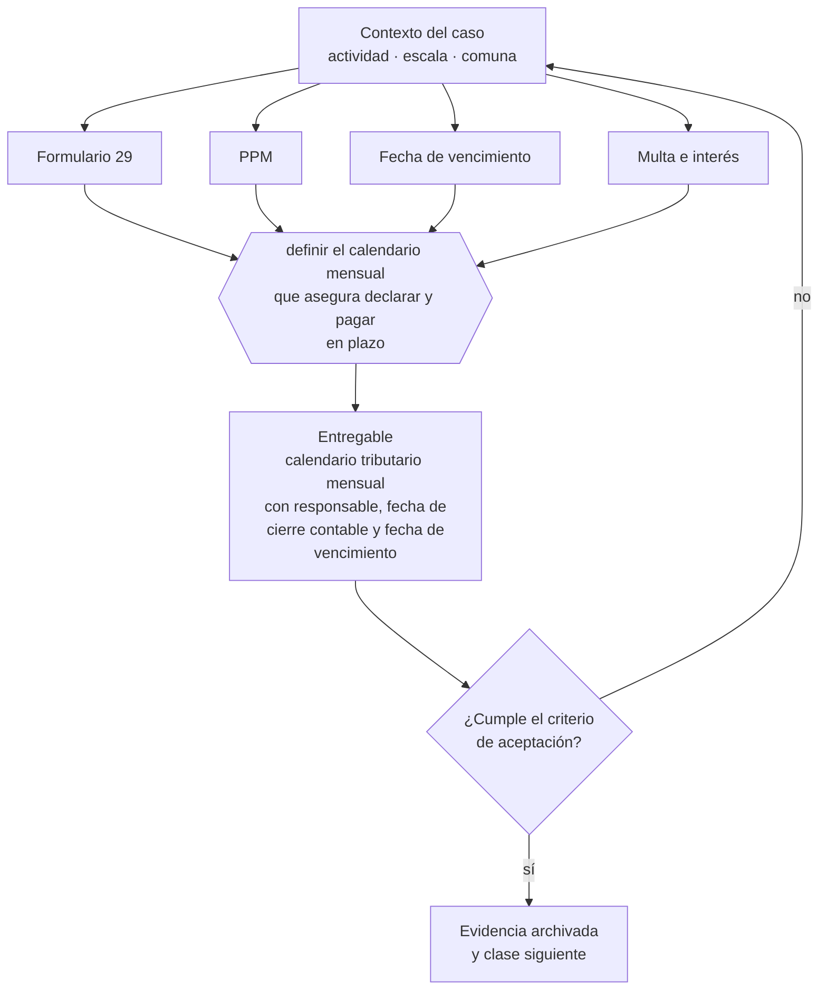

# Clase 096 — Formulario 29, PPM y ciclo mensual

> **Parte 07 · SII y ciclo tributario de principio a fin** — clase 12 de 14

**Estado de evidencia:** `VERIFICADO-FUENTE` · **Jurisdicción:** Chile-first · **Fecha base normativa:** 07-08-2026 
**Decisión que habilita:** definir el calendario mensual que asegura declarar y pagar en plazo 
**Entregable:** calendario tributario mensual con responsable, fecha de cierre contable y fecha de vencimiento

## 🎯 Propósito

Construir el calendario mensual que asegura cerrar la contabilidad antes del vencimiento del F29, y no después.

## 📚 Resultados de aprendizaje

Al finalizar esta clase podrás:

1. **Definir** con precisión los cuatro conceptos de la tabla siguiente y usarlos para describir un caso real.
2. **Explicar** por qué esta materia condiciona decisiones de otras partes del programa.
3. **Decidir** —definir el calendario mensual que asegura declarar y pagar en plazo— y justificar la decisión por escrito.
4. **Producir** el entregable de la clase y contrastarlo contra su criterio de aceptación.
5. **Distinguir** el dato estable del dato dinámico que exige revalidación en la fuente oficial.

## 🧩 Conceptos centrales

| Concepto | Comprensión verificable |
|---|---|
| **Formulario 29** | Declaración mensual de iva y retenciones. |
| **PPM** | Pago provisional mensual a cuenta del impuesto anual. |
| **Fecha de vencimiento** | Día del mes en que vence según medio de pago y tipo de contribuyente. |
| **Multa e interés** | Recargo por declaración o pago fuera de plazo. |

## 🗺️ Flujo de razonamiento

## 📖 Desarrollo

### 1. El fondo del asunto

El F29 es el ritmo mensual de la empresa: consolida IVA, PPM y retenciones. Su gestión exige que la contabilidad esté al día antes del vencimiento, no después. Declarar sin pagar evita la multa por no declarar pero genera intereses, y afecta la situación tributaria ante terceros.

### 2. Cómo se traduce en la práctica

El F29 consolida IVA, PPM y retenciones, y su gestión exige información al día. Cerrar la contabilidad después del vencimiento obliga a declarar con estimaciones y rectificar, con costo administrativo recurrente. El PPM, además, debe estar provisionado en el flujo o descuadra la caja del mes.

### 3. Marco aplicable y quién interviene

- DL 824 sobre impuesto a la renta y DL 825 sobre impuesto a las ventas y servicios
- Código Tributario (DL 830)
- Ley 21.210 de modernización tributaria y Ley 21.713 de cumplimiento tributario
- regímenes Pro Pyme General (14 D N°3), Pro Pyme Transparente (14 D N°8) y Semi Integrado (14 A)

**Autoridades o contrapartes involucradas:** SII, Tesorería General de la República.
**Profesionales de apoyo:** contador, asesor tributario, abogado tributario. La participación concreta depende del riesgo, del
tamaño de la empresa y de la actividad económica.

## 🧪 Taller guiado

Aplica esta clase a **una** de las siguientes líneas de negocio y repite después el ejercicio con
una segunda línea de carga regulatoria distinta:

| Línea | Carga regulatoria |
|---|---|
| SaaS B2B con IA | media |
| Servicios profesionales | baja |
| E-commerce D2C | media |
| Alimentos o foodtech | alta |
| Exportación de servicios | media |
| Fintech regulada | alta |
| Construcción o servicios técnicos | alta |

**Secuencia de trabajo:**

1. Delimita el contexto: actividad económica, escala, comuna y etapa de la empresa.
2. Reúne los antecedentes que la decisión exige y anota la fecha de cada fuente.
3. Identifica las alternativas reales, incluida la de no hacer nada.
4. Evalúa el impacto en mercado, caja, personas, regulación y operación.
5. Toma la decisión y regístrala con sus supuestos.
6. Produce el entregable.
7. Contrástalo contra el criterio de aceptación.
8. Anota lo que requiere validación profesional y programa su revisión.

### 📦 Entregable

Calendario tributario mensual con responsable, fecha de cierre contable y fecha de vencimiento.

Debe incluir decisión, supuestos, fuentes con fecha de consulta, responsable, riesgos
identificados y próximos pasos.

## 🏆 Reto verificable

Resuelve la misma materia para una segunda línea de negocio con distinta carga regulatoria y
explica por escrito **qué cambió, por qué y qué fuente lo determina**.

## ✅ Criterio de aceptación

- [ ] el calendario define fecha de cierre contable anterior al vencimiento
- [ ] el PPM está provisionado en el flujo de caja
- [ ] cada afirmación regulatoria está referida a una fuente oficial con fecha de consulta;
- [ ] los datos dinámicos quedan marcados para revalidación;
- [ ] hay un responsable asignado y evidencia reproducible del trabajo.

## ⚠️ Errores frecuentes

**Propios de esta clase:**

- Cerrar la contabilidad después del vencimiento del f29.
- No provisionar el ppm y descuadrar la caja del mes.

**Característicos de la parte 07:**

- Elegir régimen por recomendación genérica sin mirar la estructura de socios.
- Usar el iva recaudado como capital de trabajo y no poder pagar el f29.

## 🇨🇱 Checklist Chile

- [ ] ¿existe norma o autoridad específica para esta materia?
- [ ] ¿la fuente consultada está vigente a la fecha de ejecución?
- [ ] ¿se activa algún trámite ante el SII?
- [ ] ¿se activa algún requisito municipal o sectorial?
- [ ] ¿afecta a consumidores o al tratamiento de datos personales?
- [ ] ¿afecta a trabajadores o a la seguridad y salud en el trabajo?
- [ ] ¿afecta a impuestos, contabilidad o caja?
- [ ] ¿afecta a contratos o a propiedad intelectual?
- [ ] ¿requiere renovación, reporte periódico o revalidación?

## ❓ Preguntas de comprobación

1. ¿En qué día del mes cierras la contabilidad y en qué día vence tu F29?
2. ¿Está el PPM provisionado en tu flujo de caja de 13 semanas?
3. ¿Cuántas rectificatorias presentaste el último año y por qué causa?

## 🔗 Fuentes oficiales

**Servicio de Impuestos Internos — Registro de Compras y Ventas**  
<https://www.sii.cl/destacados/f29/registrocompraventas.htm> · verificado 2026-08-19

- *Qué contiene:* Explica cómo el SII consolida los documentos tributarios electrónicos recibidos y emitidos, y cómo esa consolidación propone la declaración mensual de IVA.
- *Cómo leerla:* Fíjate en los plazos de aceptación o reclamo de una factura recibida: la página los trata como un detalle operativo, pero dejarlos vencer equivale a aceptar la factura con efecto tributario y mérito ejecutivo.
- *Uso en esta clase:* aporta el marco de «Registro de Compras y Ventas» para definir el calendario mensual que asegura declarar y pagar en plazo.

**Servicio de Impuestos Internos — Nuevos contribuyentes, inicio de actividades y DTE**  
<https://www.sii.cl/ayudas/nuevos_contribuyentes/boleta-vys-facturador.html> · verificado 2026-08-19

- *Qué contiene:* Reúne el circuito completo del contribuyente nuevo: obtención de RUT, declaración de inicio de actividades, elección de códigos de actividad económica y habilitación para emitir documentos tributarios electrónicos.
- *Cómo leerla:* Sepáralo en dos actos distintos que la página trata seguidos: el RUT identifica, el inicio de actividades habilita. Lo que te bloquea para facturar casi siempre está en el segundo, no en el primero.
- *Uso en esta clase:* aporta el marco de «Nuevos contribuyentes, inicio de actividades y DTE» para definir el calendario mensual que asegura declarar y pagar en plazo.

Complementos del repositorio: [glosario](../../../docs/19_GLOSSARY.md) ·
[ruta de lecturas](../../../docs/15_BOOKS_AND_LEARNING_PATH.md) ·
[catálogo de fuentes](../../../docs/16_OFFICIAL_SOURCE_CATALOG.md).

> [!IMPORTANT]
> Material educativo. Para una decisión real de alto impacto hay que verificar la fuente oficial
> vigente y validar con el profesional competente.

---

| Anterior | Índice | Siguiente |
|---|---|---|
| [← 095 · Registro de Compras y Ventas](../class-11-registro-de-compras-y-ventas/README.md) | [Parte 07](../README.md) · [Programa](../../../README.md) | [097 · Operación Renta, F22 y declaraciones juradas →](../class-13-operacion-renta-f22-y-declaraciones-juradas/README.md) |
