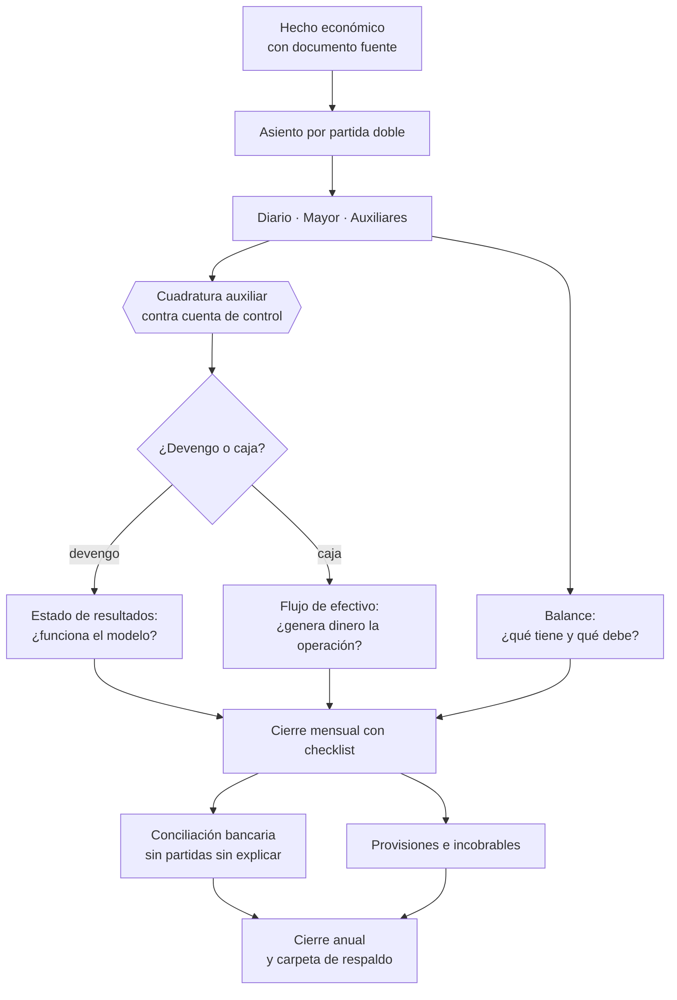

# Parte 08 — Contabilidad y estados financieros

> *Contabilidad que sirve para decidir, no solo para declarar*

🟣 **Etapa 3 — Los números que la sostienen** · salida de la etapa: Contabilidad que sirve para decidir y caja bajo control

**Estado de evidencia:** `GUIA-PRACTICA` · **Clases:** 14 (099–112) · **Fecha base normativa:** 07-08-2026 
**Contenido central:** Plan de cuentas, partida doble, devengo frente a caja, los tres estados, conciliación y cierre 
**Conceptos definidos en esta parte:** 56

## 🎯 De qué trata esta parte

Una contabilidad diseñada únicamente para cumplir con el SII llega tarde y agregada: informa lo que pasó tres meses atrás y no permite saber qué línea de negocio gana ni qué cliente cuesta más servir. Diseñarla desde el inicio con plan de cuentas y centros de costo útiles no cuesta más que diseñarla mal, y evita reconstruir tres años de historia cuando por fin se necesita gestionar.

El concepto que ordena la parte es la diferencia entre devengo y caja. Un anticipo anual cobrado en enero es caja de enero e ingreso de doce meses; tratarlo como utilidad disponible produce decisiones de gasto sobre dinero ya comprometido. La misma brecha explica que una empresa rentable no tenga con qué pagar sueldos.

Los tres estados financieros cumplen funciones distintas y complementarias: el estado de resultados dice si el modelo de negocio funciona, el balance dice qué tiene y qué debe la empresa, y el flujo de efectivo es el único que no se puede maquillar. Cerrar el mes con checklist —conciliación bancaria incluida— convierte la contabilidad en un proceso repetible en vez de una reconstrucción anual.

## 📚 Resultados de la parte

Al terminar esta parte podrás:

1. **Leer balance, estado de resultados y flujo de efectivo y explicar qué dice cada uno**.
2. **Distinguir devengo de caja y anticipar el desfase**.
3. **Ejecutar un cierre mensual con conciliación bancaria y respaldos**.
4. **Armar la carpeta de respaldo que soporta una fiscalización o una due diligence**.

## 🗺️ Mapa de la parte

## ⚖️ Marco aplicable

- IFRS e IFRS para Pymes como marco de referencia contable
- Código Tributario en materia de libros, respaldo y plazos de conservación
- normas del SII sobre contabilidad completa, simplificada y registros electrónicos

**Autoridades o contrapartes:** SII, Colegio de Contadores de Chile.
**Profesionales de apoyo:** contador general, auditor, controller.

## ⚠️ Riesgos característicos

- Cerrar el mes sin conciliar banco y arrastrar diferencias durante todo el año.
- Reconocer ingreso al firmar y no al devengar el servicio.
- No provisionar incobrables y sobreestimar el patrimonio.
- Mezclar gastos personales del socio con gastos de la empresa.

## 📘 Las 14 clases

| # | Global | Clase | Decisión que habilita |
|---:|---:|---|---|
| 01 | 099 | [Contabilidad como sistema de información](class-01-contabilidad-como-sistema-de-informacion/README.md) | definir para qué decisiones debe servir la contabilidad además de cumplir |
| 02 | 100 | [Plan de cuentas](class-02-plan-de-cuentas/README.md) | diseñar el plan de cuentas y las dimensiones de análisis que la empresa necesita |
| 03 | 101 | [Partida doble sin memorizar](class-03-partida-doble-sin-memorizar/README.md) | registrar correctamente las operaciones típicas del negocio |
| 04 | 102 | [Libro diario, mayor y auxiliares](class-04-libro-diario-mayor-y-auxiliares/README.md) | definir qué auxiliares se llevarán y con qué frecuencia se cuadran |
| 05 | 103 | [Devengo versus caja](class-05-devengo-versus-caja/README.md) | definir cuándo se reconoce el ingreso y cómo se controla el diferimiento |
| 06 | 104 | [Balance general](class-06-balance-general/README.md) | evaluar la posición financiera real detrás de las cifras del balance |
| 07 | 105 | [Estado de resultados](class-07-estado-de-resultados/README.md) | determinar si el problema está en el margen del producto o en la estructura de gastos |
| 08 | 106 | [Estado de flujo de efectivo](class-08-estado-de-flujo-de-efectivo/README.md) | determinar si la operación genera efectivo por sí misma |
| 09 | 107 | [Conciliación bancaria](class-09-conciliacion-bancaria/README.md) | establecer la conciliación bancaria como control mensual obligatorio |
| 10 | 108 | [Cuentas por cobrar y provisiones](class-10-cuentas-por-cobrar-y-provisiones/README.md) | definir política de crédito, seguimiento de antigüedad y criterio de provisión |
| 11 | 109 | [Cuentas por pagar y cierre mensual](class-11-cuentas-por-pagar-y-cierre-mensual/README.md) | definir el checklist y el calendario del cierre mensual |
| 12 | 110 | [Existencias y costo de ventas](class-12-existencias-y-costo-de-ventas/README.md) | definir método de valorización y frecuencia de conteo físico |
| 13 | 111 | [Activos fijos, depreciación e intangibles](class-13-activos-fijos-depreciacion-e-intangibles/README.md) | definir el tratamiento de activos fijos e intangibles y su efecto tributario |
| 14 | 112 | [Cierre anual y carpeta de respaldo](class-14-cierre-anual-y-carpeta-de-respaldo/README.md) | definir la estructura y custodia de la carpeta de respaldo anual |

## 🔤 Glosario de la parte

| Concepto | Definición operacional |
|---|---|
| **Activo fijo** | Bien de uso duradero destinado a la operación. |
| **Antigüedad de saldos** | Clasificación de la deuda por tramos de vencimiento. |
| **Asiento** | Registro completo y balanceado de un hecho económico. |
| **Auxiliar** | Detalle por cliente, proveedor o activo dentro de una cuenta. |
| **Balance general** | Estado de posición financiera a una fecha. |
| **Base caja** | Reconocimiento cuando el dinero entra o sale. |
| **Calidad del activo** | Grado en que los activos registrados son realizables. |
| **Carpeta de respaldo** | Conjunto ordenado de documentos que sustentan la contabilidad. |
| **Carpeta tributaria electrónica** | Documento del sii que acredita situación tributaria ante terceros. |
| **Centro de costo** | Dimensión que permite atribuir gasto a una unidad o proyecto. |
| **Checklist de cierre** | Lista de verificaciones que debe completarse cada mes. |
| **Cierre anual** | Proceso que consolida el ejercicio y prepara la declaración. |
| **Cierre mensual** | Proceso que deja el período contable completo y revisado. |
| **Conciliación bancaria** | Comparación entre el mayor de banco y la cartola. |
| **Corte** | Fecha hasta la cual se concilia. |
| **Corte de documentos** | Regla que asigna documentos al período correcto. |
| **Costo de ventas** | Costo de las existencias efectivamente vendidas. |
| **Cuadratura** | Coincidencia entre el auxiliar y el saldo de la cuenta de control. |
| **Cuenta puente** | Cuenta transitoria que debe quedar en cero al cierre. |
| **Cuentas por cobrar** | Derechos de cobro por ventas ya reconocidas. |
| **Cuentas por pagar** | Obligaciones con proveedores por bienes o servicios recibidos. |
| **Debe y haber** | Columnas que registran el efecto en cada cuenta. |
| **Depreciación** | Reconocimiento del consumo del activo en el tiempo. |
| **Devengo** | Reconocimiento del ingreso o gasto cuando ocurre el hecho económico. |
| **Diferencia de inventario** | Brecha entre el registro contable y el conteo físico. |
| **Diferencia no identificada** | Descuadre sin explicación, que indica error o irregularidad. |
| **Diferimiento** | Ingreso cobrado que aún no se ha devengado. |
| **Documento fuente** | Respaldo que origina el registro. |
| **Ecuación contable** | Activo igual a pasivo más patrimonio. |
| **Endeudamiento** | Proporción de pasivos sobre patrimonio. |
| **Estado de resultados** | Reporte de ingresos, costos y gastos de un período. |
| **Existencias** | Bienes destinados a la venta o a la producción. |
| **Flujo de efectivo** | Movimiento real de dinero del período. |
| **Flujo de financiamiento** | Efectivo de deuda, aportes y retiros. |
| **Flujo de inversión** | Efectivo usado en adquirir o vender activos. |
| **Flujo operacional** | Efectivo generado por la actividad principal. |
| **Gasto no operacional** | Resultado ajeno al giro principal. |
| **Granularidad** | Nivel de detalle que permite analizar sin volverse inmanejable. |
| **Hecho económico** | Evento que altera activos, pasivos o patrimonio. |
| **Intangible** | Activo sin sustancia física: software, marca, derechos. |
| **Libro diario** | Registro cronológico de todos los asientos. |
| **Libro mayor** | Agrupación de movimientos por cuenta. |
| **Liquidez** | Capacidad de cubrir obligaciones de corto plazo. |
| **Margen bruto** | Ingreso menos costo directo de lo vendido. |
| **Método de valorización** | Criterio de costeo del inventario, por ejemplo fifo o promedio ponderado. |
| **Oportunidad** | Cualidad de que la información esté disponible cuando se decide. |
| **Partida conciliatoria** | Diferencia explicable por desfase temporal. |
| **Partida doble** | Todo hecho económico afecta al menos dos cuentas. |
| **Plan de cuentas** | Estructura jerárquica de cuentas contables. |
| **Plazo de conservación** | Tiempo durante el cual deben mantenerse los respaldos. |
| **Política de crédito** | Reglas para otorgar plazo de pago a clientes. |
| **Provisión** | Gasto devengado que aún no se ha pagado. |
| **Provisión de incobrables** | Estimación de la parte que no se cobrará. |
| **Resultado operacional** | Antes de gastos financieros e impuestos. |
| **Sistema de información contable** | Proceso que captura, clasifica y reporta hechos económicos. |
| **Vida útil** | Período durante el cual se espera usar el activo. |

## 🔗 Cómo se conecta

Da soporte a las declaraciones de la parte 07 y entrega a la parte 09 las cifras con las que se construye el flujo de caja y la economía unitaria. La carpeta de respaldo que aquí se arma es la que pedirá el banco en la parte 16 y el comprador en la parte 22.

## 📖 Pauta bibliográfica

- IFRS para Pymes — marco de referencia contable proporcional al tamaño.
- Código Tributario — libros obligatorios, respaldo y plazos de conservación.
- SII — instrucciones sobre contabilidad completa y simplificada según régimen.

## 🏛️ Fuentes oficiales de la parte

**Servicio de Impuestos Internos — Nuevos contribuyentes, inicio de actividades y DTE**  
<https://www.sii.cl/ayudas/nuevos_contribuyentes/boleta-vys-facturador.html> · verificado 2026-08-19

- *Qué contiene:* Reúne el circuito completo del contribuyente nuevo: obtención de RUT, declaración de inicio de actividades, elección de códigos de actividad económica y habilitación para emitir documentos tributarios electrónicos.
- *Cómo leerla:* Sepáralo en dos actos distintos que la página trata seguidos: el RUT identifica, el inicio de actividades habilita. Lo que te bloquea para facturar casi siempre está en el segundo, no en el primero.

**Servicio de Impuestos Internos — Carpeta Tributaria Electrónica**  
<https://zeus.sii.cl/dii_doc/carpeta_tributaria/html/generar_carpeta.htm> · verificado 2026-08-19

- *Qué contiene:* Permite generar el expediente que acredita la situación tributaria de la empresa: inicio de actividades, régimen, declaraciones presentadas y timbraje.
- *Cómo leerla:* Es el documento que pedirán banco, inversionista y comprador. Genera una hoy aunque no la necesites: lo que muestre es exactamente lo que verá un tercero al evaluarte.

**Biblioteca del Congreso Nacional · LeyChile — Normativa oficial consolidada**  
<https://www.bcn.cl/leychile/> · verificado 2026-08-19

- *Qué contiene:* Publica el texto oficial y consolidado de leyes, decretos y reglamentos, con la versión vigente a una fecha, el historial de modificaciones y la tramitación que las originó.
- *Cómo leerla:* Usa siempre el selector de versión vigente a la fecha en que ejecutarás el trámite, no la última publicada. Y lee el artículo transitorio: en normas en implantación gradual —jornada, datos personales— ahí está la fecha que realmente te aplica.

---

| Anterior | Índice | Siguiente |
|---|---|---|
| [← Parte 07 · SII y ciclo tributario de principio a fin](../part-07-sii-y-ciclo-tributario-de-principio-a-fin/README.md) | [Currículo](../../CURRICULUM.md) · [Programa](../../README.md) | [Parte 09 · Finanzas, caja, precios y economía unitaria →](../part-09-finanzas-caja-precios-y-economia-unitaria/README.md) |
