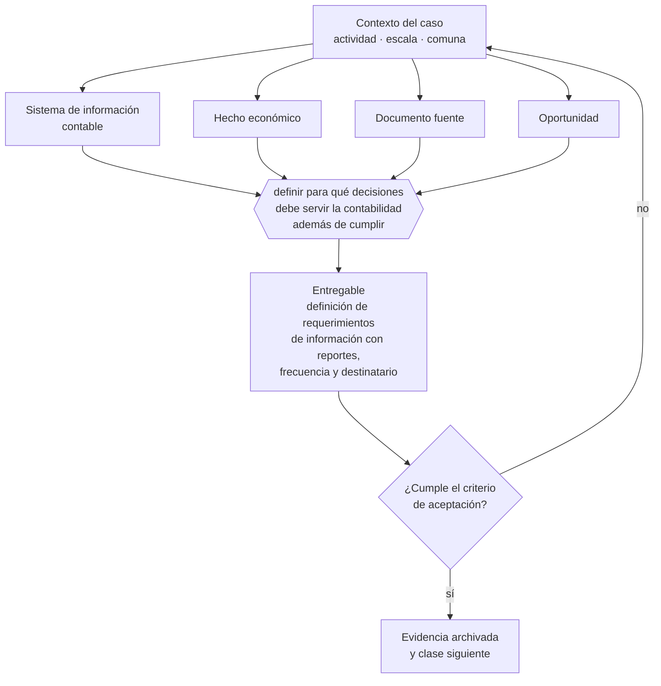

# Clase 099 — Contabilidad como sistema de información

> **Parte 08 · Contabilidad y estados financieros** — clase 1 de 14

**Estado de evidencia:** `GUIA-PRACTICA` · **Jurisdicción:** Chile-first · **Fecha base normativa:** 07-08-2026 
**Decisión que habilita:** definir para qué decisiones debe servir la contabilidad además de cumplir 
**Entregable:** definición de requerimientos de información con reportes, frecuencia y destinatario

## 🎯 Propósito

Diseñar la contabilidad para que sirva a dos clientes distintos —el fisco y quien decide— porque una que solo sirve al primero llega tarde para gestionar.

## 📚 Resultados de aprendizaje

Al finalizar esta clase podrás:

1. **Definir** con precisión los cuatro conceptos de la tabla siguiente y usarlos para describir un caso real.
2. **Explicar** por qué esta materia condiciona decisiones de otras partes del programa.
3. **Decidir** —definir para qué decisiones debe servir la contabilidad además de cumplir— y justificar la decisión por escrito.
4. **Producir** el entregable de la clase y contrastarlo contra su criterio de aceptación.
5. **Distinguir** el dato estable del dato dinámico que exige revalidación en la fuente oficial.

## 🧩 Conceptos centrales

| Concepto | Comprensión verificable |
|---|---|
| **Sistema de información contable** | Proceso que captura, clasifica y reporta hechos económicos. |
| **Hecho económico** | Evento que altera activos, pasivos o patrimonio. |
| **Documento fuente** | Respaldo que origina el registro. |
| **Oportunidad** | Cualidad de que la información esté disponible cuando se decide. |

## 🗺️ Flujo de razonamiento

## 📖 Desarrollo

### 1. El fondo del asunto

La contabilidad tiene dos clientes: el fisco y el que decide. Una contabilidad que solo sirve para declarar llega tarde para gestionar. Diseñarla desde el inicio con centros de costo y clasificaciones útiles cuesta lo mismo que diseñarla mal, y evita rehacer tres años de historia.

### 2. Cómo se traduce en la práctica

Definir desde el inicio centros de costo y clasificaciones útiles cuesta lo mismo que hacerlo mal, y evita reconstruir tres años de historia cuando por fin se necesita saber qué línea gana. La pregunta que ordena el diseño es qué decisiones debe permitir tomar, no qué formularios debe llenar.

### 3. Marco aplicable y quién interviene

- IFRS e IFRS para Pymes como marco de referencia contable
- Código Tributario en materia de libros, respaldo y plazos de conservación
- normas del SII sobre contabilidad completa, simplificada y registros electrónicos

**Autoridades o contrapartes involucradas:** SII, Colegio de Contadores de Chile.
**Profesionales de apoyo:** contador general, auditor, controller. La participación concreta depende del riesgo, del
tamaño de la empresa y de la actividad económica.

## 🧪 Taller guiado

Aplica esta clase a **una** de las siguientes líneas de negocio y repite después el ejercicio con
una segunda línea de carga regulatoria distinta:

| Línea | Carga regulatoria |
|---|---|
| SaaS B2B con IA | media |
| Servicios profesionales | baja |
| E-commerce D2C | media |
| Alimentos o foodtech | alta |
| Exportación de servicios | media |
| Fintech regulada | alta |
| Construcción o servicios técnicos | alta |

**Secuencia de trabajo:**

1. Delimita el contexto: actividad económica, escala, comuna y etapa de la empresa.
2. Reúne los antecedentes que la decisión exige y anota la fecha de cada fuente.
3. Identifica las alternativas reales, incluida la de no hacer nada.
4. Evalúa el impacto en mercado, caja, personas, regulación y operación.
5. Toma la decisión y regístrala con sus supuestos.
6. Produce el entregable.
7. Contrástalo contra el criterio de aceptación.
8. Anota lo que requiere validación profesional y programa su revisión.

### 📦 Entregable

Definición de requerimientos de información con reportes, frecuencia y destinatario.

Debe incluir decisión, supuestos, fuentes con fecha de consulta, responsable, riesgos
identificados y próximos pasos.

## 🏆 Reto verificable

Resuelve la misma materia para una segunda línea de negocio con distinta carga regulatoria y
explica por escrito **qué cambió, por qué y qué fuente lo determina**.

## ✅ Criterio de aceptación

- [ ] los reportes requeridos tienen destinatario y frecuencia
- [ ] la información está disponible antes de que caduque su utilidad
- [ ] cada afirmación regulatoria está referida a una fuente oficial con fecha de consulta;
- [ ] los datos dinámicos quedan marcados para revalidación;
- [ ] hay un responsable asignado y evidencia reproducible del trabajo.

## ⚠️ Errores frecuentes

**Propios de esta clase:**

- Diseñar la contabilidad solo para el sii y no poder gestionar con ella.
- Recibir los estados financieros tres meses después del cierre.

**Característicos de la parte 08:**

- Cerrar el mes sin conciliar banco y arrastrar diferencias durante todo el año.
- Reconocer ingreso al firmar y no al devengar el servicio.

## 🇨🇱 Checklist Chile

- [ ] ¿existe norma o autoridad específica para esta materia?
- [ ] ¿la fuente consultada está vigente a la fecha de ejecución?
- [ ] ¿se activa algún trámite ante el SII?
- [ ] ¿se activa algún requisito municipal o sectorial?
- [ ] ¿afecta a consumidores o al tratamiento de datos personales?
- [ ] ¿afecta a trabajadores o a la seguridad y salud en el trabajo?
- [ ] ¿afecta a impuestos, contabilidad o caja?
- [ ] ¿afecta a contratos o a propiedad intelectual?
- [ ] ¿requiere renovación, reporte periódico o revalidación?

## ❓ Preguntas de comprobación

1. ¿Qué tres preguntas de negocio debería responder tu contabilidad y hoy no responde?
2. ¿Cuántos días después del cierre recibes los estados financieros?
3. ¿Quién los lee además del contador y qué decide con ellos?

## 🔗 Fuentes oficiales

**Servicio de Impuestos Internos — Nuevos contribuyentes, inicio de actividades y DTE**  
<https://www.sii.cl/ayudas/nuevos_contribuyentes/boleta-vys-facturador.html> · verificado 2026-08-19

- *Qué contiene:* Reúne el circuito completo del contribuyente nuevo: obtención de RUT, declaración de inicio de actividades, elección de códigos de actividad económica y habilitación para emitir documentos tributarios electrónicos.
- *Cómo leerla:* Sepáralo en dos actos distintos que la página trata seguidos: el RUT identifica, el inicio de actividades habilita. Lo que te bloquea para facturar casi siempre está en el segundo, no en el primero.
- *Uso en esta clase:* aporta el marco de «Nuevos contribuyentes, inicio de actividades y DTE» para definir para qué decisiones debe servir la contabilidad además de cumplir.

Complementos del repositorio: [glosario](../../../docs/19_GLOSSARY.md) ·
[ruta de lecturas](../../../docs/15_BOOKS_AND_LEARNING_PATH.md) ·
[catálogo de fuentes](../../../docs/16_OFFICIAL_SOURCE_CATALOG.md).

> [!IMPORTANT]
> Material educativo. Para una decisión real de alto impacto hay que verificar la fuente oficial
> vigente y validar con el profesional competente.

---

| Anterior | Índice | Siguiente |
|---|---|---|
| **Inicio de la parte** | [Parte 08](../README.md) · [Programa](../../../README.md) | [100 · Plan de cuentas →](../class-02-plan-de-cuentas/README.md) |
