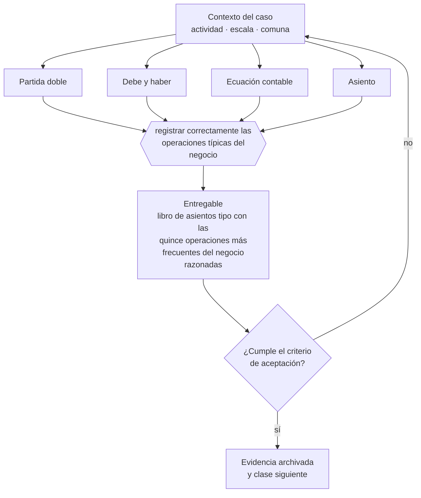

# Clase 101 — Partida doble sin memorizar

> **Parte 08 · Contabilidad y estados financieros** — clase 3 de 14

**Estado de evidencia:** `GUIA-PRACTICA` · **Jurisdicción:** Chile-first · **Fecha base normativa:** 07-08-2026 
**Decisión que habilita:** registrar correctamente las operaciones típicas del negocio 
**Entregable:** libro de asientos tipo con las quince operaciones más frecuentes del negocio razonadas

## 🎯 Propósito

Razonar los asientos desde el origen y destino de los recursos, para poder registrar operaciones nuevas sin haberlas memorizado antes.

## 📚 Resultados de aprendizaje

Al finalizar esta clase podrás:

1. **Definir** con precisión los cuatro conceptos de la tabla siguiente y usarlos para describir un caso real.
2. **Explicar** por qué esta materia condiciona decisiones de otras partes del programa.
3. **Decidir** —registrar correctamente las operaciones típicas del negocio— y justificar la decisión por escrito.
4. **Producir** el entregable de la clase y contrastarlo contra su criterio de aceptación.
5. **Distinguir** el dato estable del dato dinámico que exige revalidación en la fuente oficial.

## 🧩 Conceptos centrales

| Concepto | Comprensión verificable |
|---|---|
| **Partida doble** | Todo hecho económico afecta al menos dos cuentas. |
| **Debe y haber** | Columnas que registran el efecto en cada cuenta. |
| **Ecuación contable** | Activo igual a pasivo más patrimonio. |
| **Asiento** | Registro completo y balanceado de un hecho económico. |

## 🗺️ Flujo de razonamiento

## 📖 Desarrollo

### 1. El fondo del asunto

La partida doble se entiende sin memorizar si se piensa en origen y destino de los recursos: de dónde salió y en qué se convirtió. Con esa lógica, cualquier operación se puede razonar, incluidas las que no se han visto antes, y se detectan asientos que no tienen sentido económico.

### 2. Cómo se traduce en la práctica

Con esa lógica se detectan también los asientos que no tienen sentido económico, que es la habilidad realmente útil para quien dirige. El error clásico —registrar el pago de una deuda como gasto— es evidente cuando se pregunta qué recurso salió y en qué se convirtió.

### 3. Marco aplicable y quién interviene

- IFRS e IFRS para Pymes como marco de referencia contable
- Código Tributario en materia de libros, respaldo y plazos de conservación
- normas del SII sobre contabilidad completa, simplificada y registros electrónicos

**Autoridades o contrapartes involucradas:** SII, Colegio de Contadores de Chile.
**Profesionales de apoyo:** contador general, auditor, controller. La participación concreta depende del riesgo, del
tamaño de la empresa y de la actividad económica.

## 🧪 Taller guiado

Aplica esta clase a **una** de las siguientes líneas de negocio y repite después el ejercicio con
una segunda línea de carga regulatoria distinta:

| Línea | Carga regulatoria |
|---|---|
| SaaS B2B con IA | media |
| Servicios profesionales | baja |
| E-commerce D2C | media |
| Alimentos o foodtech | alta |
| Exportación de servicios | media |
| Fintech regulada | alta |
| Construcción o servicios técnicos | alta |

**Secuencia de trabajo:**

1. Delimita el contexto: actividad económica, escala, comuna y etapa de la empresa.
2. Reúne los antecedentes que la decisión exige y anota la fecha de cada fuente.
3. Identifica las alternativas reales, incluida la de no hacer nada.
4. Evalúa el impacto en mercado, caja, personas, regulación y operación.
5. Toma la decisión y regístrala con sus supuestos.
6. Produce el entregable.
7. Contrástalo contra el criterio de aceptación.
8. Anota lo que requiere validación profesional y programa su revisión.

### 📦 Entregable

Libro de asientos tipo con las quince operaciones más frecuentes del negocio razonadas.

Debe incluir decisión, supuestos, fuentes con fecha de consulta, responsable, riesgos
identificados y próximos pasos.

## 🏆 Reto verificable

Resuelve la misma materia para una segunda línea de negocio con distinta carga regulatoria y
explica por escrito **qué cambió, por qué y qué fuente lo determina**.

## ✅ Criterio de aceptación

- [ ] cada asiento tipo explica el origen y destino de recursos
- [ ] las operaciones típicas del negocio están cubiertas
- [ ] cada afirmación regulatoria está referida a una fuente oficial con fecha de consulta;
- [ ] los datos dinámicos quedan marcados para revalidación;
- [ ] hay un responsable asignado y evidencia reproducible del trabajo.

## ⚠️ Errores frecuentes

**Propios de esta clase:**

- Memorizar asientos sin entender el flujo económico que representan.
- Registrar el pago de una deuda como gasto.

**Característicos de la parte 08:**

- Cerrar el mes sin conciliar banco y arrastrar diferencias durante todo el año.
- Reconocer ingreso al firmar y no al devengar el servicio.

## 🇨🇱 Checklist Chile

- [ ] ¿existe norma o autoridad específica para esta materia?
- [ ] ¿la fuente consultada está vigente a la fecha de ejecución?
- [ ] ¿se activa algún trámite ante el SII?
- [ ] ¿se activa algún requisito municipal o sectorial?
- [ ] ¿afecta a consumidores o al tratamiento de datos personales?
- [ ] ¿afecta a trabajadores o a la seguridad y salud en el trabajo?
- [ ] ¿afecta a impuestos, contabilidad o caja?
- [ ] ¿afecta a contratos o a propiedad intelectual?
- [ ] ¿requiere renovación, reporte periódico o revalidación?

## ❓ Preguntas de comprobación

1. ¿Puedes explicar tus quince operaciones más frecuentes en términos de origen y destino?
2. ¿Qué asiento de tu contabilidad no sabrías justificar si te lo preguntaran?
3. ¿Registras el pago de deuda como gasto o como reducción de pasivo?

## 🔗 Fuentes oficiales

**Servicio de Impuestos Internos — Nuevos contribuyentes, inicio de actividades y DTE**  
<https://www.sii.cl/ayudas/nuevos_contribuyentes/boleta-vys-facturador.html> · verificado 2026-08-19

- *Qué contiene:* Reúne el circuito completo del contribuyente nuevo: obtención de RUT, declaración de inicio de actividades, elección de códigos de actividad económica y habilitación para emitir documentos tributarios electrónicos.
- *Cómo leerla:* Sepáralo en dos actos distintos que la página trata seguidos: el RUT identifica, el inicio de actividades habilita. Lo que te bloquea para facturar casi siempre está en el segundo, no en el primero.
- *Uso en esta clase:* aporta el marco de «Nuevos contribuyentes, inicio de actividades y DTE» para registrar correctamente las operaciones típicas del negocio.

**Servicio de Impuestos Internos — Carpeta Tributaria Electrónica**  
<https://zeus.sii.cl/dii_doc/carpeta_tributaria/html/generar_carpeta.htm> · verificado 2026-08-19

- *Qué contiene:* Permite generar el expediente que acredita la situación tributaria de la empresa: inicio de actividades, régimen, declaraciones presentadas y timbraje.
- *Cómo leerla:* Es el documento que pedirán banco, inversionista y comprador. Genera una hoy aunque no la necesites: lo que muestre es exactamente lo que verá un tercero al evaluarte.
- *Uso en esta clase:* aporta el marco de «Carpeta Tributaria Electrónica» para registrar correctamente las operaciones típicas del negocio.

**Biblioteca del Congreso Nacional · LeyChile — Normativa oficial consolidada**  
<https://www.bcn.cl/leychile/> · verificado 2026-08-19

- *Qué contiene:* Publica el texto oficial y consolidado de leyes, decretos y reglamentos, con la versión vigente a una fecha, el historial de modificaciones y la tramitación que las originó.
- *Cómo leerla:* Usa siempre el selector de versión vigente a la fecha en que ejecutarás el trámite, no la última publicada. Y lee el artículo transitorio: en normas en implantación gradual —jornada, datos personales— ahí está la fecha que realmente te aplica.
- *Uso en esta clase:* aporta el marco de «Normativa oficial consolidada» para registrar correctamente las operaciones típicas del negocio.

Complementos del repositorio: [glosario](../../../docs/19_GLOSSARY.md) ·
[ruta de lecturas](../../../docs/15_BOOKS_AND_LEARNING_PATH.md) ·
[catálogo de fuentes](../../../docs/16_OFFICIAL_SOURCE_CATALOG.md).

> [!IMPORTANT]
> Material educativo. Para una decisión real de alto impacto hay que verificar la fuente oficial
> vigente y validar con el profesional competente.

---

| Anterior | Índice | Siguiente |
|---|---|---|
| [← 100 · Plan de cuentas](../class-02-plan-de-cuentas/README.md) | [Parte 08](../README.md) · [Programa](../../../README.md) | [102 · Libro diario, mayor y auxiliares →](../class-04-libro-diario-mayor-y-auxiliares/README.md) |
