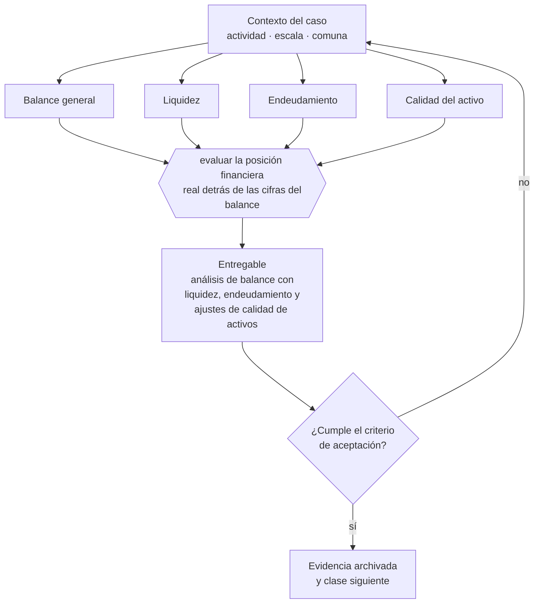

# Clase 104 — Balance general

> **Parte 08 · Contabilidad y estados financieros** — clase 6 de 14

**Estado de evidencia:** `GUIA-PRACTICA` · **Jurisdicción:** Chile-first · **Fecha base normativa:** 07-08-2026 
**Decisión que habilita:** evaluar la posición financiera real detrás de las cifras del balance 
**Entregable:** análisis de balance con liquidez, endeudamiento y ajustes de calidad de activos

## 🎯 Propósito

Leer un balance preguntando si los activos son reales y cobrables y si las obligaciones están completas, en vez de mirar solo el patrimonio.

## 📚 Resultados de aprendizaje

Al finalizar esta clase podrás:

1. **Definir** con precisión los cuatro conceptos de la tabla siguiente y usarlos para describir un caso real.
2. **Explicar** por qué esta materia condiciona decisiones de otras partes del programa.
3. **Decidir** —evaluar la posición financiera real detrás de las cifras del balance— y justificar la decisión por escrito.
4. **Producir** el entregable de la clase y contrastarlo contra su criterio de aceptación.
5. **Distinguir** el dato estable del dato dinámico que exige revalidación en la fuente oficial.

## 🧩 Conceptos centrales

| Concepto | Comprensión verificable |
|---|---|
| **Balance general** | Estado de posición financiera a una fecha. |
| **Liquidez** | Capacidad de cubrir obligaciones de corto plazo. |
| **Endeudamiento** | Proporción de pasivos sobre patrimonio. |
| **Calidad del activo** | Grado en que los activos registrados son realizables. |

## 🗺️ Flujo de razonamiento

## 📖 Desarrollo

### 1. El fondo del asunto

Leer un balance significa preguntar tres cosas: si los activos son reales y cobrables, si las obligaciones están completas y si el patrimonio refleja algo. Cuentas por cobrar antiguas sin provisión y activos totalmente depreciados aún en libros son las distorsiones más comunes.

### 2. Cómo se traduce en la práctica

Las distorsiones más comunes son cuentas por cobrar antiguas sin provisión y activos totalmente depreciados que siguen en libros. Ambas inflan el patrimonio contable y hacen que la empresa se vea mejor de lo que está, justo cuando se necesita evaluar si conviene endeudarse.

### 3. Marco aplicable y quién interviene

- IFRS e IFRS para Pymes como marco de referencia contable
- Código Tributario en materia de libros, respaldo y plazos de conservación
- normas del SII sobre contabilidad completa, simplificada y registros electrónicos

**Autoridades o contrapartes involucradas:** SII, Colegio de Contadores de Chile.
**Profesionales de apoyo:** contador general, auditor, controller. La participación concreta depende del riesgo, del
tamaño de la empresa y de la actividad económica.

## 🧪 Taller guiado

Aplica esta clase a **una** de las siguientes líneas de negocio y repite después el ejercicio con
una segunda línea de carga regulatoria distinta:

| Línea | Carga regulatoria |
|---|---|
| SaaS B2B con IA | media |
| Servicios profesionales | baja |
| E-commerce D2C | media |
| Alimentos o foodtech | alta |
| Exportación de servicios | media |
| Fintech regulada | alta |
| Construcción o servicios técnicos | alta |

**Secuencia de trabajo:**

1. Delimita el contexto: actividad económica, escala, comuna y etapa de la empresa.
2. Reúne los antecedentes que la decisión exige y anota la fecha de cada fuente.
3. Identifica las alternativas reales, incluida la de no hacer nada.
4. Evalúa el impacto en mercado, caja, personas, regulación y operación.
5. Toma la decisión y regístrala con sus supuestos.
6. Produce el entregable.
7. Contrástalo contra el criterio de aceptación.
8. Anota lo que requiere validación profesional y programa su revisión.

### 📦 Entregable

Análisis de balance con liquidez, endeudamiento y ajustes de calidad de activos.

Debe incluir decisión, supuestos, fuentes con fecha de consulta, responsable, riesgos
identificados y próximos pasos.

## 🏆 Reto verificable

Resuelve la misma materia para una segunda línea de negocio con distinta carga regulatoria y
explica por escrito **qué cambió, por qué y qué fuente lo determina**.

## ✅ Criterio de aceptación

- [ ] el análisis identifica activos de dudosa realización
- [ ] los índices están calculados e interpretados
- [ ] cada afirmación regulatoria está referida a una fuente oficial con fecha de consulta;
- [ ] los datos dinámicos quedan marcados para revalidación;
- [ ] hay un responsable asignado y evidencia reproducible del trabajo.

## ⚠️ Errores frecuentes

**Propios de esta clase:**

- Leer el patrimonio contable como valor de la empresa.
- Mantener cuentas por cobrar incobrables sin provisionar.

**Característicos de la parte 08:**

- Cerrar el mes sin conciliar banco y arrastrar diferencias durante todo el año.
- Reconocer ingreso al firmar y no al devengar el servicio.

## 🇨🇱 Checklist Chile

- [ ] ¿existe norma o autoridad específica para esta materia?
- [ ] ¿la fuente consultada está vigente a la fecha de ejecución?
- [ ] ¿se activa algún trámite ante el SII?
- [ ] ¿se activa algún requisito municipal o sectorial?
- [ ] ¿afecta a consumidores o al tratamiento de datos personales?
- [ ] ¿afecta a trabajadores o a la seguridad y salud en el trabajo?
- [ ] ¿afecta a impuestos, contabilidad o caja?
- [ ] ¿afecta a contratos o a propiedad intelectual?
- [ ] ¿requiere renovación, reporte periódico o revalidación?

## ❓ Preguntas de comprobación

1. ¿Qué proporción de tus cuentas por cobrar tiene más de 90 días?
2. ¿Qué activos figuran en libros y ya no existen o no sirven?
3. ¿Están completas tus obligaciones o hay pasivos no registrados?

## 🔗 Fuentes oficiales

**Servicio de Impuestos Internos — Nuevos contribuyentes, inicio de actividades y DTE**  
<https://www.sii.cl/ayudas/nuevos_contribuyentes/boleta-vys-facturador.html> · verificado 2026-08-07

- *Qué contiene:* Reúne el circuito completo del contribuyente nuevo: obtención de RUT, declaración de inicio de actividades, elección de códigos de actividad económica y habilitación para emitir documentos tributarios electrónicos.
- *Cómo leerla:* Sepáralo en dos actos distintos que la página trata seguidos: el RUT identifica, el inicio de actividades habilita. Lo que te bloquea para facturar casi siempre está en el segundo, no en el primero.

**Servicio de Impuestos Internos — Carpeta Tributaria Electrónica**  
<https://zeus.sii.cl/dii_doc/carpeta_tributaria/html/generar_carpeta.htm> · verificado 2026-08-07

- *Qué contiene:* Permite generar el expediente que acredita la situación tributaria de la empresa: inicio de actividades, régimen, declaraciones presentadas y timbraje.
- *Cómo leerla:* Es el documento que pedirán banco, inversionista y comprador. Genera una hoy aunque no la necesites: lo que muestre es exactamente lo que verá un tercero al evaluarte.

**Biblioteca del Congreso Nacional · LeyChile — Normativa oficial consolidada**  
<https://www.bcn.cl/leychile/> · verificado 2026-08-07

- *Qué contiene:* Publica el texto oficial y consolidado de leyes, decretos y reglamentos, con la versión vigente a una fecha, el historial de modificaciones y la tramitación que las originó.
- *Cómo leerla:* Usa siempre el selector de versión vigente a la fecha en que ejecutarás el trámite, no la última publicada. Y lee el artículo transitorio: en normas en implantación gradual —jornada, datos personales— ahí está la fecha que realmente te aplica.

Complementos del repositorio: [glosario](../../../docs/19_GLOSSARY.md) ·
[ruta de lecturas](../../../docs/15_BOOKS_AND_LEARNING_PATH.md) ·
[catálogo de fuentes](../../../docs/16_OFFICIAL_SOURCE_CATALOG.md).

> [!IMPORTANT]
> Material educativo. Para una decisión real de alto impacto hay que verificar la fuente oficial
> vigente y validar con el profesional competente.

---

| Anterior | Índice | Siguiente |
|---|---|---|
| [← 103 · Devengo versus caja](../class-05-devengo-versus-caja/README.md) | [Parte 08](../README.md) · [Programa](../../../README.md) | [105 · Estado de resultados →](../class-07-estado-de-resultados/README.md) |
