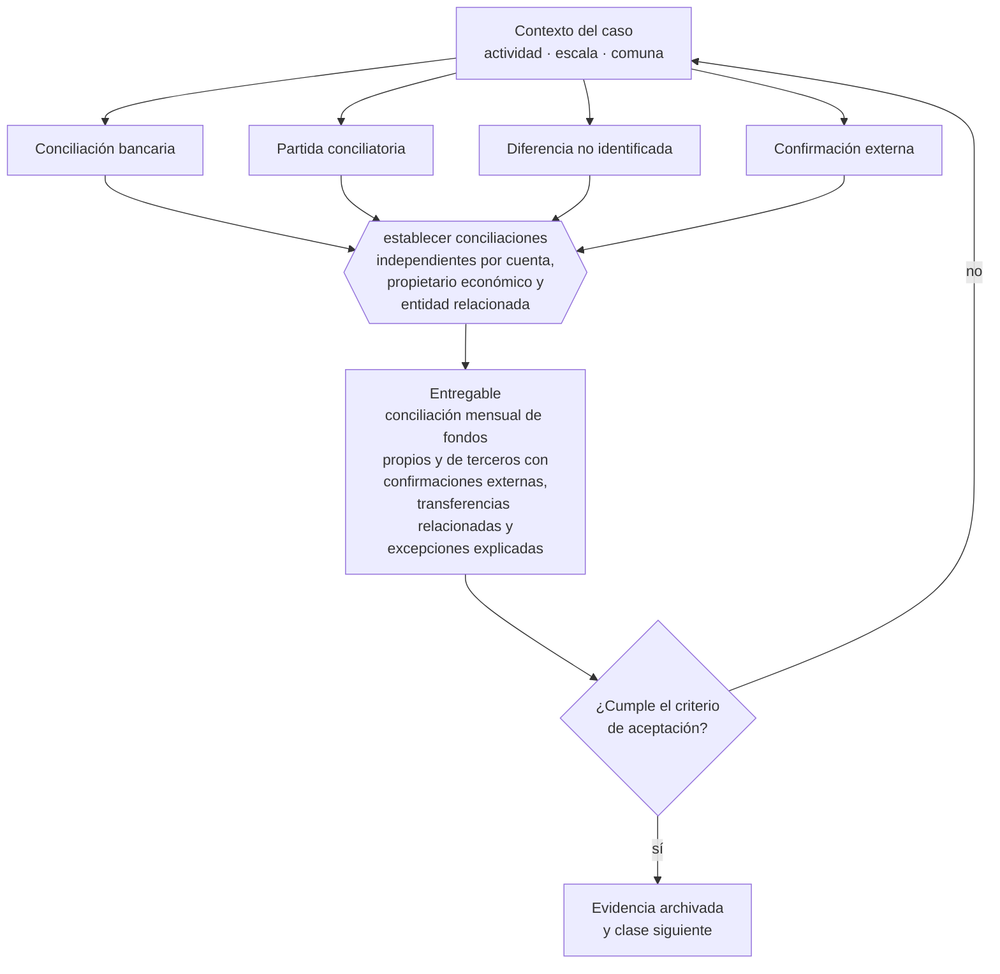

# Clase 107 — Conciliación bancaria

> **Parte 08 · Contabilidad y estados financieros** — clase 9 de 14

**Estado de evidencia:** `GUIA-PRACTICA` · **Jurisdicción:** Chile-first · **Fecha base normativa:** 07-08-2026 
**Decisión que habilita:** establecer conciliaciones independientes por cuenta, propietario económico y entidad relacionada 
**Entregable:** conciliación mensual de fondos propios y de terceros con confirmaciones externas, transferencias relacionadas y excepciones explicadas

## 🎯 Propósito

Conciliar por propietario económico y obtener confirmación independiente de cada cuenta, custodio y saldo relacionado.

## 📚 Resultados de aprendizaje

Al finalizar esta clase podrás:

1. **Definir** con precisión los cuatro conceptos de la tabla siguiente y usarlos para describir un caso real.
2. **Explicar** por qué esta materia condiciona decisiones de otras partes del programa.
3. **Decidir** —establecer conciliaciones independientes por cuenta, propietario económico y entidad relacionada— y justificar la decisión por escrito.
4. **Producir** el entregable de la clase y contrastarlo contra su criterio de aceptación.
5. **Distinguir** el dato estable del dato dinámico que exige revalidación en la fuente oficial.

## 🧩 Conceptos centrales

| Concepto | Comprensión verificable |
|---|---|
| **Conciliación bancaria** | Comparación entre el mayor de banco y la cartola obtenida de la fuente independiente. |
| **Partida conciliatoria** | Diferencia explicable por desfase temporal. |
| **Diferencia no identificada** | Descuadre sin explicación, que indica error o irregularidad. |
| **Confirmación externa** | Evidencia recibida directamente del banco, custodio o contraparte. |

## 🗺️ Flujo de razonamiento

```mermaid
flowchart TB
    C["Contexto del caso<br/>actividad · escala · comuna"]
    C --> A1["Conciliación bancaria"]
    C --> A2["Partida conciliatoria"]
    C --> A3["Diferencia no identificada"]
    C --> A4["Confirmación externa"]
    A1 & A2 & A3 & A4 --> D{{"establecer conciliaciones<br/>independientes por cuenta,<br/>propietario económico y<br/>entidad relacionada"}}
    D --> E["Entregable<br/>conciliación mensual de fondos<br/>propios y de terceros con<br/>confirmaciones externas,<br/>transferencias relacionadas y<br/>excepciones explicadas"]
    E --> V{"¿Cumple el criterio<br/>de aceptación?"}
    V -->|sí| S["Evidencia archivada<br/>y clase siguiente"]
    V -->|no| C
```

## 📖 Desarrollo

### 1. El fondo del asunto

La conciliación bancaria mensual debe cubrir por separado cuentas propias, fondos de terceros y saldos con relacionadas, usando cartolas o confirmaciones obtenidas directamente de la institución. El caso FTX/Alameda muestra por qué un saldo interno no basta cuando existen flujos entre entidades vinculadas y activos de clientes: toda diferencia, transferencia o autorización excepcional debe reconstruirse hasta su origen, aprobador y destino.

### 2. Cómo se traduce en la práctica

El mayor contable, la cartola y el auxiliar de clientes responden preguntas distintas. La conciliación debe demostrar existencia, titularidad, disponibilidad y restricciones, además de reconstruir transferencias entre entidades. Quien ejecuta o registra no debe controlar la única fuente de evidencia; cuando la dotación es pequeña, el dueño o director revisa directamente la confirmación externa y firma las excepciones.

### 3. Marco aplicable y quién interviene

- IFRS e IFRS para Pymes como marco de referencia contable
- Código Tributario en materia de libros, respaldo y plazos de conservación
- normas del SII sobre contabilidad completa, simplificada y registros electrónicos

**Autoridades o contrapartes involucradas:** SII, Colegio de Contadores de Chile.
**Profesionales de apoyo:** contador general, auditor, controller. La participación concreta depende del riesgo, del
tamaño de la empresa y de la actividad económica.

## 🧪 Taller guiado

Aplica esta clase a **una** de las siguientes líneas de negocio y repite después el ejercicio con
una segunda línea de carga regulatoria distinta:

| Línea | Carga regulatoria |
|---|---|
| SaaS B2B con IA | media |
| Servicios profesionales | baja |
| E-commerce D2C | media |
| Alimentos o foodtech | alta |
| Exportación de servicios | media |
| Fintech regulada | alta |
| Construcción o servicios técnicos | alta |

**Secuencia de trabajo:**

1. Delimita el contexto: actividad económica, escala, comuna y etapa de la empresa.
2. Reúne los antecedentes que la decisión exige y anota la fecha de cada fuente.
3. Identifica las alternativas reales, incluida la de no hacer nada.
4. Evalúa el impacto en mercado, caja, personas, regulación y operación.
5. Toma la decisión y regístrala con sus supuestos.
6. Produce el entregable.
7. Contrástalo contra el criterio de aceptación.
8. Anota lo que requiere validación profesional y programa su revisión.

### 📦 Entregable

Conciliación mensual de fondos propios y de terceros con confirmaciones externas, transferencias relacionadas y excepciones explicadas.

Debe incluir decisión, supuestos, fuentes con fecha de consulta, responsable, riesgos
identificados y próximos pasos.

## 🏆 Reto verificable

Resuelve la misma materia para una segunda línea de negocio con distinta carga regulatoria y
explica por escrito **qué cambió, por qué y qué fuente lo determina**.

## ✅ Criterio de aceptación

- [ ] cada saldo se concilia contra evidencia externa y se atribuye a su propietario económico
- [ ] toda diferencia y transferencia relacionada tiene origen, autorización, destino y resolución documentados
- [ ] cada afirmación regulatoria está referida a una fuente oficial con fecha de consulta;
- [ ] los datos dinámicos quedan marcados para revalidación;
- [ ] hay un responsable asignado y evidencia reproducible del trabajo.

## ⚠️ Errores frecuentes

**Propios de esta clase:**

- Compensar en una misma conciliación fondos propios, fondos de clientes y saldos con relacionadas.
- Aceptar reportes internos como única evidencia de existencia, titularidad o disponibilidad.

**Característicos de la parte 08:**

- Cerrar el mes sin conciliar banco y arrastrar diferencias durante todo el año.
- Reconocer ingreso al firmar y no al devengar el servicio.

## 🇨🇱 Checklist Chile

- [ ] ¿existe norma o autoridad específica para esta materia?
- [ ] ¿la fuente consultada está vigente a la fecha de ejecución?
- [ ] ¿se activa algún trámite ante el SII?
- [ ] ¿se activa algún requisito municipal o sectorial?
- [ ] ¿afecta a consumidores o al tratamiento de datos personales?
- [ ] ¿afecta a trabajadores o a la seguridad y salud en el trabajo?
- [ ] ¿afecta a impuestos, contabilidad o caja?
- [ ] ¿afecta a contratos o a propiedad intelectual?
- [ ] ¿requiere renovación, reporte periódico o revalidación?

## ❓ Preguntas de comprobación

1. ¿Puedes separar hoy cada peso propio de cada peso de terceros?
2. ¿La evidencia proviene directamente del banco o custodio y no del ejecutor?
3. ¿Qué transferencia relacionada sigue sin autorización, destino o resolución documentados?

## 🔗 Fuentes oficiales

**Departamento de Justicia de Estados Unidos — FTX y Alameda: condena y sentencia de Samuel Bankman-Fried**  
<https://www.justice.gov/archives/opa/pr/samuel-bankman-fried-sentenced-25-years-his-orchestration-multiple-fraudulent-schemes> · verificado 2026-09-28

- *Qué contiene:* Resume la condena dictada tras juicio y la sentencia de marzo de 2024, incluidos hechos acreditados sobre fondos de clientes, privilegios de Alameda, información financiera y ocultamiento a clientes, inversionistas y prestamistas.
- *Cómo leerla:* Úsala para estudiar segregación de fondos, partes relacionadas, autorización, tesorería y evidencia de gobierno. No copies tipos penales ni reglas estadounidenses a Chile: contrasta cada obligación local con contrato, actividad y norma chilena aplicable.
- *Uso en esta clase:* aporta el marco de «FTX y Alameda: condena y sentencia de Samuel Bankman-Fried» para establecer conciliaciones independientes por cuenta, propietario económico y entidad relacionada.

**U.S. Securities and Exchange Commission — Reformas posteriores a Madoff sobre custodia y verificación independiente**  
<https://www.sec.gov/spotlight/secpostmadoffreforms.htm> · verificado 2026-09-28

- *Qué contiene:* Explica controles adoptados después del caso Madoff, entre ellos custodia independiente, exámenes sorpresa, revisión por terceros y confirmación de que los activos informados existen.
- *Cómo leerla:* Toma los principios de independencia, confirmación y separación de custodia como aprendizaje de control. Sus exigencias concretas pertenecen al marco estadounidense y no deben presentarse como obligaciones chilenas sin una norma local aplicable.
- *Uso en esta clase:* aporta el marco de «Reformas posteriores a Madoff sobre custodia y verificación independiente» para establecer conciliaciones independientes por cuenta, propietario económico y entidad relacionada.

Complementos del repositorio: [glosario](../../../docs/19_GLOSSARY.md) ·
[ruta de lecturas](../../../docs/15_BOOKS_AND_LEARNING_PATH.md) ·
[catálogo de fuentes](../../../docs/16_OFFICIAL_SOURCE_CATALOG.md).

> [!IMPORTANT]
> Material educativo. Para una decisión real de alto impacto hay que verificar la fuente oficial
> vigente y validar con el profesional competente.

---

| Anterior | Índice | Siguiente |
|---|---|---|
| [← 106 · Estado de flujo de efectivo](../class-08-estado-de-flujo-de-efectivo/README.md) | [Parte 08](../README.md) · [Programa](../../../README.md) | [108 · Cuentas por cobrar y provisiones →](../class-10-cuentas-por-cobrar-y-provisiones/README.md) |
