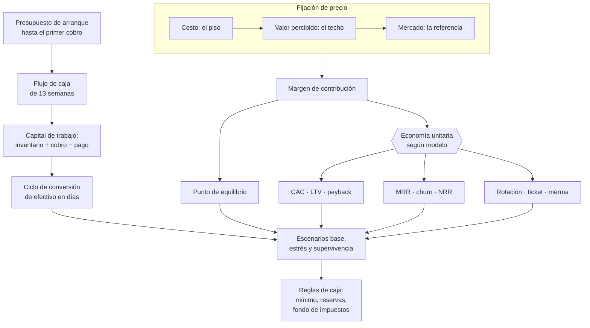

# Parte 09 — Finanzas, caja, precios y economía unitaria

> *Las empresas quiebran por caja, no por falta de utilidad contable*

**Estado de evidencia:** `GUIA-PRACTICA` · **Clases:** 14 (113–126) · **Fecha base normativa:** 07-08-2026 
**Conceptos definidos en esta parte:** 55

## 🎯 De qué trata esta parte

Esta parte es la que más veces salva una empresa. Su tesis es simple: la utilidad es una opinión y la caja es un hecho. Una compañía puede crecer en ventas, mostrar margen y quedarse sin dinero, porque el crecimiento consume capital de trabajo: cada peso adicional de venta inmoviliza inventario y cuentas por cobrar antes de convertirse en cobro.

La herramienta central es el flujo de caja de trece semanas, con horizonte suficiente para reaccionar y detalle suficiente para actuar. Su valor depende de separar lo comprometido de lo probable y de actualizarlo con lo efectivamente ocurrido, no con lo que se esperaba. Alrededor de él se ordenan el punto de equilibrio, el margen de contribución y la economía unitaria del modelo elegido en la parte 03.

El precio merece atención propia porque es la variable con mayor efecto sobre el resultado y la que más se decide por imitación. El costo define el piso, el valor percibido define el techo y el mercado da la referencia; fijar precio mirando solo al competidor equivale a heredar su estructura de costos sin conocerla. La parte cierra con reglas de caja escritas —mínimo en semanas de operación, fondo separado de impuestos y política de retiros— que protegen a la empresa de los meses buenos.

## 📚 Resultados de la parte

Al terminar esta parte podrás:

1. **Construir y mantener un flujo de caja de 13 semanas con supuestos explícitos**.
2. **Calcular punto de equilibrio, margen de contribución y economía unitaria del modelo**.
3. **Fijar precio con un método defendible y no por comparación con el vecino**.
4. **Definir reglas de caja mínima y umbrales de decisión antes de la urgencia**.

## 🗺️ Mapa de la parte

## ⚖️ Marco aplicable

- economía unitaria: CAC, LTV, payback, MRR, ARR, churn y NRR
- ciclo de conversión de efectivo y capital de trabajo
- costo de capital y evaluación de deuda

**Autoridades o contrapartes:** Banco Central de Chile, CMF, SII.
**Profesionales de apoyo:** CFO o controller, contador, asesor financiero.

## ⚠️ Riesgos característicos

- Proyectar ventas sin proyectar el desfase de cobro.
- Fijar precio sobre costo sin considerar el valor percibido ni el mercado.
- Crecer en ventas con margen de contribución negativo.
- Financiar operación estructural con deuda de corto plazo.

## 📘 Las 14 clases

| # | Global | Clase | Decisión que habilita |
|---:|---:|---|---|
| 01 | 113 | [Presupuesto de arranque](class-01-presupuesto-de-arranque/README.md) | determinar cuánto capital se necesita hasta alcanzar operación estable |
| 02 | 114 | [Flujo de caja de 13 semanas](class-02-flujo-de-caja-de-13-semanas/README.md) | instalar el flujo de 13 semanas como rutina semanal de gestión |
| 03 | 115 | [Capital de trabajo](class-03-capital-de-trabajo/README.md) | determinar cuánta caja libera cada mejora en inventario, cobro o pago |
| 04 | 116 | [Punto de equilibrio](class-04-punto-de-equilibrio/README.md) | conocer el volumen mínimo de ventas y el efecto de cada gasto fijo adicional |
| 05 | 117 | [Margen bruto, contribución y EBITDA](class-05-margen-bruto-contribucion-y-ebitda/README.md) | evaluar si el resultado operacional se está convirtiendo en efectivo |
| 06 | 118 | [Pricing basado en costos, valor y mercado](class-06-pricing-basado-en-costos-valor-y-mercado/README.md) | fijar precio y empaquetado con un método declarado y verificable |
| 07 | 119 | [CAC, LTV y payback](class-07-cac-ltv-y-payback/README.md) | determinar si el costo de adquisición es recuperable en un plazo financiable |
| 08 | 120 | [MRR, ARR, churn y NRR para suscripciones](class-08-mrr-arr-churn-y-nrr-para-suscripciones/README.md) | medir la retención neta y decidir si invertir en adquisición o en retención |
| 09 | 121 | [Rotación, ticket y merma para comercio](class-09-rotacion-ticket-y-merma-para-comercio/README.md) | decidir la mezcla de productos según rotación y contribución, no solo margen |
| 10 | 122 | [Ciclo de conversión de efectivo](class-10-ciclo-de-conversion-de-efectivo/README.md) | identificar qué palanca del ciclo se ataca primero y cuánta caja libera |
| 11 | 123 | [Deuda buena, deuda mala y costo de capital](class-11-deuda-buena-deuda-mala-y-costo-de-capital/README.md) | determinar qué se financia con deuda, en qué plazo y a qué costo máximo aceptable |
| 12 | 124 | [Escenarios base, estrés y supervivencia](class-12-escenarios-base-estres-y-supervivencia/README.md) | definir los gatillos y las palancas de ajuste de cada escenario |
| 13 | 125 | [Dashboard financiero del fundador](class-13-dashboard-financiero-del-fundador/README.md) | definir los pocos indicadores que la empresa revisará efectivamente |
| 14 | 126 | [Reglas de caja y reservas](class-14-reglas-de-caja-y-reservas/README.md) | fijar caja mínima, reservas y reglas de retiro por escrito |

## 🔤 Glosario de la parte

| Concepto | Definición operacional |
|---|---|
| **ARR** | Ingreso recurrente anualizado. |
| **CAC** | Costo de adquirir un cliente, incluidos marketing y ventas. |
| **Caja mínima** | Saldo bajo el cual se activan medidas de contingencia. |
| **Calce de plazos** | Correspondencia entre la duración del activo y la del pasivo. |
| **Calidad del EBITDA** | Grado en que el ebitda se convierte efectivamente en caja. |
| **Capital de trabajo** | Recursos que la operación inmoviliza permanentemente. |
| **Churn** | Tasa de pérdida de clientes o ingresos. |
| **Ciclo de conversión de efectivo** | Días de inventario más días de cobro menos días de pago. |
| **Ciclo negativo** | Situación donde se cobra antes de pagar, que financia el crecimiento. |
| **Cohorte** | Grupo de clientes adquiridos en el mismo período. |
| **Colchón** | Reserva para desviaciones del plan. |
| **Costo de capital** | Costo promedio de los recursos que financian la empresa. |
| **Costo fijo** | Gasto que no varía con el volumen en el rango relevante. |
| **Costo variable** | Costo que varía proporcionalmente al volumen. |
| **Dashboard financiero** | Conjunto reducido de indicadores para decidir. |
| **Deuda buena** | Financiamiento cuyo retorno supera su costo y calza en plazo. |
| **Deuda mala** | Financiamiento que cubre pérdidas operacionales recurrentes. |
| **Días de cobro** | Plazo promedio efectivo de cobranza. |
| **Días de inventario** | Tiempo promedio que el inventario permanece antes de venderse. |
| **Días de pago** | Plazo promedio de pago a proveedores. |
| **EBITDA** | Resultado operacional antes de intereses, impuestos, depreciación y amortización. |
| **Efecto sobre caja** | Dinero liberado por cada día de reducción del ciclo. |
| **Empaquetado** | Forma en que se agrupan funciones o servicios en niveles de precio. |
| **Entrada comprometida** | Cobro con documento y fecha acordada. |
| **Escenario base** | Proyección con supuestos más probables. |
| **Escenario de estrés** | Proyección con supuestos adversos pero plausibles. |
| **Escenario de supervivencia** | Mínimo con el que la empresa sigue existiendo. |
| **Flujo de 13 semanas** | Proyección semanal de entradas y salidas de efectivo. |
| **Fondo de impuestos** | Provisión separada para iva, ppm y renta. |
| **Frecuencia** | Cada cuánto se actualiza cada indicador. |
| **Fuente del dato** | Sistema del que proviene cada indicador. |
| **Gasto preoperativo** | Desembolso previo a la primera venta. |
| **LTV** | Valor total esperado de un cliente durante su relación. |
| **Margen bruto** | Porcentaje del ingreso que queda tras el costo directo. |
| **Margen de contribución** | Precio menos costo variable unitario. |
| **Margen por metro cuadrado** | Contribución en relación al espacio ocupado. |
| **Merma** | Pérdida de inventario por daño, vencimiento o hurto. |
| **MRR** | Ingreso recurrente mensual. |
| **NRR** | Retención neta de ingresos incluyendo expansión y contracción. |
| **Palanca de ajuste** | Decisión disponible para reaccionar en cada escenario. |
| **Palanca de reducción** | Acción concreta que acorta el ciclo. |
| **Payback** | Meses que tarda el margen en recuperar el cac. |
| **Precio basado en costo** | Costo más margen objetivo. |
| **Precio basado en valor** | Precio derivado del valor económico para el cliente. |
| **Precio de mercado** | Referencia dada por alternativas disponibles. |
| **Presupuesto de arranque** | Estimación de todos los desembolsos hasta alcanzar operación estable. |
| **Punto de caja mínima** | Saldo bajo el cual la empresa entra en riesgo. |
| **Punto de equilibrio** | Nivel de ventas donde el resultado es cero. |
| **Regla de retiro** | Criterio que define cuándo y cuánto pueden retirar los socios. |
| **Reserva** | Fondo destinado a obligaciones futuras conocidas. |
| **Rolling forecast** | Actualización semanal que desplaza el horizonte. |
| **Rotación** | Frecuencia con que el inventario se vende y repone. |
| **Salida ineludible** | Pago que no admite postergación: remuneraciones, impuestos, arriendo. |
| **Ticket promedio** | Venta media por transacción. |
| **Umbral** | Valor que gatilla una acción. |

## 🔗 Cómo se conecta

Traduce a números el modelo de la parte 03 con los datos de la parte 08. Define el límite de crecimiento financiable que la parte 20 no puede exceder y produce las proyecciones que la parte 16 presenta al banco o al inversionista.

## 📖 Pauta bibliográfica

- Berman, K. y Knight, J. — *Financial Intelligence for Entrepreneurs*: leer estados financieros para decidir.
- Anderson, C. — *The Art of Value*: pricing basado en valor frente a pricing basado en costo.
- Banco Central de Chile — series de tipo de cambio, UF y tasas para las proyecciones.

## 🏛️ Fuentes oficiales de la parte

**Biblioteca del Congreso Nacional · LeyChile — Normativa oficial consolidada**  
<https://www.bcn.cl/leychile/> · verificado 2026-08-07

- *Qué contiene:* Publica el texto oficial y consolidado de leyes, decretos y reglamentos, con la versión vigente a una fecha, el historial de modificaciones y la tramitación que las originó.
- *Cómo leerla:* Usa siempre el selector de versión vigente a la fecha en que ejecutarás el trámite, no la última publicada. Y lee el artículo transitorio: en normas en implantación gradual —jornada, datos personales— ahí está la fecha que realmente te aplica.

**Servicio de Impuestos Internos — Nuevos contribuyentes, inicio de actividades y DTE**  
<https://www.sii.cl/ayudas/nuevos_contribuyentes/boleta-vys-facturador.html> · verificado 2026-08-07

- *Qué contiene:* Reúne el circuito completo del contribuyente nuevo: obtención de RUT, declaración de inicio de actividades, elección de códigos de actividad económica y habilitación para emitir documentos tributarios electrónicos.
- *Cómo leerla:* Sepáralo en dos actos distintos que la página trata seguidos: el RUT identifica, el inicio de actividades habilita. Lo que te bloquea para facturar casi siempre está en el segundo, no en el primero.

**Corporación de Fomento de la Producción — Innovación, inversión y garantías**  
<https://www.corfo.cl/> · verificado 2026-08-07

- *Qué contiene:* Reúne los instrumentos de fomento a la innovación y la inversión, incluidos programas de capital semilla, escalamiento, garantías y cobertura de riesgo para el sistema financiero.
- *Cómo leerla:* Filtra por etapa de la empresa antes que por monto. Y verifica el componente de innovación que exige cada instrumento: presentar una expansión comercial como innovación es la causa más común de rechazo.

---

| Anterior | Índice | Siguiente |
|---|---|---|
| [← Parte 08 · Contabilidad y estados financieros](../part-08-contabilidad-y-estados-financieros/README.md) | [Currículo](../../CURRICULUM.md) · [Programa](../../README.md) | [Parte 10 · Contratos y arquitectura legal operativa →](../part-10-contratos-y-arquitectura-legal-operativa/README.md) |
