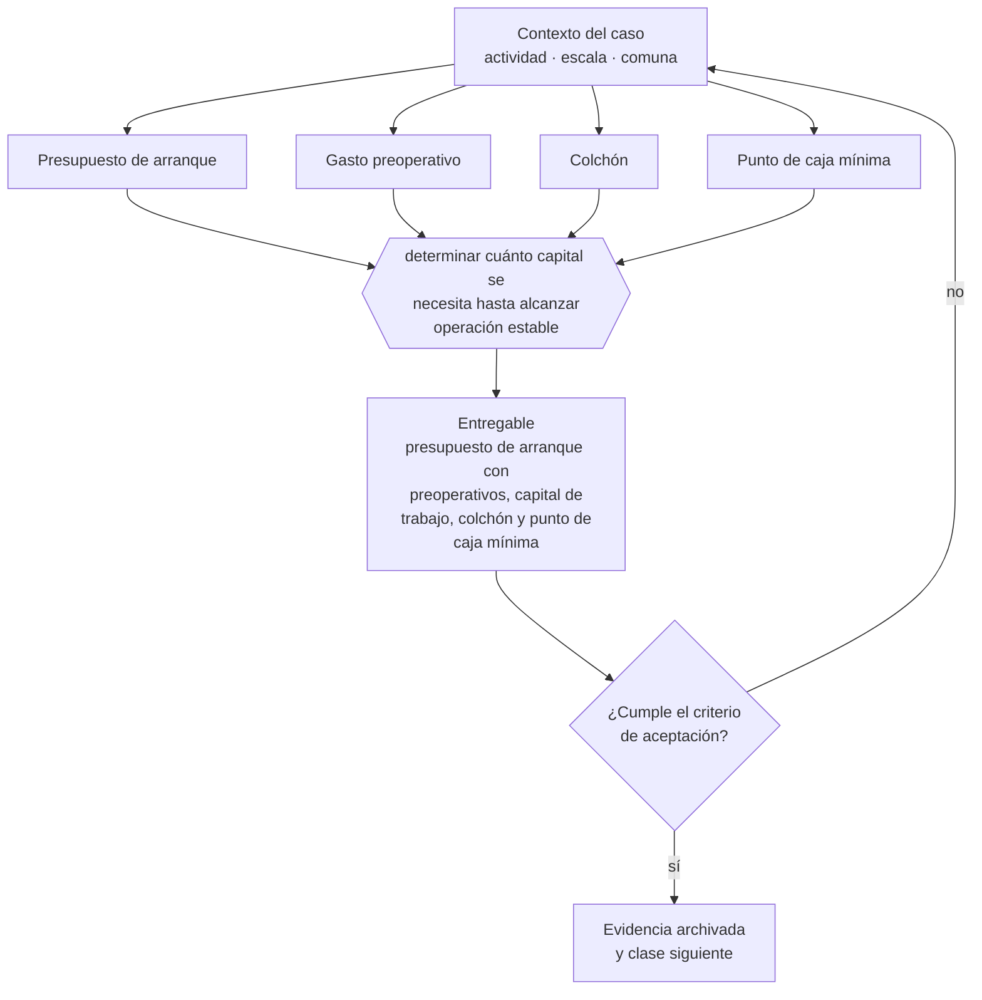

# Clase 113 — Presupuesto de arranque

> **Parte 09 · Finanzas, caja, precios y economía unitaria** — clase 1 de 14

**Estado de evidencia:** `GUIA-PRACTICA` · **Jurisdicción:** Chile-first · **Fecha base normativa:** 07-08-2026 
**Decisión que habilita:** determinar cuánto capital se necesita hasta alcanzar operación estable 
**Entregable:** presupuesto de arranque con preoperativos, capital de trabajo, colchón y punto de caja mínima

## 🎯 Propósito

Presupuestar hasta el primer ciclo completo de cobro y no hasta la primera venta, que es donde se agota el capital de la mayoría de los arranques.

## 📚 Resultados de aprendizaje

Al finalizar esta clase podrás:

1. **Definir** con precisión los cuatro conceptos de la tabla siguiente y usarlos para describir un caso real.
2. **Explicar** por qué esta materia condiciona decisiones de otras partes del programa.
3. **Decidir** —determinar cuánto capital se necesita hasta alcanzar operación estable— y justificar la decisión por escrito.
4. **Producir** el entregable de la clase y contrastarlo contra su criterio de aceptación.
5. **Distinguir** el dato estable del dato dinámico que exige revalidación en la fuente oficial.

## 🧩 Conceptos centrales

| Concepto | Comprensión verificable |
|---|---|
| **Presupuesto de arranque** | Estimación de todos los desembolsos hasta alcanzar operación estable. |
| **Gasto preoperativo** | Desembolso previo a la primera venta. |
| **Colchón** | Reserva para desviaciones del plan. |
| **Punto de caja mínima** | Saldo bajo el cual la empresa entra en riesgo. |

## 🗺️ Flujo de razonamiento

## 📖 Desarrollo

### 1. El fondo del asunto

El presupuesto de arranque falla casi siempre por dos omisiones: los costos de habilitación regulatoria y el capital de trabajo del primer ciclo de cobro. Un presupuesto realista incluye constitución, permisos, garantías de arriendo, primer inventario y tres meses de operación sin ingresos.

### 2. Cómo se traduce en la práctica

Las dos omisiones típicas son los costos de habilitación regulatoria —patente, permisos sectoriales, garantías de arriendo— y el capital de trabajo del primer ciclo. Un presupuesto realista incluye constitución, permisos, primer inventario y tres meses de operación sin ingresos, más un colchón declarado.

### 3. Marco aplicable y quién interviene

- economía unitaria: CAC, LTV, payback, MRR, ARR, churn y NRR
- ciclo de conversión de efectivo y capital de trabajo
- costo de capital y evaluación de deuda

**Autoridades o contrapartes involucradas:** Banco Central de Chile, CMF, SII.
**Profesionales de apoyo:** CFO o controller, contador, asesor financiero. La participación concreta depende del riesgo, del
tamaño de la empresa y de la actividad económica.

## 🧪 Taller guiado

Aplica esta clase a **una** de las siguientes líneas de negocio y repite después el ejercicio con
una segunda línea de carga regulatoria distinta:

| Línea | Carga regulatoria |
|---|---|
| SaaS B2B con IA | media |
| Servicios profesionales | baja |
| E-commerce D2C | media |
| Alimentos o foodtech | alta |
| Exportación de servicios | media |
| Fintech regulada | alta |
| Construcción o servicios técnicos | alta |

**Secuencia de trabajo:**

1. Delimita el contexto: actividad económica, escala, comuna y etapa de la empresa.
2. Reúne los antecedentes que la decisión exige y anota la fecha de cada fuente.
3. Identifica las alternativas reales, incluida la de no hacer nada.
4. Evalúa el impacto en mercado, caja, personas, regulación y operación.
5. Toma la decisión y regístrala con sus supuestos.
6. Produce el entregable.
7. Contrástalo contra el criterio de aceptación.
8. Anota lo que requiere validación profesional y programa su revisión.

### 📦 Entregable

Presupuesto de arranque con preoperativos, capital de trabajo, colchón y punto de caja mínima.

Debe incluir decisión, supuestos, fuentes con fecha de consulta, responsable, riesgos
identificados y próximos pasos.

## 🏆 Reto verificable

Resuelve la misma materia para una segunda línea de negocio con distinta carga regulatoria y
explica por escrito **qué cambió, por qué y qué fuente lo determina**.

## ✅ Criterio de aceptación

- [ ] el presupuesto llega hasta el primer ciclo completo de cobro
- [ ] incluye colchón declarado como porcentaje del total
- [ ] cada afirmación regulatoria está referida a una fuente oficial con fecha de consulta;
- [ ] los datos dinámicos quedan marcados para revalidación;
- [ ] hay un responsable asignado y evidencia reproducible del trabajo.

## ⚠️ Errores frecuentes

**Propios de esta clase:**

- Omitir costos de habilitación regulatoria y garantías.
- Presupuestar hasta la primera venta y no hasta el primer cobro.

**Característicos de la parte 09:**

- Proyectar ventas sin proyectar el desfase de cobro.
- Fijar precio sobre costo sin considerar el valor percibido ni el mercado.

## 🇨🇱 Checklist Chile

- [ ] ¿existe norma o autoridad específica para esta materia?
- [ ] ¿la fuente consultada está vigente a la fecha de ejecución?
- [ ] ¿se activa algún trámite ante el SII?
- [ ] ¿se activa algún requisito municipal o sectorial?
- [ ] ¿afecta a consumidores o al tratamiento de datos personales?
- [ ] ¿afecta a trabajadores o a la seguridad y salud en el trabajo?
- [ ] ¿afecta a impuestos, contabilidad o caja?
- [ ] ¿afecta a contratos o a propiedad intelectual?
- [ ] ¿requiere renovación, reporte periódico o revalidación?

## ❓ Preguntas de comprobación

1. ¿Tu presupuesto llega hasta el primer cobro o hasta la primera venta?
2. ¿Incluiste los costos y plazos de habilitación de la parte 17?
3. ¿Qué porcentaje del total dejaste como colchón y por qué ese?

## 🔗 Fuentes oficiales

**Servicio de Cooperación Técnica — Fomento para micro y pequeñas empresas**  
<https://www.sercotec.cl/> · verificado 2026-08-19

- *Qué contiene:* Publica las convocatorias vigentes con sus bases: perfil de empresa elegible, monto del subsidio, cofinanciamiento exigido, gastos financiables y obligaciones de rendición.
- *Cómo leerla:* Lee las bases desde el final: la sección de rendición decide si podrás quedarte con el subsidio. Muchos proyectos se adjudican y después devuelven fondos por no poder acreditar el gasto en la forma exigida.
- *Uso en esta clase:* aporta el marco de «Fomento para micro y pequeñas empresas» para determinar cuánto capital se necesita hasta alcanzar operación estable.

Complementos del repositorio: [glosario](../../../docs/19_GLOSSARY.md) ·
[ruta de lecturas](../../../docs/15_BOOKS_AND_LEARNING_PATH.md) ·
[catálogo de fuentes](../../../docs/16_OFFICIAL_SOURCE_CATALOG.md).

> [!IMPORTANT]
> Material educativo. Para una decisión real de alto impacto hay que verificar la fuente oficial
> vigente y validar con el profesional competente.

---

| Anterior | Índice | Siguiente |
|---|---|---|
| **Inicio de la parte** | [Parte 09](../README.md) · [Programa](../../../README.md) | [114 · Flujo de caja de 13 semanas →](../class-02-flujo-de-caja-de-13-semanas/README.md) |
