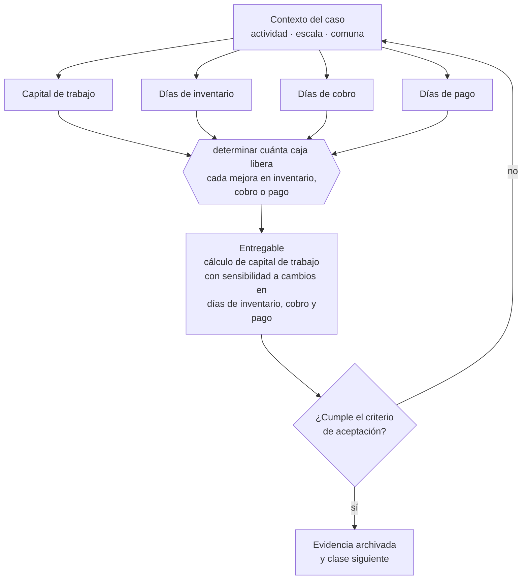

# Clase 115 — Capital de trabajo

> **Parte 09 · Finanzas, caja, precios y economía unitaria** — clase 3 de 14

**Estado de evidencia:** `GUIA-PRACTICA` · **Jurisdicción:** Chile-first · **Fecha base normativa:** 07-08-2026 
**Decisión que habilita:** determinar cuánta caja libera cada mejora en inventario, cobro o pago 
**Entregable:** cálculo de capital de trabajo con sensibilidad a cambios en días de inventario, cobro y pago

## 🎯 Propósito

Calcular cuánta caja libera cada mejora en inventario, cobro o pago, porque suele ser la fuente de financiamiento más rápida y barata disponible.

## 📚 Resultados de aprendizaje

Al finalizar esta clase podrás:

1. **Definir** con precisión los cuatro conceptos de la tabla siguiente y usarlos para describir un caso real.
2. **Explicar** por qué esta materia condiciona decisiones de otras partes del programa.
3. **Decidir** —determinar cuánta caja libera cada mejora en inventario, cobro o pago— y justificar la decisión por escrito.
4. **Producir** el entregable de la clase y contrastarlo contra su criterio de aceptación.
5. **Distinguir** el dato estable del dato dinámico que exige revalidación en la fuente oficial.

## 🧩 Conceptos centrales

| Concepto | Comprensión verificable |
|---|---|
| **Capital de trabajo** | Recursos que la operación inmoviliza permanentemente. |
| **Días de inventario** | Tiempo promedio que el inventario permanece antes de venderse. |
| **Días de cobro** | Plazo promedio efectivo de cobranza. |
| **Días de pago** | Plazo promedio de pago a proveedores. |

## 🗺️ Flujo de razonamiento

## 📖 Desarrollo

### 1. El fondo del asunto

El capital de trabajo requerido crece proporcionalmente a las ventas: por eso el crecimiento consume caja. Reducirlo actuando sobre inventario, cobro y pago libera dinero sin necesidad de financiamiento externo, y suele ser la palanca más rápida disponible.

### 2. Cómo se traduce en la práctica

El capital de trabajo crece proporcionalmente a las ventas: por eso el crecimiento consume caja. Actuar sobre los días de inventario, cobro y pago libera dinero sin costo financiero, aunque alargar el pago a proveedores tiene un límite: pasado cierto punto daña el suministro y encarece la compra.

### 3. Marco aplicable y quién interviene

- economía unitaria: CAC, LTV, payback, MRR, ARR, churn y NRR
- ciclo de conversión de efectivo y capital de trabajo
- costo de capital y evaluación de deuda

**Autoridades o contrapartes involucradas:** Banco Central de Chile, CMF, SII.
**Profesionales de apoyo:** CFO o controller, contador, asesor financiero. La participación concreta depende del riesgo, del
tamaño de la empresa y de la actividad económica.

## 🧪 Taller guiado

Aplica esta clase a **una** de las siguientes líneas de negocio y repite después el ejercicio con
una segunda línea de carga regulatoria distinta:

| Línea | Carga regulatoria |
|---|---|
| SaaS B2B con IA | media |
| Servicios profesionales | baja |
| E-commerce D2C | media |
| Alimentos o foodtech | alta |
| Exportación de servicios | media |
| Fintech regulada | alta |
| Construcción o servicios técnicos | alta |

**Secuencia de trabajo:**

1. Delimita el contexto: actividad económica, escala, comuna y etapa de la empresa.
2. Reúne los antecedentes que la decisión exige y anota la fecha de cada fuente.
3. Identifica las alternativas reales, incluida la de no hacer nada.
4. Evalúa el impacto en mercado, caja, personas, regulación y operación.
5. Toma la decisión y regístrala con sus supuestos.
6. Produce el entregable.
7. Contrástalo contra el criterio de aceptación.
8. Anota lo que requiere validación profesional y programa su revisión.

### 📦 Entregable

Cálculo de capital de trabajo con sensibilidad a cambios en días de inventario, cobro y pago.

Debe incluir decisión, supuestos, fuentes con fecha de consulta, responsable, riesgos
identificados y próximos pasos.

## 🏆 Reto verificable

Resuelve la misma materia para una segunda línea de negocio con distinta carga regulatoria y
explica por escrito **qué cambió, por qué y qué fuente lo determina**.

## ✅ Criterio de aceptación

- [ ] la sensibilidad muestra caja liberada por cada palanca
- [ ] el capital de trabajo proyectado acompaña el plan de ventas
- [ ] cada afirmación regulatoria está referida a una fuente oficial con fecha de consulta;
- [ ] los datos dinámicos quedan marcados para revalidación;
- [ ] hay un responsable asignado y evidencia reproducible del trabajo.

## ⚠️ Errores frecuentes

**Propios de esta clase:**

- Financiar capital de trabajo estructural con deuda de corto plazo renovada indefinidamente.
- Alargar el pago a proveedores hasta dañar el suministro.

**Característicos de la parte 09:**

- Proyectar ventas sin proyectar el desfase de cobro.
- Fijar precio sobre costo sin considerar el valor percibido ni el mercado.

## 🇨🇱 Checklist Chile

- [ ] ¿existe norma o autoridad específica para esta materia?
- [ ] ¿la fuente consultada está vigente a la fecha de ejecución?
- [ ] ¿se activa algún trámite ante el SII?
- [ ] ¿se activa algún requisito municipal o sectorial?
- [ ] ¿afecta a consumidores o al tratamiento de datos personales?
- [ ] ¿afecta a trabajadores o a la seguridad y salud en el trabajo?
- [ ] ¿afecta a impuestos, contabilidad o caja?
- [ ] ¿afecta a contratos o a propiedad intelectual?
- [ ] ¿requiere renovación, reporte periódico o revalidación?

## ❓ Preguntas de comprobación

1. ¿Cuánta caja liberarías reduciendo cinco días tu plazo de cobro?
2. ¿Qué días de inventario tienes y cuánto dinero representan?
3. ¿Estás alargando el pago a proveedores hasta un punto que ya te encarece la compra?

## 🔗 Fuentes oficiales

**Biblioteca del Congreso Nacional · LeyChile — Normativa oficial consolidada**  
<https://www.bcn.cl/leychile/> · verificado 2026-08-19

- *Qué contiene:* Publica el texto oficial y consolidado de leyes, decretos y reglamentos, con la versión vigente a una fecha, el historial de modificaciones y la tramitación que las originó.
- *Cómo leerla:* Usa siempre el selector de versión vigente a la fecha en que ejecutarás el trámite, no la última publicada. Y lee el artículo transitorio: en normas en implantación gradual —jornada, datos personales— ahí está la fecha que realmente te aplica.
- *Uso en esta clase:* aporta el marco de «Normativa oficial consolidada» para determinar cuánta caja libera cada mejora en inventario, cobro o pago.

**Servicio de Impuestos Internos — Nuevos contribuyentes, inicio de actividades y DTE**  
<https://www.sii.cl/ayudas/nuevos_contribuyentes/boleta-vys-facturador.html> · verificado 2026-08-19

- *Qué contiene:* Reúne el circuito completo del contribuyente nuevo: obtención de RUT, declaración de inicio de actividades, elección de códigos de actividad económica y habilitación para emitir documentos tributarios electrónicos.
- *Cómo leerla:* Sepáralo en dos actos distintos que la página trata seguidos: el RUT identifica, el inicio de actividades habilita. Lo que te bloquea para facturar casi siempre está en el segundo, no en el primero.
- *Uso en esta clase:* aporta el marco de «Nuevos contribuyentes, inicio de actividades y DTE» para determinar cuánta caja libera cada mejora en inventario, cobro o pago.

**Corporación de Fomento de la Producción — Innovación, inversión y garantías**  
<https://www.corfo.cl/> · verificado 2026-08-19

- *Qué contiene:* Reúne los instrumentos de fomento a la innovación y la inversión, incluidos programas de capital semilla, escalamiento, garantías y cobertura de riesgo para el sistema financiero.
- *Cómo leerla:* Filtra por etapa de la empresa antes que por monto. Y verifica el componente de innovación que exige cada instrumento: presentar una expansión comercial como innovación es la causa más común de rechazo.
- *Uso en esta clase:* aporta el marco de «Innovación, inversión y garantías» para determinar cuánta caja libera cada mejora en inventario, cobro o pago.

Complementos del repositorio: [glosario](../../../docs/19_GLOSSARY.md) ·
[ruta de lecturas](../../../docs/15_BOOKS_AND_LEARNING_PATH.md) ·
[catálogo de fuentes](../../../docs/16_OFFICIAL_SOURCE_CATALOG.md).

> [!IMPORTANT]
> Material educativo. Para una decisión real de alto impacto hay que verificar la fuente oficial
> vigente y validar con el profesional competente.

---

| Anterior | Índice | Siguiente |
|---|---|---|
| [← 114 · Flujo de caja de 13 semanas](../class-02-flujo-de-caja-de-13-semanas/README.md) | [Parte 09](../README.md) · [Programa](../../../README.md) | [116 · Punto de equilibrio →](../class-04-punto-de-equilibrio/README.md) |
