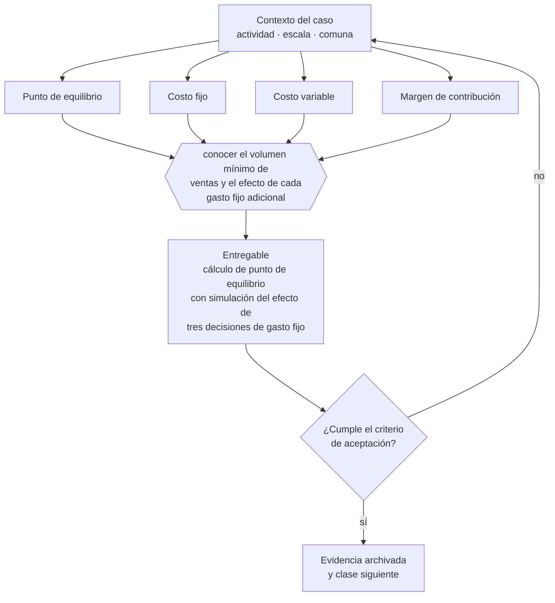

# Clase 116 — Punto de equilibrio

> **Parte 09 · Finanzas, caja, precios y economía unitaria** — clase 4 de 14

**Estado de evidencia:** `GUIA-PRACTICA` · **Jurisdicción:** Chile-first · **Fecha base normativa:** 07-08-2026 
**Decisión que habilita:** conocer el volumen mínimo de ventas y el efecto de cada gasto fijo adicional 
**Entregable:** cálculo de punto de equilibrio con simulación del efecto de tres decisiones de gasto fijo

## 🎯 Propósito

Conocer el volumen mínimo de ventas y, sobre todo, cuánto sube esa exigencia con cada gasto fijo nuevo que se compromete.

## 📚 Resultados de aprendizaje

Al finalizar esta clase podrás:

1. **Definir** con precisión los cuatro conceptos de la tabla siguiente y usarlos para describir un caso real.
2. **Explicar** por qué esta materia condiciona decisiones de otras partes del programa.
3. **Decidir** —conocer el volumen mínimo de ventas y el efecto de cada gasto fijo adicional— y justificar la decisión por escrito.
4. **Producir** el entregable de la clase y contrastarlo contra su criterio de aceptación.
5. **Distinguir** el dato estable del dato dinámico que exige revalidación en la fuente oficial.

## 🧩 Conceptos centrales

| Concepto | Comprensión verificable |
|---|---|
| **Punto de equilibrio** | Nivel de ventas donde el resultado es cero. |
| **Costo fijo** | Gasto que no varía con el volumen en el rango relevante. |
| **Costo variable** | Costo que varía proporcionalmente al volumen. |
| **Margen de contribución** | Precio menos costo variable unitario. |

## 🗺️ Flujo de razonamiento

## 📖 Desarrollo

### 1. El fondo del asunto

El punto de equilibrio se calcula dividiendo costos fijos por margen de contribución unitario. Su utilidad práctica es doble: dice cuánto hay que vender para no perder y, sobre todo, cuánto sube esa exigencia con cada gasto fijo nuevo que se compromete.

### 2. Cómo se traduce en la práctica

Esa segunda lectura es la útil para decidir: contratar a alguien o arrendar un local no es un gasto mensual, es un desplazamiento permanente del punto de equilibrio. Clasificar como fijo un costo que en realidad varía con el volumen distorsiona el cálculo en la dirección optimista.

### 3. Marco aplicable y quién interviene

- economía unitaria: CAC, LTV, payback, MRR, ARR, churn y NRR
- ciclo de conversión de efectivo y capital de trabajo
- costo de capital y evaluación de deuda

**Autoridades o contrapartes involucradas:** Banco Central de Chile, CMF, SII.
**Profesionales de apoyo:** CFO o controller, contador, asesor financiero. La participación concreta depende del riesgo, del
tamaño de la empresa y de la actividad económica.

## 🧪 Taller guiado

Aplica esta clase a **una** de las siguientes líneas de negocio y repite después el ejercicio con
una segunda línea de carga regulatoria distinta:

| Línea | Carga regulatoria |
|---|---|
| SaaS B2B con IA | media |
| Servicios profesionales | baja |
| E-commerce D2C | media |
| Alimentos o foodtech | alta |
| Exportación de servicios | media |
| Fintech regulada | alta |
| Construcción o servicios técnicos | alta |

**Secuencia de trabajo:**

1. Delimita el contexto: actividad económica, escala, comuna y etapa de la empresa.
2. Reúne los antecedentes que la decisión exige y anota la fecha de cada fuente.
3. Identifica las alternativas reales, incluida la de no hacer nada.
4. Evalúa el impacto en mercado, caja, personas, regulación y operación.
5. Toma la decisión y regístrala con sus supuestos.
6. Produce el entregable.
7. Contrástalo contra el criterio de aceptación.
8. Anota lo que requiere validación profesional y programa su revisión.

### 📦 Entregable

Cálculo de punto de equilibrio con simulación del efecto de tres decisiones de gasto fijo.

Debe incluir decisión, supuestos, fuentes con fecha de consulta, responsable, riesgos
identificados y próximos pasos.

## 🏆 Reto verificable

Resuelve la misma materia para una segunda línea de negocio con distinta carga regulatoria y
explica por escrito **qué cambió, por qué y qué fuente lo determina**.

## ✅ Criterio de aceptación

- [ ] la clasificación fijo/variable está justificada
- [ ] se muestra el efecto de decisiones de gasto sobre el equilibrio
- [ ] cada afirmación regulatoria está referida a una fuente oficial con fecha de consulta;
- [ ] los datos dinámicos quedan marcados para revalidación;
- [ ] hay un responsable asignado y evidencia reproducible del trabajo.

## ⚠️ Errores frecuentes

**Propios de esta clase:**

- Clasificar como fijo un costo que en realidad varía con el volumen.
- Comprometer gasto fijo sin recalcular el punto de equilibrio.

**Característicos de la parte 09:**

- Proyectar ventas sin proyectar el desfase de cobro.
- Fijar precio sobre costo sin considerar el valor percibido ni el mercado.

## 🇨🇱 Checklist Chile

- [ ] ¿existe norma o autoridad específica para esta materia?
- [ ] ¿la fuente consultada está vigente a la fecha de ejecución?
- [ ] ¿se activa algún trámite ante el SII?
- [ ] ¿se activa algún requisito municipal o sectorial?
- [ ] ¿afecta a consumidores o al tratamiento de datos personales?
- [ ] ¿afecta a trabajadores o a la seguridad y salud en el trabajo?
- [ ] ¿afecta a impuestos, contabilidad o caja?
- [ ] ¿afecta a contratos o a propiedad intelectual?
- [ ] ¿requiere renovación, reporte periódico o revalidación?

## ❓ Preguntas de comprobación

1. ¿Cuánto sube tu punto de equilibrio con la próxima contratación que estás evaluando?
2. ¿Qué costos clasificados como fijos varían en realidad con el volumen?
3. ¿Cuántos meses seguidos has estado bajo el punto de equilibrio?

## 🔗 Fuentes oficiales

**Biblioteca del Congreso Nacional · LeyChile — Normativa oficial consolidada**  
<https://www.bcn.cl/leychile/> · verificado 2026-08-19

- *Qué contiene:* Publica el texto oficial y consolidado de leyes, decretos y reglamentos, con la versión vigente a una fecha, el historial de modificaciones y la tramitación que las originó.
- *Cómo leerla:* Usa siempre el selector de versión vigente a la fecha en que ejecutarás el trámite, no la última publicada. Y lee el artículo transitorio: en normas en implantación gradual —jornada, datos personales— ahí está la fecha que realmente te aplica.
- *Uso en esta clase:* aporta el marco de «Normativa oficial consolidada» para conocer el volumen mínimo de ventas y el efecto de cada gasto fijo adicional.

**Servicio de Impuestos Internos — Nuevos contribuyentes, inicio de actividades y DTE**  
<https://www.sii.cl/ayudas/nuevos_contribuyentes/boleta-vys-facturador.html> · verificado 2026-08-19

- *Qué contiene:* Reúne el circuito completo del contribuyente nuevo: obtención de RUT, declaración de inicio de actividades, elección de códigos de actividad económica y habilitación para emitir documentos tributarios electrónicos.
- *Cómo leerla:* Sepáralo en dos actos distintos que la página trata seguidos: el RUT identifica, el inicio de actividades habilita. Lo que te bloquea para facturar casi siempre está en el segundo, no en el primero.
- *Uso en esta clase:* aporta el marco de «Nuevos contribuyentes, inicio de actividades y DTE» para conocer el volumen mínimo de ventas y el efecto de cada gasto fijo adicional.

**Corporación de Fomento de la Producción — Innovación, inversión y garantías**  
<https://www.corfo.cl/> · verificado 2026-08-19

- *Qué contiene:* Reúne los instrumentos de fomento a la innovación y la inversión, incluidos programas de capital semilla, escalamiento, garantías y cobertura de riesgo para el sistema financiero.
- *Cómo leerla:* Filtra por etapa de la empresa antes que por monto. Y verifica el componente de innovación que exige cada instrumento: presentar una expansión comercial como innovación es la causa más común de rechazo.
- *Uso en esta clase:* aporta el marco de «Innovación, inversión y garantías» para conocer el volumen mínimo de ventas y el efecto de cada gasto fijo adicional.

Complementos del repositorio: [glosario](../../../docs/19_GLOSSARY.md) ·
[ruta de lecturas](../../../docs/15_BOOKS_AND_LEARNING_PATH.md) ·
[catálogo de fuentes](../../../docs/16_OFFICIAL_SOURCE_CATALOG.md).

> [!IMPORTANT]
> Material educativo. Para una decisión real de alto impacto hay que verificar la fuente oficial
> vigente y validar con el profesional competente.

---

| Anterior | Índice | Siguiente |
|---|---|---|
| [← 115 · Capital de trabajo](../class-03-capital-de-trabajo/README.md) | [Parte 09](../README.md) · [Programa](../../../README.md) | [117 · Margen bruto, contribución y EBITDA →](../class-05-margen-bruto-contribucion-y-ebitda/README.md) |
