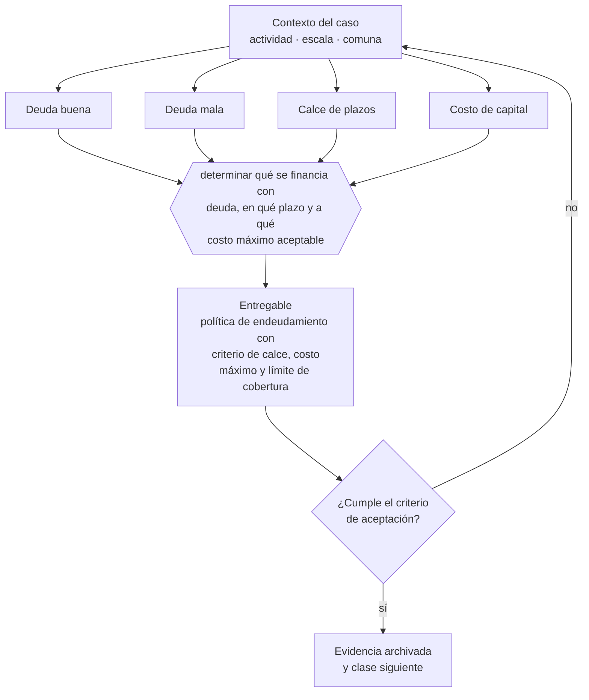

# Clase 123 — Deuda buena, deuda mala y costo de capital

> **Parte 09 · Finanzas, caja, precios y economía unitaria** — clase 11 de 14

**Estado de evidencia:** `GUIA-PRACTICA` · **Jurisdicción:** Chile-first · **Fecha base normativa:** 07-08-2026 
**Decisión que habilita:** determinar qué se financia con deuda, en qué plazo y a qué costo máximo aceptable 
**Entregable:** política de endeudamiento con criterio de calce, costo máximo y límite de cobertura

## 🎯 Propósito

Aplicar la regla de calce de plazos y distinguir deuda que financia crecimiento de deuda que cubre pérdidas operacionales recurrentes.

## 📚 Resultados de aprendizaje

Al finalizar esta clase podrás:

1. **Definir** con precisión los cuatro conceptos de la tabla siguiente y usarlos para describir un caso real.
2. **Explicar** por qué esta materia condiciona decisiones de otras partes del programa.
3. **Decidir** —determinar qué se financia con deuda, en qué plazo y a qué costo máximo aceptable— y justificar la decisión por escrito.
4. **Producir** el entregable de la clase y contrastarlo contra su criterio de aceptación.
5. **Distinguir** el dato estable del dato dinámico que exige revalidación en la fuente oficial.

## 🧩 Conceptos centrales

| Concepto | Comprensión verificable |
|---|---|
| **Deuda buena** | Financiamiento cuyo retorno supera su costo y calza en plazo. |
| **Deuda mala** | Financiamiento que cubre pérdidas operacionales recurrentes. |
| **Calce de plazos** | Correspondencia entre la duración del activo y la del pasivo. |
| **Costo de capital** | Costo promedio de los recursos que financian la empresa. |

## 🗺️ Flujo de razonamiento

## 📖 Desarrollo

### 1. El fondo del asunto

La regla del calce es simple y se viola con frecuencia: activos de largo plazo se financian con pasivos de largo plazo. Financiar una máquina con una línea de crédito renovable expone a la empresa a que el banco no renueve justo cuando más lo necesita.

### 2. Cómo se traduce en la práctica

Financiar una máquina con una línea renovable expone a la empresa a que el banco no renueve justo cuando más lo necesita. Y financiar pérdidas operacionales esperando que la operación mejore sola convierte un problema de modelo en un problema de solvencia, que ya no tiene solución operativa.

### 3. Marco aplicable y quién interviene

- economía unitaria: CAC, LTV, payback, MRR, ARR, churn y NRR
- ciclo de conversión de efectivo y capital de trabajo
- costo de capital y evaluación de deuda

**Autoridades o contrapartes involucradas:** Banco Central de Chile, CMF, SII.
**Profesionales de apoyo:** CFO o controller, contador, asesor financiero. La participación concreta depende del riesgo, del
tamaño de la empresa y de la actividad económica.

## 🧪 Taller guiado

Aplica esta clase a **una** de las siguientes líneas de negocio y repite después el ejercicio con
una segunda línea de carga regulatoria distinta:

| Línea | Carga regulatoria |
|---|---|
| SaaS B2B con IA | media |
| Servicios profesionales | baja |
| E-commerce D2C | media |
| Alimentos o foodtech | alta |
| Exportación de servicios | media |
| Fintech regulada | alta |
| Construcción o servicios técnicos | alta |

**Secuencia de trabajo:**

1. Delimita el contexto: actividad económica, escala, comuna y etapa de la empresa.
2. Reúne los antecedentes que la decisión exige y anota la fecha de cada fuente.
3. Identifica las alternativas reales, incluida la de no hacer nada.
4. Evalúa el impacto en mercado, caja, personas, regulación y operación.
5. Toma la decisión y regístrala con sus supuestos.
6. Produce el entregable.
7. Contrástalo contra el criterio de aceptación.
8. Anota lo que requiere validación profesional y programa su revisión.

### 📦 Entregable

Política de endeudamiento con criterio de calce, costo máximo y límite de cobertura.

Debe incluir decisión, supuestos, fuentes con fecha de consulta, responsable, riesgos
identificados y próximos pasos.

## 🏆 Reto verificable

Resuelve la misma materia para una segunda línea de negocio con distinta carga regulatoria y
explica por escrito **qué cambió, por qué y qué fuente lo determina**.

## ✅ Criterio de aceptación

- [ ] cada deuda tiene destino y plazo calzado
- [ ] existe límite declarado de cobertura de intereses
- [ ] cada afirmación regulatoria está referida a una fuente oficial con fecha de consulta;
- [ ] los datos dinámicos quedan marcados para revalidación;
- [ ] hay un responsable asignado y evidencia reproducible del trabajo.

## ⚠️ Errores frecuentes

**Propios de esta clase:**

- Financiar pérdidas operacionales con deuda esperando que la operación mejore sola.
- Tomar deuda de corto plazo para activos de largo plazo.

**Característicos de la parte 09:**

- Proyectar ventas sin proyectar el desfase de cobro.
- Fijar precio sobre costo sin considerar el valor percibido ni el mercado.

## 🇨🇱 Checklist Chile

- [ ] ¿existe norma o autoridad específica para esta materia?
- [ ] ¿la fuente consultada está vigente a la fecha de ejecución?
- [ ] ¿se activa algún trámite ante el SII?
- [ ] ¿se activa algún requisito municipal o sectorial?
- [ ] ¿afecta a consumidores o al tratamiento de datos personales?
- [ ] ¿afecta a trabajadores o a la seguridad y salud en el trabajo?
- [ ] ¿afecta a impuestos, contabilidad o caja?
- [ ] ¿afecta a contratos o a propiedad intelectual?
- [ ] ¿requiere renovación, reporte periódico o revalidación?

## ❓ Preguntas de comprobación

1. ¿Cada deuda que tienes calza en plazo con lo que financió?
2. ¿Alguna deuda tuya está cubriendo pérdidas operacionales recurrentes?
3. ¿Qué límite de cobertura de intereses te has fijado por escrito?

## 🔗 Fuentes oficiales

**Corporación de Fomento de la Producción — Innovación, inversión y garantías**  
<https://www.corfo.cl/> · verificado 2026-08-07

- *Qué contiene:* Reúne los instrumentos de fomento a la innovación y la inversión, incluidos programas de capital semilla, escalamiento, garantías y cobertura de riesgo para el sistema financiero.
- *Cómo leerla:* Filtra por etapa de la empresa antes que por monto. Y verifica el componente de innovación que exige cada instrumento: presentar una expansión comercial como innovación es la causa más común de rechazo.

**Biblioteca del Congreso Nacional · LeyChile — Normativa oficial consolidada**  
<https://www.bcn.cl/leychile/> · verificado 2026-08-07

- *Qué contiene:* Publica el texto oficial y consolidado de leyes, decretos y reglamentos, con la versión vigente a una fecha, el historial de modificaciones y la tramitación que las originó.
- *Cómo leerla:* Usa siempre el selector de versión vigente a la fecha en que ejecutarás el trámite, no la última publicada. Y lee el artículo transitorio: en normas en implantación gradual —jornada, datos personales— ahí está la fecha que realmente te aplica.

Complementos del repositorio: [glosario](../../../docs/19_GLOSSARY.md) ·
[ruta de lecturas](../../../docs/15_BOOKS_AND_LEARNING_PATH.md) ·
[catálogo de fuentes](../../../docs/16_OFFICIAL_SOURCE_CATALOG.md).

> [!IMPORTANT]
> Material educativo. Para una decisión real de alto impacto hay que verificar la fuente oficial
> vigente y validar con el profesional competente.

---

| Anterior | Índice | Siguiente |
|---|---|---|
| [← 122 · Ciclo de conversión de efectivo](../class-10-ciclo-de-conversion-de-efectivo/README.md) | [Parte 09](../README.md) · [Programa](../../../README.md) | [124 · Escenarios base, estrés y supervivencia →](../class-12-escenarios-base-estres-y-supervivencia/README.md) |
