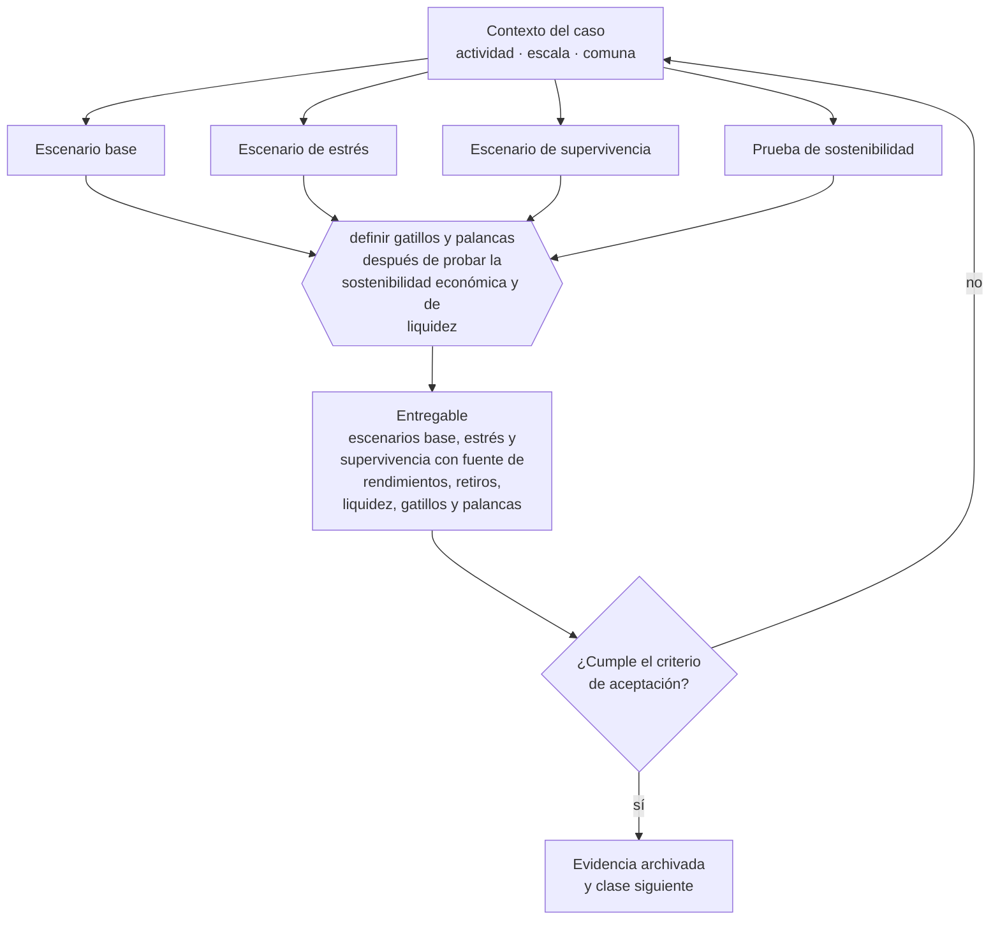

# Clase 124 — Escenarios base, estrés y supervivencia

> **Parte 09 · Finanzas, caja, precios y economía unitaria** — clase 12 de 14

**Estado de evidencia:** `GUIA-PRACTICA` · **Jurisdicción:** Chile-first · **Fecha base normativa:** 07-08-2026 
**Decisión que habilita:** definir gatillos y palancas después de probar la sostenibilidad económica y de liquidez 
**Entregable:** escenarios base, estrés y supervivencia con fuente de rendimientos, retiros, liquidez, gatillos y palancas

## 🎯 Propósito

Probar que rendimiento, liquidez y promesa de producto siguen siendo sostenibles bajo estrés y tienen palancas ejecutables.

## 📚 Resultados de aprendizaje

Al finalizar esta clase podrás:

1. **Definir** con precisión los cuatro conceptos de la tabla siguiente y usarlos para describir un caso real.
2. **Explicar** por qué esta materia condiciona decisiones de otras partes del programa.
3. **Decidir** —definir gatillos y palancas después de probar la sostenibilidad económica y de liquidez— y justificar la decisión por escrito.
4. **Producir** el entregable de la clase y contrastarlo contra su criterio de aceptación.
5. **Distinguir** el dato estable del dato dinámico que exige revalidación en la fuente oficial.

## 🧩 Conceptos centrales

| Concepto | Comprensión verificable |
|---|---|
| **Escenario base** | Proyección con supuestos más probables. |
| **Escenario de estrés** | Proyección con supuestos adversos pero plausibles. |
| **Escenario de supervivencia** | Mínimo con el que la empresa sigue existiendo. |
| **Prueba de sostenibilidad** | Contraste entre la promesa del producto y las fuentes reales de caja y rendimiento. |

## 🗺️ Flujo de razonamiento

## 📖 Desarrollo

### 1. El fondo del asunto

Los escenarios deben probar simultáneamente ingresos, liquidez, retiros y la fuente económica de cualquier rendimiento prometido. Celsius aporta una lección sobre tasas, liquidez y comunicación de riesgos; Terra/UST/LUNA, sobre productos cuya estabilidad depende de supuestos que pueden romperse de forma conjunta. Las fuentes citadas corresponden a sentencias estadounidenses, no a reglas trasladables por sí solas a Chile. Una rentabilidad elevada activa verificación reforzada, pero no demuestra automáticamente un delito.

### 2. Cómo se traduce en la práctica

Celsius y Terra muestran por rutas distintas que el escenario útil combina deterioro de activos, retiros, concentración, pérdida de confianza y costo de sostener la promesa. El modelo debe explicar quién paga el rendimiento, qué activo lo produce, cuándo se realiza la caja y qué ocurre si todos los supuestos adversos se correlacionan. La señal abre una investigación; la evidencia determina la conclusión.

### 3. Marco aplicable y quién interviene

- economía unitaria: CAC, LTV, payback, MRR, ARR, churn y NRR
- ciclo de conversión de efectivo y capital de trabajo
- costo de capital y evaluación de deuda

**Autoridades o contrapartes involucradas:** Banco Central de Chile, CMF, SII.
**Profesionales de apoyo:** CFO o controller, contador, asesor financiero. La participación concreta depende del riesgo, del
tamaño de la empresa y de la actividad económica.

## 🧪 Taller guiado

Aplica esta clase a **una** de las siguientes líneas de negocio y repite después el ejercicio con
una segunda línea de carga regulatoria distinta:

| Línea | Carga regulatoria |
|---|---|
| SaaS B2B con IA | media |
| Servicios profesionales | baja |
| E-commerce D2C | media |
| Alimentos o foodtech | alta |
| Exportación de servicios | media |
| Fintech regulada | alta |
| Construcción o servicios técnicos | alta |

**Secuencia de trabajo:**

1. Delimita el contexto: actividad económica, escala, comuna y etapa de la empresa.
2. Reúne los antecedentes que la decisión exige y anota la fecha de cada fuente.
3. Identifica las alternativas reales, incluida la de no hacer nada.
4. Evalúa el impacto en mercado, caja, personas, regulación y operación.
5. Toma la decisión y regístrala con sus supuestos.
6. Produce el entregable.
7. Contrástalo contra el criterio de aceptación.
8. Anota lo que requiere validación profesional y programa su revisión.

### 📦 Entregable

Escenarios base, estrés y supervivencia con fuente de rendimientos, retiros, liquidez, gatillos y palancas.

Debe incluir decisión, supuestos, fuentes con fecha de consulta, responsable, riesgos
identificados y próximos pasos.

## 🏆 Reto verificable

Resuelve la misma materia para una segunda línea de negocio con distinta carga regulatoria y
explica por escrito **qué cambió, por qué y qué fuente lo determina**.

## ✅ Criterio de aceptación

- [ ] cada rendimiento se reconcilia con una fuente económica y un riesgo explícitos
- [ ] el estrés combina retiros, deterioro de activos y pérdida de confianza con palancas ejecutables
- [ ] cada afirmación regulatoria está referida a una fuente oficial con fecha de consulta;
- [ ] los datos dinámicos quedan marcados para revalidación;
- [ ] hay un responsable asignado y evidencia reproducible del trabajo.

## ⚠️ Errores frecuentes

**Propios de esta clase:**

- Modelar el rendimiento prometido sin explicar quién lo genera y bajo qué riesgo.
- Tratar la insolvencia o una rentabilidad alta como prueba automática de fraude.

**Característicos de la parte 09:**

- Proyectar ventas sin proyectar el desfase de cobro.
- Fijar precio sobre costo sin considerar el valor percibido ni el mercado.

## 🇨🇱 Checklist Chile

- [ ] ¿existe norma o autoridad específica para esta materia?
- [ ] ¿la fuente consultada está vigente a la fecha de ejecución?
- [ ] ¿se activa algún trámite ante el SII?
- [ ] ¿se activa algún requisito municipal o sectorial?
- [ ] ¿afecta a consumidores o al tratamiento de datos personales?
- [ ] ¿afecta a trabajadores o a la seguridad y salud en el trabajo?
- [ ] ¿afecta a impuestos, contabilidad o caja?
- [ ] ¿afecta a contratos o a propiedad intelectual?
- [ ] ¿requiere renovación, reporte periódico o revalidación?

## ❓ Preguntas de comprobación

1. ¿Qué actividad y flujo de caja producen realmente cada rendimiento ofrecido?
2. ¿Cuántos retiros simultáneos soporta la empresa sin vender activos con pérdida?
3. ¿Qué gatillo detiene nuevas promesas y activa comunicación de riesgo?

## 🔗 Fuentes oficiales

**Departamento de Justicia de Estados Unidos — Celsius: declaración de culpabilidad y sentencia del fundador**  
<https://www.justice.gov/usao-sdny/pr/founder-celsius-sentenced-12-years-fraud-and-market-manipulation> · verificado 2026-09-28

- *Qué contiene:* Registra que Alexander Mashinsky se declaró culpable en diciembre de 2024 y fue sentenciado en mayo de 2025, y describe hallazgos sobre sostenibilidad de rendimientos, liquidez, uso de depósitos y comunicación de riesgos.
- *Cómo leerla:* Distingue los hechos reconocidos en la declaración de culpabilidad y considerados en la sentencia de las reglas aplicables a una empresa chilena. El aprendizaje empresarial es probar la fuente del rendimiento, el calce de liquidez y la evidencia detrás de cada comunicación.
- *Uso en esta clase:* aporta el marco de «Celsius: declaración de culpabilidad y sentencia del fundador» para definir gatillos y palancas después de probar la sostenibilidad económica y de liquidez.

**Departamento de Justicia de Estados Unidos — Terraform, UST y LUNA: declaración de culpabilidad y sentencia de Do Kwon**  
<https://www.justice.gov/usao-sdny/pr/crypto-enabled-fraudster-sentenced-orchestrating-40-billion-fraud> · verificado 2026-09-28

- *Qué contiene:* Registra la declaración de culpabilidad de agosto de 2025 y la sentencia de diciembre de 2025, y describe hechos sobre el funcionamiento comunicado de UST, intervenciones no reveladas y respuesta posterior a la pérdida de estabilidad.
- *Cómo leerla:* Úsala para someter a estrés el mecanismo del producto, sus dependencias, incentivos, liquidez y comunicación. La sentencia estadounidense acredita conducta en ese proceso; no crea por sí sola una regla jurídica aplicable en Chile.
- *Uso en esta clase:* aporta el marco de «Terraform, UST y LUNA: declaración de culpabilidad y sentencia de Do Kwon» para definir gatillos y palancas después de probar la sostenibilidad económica y de liquidez.

Complementos del repositorio: [glosario](../../../docs/19_GLOSSARY.md) ·
[ruta de lecturas](../../../docs/15_BOOKS_AND_LEARNING_PATH.md) ·
[catálogo de fuentes](../../../docs/16_OFFICIAL_SOURCE_CATALOG.md).

> [!IMPORTANT]
> Material educativo. Para una decisión real de alto impacto hay que verificar la fuente oficial
> vigente y validar con el profesional competente.

---

| Anterior | Índice | Siguiente |
|---|---|---|
| [← 123 · Deuda buena, deuda mala y costo de capital](../class-11-deuda-buena-deuda-mala-y-costo-de-capital/README.md) | [Parte 09](../README.md) · [Programa](../../../README.md) | [125 · Dashboard financiero del fundador →](../class-13-dashboard-financiero-del-fundador/README.md) |
