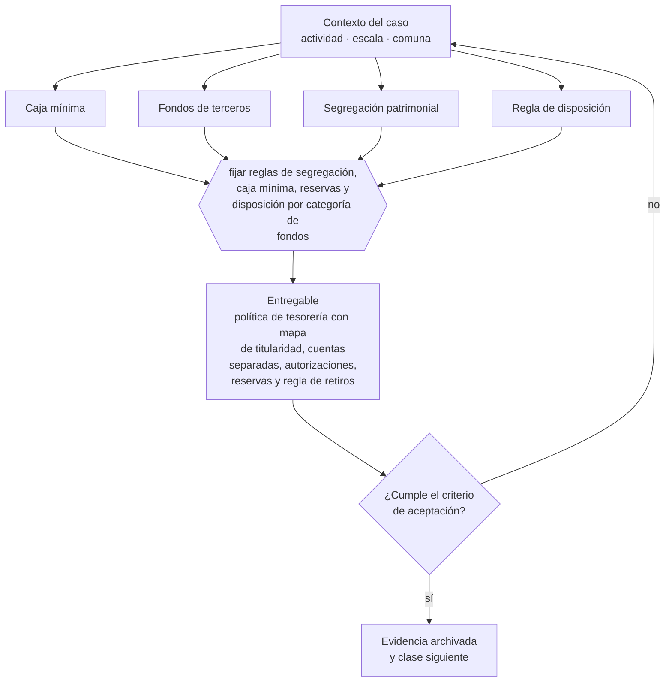

# Clase 126 — Reglas de caja y reservas

> **Parte 09 · Finanzas, caja, precios y economía unitaria** — clase 14 de 14

**Estado de evidencia:** `GUIA-PRACTICA` · **Jurisdicción:** Chile-first · **Fecha base normativa:** 07-08-2026 
**Decisión que habilita:** fijar reglas de segregación, caja mínima, reservas y disposición por categoría de fondos 
**Entregable:** política de tesorería con mapa de titularidad, cuentas separadas, autorizaciones, reservas y regla de retiros

## 🎯 Propósito

Separar patrimonios y fijar reglas de disposición para que fondos de terceros, impuestos y reservas nunca financien informalmente la operación.

## 📚 Resultados de aprendizaje

Al finalizar esta clase podrás:

1. **Definir** con precisión los cuatro conceptos de la tabla siguiente y usarlos para describir un caso real.
2. **Explicar** por qué esta materia condiciona decisiones de otras partes del programa.
3. **Decidir** —fijar reglas de segregación, caja mínima, reservas y disposición por categoría de fondos— y justificar la decisión por escrito.
4. **Producir** el entregable de la clase y contrastarlo contra su criterio de aceptación.
5. **Distinguir** el dato estable del dato dinámico que exige revalidación en la fuente oficial.

## 🧩 Conceptos centrales

| Concepto | Comprensión verificable |
|---|---|
| **Caja mínima** | Saldo propio bajo el cual se activan medidas de contingencia. |
| **Fondos de terceros** | Recursos recibidos con titularidad, destino o disponibilidad restringidos. |
| **Segregación patrimonial** | Separación jurídica, contable, bancaria y operativa entre patrimonios. |
| **Regla de disposición** | Criterio de autorización para usar o transferir cada categoría de fondos. |

## 🗺️ Flujo de razonamiento

```mermaid
flowchart TB
    C["Contexto del caso<br/>actividad · escala · comuna"]
    C --> A1["Caja mínima"]
    C --> A2["Fondos de terceros"]
    C --> A3["Segregación patrimonial"]
    C --> A4["Regla de disposición"]
    A1 & A2 & A3 & A4 --> D{{"fijar reglas de segregación,<br/>caja mínima, reservas y<br/>disposición por categoría de<br/>fondos"}}
    D --> E["Entregable<br/>política de tesorería con mapa<br/>de titularidad, cuentas<br/>separadas, autorizaciones,<br/>reservas y regla de retiros"]
    E --> V{"¿Cumple el criterio<br/>de aceptación?"}
    V -->|sí| S["Evidencia archivada<br/>y clase siguiente"]
    V -->|no| C
```

## 📖 Desarrollo

### 1. El fondo del asunto

La política de tesorería debe distinguir caja propia, impuestos, garantías y fondos de terceros. Estos últimos no se convierten en financiamiento operativo por estar disponibles en una cuenta. El caso FTX/Alameda refuerza la necesidad de cuentas, auxiliares, permisos y conciliaciones separadas, con doble autorización para movimientos excepcionales; la obligación chilena concreta depende del contrato y de la regulación aplicable a la actividad.

### 2. Cómo se traduce en la práctica

La separación debe existir al mismo tiempo en contrato, cuenta bancaria o custodio, plan de cuentas, permisos del sistema y conciliación. Etiquetar un saldo no impide usarlo; el control real limita técnicamente la transferencia, exige doble autorización, alerta la excepción y permite que otra persona confirme el saldo y su titularidad.

### 3. Marco aplicable y quién interviene

- economía unitaria: CAC, LTV, payback, MRR, ARR, churn y NRR
- ciclo de conversión de efectivo y capital de trabajo
- costo de capital y evaluación de deuda

**Autoridades o contrapartes involucradas:** Banco Central de Chile, CMF, SII.
**Profesionales de apoyo:** CFO o controller, contador, asesor financiero. La participación concreta depende del riesgo, del
tamaño de la empresa y de la actividad económica.

## 🧪 Taller guiado

Aplica esta clase a **una** de las siguientes líneas de negocio y repite después el ejercicio con
una segunda línea de carga regulatoria distinta:

| Línea | Carga regulatoria |
|---|---|
| SaaS B2B con IA | media |
| Servicios profesionales | baja |
| E-commerce D2C | media |
| Alimentos o foodtech | alta |
| Exportación de servicios | media |
| Fintech regulada | alta |
| Construcción o servicios técnicos | alta |

**Secuencia de trabajo:**

1. Delimita el contexto: actividad económica, escala, comuna y etapa de la empresa.
2. Reúne los antecedentes que la decisión exige y anota la fecha de cada fuente.
3. Identifica las alternativas reales, incluida la de no hacer nada.
4. Evalúa el impacto en mercado, caja, personas, regulación y operación.
5. Toma la decisión y regístrala con sus supuestos.
6. Produce el entregable.
7. Contrástalo contra el criterio de aceptación.
8. Anota lo que requiere validación profesional y programa su revisión.

### 📦 Entregable

Política de tesorería con mapa de titularidad, cuentas separadas, autorizaciones, reservas y regla de retiros.

Debe incluir decisión, supuestos, fuentes con fecha de consulta, responsable, riesgos
identificados y próximos pasos.

## 🏆 Reto verificable

Resuelve la misma materia para una segunda línea de negocio con distinta carga regulatoria y
explica por escrito **qué cambió, por qué y qué fuente lo determina**.

## ✅ Criterio de aceptación

- [ ] cada saldo tiene propietario económico, cuenta, auxiliar, uso permitido y responsable definidos
- [ ] los movimientos excepcionales exigen autorización previa, evidencia y revisión independiente
- [ ] cada afirmación regulatoria está referida a una fuente oficial con fecha de consulta;
- [ ] los datos dinámicos quedan marcados para revalidación;
- [ ] hay un responsable asignado y evidencia reproducible del trabajo.

## ⚠️ Errores frecuentes

**Propios de esta clase:**

- Usar fondos de clientes o terceros como capital de trabajo por una necesidad transitoria.
- Suponer que una separación contable basta sin separación bancaria, permisos y conciliación.

**Característicos de la parte 09:**

- Proyectar ventas sin proyectar el desfase de cobro.
- Fijar precio sobre costo sin considerar el valor percibido ni el mercado.

## 🇨🇱 Checklist Chile

- [ ] ¿existe norma o autoridad específica para esta materia?
- [ ] ¿la fuente consultada está vigente a la fecha de ejecución?
- [ ] ¿se activa algún trámite ante el SII?
- [ ] ¿se activa algún requisito municipal o sectorial?
- [ ] ¿afecta a consumidores o al tratamiento de datos personales?
- [ ] ¿afecta a trabajadores o a la seguridad y salud en el trabajo?
- [ ] ¿afecta a impuestos, contabilidad o caja?
- [ ] ¿afecta a contratos o a propiedad intelectual?
- [ ] ¿requiere renovación, reporte periódico o revalidación?

## ❓ Preguntas de comprobación

1. ¿Qué saldos administras que pertenecen económica o jurídicamente a terceros?
2. ¿Qué control técnico impide usarlos para pagar gastos propios?
3. ¿Quién autoriza, concilia y revisa una transferencia excepcional?

## 🔗 Fuentes oficiales

**Servicio de Impuestos Internos — Nuevos contribuyentes, inicio de actividades y DTE**  
<https://www.sii.cl/ayudas/nuevos_contribuyentes/boleta-vys-facturador.html> · verificado 2026-09-01

- *Qué contiene:* Reúne el circuito completo del contribuyente nuevo: obtención de RUT, declaración de inicio de actividades, elección de códigos de actividad económica y habilitación para emitir documentos tributarios electrónicos.
- *Cómo leerla:* Sepáralo en dos actos distintos que la página trata seguidos: el RUT identifica, el inicio de actividades habilita. Lo que te bloquea para facturar casi siempre está en el segundo, no en el primero.
- *Uso en esta clase:* aporta el marco de «Nuevos contribuyentes, inicio de actividades y DTE» para fijar reglas de segregación, caja mínima, reservas y disposición por categoría de fondos.

**Departamento de Justicia de Estados Unidos — FTX y Alameda: condena y sentencia de Samuel Bankman-Fried**  
<https://www.justice.gov/archives/opa/pr/samuel-bankman-fried-sentenced-25-years-his-orchestration-multiple-fraudulent-schemes> · verificado 2026-09-28

- *Qué contiene:* Resume la condena dictada tras juicio y la sentencia de marzo de 2024, incluidos hechos acreditados sobre fondos de clientes, privilegios de Alameda, información financiera y ocultamiento a clientes, inversionistas y prestamistas.
- *Cómo leerla:* Úsala para estudiar segregación de fondos, partes relacionadas, autorización, tesorería y evidencia de gobierno. No copies tipos penales ni reglas estadounidenses a Chile: contrasta cada obligación local con contrato, actividad y norma chilena aplicable.
- *Uso en esta clase:* aporta el marco de «FTX y Alameda: condena y sentencia de Samuel Bankman-Fried» para fijar reglas de segregación, caja mínima, reservas y disposición por categoría de fondos.

Complementos del repositorio: [glosario](../../../docs/19_GLOSSARY.md) ·
[ruta de lecturas](../../../docs/15_BOOKS_AND_LEARNING_PATH.md) ·
[catálogo de fuentes](../../../docs/16_OFFICIAL_SOURCE_CATALOG.md).

> [!IMPORTANT]
> Material educativo. Para una decisión real de alto impacto hay que verificar la fuente oficial
> vigente y validar con el profesional competente.

---

| Anterior | Índice | Siguiente |
|---|---|---|
| [← 125 · Dashboard financiero del fundador](../class-13-dashboard-financiero-del-fundador/README.md) | [Parte 09](../README.md) · [Programa](../../../README.md) | [127 · Anatomía de un contrato comercial →](../../part-10-contratos-y-arquitectura-legal-operativa/class-01-anatomia-de-un-contrato-comercial/README.md) |
