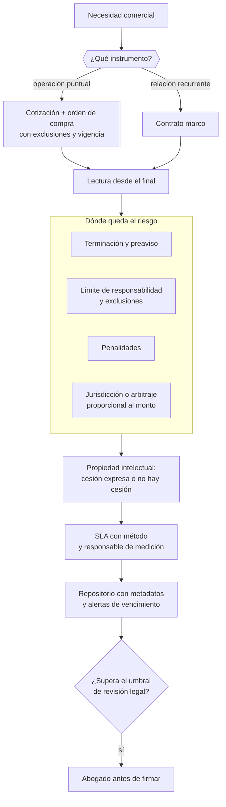

# Parte 10 — Contratos y arquitectura legal operativa

> *El contrato se lee empezando por el final*

**Estado de evidencia:** `VERIFICADO-FUENTE` · **Clases:** 14 (127–140) · **Fecha base normativa:** 07-08-2026 
**Conceptos definidos en esta parte:** 56

## 🎯 De qué trata esta parte

Objeto y precio suelen estar claros en cualquier contrato; lo que destruye valor son las cláusulas que nadie leyó porque se asumió que el negocio iba a salir bien. Por eso el método de esta parte es leer al revés: terminación, responsabilidad, penalidades y jurisdicción primero. Ahí está la asignación real del riesgo.

En la práctica chilena buena parte de la operación se documenta con cotización y orden de compra, sin contrato firmado. Eso funciona mientras la cotización contenga alcance, exclusiones, vigencia, plazos y límite de responsabilidad; si no los contiene, se aplica el régimen supletorio, que rara vez favorece al proveedor. La distinción entre obligación de medios y de resultado, y el procedimiento escrito de orden de cambio, son las dos piezas que más margen protegen en servicios.

La parte incluye además dos temas que se descubren tarde: la propiedad intelectual de lo desarrollado a medida, que no se transfiere sola por haber pagado, y el control de vencimientos. Una renovación automática con noventa días de preaviso exige un repositorio con alertas; sin él, la empresa renueva contratos caros por olvido.

## 📚 Resultados de la parte

Al terminar esta parte podrás:

1. **Leer y negociar un contrato comercial identificando las cláusulas que asignan riesgo**.
2. **Elegir el instrumento correcto entre cotización, orden de compra y contrato marco**.
3. **Diseñar SLA, límites de responsabilidad y salidas contractuales**.
4. **Mantener un repositorio de contratos con vencimientos y renovaciones controlados**.

## 🗺️ Mapa de la parte

## ⚖️ Marco aplicable

- Código Civil en materia de obligaciones, contratos y responsabilidad
- Código de Comercio para actos mercantiles
- Ley 19.983 sobre mérito ejecutivo de la factura
- Ley 21.131 sobre pago a treinta días

**Autoridades o contrapartes:** Tribunales ordinarios, Centros de arbitraje (CAM Santiago).
**Profesionales de apoyo:** abogado comercial, responsable de contratos, finanzas.

## ⚠️ Riesgos característicos

- Aceptar términos y condiciones de un proveedor crítico sin leer la limitación de responsabilidad.
- Operar con orden de compra sin contrato marco en servicios recurrentes.
- No pactar propiedad intelectual sobre entregables desarrollados a medida.
- Perder el control de vencimientos y renovar automáticamente contratos que ya no sirven.

## 📘 Las 14 clases

| # | Global | Clase | Decisión que habilita |
|---:|---:|---|---|
| 01 | 127 | [Anatomía de un contrato comercial](class-01-anatomia-de-un-contrato-comercial/README.md) | identificar dónde queda el riesgo en cada contrato antes de firmar |
| 02 | 128 | [Cotización, orden de compra y aceptación](class-02-cotizacion-orden-de-compra-y-aceptacion/README.md) | definir qué operaciones van con contrato marco y cuáles con cotización y orden |
| 03 | 129 | [Contrato de prestación de servicios](class-03-contrato-de-prestacion-de-servicios/README.md) | definir el estándar de la obligación y el mecanismo de control de cambios |
| 04 | 130 | [Contrato de suministro](class-04-contrato-de-suministro/README.md) | definir volumen, mecanismo de ajuste de precio y consecuencias del incumplimiento |
| 05 | 131 | [NDA y confidencialidad](class-05-nda-y-confidencialidad/README.md) | definir qué información se protege, por cuánto tiempo y con qué medidas |
| 06 | 132 | [Propiedad intelectual en contratos](class-06-propiedad-intelectual-en-contratos/README.md) | definir quién es titular de lo creado y qué se cede o licencia |
| 07 | 133 | [SLA, soporte y niveles de servicio](class-07-sla-soporte-y-niveles-de-servicio/README.md) | definir métricas, exclusiones y consecuencias del nivel de servicio |
| 08 | 134 | [Limitación de responsabilidad y garantías](class-08-limitacion-de-responsabilidad-y-garantias/README.md) | definir el tope de responsabilidad aceptable y las exclusiones necesarias |
| 09 | 135 | [Terminación, renovación y penalidades](class-09-terminacion-renovacion-y-penalidades/README.md) | definir cómo se sale de cada contrato y con qué anticipación |
| 10 | 136 | [Jurisdicción, arbitraje y solución de controversias](class-10-jurisdiccion-arbitraje-y-solucion-de-controversias/README.md) | elegir el mecanismo de resolución proporcional al valor y riesgo del contrato |
| 11 | 137 | [Cesión, subcontratación y terceros](class-11-cesion-subcontratacion-y-terceros/README.md) | definir qué se puede ceder o subcontratar y con qué controles |
| 12 | 138 | [Contratos con proveedores críticos](class-12-contratos-con-proveedores-criticos/README.md) | identificar proveedores críticos y asegurar continuidad contractual |
| 13 | 139 | [Gestión y repositorio de contratos](class-13-gestion-y-repositorio-de-contratos/README.md) | definir dónde viven los contratos y quién controla vencimientos |
| 14 | 140 | [Cuándo debe intervenir un abogado](class-14-cuando-debe-intervenir-un-abogado/README.md) | fijar los umbrales que obligan a revisión legal antes de firmar |

## 🔤 Glosario de la parte

| Concepto | Definición operacional |
|---|---|
| **Aceptación tácita** | Conducta que implica aceptación aunque no haya firma. |
| **Alerta de vencimiento** | Aviso anticipado antes de la fecha crítica. |
| **Arbitraje** | Resolución por árbitro designado según lo pactado. |
| **Asignación de riesgo** | Cláusulas que definen quién soporta qué contingencia. |
| **Auditoría de proveedor** | Derecho contractual de verificar cumplimiento. |
| **Cesión de derechos** | Transferencia de la titularidad patrimonial. |
| **Cesión del contrato** | Transferencia de la posición contractual a un tercero. |
| **Cláusula de ajuste** | Mecanismo de revisión de precio ante variación de insumos. |
| **Cláusula patológica** | Redacción ambigua que hace inaplicable lo pactado. |
| **Consentimiento previo** | Requisito de autorización para ceder o subcontratar. |
| **Contraprestación** | Precio, forma y plazo de pago. |
| **Contrato de alto impacto** | Aquel cuyo incumplimiento amenaza la continuidad. |
| **Contrato de servicios** | Obligación de hacer con estándar de diligencia o de resultado. |
| **Contrato de suministro** | Entrega periódica de bienes bajo condiciones acordadas. |
| **Contrato marco** | Acuerdo general bajo el cual se emiten órdenes específicas. |
| **Costo de no consultar** | Contingencia esperada por firmar sin revisión. |
| **Cotización** | Oferta con condiciones y plazo de vigencia. |
| **Crédito de servicio** | Compensación por incumplimiento del sla. |
| **Daño directo e indirecto** | Distinción sobre qué perjuicios se indemnizan. |
| **Dependencia** | Grado en que la operación no puede continuar sin él. |
| **Disponibilidad** | Porcentaje de tiempo en que el servicio está operativo. |
| **Escalamiento** | Secuencia pactada de negociación, mediación y litigio. |
| **Excepciones** | Información pública, previamente conocida o de desarrollo independiente. |
| **Exclusividad** | Compromiso de comprar o vender solo a la contraparte. |
| **Garantía** | Compromiso sobre características o funcionamiento. |
| **Indemnidad** | Obligación de mantener indemne a la contraparte frente a reclamos de terceros. |
| **Información confidencial** | Definición del alcance protegido. |
| **Jurisdicción** | Tribunal competente para conocer del conflicto. |
| **Ley aplicable** | Ordenamiento que rige la interpretación del contrato. |
| **Licencia de uso** | Autorización de uso sin transferir titularidad. |
| **Limitación de responsabilidad** | Tope máximo de indemnización pactado. |
| **Metadatos** | Datos de control: contraparte, monto, vigencia, preaviso, responsable. |
| **NDA** | Acuerdo de confidencialidad sobre información revelada. |
| **Objeto del contrato** | Descripción precisa de qué se obliga cada parte. |
| **Obligación de medios** | Compromiso de diligencia sin garantizar resultado. |
| **Obligación de resultado** | Compromiso de entregar un resultado determinado. |
| **Obra por encargo** | Creación desarrollada a petición de un tercero. |
| **Orden de cambio** | Documento que modifica alcance, plazo o precio. |
| **Orden de compra** | Aceptación formal que perfecciona el acuerdo. |
| **Penalidad** | Suma pactada por incumplimiento o salida anticipada. |
| **Plan de salida** | Procedimiento para reemplazarlo sin interrumpir el servicio. |
| **Plazo de confidencialidad** | Duración de la obligación tras terminar la relación. |
| **Preaviso** | Plazo de anticipación para comunicar la terminación. |
| **Proveedor crítico** | Aquel cuya falla detiene la operación. |
| **Renovación automática** | Prórroga tácita salvo aviso en contrario. |
| **Repositorio de contratos** | Archivo central con versión vigente de cada contrato. |
| **Responsabilidad solidaria** | Obligación de responder junto al subcontratista. |
| **Revisión preventiva** | Análisis antes de firmar. |
| **SLA** | Acuerdo de nivel de servicio con métricas y compromisos. |
| **Subcontratación** | Ejecución por un tercero conservando la responsabilidad. |
| **Terminación anticipada** | Facultad de poner fin antes del plazo. |
| **Tiempo de respuesta y de resolución** | Plazos comprometidos por severidad. |
| **Titularidad** | Quién es dueño de lo creado durante la relación. |
| **Umbral de intervención** | Monto o riesgo desde el cual se requiere abogado. |
| **Versión vigente** | Documento firmado con sus anexos y modificaciones. |
| **Volumen mínimo** | Cantidad comprometida que activa el precio pactado. |

## 🔗 Cómo se conecta

Instrumenta las relaciones que crean las partes 13, 14 y 15, y su cláusula de propiedad intelectual se apoya en la parte 11. El repositorio ordenado que exige es lo que hace posible la due diligence de la parte 22.

## 📖 Pauta bibliográfica

- Código Civil (obligaciones y contratos) y Código de Comercio.
- Ley 19.983 sobre mérito ejecutivo de la factura y Ley 21.131 sobre pago a treinta días.
- Cámara de Comercio de Santiago — reglamento de arbitraje y cuándo conviene pactarlo.

## 🏛️ Fuentes oficiales de la parte

**Biblioteca del Congreso Nacional · LeyChile — Normativa oficial consolidada**  
<https://www.bcn.cl/leychile/> · verificado 2026-08-07

- *Qué contiene:* Publica el texto oficial y consolidado de leyes, decretos y reglamentos, con la versión vigente a una fecha, el historial de modificaciones y la tramitación que las originó.
- *Cómo leerla:* Usa siempre el selector de versión vigente a la fecha en que ejecutarás el trámite, no la última publicada. Y lee el artículo transitorio: en normas en implantación gradual —jornada, datos personales— ahí está la fecha que realmente te aplica.

**Servicio de Impuestos Internos — Nuevos contribuyentes, inicio de actividades y DTE**  
<https://www.sii.cl/ayudas/nuevos_contribuyentes/boleta-vys-facturador.html> · verificado 2026-08-07

- *Qué contiene:* Reúne el circuito completo del contribuyente nuevo: obtención de RUT, declaración de inicio de actividades, elección de códigos de actividad económica y habilitación para emitir documentos tributarios electrónicos.
- *Cómo leerla:* Sepáralo en dos actos distintos que la página trata seguidos: el RUT identifica, el inicio de actividades habilita. Lo que te bloquea para facturar casi siempre está en el segundo, no en el primero.

---

| Anterior | Índice | Siguiente |
|---|---|---|
| [← Parte 09 · Finanzas, caja, precios y economía unitaria](../part-09-finanzas-caja-precios-y-economia-unitaria/README.md) | [Currículo](../../CURRICULUM.md) · [Programa](../../README.md) | [Parte 11 · Consumidor, e-commerce, privacidad, IP y seguridad digital →](../part-11-consumidor-e-commerce-privacidad-ip-y-seguridad-digital/README.md) |
