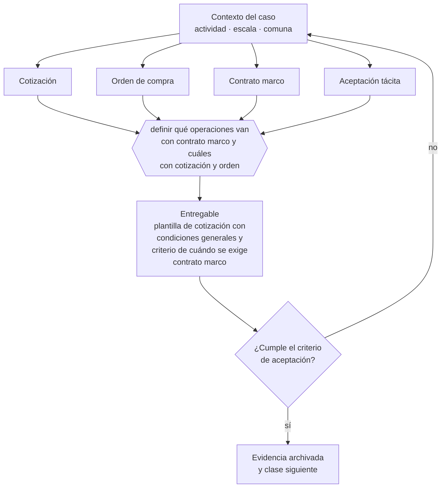

# Clase 128 — Cotización, orden de compra y aceptación

> **Parte 10 · Contratos y arquitectura legal operativa** — clase 2 de 14

**Estado de evidencia:** `VERIFICADO-FUENTE` · **Jurisdicción:** Chile-first · **Fecha base normativa:** 07-08-2026 
**Decisión que habilita:** definir qué operaciones van con contrato marco y cuáles con cotización y orden 
**Entregable:** plantilla de cotización con condiciones generales y criterio de cuándo se exige contrato marco

## 🎯 Propósito

Decidir qué operaciones van con contrato marco y cuáles con cotización y orden de compra, asegurando que la cotización contenga lo que la protege.

## 📚 Resultados de aprendizaje

Al finalizar esta clase podrás:

1. **Definir** con precisión los cuatro conceptos de la tabla siguiente y usarlos para describir un caso real.
2. **Explicar** por qué esta materia condiciona decisiones de otras partes del programa.
3. **Decidir** —definir qué operaciones van con contrato marco y cuáles con cotización y orden— y justificar la decisión por escrito.
4. **Producir** el entregable de la clase y contrastarlo contra su criterio de aceptación.
5. **Distinguir** el dato estable del dato dinámico que exige revalidación en la fuente oficial.

## 🧩 Conceptos centrales

| Concepto | Comprensión verificable |
|---|---|
| **Cotización** | Oferta con condiciones y plazo de vigencia. |
| **Orden de compra** | Aceptación formal que perfecciona el acuerdo. |
| **Contrato marco** | Acuerdo general bajo el cual se emiten órdenes específicas. |
| **Aceptación tácita** | Conducta que implica aceptación aunque no haya firma. |

## 🗺️ Flujo de razonamiento

## 📖 Desarrollo

### 1. El fondo del asunto

En la práctica chilena buena parte de la operación comercial se documenta con cotización más orden de compra, sin contrato firmado. Eso funciona mientras la cotización incluya condiciones completas: alcance, exclusiones, vigencia, plazo, pago y responsabilidad. Si no las incluye, se aplica el supletorio legal, que rara vez favorece al proveedor.

### 2. Cómo se traduce en la práctica

En la práctica chilena buena parte de la operación se documenta sin contrato firmado, y eso funciona mientras la cotización incluya alcance, exclusiones, vigencia, plazos y límite de responsabilidad. Si no los incluye, aplica el régimen supletorio del Código Civil, que rara vez favorece al proveedor.

### 3. Marco aplicable y quién interviene

- Código Civil en materia de obligaciones, contratos y responsabilidad
- Código de Comercio para actos mercantiles
- Ley 19.983 sobre mérito ejecutivo de la factura
- Ley 21.131 sobre pago a treinta días

**Autoridades o contrapartes involucradas:** Tribunales ordinarios, Centros de arbitraje (CAM Santiago).
**Profesionales de apoyo:** abogado comercial, responsable de contratos, finanzas. La participación concreta depende del riesgo, del
tamaño de la empresa y de la actividad económica.

## 🧪 Taller guiado

Aplica esta clase a **una** de las siguientes líneas de negocio y repite después el ejercicio con
una segunda línea de carga regulatoria distinta:

| Línea | Carga regulatoria |
|---|---|
| SaaS B2B con IA | media |
| Servicios profesionales | baja |
| E-commerce D2C | media |
| Alimentos o foodtech | alta |
| Exportación de servicios | media |
| Fintech regulada | alta |
| Construcción o servicios técnicos | alta |

**Secuencia de trabajo:**

1. Delimita el contexto: actividad económica, escala, comuna y etapa de la empresa.
2. Reúne los antecedentes que la decisión exige y anota la fecha de cada fuente.
3. Identifica las alternativas reales, incluida la de no hacer nada.
4. Evalúa el impacto en mercado, caja, personas, regulación y operación.
5. Toma la decisión y regístrala con sus supuestos.
6. Produce el entregable.
7. Contrástalo contra el criterio de aceptación.
8. Anota lo que requiere validación profesional y programa su revisión.

### 📦 Entregable

Plantilla de cotización con condiciones generales y criterio de cuándo se exige contrato marco.

Debe incluir decisión, supuestos, fuentes con fecha de consulta, responsable, riesgos
identificados y próximos pasos.

## 🏆 Reto verificable

Resuelve la misma materia para una segunda línea de negocio con distinta carga regulatoria y
explica por escrito **qué cambió, por qué y qué fuente lo determina**.

## ✅ Criterio de aceptación

- [ ] la cotización incluye alcance, exclusiones, vigencia y condiciones de pago
- [ ] existe criterio escrito de cuándo se exige contrato marco
- [ ] cada afirmación regulatoria está referida a una fuente oficial con fecha de consulta;
- [ ] los datos dinámicos quedan marcados para revalidación;
- [ ] hay un responsable asignado y evidencia reproducible del trabajo.

## ⚠️ Errores frecuentes

**Propios de esta clase:**

- Cotizar sin exclusiones y quedar obligado a alcance no previsto.
- Emitir cotizaciones sin plazo de vigencia en contextos de costos volátiles.

**Característicos de la parte 10:**

- Aceptar términos y condiciones de un proveedor crítico sin leer la limitación de responsabilidad.
- Operar con orden de compra sin contrato marco en servicios recurrentes.

## 🇨🇱 Checklist Chile

- [ ] ¿existe norma o autoridad específica para esta materia?
- [ ] ¿la fuente consultada está vigente a la fecha de ejecución?
- [ ] ¿se activa algún trámite ante el SII?
- [ ] ¿se activa algún requisito municipal o sectorial?
- [ ] ¿afecta a consumidores o al tratamiento de datos personales?
- [ ] ¿afecta a trabajadores o a la seguridad y salud en el trabajo?
- [ ] ¿afecta a impuestos, contabilidad o caja?
- [ ] ¿afecta a contratos o a propiedad intelectual?
- [ ] ¿requiere renovación, reporte periódico o revalidación?

## ❓ Preguntas de comprobación

1. ¿Tu cotización estándar incluye exclusiones y plazo de vigencia?
2. ¿Qué operaciones deberían tener contrato marco y hoy no lo tienen?
3. ¿Qué pasa si el cliente acepta tu cotización por correo y luego discute el alcance?

## 🔗 Fuentes oficiales

**Biblioteca del Congreso Nacional · LeyChile — Normativa oficial consolidada**  
<https://www.bcn.cl/leychile/> · verificado 2026-08-07

- *Qué contiene:* Publica el texto oficial y consolidado de leyes, decretos y reglamentos, con la versión vigente a una fecha, el historial de modificaciones y la tramitación que las originó.
- *Cómo leerla:* Usa siempre el selector de versión vigente a la fecha en que ejecutarás el trámite, no la última publicada. Y lee el artículo transitorio: en normas en implantación gradual —jornada, datos personales— ahí está la fecha que realmente te aplica.

Complementos del repositorio: [glosario](../../../docs/19_GLOSSARY.md) ·
[ruta de lecturas](../../../docs/15_BOOKS_AND_LEARNING_PATH.md) ·
[catálogo de fuentes](../../../docs/16_OFFICIAL_SOURCE_CATALOG.md).

> [!IMPORTANT]
> Material educativo. Para una decisión real de alto impacto hay que verificar la fuente oficial
> vigente y validar con el profesional competente.

---

| Anterior | Índice | Siguiente |
|---|---|---|
| [← 127 · Anatomía de un contrato comercial](../class-01-anatomia-de-un-contrato-comercial/README.md) | [Parte 10](../README.md) · [Programa](../../../README.md) | [129 · Contrato de prestación de servicios →](../class-03-contrato-de-prestacion-de-servicios/README.md) |
