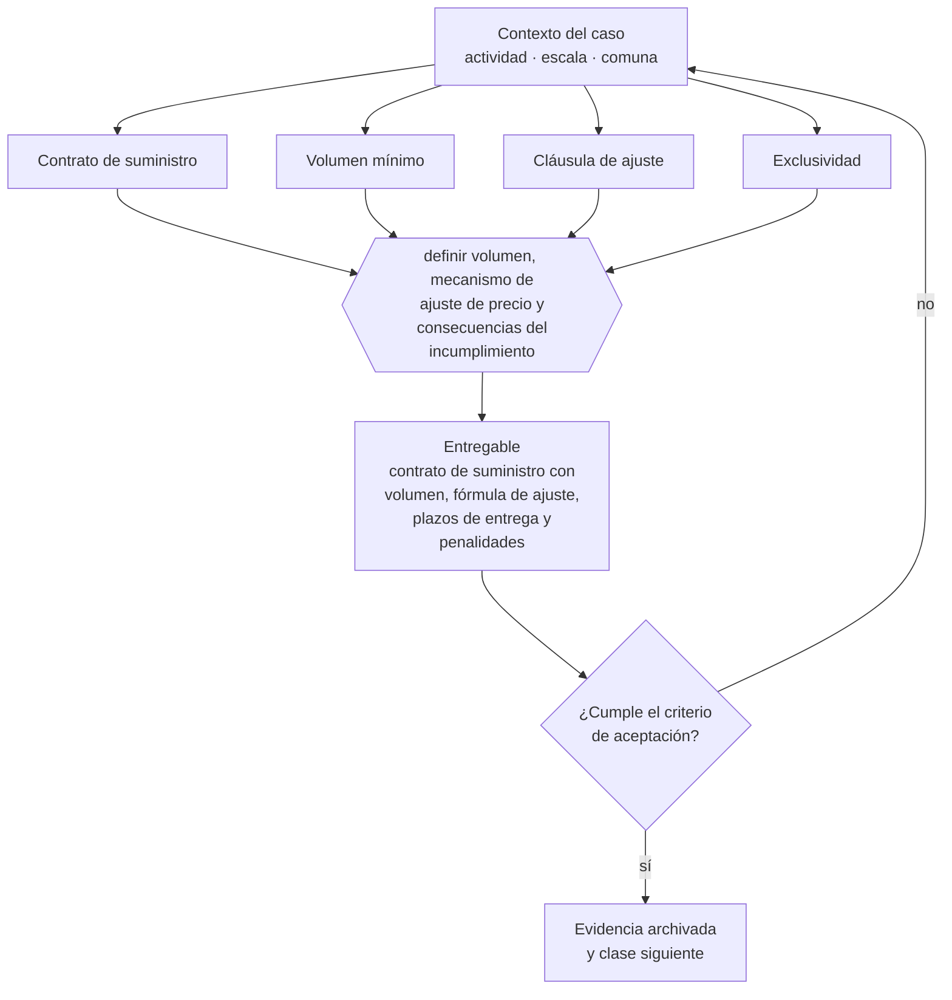

# Clase 130 — Contrato de suministro

> **Parte 10 · Contratos y arquitectura legal operativa** — clase 4 de 14

**Estado de evidencia:** `VERIFICADO-FUENTE` · **Jurisdicción:** Chile-first · **Fecha base normativa:** 07-08-2026 
**Decisión que habilita:** definir volumen, mecanismo de ajuste de precio y consecuencias del incumplimiento 
**Entregable:** contrato de suministro con volumen, fórmula de ajuste, plazos de entrega y penalidades

## 🎯 Propósito

Pactar fórmula de ajuste de precio y consecuencias del incumplimiento de volumen, que son las dos variables que definen un contrato de suministro.

## 📚 Resultados de aprendizaje

Al finalizar esta clase podrás:

1. **Definir** con precisión los cuatro conceptos de la tabla siguiente y usarlos para describir un caso real.
2. **Explicar** por qué esta materia condiciona decisiones de otras partes del programa.
3. **Decidir** —definir volumen, mecanismo de ajuste de precio y consecuencias del incumplimiento— y justificar la decisión por escrito.
4. **Producir** el entregable de la clase y contrastarlo contra su criterio de aceptación.
5. **Distinguir** el dato estable del dato dinámico que exige revalidación en la fuente oficial.

## 🧩 Conceptos centrales

| Concepto | Comprensión verificable |
|---|---|
| **Contrato de suministro** | Entrega periódica de bienes bajo condiciones acordadas. |
| **Volumen mínimo** | Cantidad comprometida que activa el precio pactado. |
| **Cláusula de ajuste** | Mecanismo de revisión de precio ante variación de insumos. |
| **Exclusividad** | Compromiso de comprar o vender solo a la contraparte. |

## 🗺️ Flujo de razonamiento

## 📖 Desarrollo

### 1. El fondo del asunto

El suministro se juega en el mecanismo de ajuste de precio y en las consecuencias del incumplimiento de volumen. Pactar precio fijo a doce meses en un insumo volátil traslada todo el riesgo a una parte; sin fórmula de ajuste, la relación se renegocia bajo presión o se rompe.

### 2. Cómo se traduce en la práctica

Pactar precio fijo a doce meses sobre un insumo volátil traslada todo el riesgo a una parte, y sin fórmula de ajuste la relación se renegocia bajo presión o se rompe. Aceptar exclusividad sin volumen mínimo garantizado es el error simétrico: se cede el mercado sin asegurar la compra.

### 3. Marco aplicable y quién interviene

- Código Civil en materia de obligaciones, contratos y responsabilidad
- Código de Comercio para actos mercantiles
- Ley 19.983 sobre mérito ejecutivo de la factura
- Ley 21.131 sobre pago a treinta días

**Autoridades o contrapartes involucradas:** Tribunales ordinarios, Centros de arbitraje (CAM Santiago).
**Profesionales de apoyo:** abogado comercial, responsable de contratos, finanzas. La participación concreta depende del riesgo, del
tamaño de la empresa y de la actividad económica.

## 🧪 Taller guiado

Aplica esta clase a **una** de las siguientes líneas de negocio y repite después el ejercicio con
una segunda línea de carga regulatoria distinta:

| Línea | Carga regulatoria |
|---|---|
| SaaS B2B con IA | media |
| Servicios profesionales | baja |
| E-commerce D2C | media |
| Alimentos o foodtech | alta |
| Exportación de servicios | media |
| Fintech regulada | alta |
| Construcción o servicios técnicos | alta |

**Secuencia de trabajo:**

1. Delimita el contexto: actividad económica, escala, comuna y etapa de la empresa.
2. Reúne los antecedentes que la decisión exige y anota la fecha de cada fuente.
3. Identifica las alternativas reales, incluida la de no hacer nada.
4. Evalúa el impacto en mercado, caja, personas, regulación y operación.
5. Toma la decisión y regístrala con sus supuestos.
6. Produce el entregable.
7. Contrástalo contra el criterio de aceptación.
8. Anota lo que requiere validación profesional y programa su revisión.

### 📦 Entregable

Contrato de suministro con volumen, fórmula de ajuste, plazos de entrega y penalidades.

Debe incluir decisión, supuestos, fuentes con fecha de consulta, responsable, riesgos
identificados y próximos pasos.

## 🏆 Reto verificable

Resuelve la misma materia para una segunda línea de negocio con distinta carga regulatoria y
explica por escrito **qué cambió, por qué y qué fuente lo determina**.

## ✅ Criterio de aceptación

- [ ] existe fórmula de ajuste con índice verificable
- [ ] las consecuencias del incumplimiento están cuantificadas
- [ ] cada afirmación regulatoria está referida a una fuente oficial con fecha de consulta;
- [ ] los datos dinámicos quedan marcados para revalidación;
- [ ] hay un responsable asignado y evidencia reproducible del trabajo.

## ⚠️ Errores frecuentes

**Propios de esta clase:**

- Pactar precio fijo de largo plazo sobre insumos volátiles sin fórmula de ajuste.
- Aceptar exclusividad sin volumen mínimo garantizado.

**Característicos de la parte 10:**

- Aceptar términos y condiciones de un proveedor crítico sin leer la limitación de responsabilidad.
- Operar con orden de compra sin contrato marco en servicios recurrentes.

## 🇨🇱 Checklist Chile

- [ ] ¿existe norma o autoridad específica para esta materia?
- [ ] ¿la fuente consultada está vigente a la fecha de ejecución?
- [ ] ¿se activa algún trámite ante el SII?
- [ ] ¿se activa algún requisito municipal o sectorial?
- [ ] ¿afecta a consumidores o al tratamiento de datos personales?
- [ ] ¿afecta a trabajadores o a la seguridad y salud en el trabajo?
- [ ] ¿afecta a impuestos, contabilidad o caja?
- [ ] ¿afecta a contratos o a propiedad intelectual?
- [ ] ¿requiere renovación, reporte periódico o revalidación?

## ❓ Preguntas de comprobación

1. ¿Qué fórmula de ajuste y qué índice verificable usa tu contrato de suministro?
2. ¿Qué pasa si la contraparte no alcanza el volumen comprometido?
3. ¿Cediste exclusividad y a cambio de qué volumen garantizado?

## 🔗 Fuentes oficiales

**Biblioteca del Congreso Nacional · LeyChile — Normativa oficial consolidada**  
<https://www.bcn.cl/leychile/> · verificado 2026-08-07

- *Qué contiene:* Publica el texto oficial y consolidado de leyes, decretos y reglamentos, con la versión vigente a una fecha, el historial de modificaciones y la tramitación que las originó.
- *Cómo leerla:* Usa siempre el selector de versión vigente a la fecha en que ejecutarás el trámite, no la última publicada. Y lee el artículo transitorio: en normas en implantación gradual —jornada, datos personales— ahí está la fecha que realmente te aplica.

Complementos del repositorio: [glosario](../../../docs/19_GLOSSARY.md) ·
[ruta de lecturas](../../../docs/15_BOOKS_AND_LEARNING_PATH.md) ·
[catálogo de fuentes](../../../docs/16_OFFICIAL_SOURCE_CATALOG.md).

> [!IMPORTANT]
> Material educativo. Para una decisión real de alto impacto hay que verificar la fuente oficial
> vigente y validar con el profesional competente.

---

| Anterior | Índice | Siguiente |
|---|---|---|
| [← 129 · Contrato de prestación de servicios](../class-03-contrato-de-prestacion-de-servicios/README.md) | [Parte 10](../README.md) · [Programa](../../../README.md) | [131 · NDA y confidencialidad →](../class-05-nda-y-confidencialidad/README.md) |
