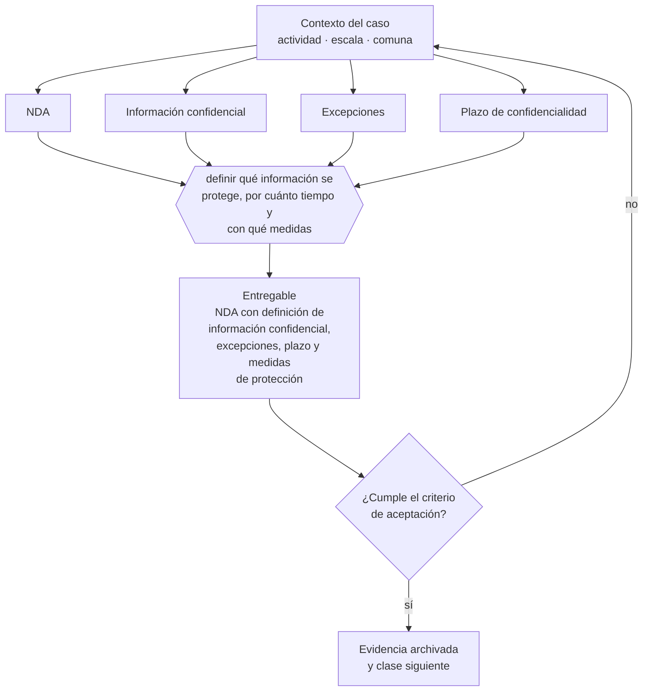

# Clase 131 — NDA y confidencialidad

> **Parte 10 · Contratos y arquitectura legal operativa** — clase 5 de 14

**Estado de evidencia:** `VERIFICADO-FUENTE` · **Jurisdicción:** Chile-first · **Fecha base normativa:** 07-08-2026 
**Decisión que habilita:** definir qué información se protege, por cuánto tiempo y con qué medidas 
**Entregable:** NDA con definición de información confidencial, excepciones, plazo y medidas de protección

## 🎯 Propósito

Definir con precisión qué información se protege y por cuánto tiempo, y respaldar el NDA con medidas efectivas de protección.

## 📚 Resultados de aprendizaje

Al finalizar esta clase podrás:

1. **Definir** con precisión los cuatro conceptos de la tabla siguiente y usarlos para describir un caso real.
2. **Explicar** por qué esta materia condiciona decisiones de otras partes del programa.
3. **Decidir** —definir qué información se protege, por cuánto tiempo y con qué medidas— y justificar la decisión por escrito.
4. **Producir** el entregable de la clase y contrastarlo contra su criterio de aceptación.
5. **Distinguir** el dato estable del dato dinámico que exige revalidación en la fuente oficial.

## 🧩 Conceptos centrales

| Concepto | Comprensión verificable |
|---|---|
| **NDA** | Acuerdo de confidencialidad sobre información revelada. |
| **Información confidencial** | Definición del alcance protegido. |
| **Excepciones** | Información pública, previamente conocida o de desarrollo independiente. |
| **Plazo de confidencialidad** | Duración de la obligación tras terminar la relación. |

## 🗺️ Flujo de razonamiento

## 📖 Desarrollo

### 1. El fondo del asunto

Un NDA vale por su definición de información confidencial y su plazo. Definiciones demasiado amplias son inaplicables; demasiado estrechas dejan fuera lo que importa. En secreto empresarial, además del NDA hay que acreditar medidas razonables de protección para que la ley proteja la información.

### 2. Cómo se traduce en la práctica

Una definición demasiado amplia es inaplicable y una demasiado estrecha deja fuera lo que importa. Además, para que la ley proteja un secreto empresarial hay que acreditar medidas razonables de resguardo: proteger por contrato información que circula sin control no produce protección real.

### 3. Marco aplicable y quién interviene

- Código Civil en materia de obligaciones, contratos y responsabilidad
- Código de Comercio para actos mercantiles
- Ley 19.983 sobre mérito ejecutivo de la factura
- Ley 21.131 sobre pago a treinta días

**Autoridades o contrapartes involucradas:** Tribunales ordinarios, Centros de arbitraje (CAM Santiago).
**Profesionales de apoyo:** abogado comercial, responsable de contratos, finanzas. La participación concreta depende del riesgo, del
tamaño de la empresa y de la actividad económica.

## 🧪 Taller guiado

Aplica esta clase a **una** de las siguientes líneas de negocio y repite después el ejercicio con
una segunda línea de carga regulatoria distinta:

| Línea | Carga regulatoria |
|---|---|
| SaaS B2B con IA | media |
| Servicios profesionales | baja |
| E-commerce D2C | media |
| Alimentos o foodtech | alta |
| Exportación de servicios | media |
| Fintech regulada | alta |
| Construcción o servicios técnicos | alta |

**Secuencia de trabajo:**

1. Delimita el contexto: actividad económica, escala, comuna y etapa de la empresa.
2. Reúne los antecedentes que la decisión exige y anota la fecha de cada fuente.
3. Identifica las alternativas reales, incluida la de no hacer nada.
4. Evalúa el impacto en mercado, caja, personas, regulación y operación.
5. Toma la decisión y regístrala con sus supuestos.
6. Produce el entregable.
7. Contrástalo contra el criterio de aceptación.
8. Anota lo que requiere validación profesional y programa su revisión.

### 📦 Entregable

Nda con definición de información confidencial, excepciones, plazo y medidas de protección.

Debe incluir decisión, supuestos, fuentes con fecha de consulta, responsable, riesgos
identificados y próximos pasos.

## 🏆 Reto verificable

Resuelve la misma materia para una segunda línea de negocio con distinta carga regulatoria y
explica por escrito **qué cambió, por qué y qué fuente lo determina**.

## ✅ Criterio de aceptación

- [ ] la definición de confidencialidad es aplicable y acotada
- [ ] existen medidas de protección efectivas documentadas
- [ ] cada afirmación regulatoria está referida a una fuente oficial con fecha de consulta;
- [ ] los datos dinámicos quedan marcados para revalidación;
- [ ] hay un responsable asignado y evidencia reproducible del trabajo.

## ⚠️ Errores frecuentes

**Propios de esta clase:**

- Firmar nda mutuo sin revisar el plazo posterior al término.
- Proteger por contrato información que no se resguarda con medidas técnicas.

**Característicos de la parte 10:**

- Aceptar términos y condiciones de un proveedor crítico sin leer la limitación de responsabilidad.
- Operar con orden de compra sin contrato marco en servicios recurrentes.

## 🇨🇱 Checklist Chile

- [ ] ¿existe norma o autoridad específica para esta materia?
- [ ] ¿la fuente consultada está vigente a la fecha de ejecución?
- [ ] ¿se activa algún trámite ante el SII?
- [ ] ¿se activa algún requisito municipal o sectorial?
- [ ] ¿afecta a consumidores o al tratamiento de datos personales?
- [ ] ¿afecta a trabajadores o a la seguridad y salud en el trabajo?
- [ ] ¿afecta a impuestos, contabilidad o caja?
- [ ] ¿afecta a contratos o a propiedad intelectual?
- [ ] ¿requiere renovación, reporte periódico o revalidación?

## ❓ Preguntas de comprobación

1. ¿Qué información concreta protege tu NDA y por cuánto tiempo tras el término?
2. ¿Qué medidas técnicas respaldan esa protección en la práctica?
3. ¿Revisaste el plazo posterior al término en los NDA mutuos que firmaste?

## 🔗 Fuentes oficiales

**Instituto Nacional de Propiedad Industrial — Marcas, patentes y diseños industriales**  
<https://www.inapi.cl/> · verificado 2026-08-19

- *Qué contiene:* Administra el registro de marcas, patentes, diseños e indicaciones geográficas, y ofrece el buscador público de solicitudes y registros vigentes por clase.
- *Cómo leerla:* Empieza siempre por el buscador de anterioridades y por clases, no por el formulario de solicitud. Una marca disponible en tu clase puede estar tomada en la clase donde realmente operas, y eso solo se ve buscando por actividad.
- *Uso en esta clase:* aporta el marco de «Marcas, patentes y diseños industriales» para definir qué información se protege, por cuánto tiempo y con qué medidas.

**Biblioteca del Congreso Nacional · LeyChile — Normativa oficial consolidada**  
<https://www.bcn.cl/leychile/> · verificado 2026-08-19

- *Qué contiene:* Publica el texto oficial y consolidado de leyes, decretos y reglamentos, con la versión vigente a una fecha, el historial de modificaciones y la tramitación que las originó.
- *Cómo leerla:* Usa siempre el selector de versión vigente a la fecha en que ejecutarás el trámite, no la última publicada. Y lee el artículo transitorio: en normas en implantación gradual —jornada, datos personales— ahí está la fecha que realmente te aplica.
- *Uso en esta clase:* aporta el marco de «Normativa oficial consolidada» para definir qué información se protege, por cuánto tiempo y con qué medidas.

Complementos del repositorio: [glosario](../../../docs/19_GLOSSARY.md) ·
[ruta de lecturas](../../../docs/15_BOOKS_AND_LEARNING_PATH.md) ·
[catálogo de fuentes](../../../docs/16_OFFICIAL_SOURCE_CATALOG.md).

> [!IMPORTANT]
> Material educativo. Para una decisión real de alto impacto hay que verificar la fuente oficial
> vigente y validar con el profesional competente.

---

| Anterior | Índice | Siguiente |
|---|---|---|
| [← 130 · Contrato de suministro](../class-04-contrato-de-suministro/README.md) | [Parte 10](../README.md) · [Programa](../../../README.md) | [132 · Propiedad intelectual en contratos →](../class-06-propiedad-intelectual-en-contratos/README.md) |
