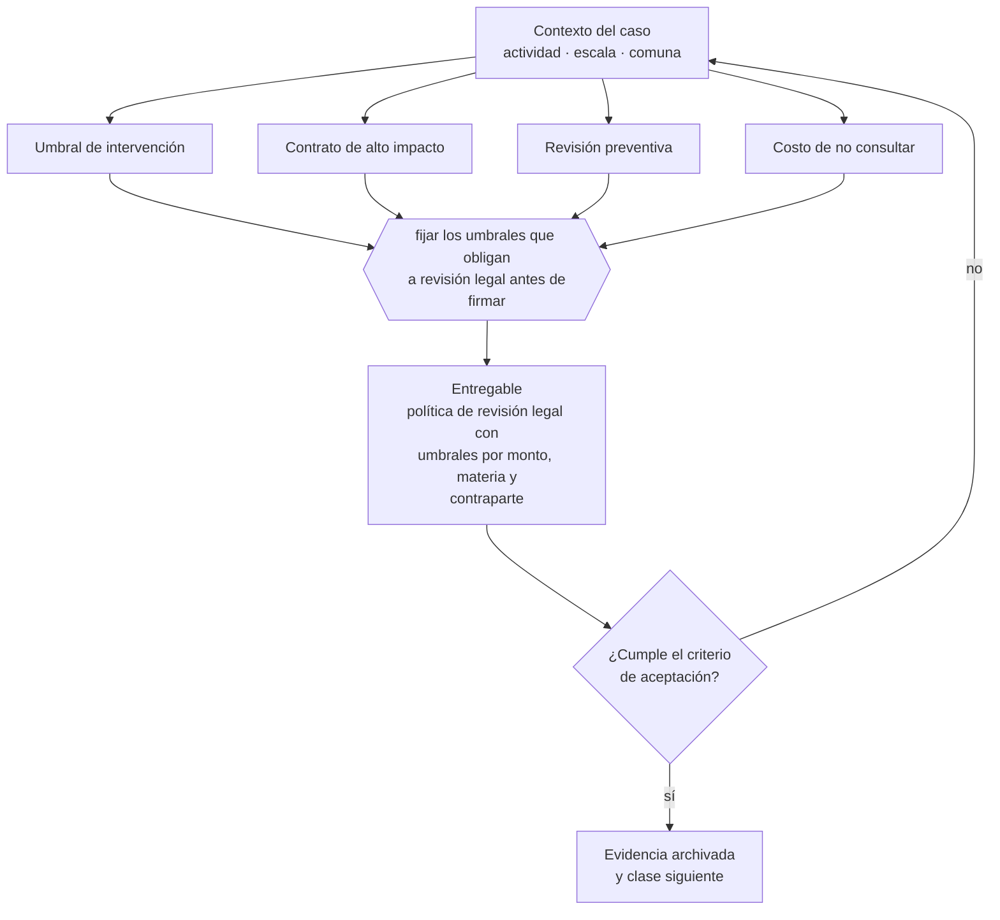

# Clase 140 — Cuándo debe intervenir un abogado

> **Parte 10 · Contratos y arquitectura legal operativa** — clase 14 de 14

**Estado de evidencia:** `VERIFICADO-FUENTE` · **Jurisdicción:** Chile-first · **Fecha base normativa:** 07-08-2026 
**Decisión que habilita:** fijar los umbrales que obligan a revisión legal antes de firmar 
**Entregable:** política de revisión legal con umbrales por monto, materia y contraparte

## 🎯 Propósito

Fijar por escrito los umbrales que obligan a revisión legal, para que la decisión no quede al juicio de quien tiene prisa por cerrar.

## 📚 Resultados de aprendizaje

Al finalizar esta clase podrás:

1. **Definir** con precisión los cuatro conceptos de la tabla siguiente y usarlos para describir un caso real.
2. **Explicar** por qué esta materia condiciona decisiones de otras partes del programa.
3. **Decidir** —fijar los umbrales que obligan a revisión legal antes de firmar— y justificar la decisión por escrito.
4. **Producir** el entregable de la clase y contrastarlo contra su criterio de aceptación.
5. **Distinguir** el dato estable del dato dinámico que exige revalidación en la fuente oficial.

## 🧩 Conceptos centrales

| Concepto | Comprensión verificable |
|---|---|
| **Umbral de intervención** | Monto o riesgo desde el cual se requiere abogado. |
| **Contrato de alto impacto** | Aquel cuyo incumplimiento amenaza la continuidad. |
| **Revisión preventiva** | Análisis antes de firmar. |
| **Costo de no consultar** | Contingencia esperada por firmar sin revisión. |

## 🗺️ Flujo de razonamiento

## 📖 Desarrollo

### 1. El fondo del asunto

La regla práctica es definir umbrales por escrito: sobre cierto monto, con cierta contraparte o con ciertas materias (propiedad intelectual, laboral, datos personales, exclusividad), la revisión legal es obligatoria. Sin umbrales, la decisión queda al juicio del que tiene prisa por cerrar.

### 2. Cómo se traduce en la práctica

Los umbrales razonables combinan monto y materia: propiedad intelectual, laboral, datos personales, exclusividad y responsabilidad ilimitada deberían exigir revisión con independencia del valor. Consultar al abogado después de firmar convierte la asesoría en un informe sobre un problema que ya existe.

### 3. Marco aplicable y quién interviene

- Código Civil en materia de obligaciones, contratos y responsabilidad
- Código de Comercio para actos mercantiles
- Ley 19.983 sobre mérito ejecutivo de la factura
- Ley 21.131 sobre pago a treinta días

**Autoridades o contrapartes involucradas:** Tribunales ordinarios, Centros de arbitraje (CAM Santiago).
**Profesionales de apoyo:** abogado comercial, responsable de contratos, finanzas. La participación concreta depende del riesgo, del
tamaño de la empresa y de la actividad económica.

## 🧪 Taller guiado

Aplica esta clase a **una** de las siguientes líneas de negocio y repite después el ejercicio con
una segunda línea de carga regulatoria distinta:

| Línea | Carga regulatoria |
|---|---|
| SaaS B2B con IA | media |
| Servicios profesionales | baja |
| E-commerce D2C | media |
| Alimentos o foodtech | alta |
| Exportación de servicios | media |
| Fintech regulada | alta |
| Construcción o servicios técnicos | alta |

**Secuencia de trabajo:**

1. Delimita el contexto: actividad económica, escala, comuna y etapa de la empresa.
2. Reúne los antecedentes que la decisión exige y anota la fecha de cada fuente.
3. Identifica las alternativas reales, incluida la de no hacer nada.
4. Evalúa el impacto en mercado, caja, personas, regulación y operación.
5. Toma la decisión y regístrala con sus supuestos.
6. Produce el entregable.
7. Contrástalo contra el criterio de aceptación.
8. Anota lo que requiere validación profesional y programa su revisión.

### 📦 Entregable

Política de revisión legal con umbrales por monto, materia y contraparte.

Debe incluir decisión, supuestos, fuentes con fecha de consulta, responsable, riesgos
identificados y próximos pasos.

## 🏆 Reto verificable

Resuelve la misma materia para una segunda línea de negocio con distinta carga regulatoria y
explica por escrito **qué cambió, por qué y qué fuente lo determina**.

## ✅ Criterio de aceptación

- [ ] los umbrales están definidos por monto y por materia
- [ ] la política identifica materias de revisión obligatoria
- [ ] cada afirmación regulatoria está referida a una fuente oficial con fecha de consulta;
- [ ] los datos dinámicos quedan marcados para revalidación;
- [ ] hay un responsable asignado y evidencia reproducible del trabajo.

## ⚠️ Errores frecuentes

**Propios de esta clase:**

- Consultar al abogado después de firmar para que resuelva lo ya pactado.
- Evitar el costo de revisión en contratos que comprometen la continuidad.

**Característicos de la parte 10:**

- Aceptar términos y condiciones de un proveedor crítico sin leer la limitación de responsabilidad.
- Operar con orden de compra sin contrato marco en servicios recurrentes.

## 🇨🇱 Checklist Chile

- [ ] ¿existe norma o autoridad específica para esta materia?
- [ ] ¿la fuente consultada está vigente a la fecha de ejecución?
- [ ] ¿se activa algún trámite ante el SII?
- [ ] ¿se activa algún requisito municipal o sectorial?
- [ ] ¿afecta a consumidores o al tratamiento de datos personales?
- [ ] ¿afecta a trabajadores o a la seguridad y salud en el trabajo?
- [ ] ¿afecta a impuestos, contabilidad o caja?
- [ ] ¿afecta a contratos o a propiedad intelectual?
- [ ] ¿requiere renovación, reporte periódico o revalidación?

## ❓ Preguntas de comprobación

1. ¿Sobre qué monto o materia tu empresa exige revisión legal antes de firmar?
2. ¿Cuántos contratos del último año se firmaron sin esa revisión?
3. ¿Cuánto costaría la contingencia del peor contrato firmado sin revisar?

## 🔗 Fuentes oficiales

**Biblioteca del Congreso Nacional · LeyChile — Normativa oficial consolidada**  
<https://www.bcn.cl/leychile/> · verificado 2026-08-19

- *Qué contiene:* Publica el texto oficial y consolidado de leyes, decretos y reglamentos, con la versión vigente a una fecha, el historial de modificaciones y la tramitación que las originó.
- *Cómo leerla:* Usa siempre el selector de versión vigente a la fecha en que ejecutarás el trámite, no la última publicada. Y lee el artículo transitorio: en normas en implantación gradual —jornada, datos personales— ahí está la fecha que realmente te aplica.
- *Uso en esta clase:* aporta el marco de «Normativa oficial consolidada» para fijar los umbrales que obligan a revisión legal antes de firmar.

Complementos del repositorio: [glosario](../../../docs/19_GLOSSARY.md) ·
[ruta de lecturas](../../../docs/15_BOOKS_AND_LEARNING_PATH.md) ·
[catálogo de fuentes](../../../docs/16_OFFICIAL_SOURCE_CATALOG.md).

> [!IMPORTANT]
> Material educativo. Para una decisión real de alto impacto hay que verificar la fuente oficial
> vigente y validar con el profesional competente.

---

| Anterior | Índice | Siguiente |
|---|---|---|
| [← 139 · Gestión y repositorio de contratos](../class-13-gestion-y-repositorio-de-contratos/README.md) | [Parte 10](../README.md) · [Programa](../../../README.md) | [141 · Ley del Consumidor aplicada al negocio →](../../part-11-consumidor-e-commerce-privacidad-ip-y-seguridad-digital/class-01-ley-del-consumidor-aplicada-al-negocio/README.md) |
