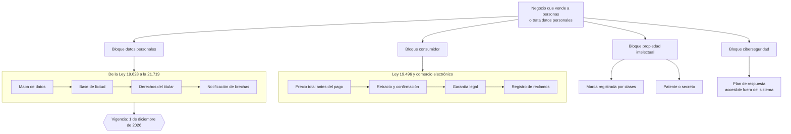

# Parte 11 — Consumidor, e-commerce, privacidad, IP y seguridad digital

> *Vender a consumidores y tratar datos activa un bloque regulatorio propio*

🟠 **Etapa 4 — El blindaje: contratos, datos y personas** · salida de la etapa: Operación contractual y laboral sin contingencias abiertas

**Estado de evidencia:** `DINAMICO` · **Clases:** 14 (141–154) · **Fecha base normativa:** 07-08-2026 
**Contenido central:** Ley del Consumidor, comercio electrónico, garantía, Ley 19.628 y 21.719, marcas, IP y ciberseguridad 
**Conceptos definidos en esta parte:** 56

## 🎯 De qué trata esta parte

Esta es la parte con más cambio normativo en curso del programa, y por eso está marcada como dinámica. La Ley 21.719 de protección de datos personales entra en vigencia el 1 de diciembre de 2026: crea una autoridad con potestad sancionatoria, introduce bases de licitud, refuerza los derechos de los titulares y obliga a notificar brechas. Prepararse no es un proyecto legal: exige cambiar sistemas, contratos con proveedores y procesos de atención.

El bloque de consumo es más antiguo y más fiscalizado. La Ley 19.496 y su Reglamento de Comercio Electrónico exigen informar el precio total antes del pago, sostener lo publicitado, respetar la garantía legal en los términos que la ley establece y atender reclamos. La mayoría de las infracciones no nacen de mala fe sino de una operación que no puede cumplir lo que la web promete: stock desincronizado, plazos de despacho optimistas, políticas de devolución sin costear.

La parte cierra con propiedad intelectual y ciberseguridad. Registrar la marca en INAPI antes de invertir en ella, elegir entre patente y secreto con criterio, controlar las licencias de los componentes de software que se incorporan, y tener un plan de respuesta a incidentes accesible fuera de los sistemas afectados.

## 📚 Resultados de la parte

Al terminar esta parte podrás:

1. **Cumplir las obligaciones de información, retracto y garantía legal en venta a consumidores**.
2. **Levantar el mapa de datos personales y su base de licitud**.
3. **Preparar la organización para la vigencia de la Ley 21.719**.
4. **Proteger marca, obra y secreto empresarial con el instrumento correcto**.

## 🗺️ Mapa de la parte

## ⚖️ Marco aplicable

- Ley 19.496 sobre protección de los derechos de los consumidores y su Reglamento de Comercio Electrónico
- Ley 19.628 sobre protección de la vida privada, vigente hasta la entrada en régimen de la Ley 21.719
- Ley 21.719 sobre protección de datos personales, con vigencia el 1 de diciembre de 2026
- Ley 19.039 sobre propiedad industrial y Ley 17.336 sobre propiedad intelectual
- Ley 21.663 Marco de Ciberseguridad

**Autoridades o contrapartes:** SERNAC, Agencia de Protección de Datos Personales (en implementación), INAPI, ANCI.
**Profesionales de apoyo:** abogado de consumo y datos, DPO o responsable de privacidad, responsable de seguridad de la información.

## ⚠️ Riesgos característicos

- Publicar precio o stock que después no se puede honrar.
- Tratar datos personales sin base de licitud ni registro de actividades de tratamiento.
- Operar la marca comercial sin registro y perderla frente a un tercero que sí registró.
- No tener plan de respuesta a incidentes ni cadena de custodia de evidencia.

## 📘 Las 14 clases

| # | Global | Clase | Decisión que habilita |
|---:|---:|---|---|
| 01 | 141 | [Ley del Consumidor aplicada al negocio](class-01-ley-del-consumidor-aplicada-al-negocio/README.md) | determinar si la empresa vende a consumidores y qué obligaciones activa |
| 02 | 142 | [Reglamento de Comercio Electrónico](class-02-reglamento-de-comercio-electronico/README.md) | ajustar el flujo de compra del sitio a las obligaciones del reglamento |
| 03 | 143 | [Información de precio, stock, despacho y retracto](class-03-informacion-de-precio-stock-despacho-y-retracto/README.md) | asegurar que lo publicado sea cumplible por la operación real |
| 04 | 144 | [Garantía legal y postventa](class-04-garantia-legal-y-postventa/README.md) | definir el procedimiento de postventa que cumple la garantía legal |
| 05 | 145 | [Términos y condiciones y contratos de adhesión](class-05-terminos-y-condiciones-y-contratos-de-adhesion/README.md) | redactar términos y condiciones válidos y ejecutables en Chile |
| 06 | 146 | [Privacidad bajo Ley 19.628 vigente](class-06-privacidad-bajo-ley-19-628-vigente/README.md) | levantar qué datos personales trata la empresa y con qué autorización |
| 07 | 147 | [Preparación para Ley 21.719 desde 1-dic-2026](class-07-preparacion-para-ley-21-719-desde-1-dic-2026/README.md) | planificar la adecuación de la empresa antes de la entrada en vigencia |
| 08 | 148 | [Mapa de datos y bases de licitud](class-08-mapa-de-datos-y-bases-de-licitud/README.md) | levantar el mapa de datos y asignar base de licitud a cada tratamiento |
| 09 | 149 | [Derechos de titulares y gobierno de datos](class-09-derechos-de-titulares-y-gobierno-de-datos/README.md) | habilitar el canal y el procedimiento de atención de derechos |
| 10 | 150 | [Registro de marca en INAPI](class-10-registro-de-marca-en-inapi/README.md) | determinar qué signo se registra, en qué clases y con qué anterioridades |
| 11 | 151 | [Patentes, diseños y secretos empresariales](class-11-patentes-disenos-y-secretos-empresariales/README.md) | elegir entre patentar, registrar diseño o proteger como secreto |
| 12 | 152 | [Derecho de autor y licencias de software](class-12-derecho-de-autor-y-licencias-de-software/README.md) | definir qué licencias se aceptan y cómo se verifica el cumplimiento |
| 13 | 153 | [Ley Marco de Ciberseguridad y ciberhigiene empresarial](class-13-ley-marco-de-ciberseguridad-y-ciberhigiene-empresarial/README.md) | determinar si la empresa tiene obligaciones directas o derivadas de sus clientes |
| 14 | 154 | [Respuesta a incidentes y evidencia](class-14-respuesta-a-incidentes-y-evidencia/README.md) | definir el plan de respuesta a incidentes y los criterios de notificación |

## 🔤 Glosario de la parte

| Concepto | Definición operacional |
|---|---|
| **Aceptación informada** | Constancia de que el consumidor conoció las condiciones. |
| **Agencia de Protección de Datos** | Autoridad con potestad fiscalizadora y sancionatoria. |
| **Base de licitud** | Fundamento legal que habilita el tratamiento. |
| **Búsqueda de anterioridad** | Revisión de marcas previas similares. |
| **Cadena de custodia** | Registro que preserva el valor probatorio de la evidencia. |
| **Canal de ejercicio** | Medio publicado para que el titular ejerza sus derechos. |
| **Ciberhigiene** | Conjunto de prácticas básicas que reducen la mayoría del riesgo. |
| **Clase** | Categoría de la clasificación de niza en que se solicita el registro. |
| **Cláusula abusiva** | Estipulación que causa desequilibrio en perjuicio del consumidor. |
| **Comercio electrónico** | Venta a distancia por medios electrónicos. |
| **Confirmación de compra** | Comunicación que acredita la aceptación y condiciones. |
| **Consentimiento** | Autorización libre, informada y específica del titular. |
| **Consumidor** | Persona natural que adquiere bienes o servicios como destinatario final. |
| **Contrato de adhesión** | Aquel cuyas cláusulas redacta una parte sin negociación. |
| **Cumplimiento de licencias** | Verificación de que el uso respeta las condiciones. |
| **Dato personal** | Información relativa a una persona natural identificada o identificable. |
| **Dato sensible** | Categoría con protección reforzada: salud, origen, creencias, entre otros. |
| **Deber de información** | Obligación de informar de forma veraz y oportuna. |
| **Derecho a retracto** | Facultad de desistir en los casos y plazos legales. |
| **Derecho de autor** | Protección de la obra desde su creación, sin registro constitutivo. |
| **Derechos del titular** | Acceso, rectificación, cancelación, oposición y portabilidad. |
| **Diseño industrial** | Protección de la apariencia de un producto. |
| **Divulgación previa** | Publicación anterior que impide obtener la patente. |
| **Encargado** | Quien trata datos por cuenta del responsable. |
| **Garantía legal** | Derecho del consumidor a reparación, reposición o devolución. |
| **Garantía voluntaria** | Compromiso adicional ofrecido por el proveedor. |
| **Incidente** | Evento que compromete disponibilidad, integridad o confidencialidad. |
| **Información precontractual** | Datos que deben estar disponibles antes de contratar. |
| **Legibilidad** | Exigencia de redacción clara y accesible. |
| **Ley 21.663** | Ley marco de ciberseguridad. |
| **Ley 21.719** | Nueva ley de protección de datos personales, con vigencia el 1 de diciembre de 2026. |
| **Licencia de código abierto** | Permiso con obligaciones específicas según el tipo. |
| **Licencia de software** | Condiciones bajo las cuales se autoriza el uso. |
| **Mapa de datos** | Inventario de qué datos se tratan, dónde y por qué. |
| **Marca** | Signo que distingue productos o servicios en el mercado. |
| **Minimización** | Principio de tratar solo los datos necesarios para la finalidad. |
| **Notificación de brecha** | Obligación de informar a la autoridad y a los afectados. |
| **Operador de importancia vital** | Entidad calificada con obligaciones reforzadas. |
| **Oposición** | Procedimiento por el que un tercero impugna la solicitud. |
| **Patente de invención** | Protección de una solución técnica nueva con altura inventiva. |
| **Plan de respuesta** | Procedimiento con roles, pasos y comunicaciones. |
| **Plazo de conservación** | Tiempo durante el cual se mantienen los datos. |
| **Plazo de despacho** | Tiempo comprometido de entrega. |
| **Plazo de respuesta** | Tiempo legal para atender la solicitud. |
| **Precio informado** | Monto total que el consumidor debe pagar. |
| **Proveedor** | Quien habitualmente desarrolla actividades de producción o comercialización. |
| **Publicidad engañosa** | Comunicación que induce a error sobre características relevantes. |
| **Registro de reclamos** | Bitácora de casos y su resolución. |
| **Registro de solicitudes** | Evidencia de atención y resolución. |
| **Responsable del tratamiento** | Quien decide fines y medios. |
| **Retracto** | Derecho a desistir dentro del plazo legal en los casos que corresponde. |
| **Secreto empresarial** | Información no divulgada con valor comercial y medidas de protección. |
| **Servicio esencial** | Actividad cuya interrupción afecta significativamente. |
| **Servicio técnico** | Canal de atención para hacer efectiva la garantía. |
| **Stock disponible** | Existencia real que respalda la oferta publicada. |
| **Tratamiento** | Cualquier operación sobre datos personales. |

## 🔗 Cómo se conecta

Aplica a todo modelo B2C de la parte 03 y a toda operación digital de la parte 15. Sus obligaciones se instrumentan por contrato en la parte 10 y se auditan en el mapa de compliance de la parte 19.

## 📖 Pauta bibliográfica

- Ley 19.496 y Reglamento de Comercio Electrónico; Ley 19.628 y Ley 21.719.
- Ley 19.039 (propiedad industrial), Ley 17.336 (derecho de autor) y Ley 21.663 (ciberseguridad).
- SERNAC — procedimientos y alertas por rubro: mejor predictor del riesgo que la lectura abstracta.

## 🏛️ Fuentes oficiales de la parte

**Servicio Nacional del Consumidor — Ley 19.496, comercio electrónico y garantía legal**  
<https://www.sernac.cl/> · verificado 2026-08-19

- *Qué contiene:* Publica la interpretación aplicada de la Ley del Consumidor: deberes de información en la oferta, reglas del comercio electrónico, garantía legal, contratos de adhesión y el procedimiento de reclamos.
- *Cómo leerla:* Entra por el rubro de tu negocio y revisa las alertas y procedimientos colectivos publicados: muestran qué está fiscalizando el servicio ahora, que es mejor predictor de tu riesgo que la lectura abstracta de la ley.

**Instituto Nacional de Propiedad Industrial — Marcas, patentes y diseños industriales**  
<https://www.inapi.cl/> · verificado 2026-08-19

- *Qué contiene:* Administra el registro de marcas, patentes, diseños e indicaciones geográficas, y ofrece el buscador público de solicitudes y registros vigentes por clase.
- *Cómo leerla:* Empieza siempre por el buscador de anterioridades y por clases, no por el formulario de solicitud. Una marca disponible en tu clase puede estar tomada en la clase donde realmente operas, y eso solo se ve buscando por actividad.

**Biblioteca del Congreso Nacional · LeyChile — Normativa oficial consolidada**  
<https://www.bcn.cl/leychile/> · verificado 2026-08-19

- *Qué contiene:* Publica el texto oficial y consolidado de leyes, decretos y reglamentos, con la versión vigente a una fecha, el historial de modificaciones y la tramitación que las originó.
- *Cómo leerla:* Usa siempre el selector de versión vigente a la fecha en que ejecutarás el trámite, no la última publicada. Y lee el artículo transitorio: en normas en implantación gradual —jornada, datos personales— ahí está la fecha que realmente te aplica.

---

| Anterior | Índice | Siguiente |
|---|---|---|
| [← Parte 10 · Contratos y arquitectura legal operativa](../part-10-contratos-y-arquitectura-legal-operativa/README.md) | [Currículo](../../CURRICULUM.md) · [Programa](../../README.md) | [Parte 12 · Personas, relaciones laborales y seguridad y salud →](../part-12-personas-relaciones-laborales-y-seguridad-y-salud/README.md) |
