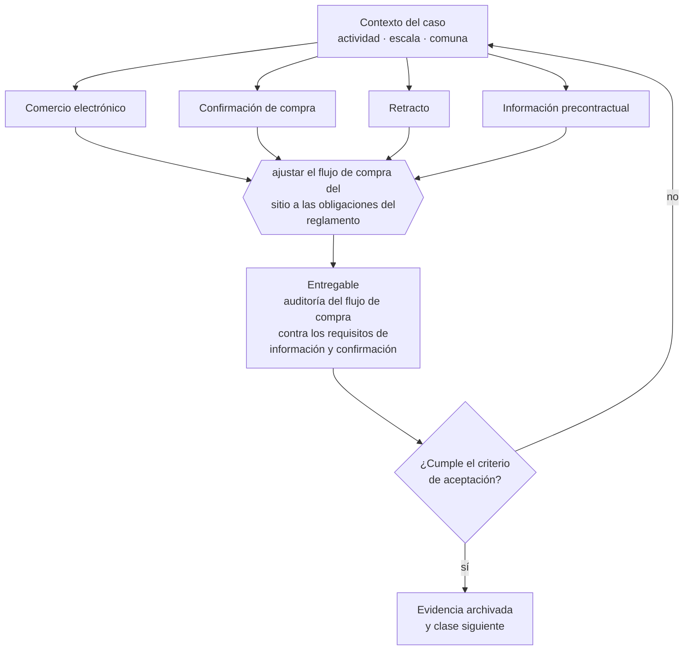

# Clase 142 — Reglamento de Comercio Electrónico

> **Parte 11 · Consumidor, e-commerce, privacidad, IP y seguridad digital** — clase 2 de 14

**Estado de evidencia:** `DINAMICO` · **Jurisdicción:** Chile-first · **Fecha base normativa:** 07-08-2026 
**Decisión que habilita:** ajustar el flujo de compra del sitio a las obligaciones del reglamento 
**Entregable:** auditoría del flujo de compra contra los requisitos de información y confirmación

## 🎯 Propósito

Auditar el flujo de compra del sitio contra los requisitos de información, confirmación y retracto del Reglamento de Comercio Electrónico.

## 📚 Resultados de aprendizaje

Al finalizar esta clase podrás:

1. **Definir** con precisión los cuatro conceptos de la tabla siguiente y usarlos para describir un caso real.
2. **Explicar** por qué esta materia condiciona decisiones de otras partes del programa.
3. **Decidir** —ajustar el flujo de compra del sitio a las obligaciones del reglamento— y justificar la decisión por escrito.
4. **Producir** el entregable de la clase y contrastarlo contra su criterio de aceptación.
5. **Distinguir** el dato estable del dato dinámico que exige revalidación en la fuente oficial.

## 🧩 Conceptos centrales

| Concepto | Comprensión verificable |
|---|---|
| **Comercio electrónico** | Venta a distancia por medios electrónicos. |
| **Confirmación de compra** | Comunicación que acredita la aceptación y condiciones. |
| **Retracto** | Derecho a desistir dentro del plazo legal en los casos que corresponde. |
| **Información precontractual** | Datos que deben estar disponibles antes de contratar. |

## 🗺️ Flujo de razonamiento

## 📖 Desarrollo

### 1. El fondo del asunto

El Reglamento de Comercio Electrónico detalla cómo debe informarse el precio total, la disponibilidad, el plazo de entrega, el procedimiento de devolución y los datos del proveedor. Un sitio que no informa el costo de despacho antes del último paso incumple, aunque después lo muestre.

### 2. Cómo se traduce en la práctica

Mostrar el costo de despacho recién en el último paso del checkout es incumplimiento aunque después se muestre, porque el precio total debe estar disponible antes de contratar. Y la confirmación debe incluir condiciones completas, plazos y procedimiento de devolución, no solo el número de pedido.

### 3. Marco aplicable y quién interviene

- Ley 19.496 sobre protección de los derechos de los consumidores y su Reglamento de Comercio Electrónico
- Ley 19.628 sobre protección de la vida privada, vigente hasta la entrada en régimen de la Ley 21.719
- Ley 21.719 sobre protección de datos personales, con vigencia el 1 de diciembre de 2026
- Ley 19.039 sobre propiedad industrial y Ley 17.336 sobre propiedad intelectual
- Ley 21.663 Marco de Ciberseguridad

**Autoridades o contrapartes involucradas:** SERNAC, Agencia de Protección de Datos Personales (en implementación), INAPI, ANCI.
**Profesionales de apoyo:** abogado de consumo y datos, DPO o responsable de privacidad, responsable de seguridad de la información. La participación concreta depende del riesgo, del
tamaño de la empresa y de la actividad económica.

## 🧪 Taller guiado

Aplica esta clase a **una** de las siguientes líneas de negocio y repite después el ejercicio con
una segunda línea de carga regulatoria distinta:

| Línea | Carga regulatoria |
|---|---|
| SaaS B2B con IA | media |
| Servicios profesionales | baja |
| E-commerce D2C | media |
| Alimentos o foodtech | alta |
| Exportación de servicios | media |
| Fintech regulada | alta |
| Construcción o servicios técnicos | alta |

**Secuencia de trabajo:**

1. Delimita el contexto: actividad económica, escala, comuna y etapa de la empresa.
2. Reúne los antecedentes que la decisión exige y anota la fecha de cada fuente.
3. Identifica las alternativas reales, incluida la de no hacer nada.
4. Evalúa el impacto en mercado, caja, personas, regulación y operación.
5. Toma la decisión y regístrala con sus supuestos.
6. Produce el entregable.
7. Contrástalo contra el criterio de aceptación.
8. Anota lo que requiere validación profesional y programa su revisión.

### 📦 Entregable

Auditoría del flujo de compra contra los requisitos de información y confirmación.

Debe incluir decisión, supuestos, fuentes con fecha de consulta, responsable, riesgos
identificados y próximos pasos.

## 🏆 Reto verificable

Resuelve la misma materia para una segunda línea de negocio con distinta carga regulatoria y
explica por escrito **qué cambió, por qué y qué fuente lo determina**.

## ✅ Criterio de aceptación

- [ ] el precio total es visible antes de iniciar el pago
- [ ] la confirmación incluye condiciones, plazos y procedimiento de devolución
- [ ] cada afirmación regulatoria está referida a una fuente oficial con fecha de consulta;
- [ ] los datos dinámicos quedan marcados para revalidación;
- [ ] hay un responsable asignado y evidencia reproducible del trabajo.

## ⚠️ Errores frecuentes

**Propios de esta clase:**

- Mostrar el costo de despacho recién en el último paso del checkout.
- No enviar confirmación con las condiciones completas de la compra.

**Característicos de la parte 11:**

- Publicar precio o stock que después no se puede honrar.
- Tratar datos personales sin base de licitud ni registro de actividades de tratamiento.

## 🇨🇱 Checklist Chile

- [ ] ¿existe norma o autoridad específica para esta materia?
- [ ] ¿la fuente consultada está vigente a la fecha de ejecución?
- [ ] ¿se activa algún trámite ante el SII?
- [ ] ¿se activa algún requisito municipal o sectorial?
- [ ] ¿afecta a consumidores o al tratamiento de datos personales?
- [ ] ¿afecta a trabajadores o a la seguridad y salud en el trabajo?
- [ ] ¿afecta a impuestos, contabilidad o caja?
- [ ] ¿afecta a contratos o a propiedad intelectual?
- [ ] ¿requiere renovación, reporte periódico o revalidación?

## ❓ Preguntas de comprobación

1. ¿Puede el cliente ver el precio total, con despacho, antes de iniciar el pago?
2. ¿Qué información contiene tu correo de confirmación de compra?
3. ¿Está publicado y accesible tu procedimiento de devolución?

## 🔗 Fuentes oficiales

**Servicio Nacional del Consumidor — Ley 19.496, comercio electrónico y garantía legal**  
<https://www.sernac.cl/> · verificado 2026-08-07

- *Qué contiene:* Publica la interpretación aplicada de la Ley del Consumidor: deberes de información en la oferta, reglas del comercio electrónico, garantía legal, contratos de adhesión y el procedimiento de reclamos.
- *Cómo leerla:* Entra por el rubro de tu negocio y revisa las alertas y procedimientos colectivos publicados: muestran qué está fiscalizando el servicio ahora, que es mejor predictor de tu riesgo que la lectura abstracta de la ley.

**Biblioteca del Congreso Nacional · LeyChile — Normativa oficial consolidada**  
<https://www.bcn.cl/leychile/> · verificado 2026-08-07

- *Qué contiene:* Publica el texto oficial y consolidado de leyes, decretos y reglamentos, con la versión vigente a una fecha, el historial de modificaciones y la tramitación que las originó.
- *Cómo leerla:* Usa siempre el selector de versión vigente a la fecha en que ejecutarás el trámite, no la última publicada. Y lee el artículo transitorio: en normas en implantación gradual —jornada, datos personales— ahí está la fecha que realmente te aplica.

Complementos del repositorio: [glosario](../../../docs/19_GLOSSARY.md) ·
[ruta de lecturas](../../../docs/15_BOOKS_AND_LEARNING_PATH.md) ·
[catálogo de fuentes](../../../docs/16_OFFICIAL_SOURCE_CATALOG.md).

> [!IMPORTANT]
> Material educativo. Para una decisión real de alto impacto hay que verificar la fuente oficial
> vigente y validar con el profesional competente.

---

| Anterior | Índice | Siguiente |
|---|---|---|
| [← 141 · Ley del Consumidor aplicada al negocio](../class-01-ley-del-consumidor-aplicada-al-negocio/README.md) | [Parte 11](../README.md) · [Programa](../../../README.md) | [143 · Información de precio, stock, despacho y retracto →](../class-03-informacion-de-precio-stock-despacho-y-retracto/README.md) |
