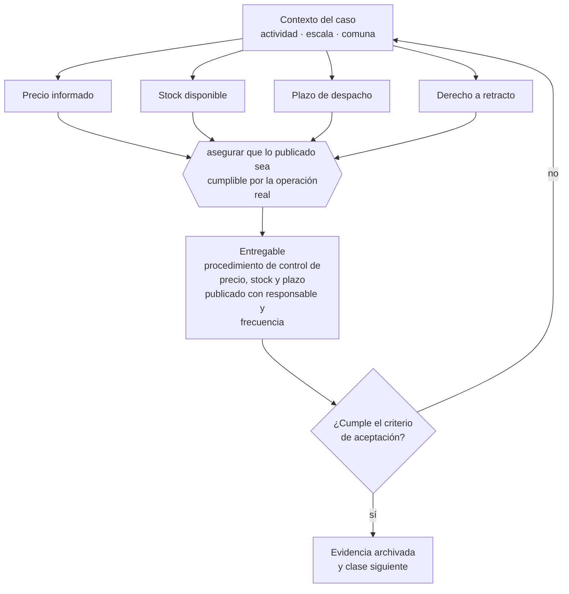

# Clase 143 — Información de precio, stock, despacho y retracto

> **Parte 11 · Consumidor, e-commerce, privacidad, IP y seguridad digital** — clase 3 de 14

**Estado de evidencia:** `DINAMICO` · **Jurisdicción:** Chile-first · **Fecha base normativa:** 07-08-2026 
**Decisión que habilita:** asegurar que lo publicado sea cumplible por la operación real 
**Entregable:** procedimiento de control de precio, stock y plazo publicado con responsable y frecuencia

## 🎯 Propósito

Asegurar que lo publicado sea cumplible por la operación real, porque el problema de fondo es operativo antes que legal.

## 📚 Resultados de aprendizaje

Al finalizar esta clase podrás:

1. **Definir** con precisión los cuatro conceptos de la tabla siguiente y usarlos para describir un caso real.
2. **Explicar** por qué esta materia condiciona decisiones de otras partes del programa.
3. **Decidir** —asegurar que lo publicado sea cumplible por la operación real— y justificar la decisión por escrito.
4. **Producir** el entregable de la clase y contrastarlo contra su criterio de aceptación.
5. **Distinguir** el dato estable del dato dinámico que exige revalidación en la fuente oficial.

## 🧩 Conceptos centrales

| Concepto | Comprensión verificable |
|---|---|
| **Precio informado** | Monto total que el consumidor debe pagar. |
| **Stock disponible** | Existencia real que respalda la oferta publicada. |
| **Plazo de despacho** | Tiempo comprometido de entrega. |
| **Derecho a retracto** | Facultad de desistir en los casos y plazos legales. |

## 🗺️ Flujo de razonamiento

## 📖 Desarrollo

### 1. El fondo del asunto

Publicar precio o stock que no se puede honrar genera responsabilidad, y la corrección posterior no siempre la evita. La operación debe poder sostener lo publicado: si el inventario no está sincronizado o el despacho no cumple el plazo, el problema es operativo antes que legal.

### 2. Cómo se traduce en la práctica

Publicar plazos de despacho promedio como si fueran garantizados y vender contra inventario no sincronizado producen cancelaciones que el consumidor no aceptó. La corrección posterior no siempre evita la responsabilidad, y el costo reputacional supera al legal en un negocio que depende de recompra.

### 3. Marco aplicable y quién interviene

- Ley 19.496 sobre protección de los derechos de los consumidores y su Reglamento de Comercio Electrónico
- Ley 19.628 sobre protección de la vida privada, vigente hasta la entrada en régimen de la Ley 21.719
- Ley 21.719 sobre protección de datos personales, con vigencia el 1 de diciembre de 2026
- Ley 19.039 sobre propiedad industrial y Ley 17.336 sobre propiedad intelectual
- Ley 21.663 Marco de Ciberseguridad

**Autoridades o contrapartes involucradas:** SERNAC, Agencia de Protección de Datos Personales (en implementación), INAPI, ANCI.
**Profesionales de apoyo:** abogado de consumo y datos, DPO o responsable de privacidad, responsable de seguridad de la información. La participación concreta depende del riesgo, del
tamaño de la empresa y de la actividad económica.

## 🧪 Taller guiado

Aplica esta clase a **una** de las siguientes líneas de negocio y repite después el ejercicio con
una segunda línea de carga regulatoria distinta:

| Línea | Carga regulatoria |
|---|---|
| SaaS B2B con IA | media |
| Servicios profesionales | baja |
| E-commerce D2C | media |
| Alimentos o foodtech | alta |
| Exportación de servicios | media |
| Fintech regulada | alta |
| Construcción o servicios técnicos | alta |

**Secuencia de trabajo:**

1. Delimita el contexto: actividad económica, escala, comuna y etapa de la empresa.
2. Reúne los antecedentes que la decisión exige y anota la fecha de cada fuente.
3. Identifica las alternativas reales, incluida la de no hacer nada.
4. Evalúa el impacto en mercado, caja, personas, regulación y operación.
5. Toma la decisión y regístrala con sus supuestos.
6. Produce el entregable.
7. Contrástalo contra el criterio de aceptación.
8. Anota lo que requiere validación profesional y programa su revisión.

### 📦 Entregable

Procedimiento de control de precio, stock y plazo publicado con responsable y frecuencia.

Debe incluir decisión, supuestos, fuentes con fecha de consulta, responsable, riesgos
identificados y próximos pasos.

## 🏆 Reto verificable

Resuelve la misma materia para una segunda línea de negocio con distinta carga regulatoria y
explica por escrito **qué cambió, por qué y qué fuente lo determina**.

## ✅ Criterio de aceptación

- [ ] existe control documentado de coherencia entre publicación y operación
- [ ] el plazo publicado se sostiene con datos históricos de cumplimiento
- [ ] cada afirmación regulatoria está referida a una fuente oficial con fecha de consulta;
- [ ] los datos dinámicos quedan marcados para revalidación;
- [ ] hay un responsable asignado y evidencia reproducible del trabajo.

## ⚠️ Errores frecuentes

**Propios de esta clase:**

- Publicar plazos de despacho promedio como si fueran garantizados.
- Vender contra inventario no sincronizado y cancelar pedidos después.

**Característicos de la parte 11:**

- Publicar precio o stock que después no se puede honrar.
- Tratar datos personales sin base de licitud ni registro de actividades de tratamiento.

## 🇨🇱 Checklist Chile

- [ ] ¿existe norma o autoridad específica para esta materia?
- [ ] ¿la fuente consultada está vigente a la fecha de ejecución?
- [ ] ¿se activa algún trámite ante el SII?
- [ ] ¿se activa algún requisito municipal o sectorial?
- [ ] ¿afecta a consumidores o al tratamiento de datos personales?
- [ ] ¿afecta a trabajadores o a la seguridad y salud en el trabajo?
- [ ] ¿afecta a impuestos, contabilidad o caja?
- [ ] ¿afecta a contratos o a propiedad intelectual?
- [ ] ¿requiere renovación, reporte periódico o revalidación?

## ❓ Preguntas de comprobación

1. ¿Qué porcentaje de tus despachos cumple el plazo que publicas?
2. ¿Con qué frecuencia se sincroniza el stock que ve tu canal digital?
3. ¿Cuántos pedidos cancelaste el último trimestre por falta de stock?

## 🔗 Fuentes oficiales

**Servicio Nacional del Consumidor — Ley 19.496, comercio electrónico y garantía legal**  
<https://www.sernac.cl/> · verificado 2026-08-07

- *Qué contiene:* Publica la interpretación aplicada de la Ley del Consumidor: deberes de información en la oferta, reglas del comercio electrónico, garantía legal, contratos de adhesión y el procedimiento de reclamos.
- *Cómo leerla:* Entra por el rubro de tu negocio y revisa las alertas y procedimientos colectivos publicados: muestran qué está fiscalizando el servicio ahora, que es mejor predictor de tu riesgo que la lectura abstracta de la ley.

Complementos del repositorio: [glosario](../../../docs/19_GLOSSARY.md) ·
[ruta de lecturas](../../../docs/15_BOOKS_AND_LEARNING_PATH.md) ·
[catálogo de fuentes](../../../docs/16_OFFICIAL_SOURCE_CATALOG.md).

> [!IMPORTANT]
> Material educativo. Para una decisión real de alto impacto hay que verificar la fuente oficial
> vigente y validar con el profesional competente.

---

| Anterior | Índice | Siguiente |
|---|---|---|
| [← 142 · Reglamento de Comercio Electrónico](../class-02-reglamento-de-comercio-electronico/README.md) | [Parte 11](../README.md) · [Programa](../../../README.md) | [144 · Garantía legal y postventa →](../class-04-garantia-legal-y-postventa/README.md) |
