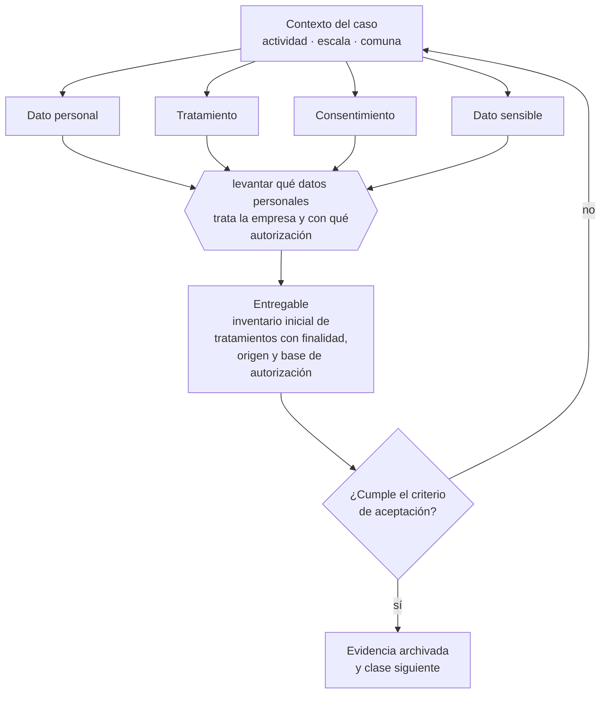

# Clase 146 — Privacidad bajo Ley 19.628 vigente

> **Parte 11 · Consumidor, e-commerce, privacidad, IP y seguridad digital** — clase 6 de 14

**Estado de evidencia:** `DINAMICO` · **Jurisdicción:** Chile-first · **Fecha base normativa:** 07-08-2026 
**Decisión que habilita:** levantar qué datos personales trata la empresa y con qué autorización 
**Entregable:** inventario inicial de tratamientos con finalidad, origen y base de autorización

## 🎯 Propósito

Levantar qué datos personales trata la empresa y con qué autorización, usando ya el estándar de la ley nueva para no rehacer el trabajo.

## 📚 Resultados de aprendizaje

Al finalizar esta clase podrás:

1. **Definir** con precisión los cuatro conceptos de la tabla siguiente y usarlos para describir un caso real.
2. **Explicar** por qué esta materia condiciona decisiones de otras partes del programa.
3. **Decidir** —levantar qué datos personales trata la empresa y con qué autorización— y justificar la decisión por escrito.
4. **Producir** el entregable de la clase y contrastarlo contra su criterio de aceptación.
5. **Distinguir** el dato estable del dato dinámico que exige revalidación en la fuente oficial.

## 🧩 Conceptos centrales

| Concepto | Comprensión verificable |
|---|---|
| **Dato personal** | Información relativa a una persona natural identificada o identificable. |
| **Tratamiento** | Cualquier operación sobre datos personales. |
| **Consentimiento** | Autorización libre, informada y específica del titular. |
| **Dato sensible** | Categoría con protección reforzada: salud, origen, creencias, entre otros. |

## 🗺️ Flujo de razonamiento

## 📖 Desarrollo

### 1. El fondo del asunto

La Ley 19.628 rige mientras la Ley 21.719 no entra plenamente en vigencia. Su estándar es más bajo, pero ya exige finalidad determinada, consentimiento y resguardo. Construir el tratamiento con el estándar de la ley nueva evita rehacer todo el año de la transición.

### 2. Cómo se traduce en la práctica

La Ley 19.628 rige mientras la 21.719 no entra plenamente en vigencia, y su estándar es más bajo. Construir el tratamiento con el estándar futuro evita hacer dos veces el mismo trabajo, porque la finalidad determinada, el registro de tratamientos y la base de licitud serán exigibles desde el 1 de diciembre de 2026.

### 3. Marco aplicable y quién interviene

- Ley 19.496 sobre protección de los derechos de los consumidores y su Reglamento de Comercio Electrónico
- Ley 19.628 sobre protección de la vida privada, vigente hasta la entrada en régimen de la Ley 21.719
- Ley 21.719 sobre protección de datos personales, con vigencia el 1 de diciembre de 2026
- Ley 19.039 sobre propiedad industrial y Ley 17.336 sobre propiedad intelectual
- Ley 21.663 Marco de Ciberseguridad

**Autoridades o contrapartes involucradas:** SERNAC, Agencia de Protección de Datos Personales (en implementación), INAPI, ANCI.
**Profesionales de apoyo:** abogado de consumo y datos, DPO o responsable de privacidad, responsable de seguridad de la información. La participación concreta depende del riesgo, del
tamaño de la empresa y de la actividad económica.

## 🧪 Taller guiado

Aplica esta clase a **una** de las siguientes líneas de negocio y repite después el ejercicio con
una segunda línea de carga regulatoria distinta:

| Línea | Carga regulatoria |
|---|---|
| SaaS B2B con IA | media |
| Servicios profesionales | baja |
| E-commerce D2C | media |
| Alimentos o foodtech | alta |
| Exportación de servicios | media |
| Fintech regulada | alta |
| Construcción o servicios técnicos | alta |

**Secuencia de trabajo:**

1. Delimita el contexto: actividad económica, escala, comuna y etapa de la empresa.
2. Reúne los antecedentes que la decisión exige y anota la fecha de cada fuente.
3. Identifica las alternativas reales, incluida la de no hacer nada.
4. Evalúa el impacto en mercado, caja, personas, regulación y operación.
5. Toma la decisión y regístrala con sus supuestos.
6. Produce el entregable.
7. Contrástalo contra el criterio de aceptación.
8. Anota lo que requiere validación profesional y programa su revisión.

### 📦 Entregable

Inventario inicial de tratamientos con finalidad, origen y base de autorización.

Debe incluir decisión, supuestos, fuentes con fecha de consulta, responsable, riesgos
identificados y próximos pasos.

## 🏆 Reto verificable

Resuelve la misma materia para una segunda línea de negocio con distinta carga regulatoria y
explica por escrito **qué cambió, por qué y qué fuente lo determina**.

## ✅ Criterio de aceptación

- [ ] cada tratamiento tiene finalidad declarada
- [ ] el origen y la autorización de cada base están identificados
- [ ] cada afirmación regulatoria está referida a una fuente oficial con fecha de consulta;
- [ ] los datos dinámicos quedan marcados para revalidación;
- [ ] hay un responsable asignado y evidencia reproducible del trabajo.

## ⚠️ Errores frecuentes

**Propios de esta clase:**

- Tratar datos con finalidades distintas de las informadas al recolectarlos.
- Asumir que el consentimiento genérico cubre cualquier uso futuro.

**Característicos de la parte 11:**

- Publicar precio o stock que después no se puede honrar.
- Tratar datos personales sin base de licitud ni registro de actividades de tratamiento.

## 🇨🇱 Checklist Chile

- [ ] ¿existe norma o autoridad específica para esta materia?
- [ ] ¿la fuente consultada está vigente a la fecha de ejecución?
- [ ] ¿se activa algún trámite ante el SII?
- [ ] ¿se activa algún requisito municipal o sectorial?
- [ ] ¿afecta a consumidores o al tratamiento de datos personales?
- [ ] ¿afecta a trabajadores o a la seguridad y salud en el trabajo?
- [ ] ¿afecta a impuestos, contabilidad o caja?
- [ ] ¿afecta a contratos o a propiedad intelectual?
- [ ] ¿requiere renovación, reporte periódico o revalidación?

## ❓ Preguntas de comprobación

1. ¿Qué datos personales tratas y con qué finalidad declarada al recolectarlos?
2. ¿Estás usando esos datos para finalidades distintas de las informadas?
3. ¿Dónde están esos datos: sistemas, planillas, correos, proveedores?

## 🔗 Fuentes oficiales

**Biblioteca del Congreso Nacional · LeyChile — Normativa oficial consolidada**  
<https://www.bcn.cl/leychile/> · verificado 2026-08-19

- *Qué contiene:* Publica el texto oficial y consolidado de leyes, decretos y reglamentos, con la versión vigente a una fecha, el historial de modificaciones y la tramitación que las originó.
- *Cómo leerla:* Usa siempre el selector de versión vigente a la fecha en que ejecutarás el trámite, no la última publicada. Y lee el artículo transitorio: en normas en implantación gradual —jornada, datos personales— ahí está la fecha que realmente te aplica.
- *Uso en esta clase:* aporta el marco de «Normativa oficial consolidada» para levantar qué datos personales trata la empresa y con qué autorización.

Complementos del repositorio: [glosario](../../../docs/19_GLOSSARY.md) ·
[ruta de lecturas](../../../docs/15_BOOKS_AND_LEARNING_PATH.md) ·
[catálogo de fuentes](../../../docs/16_OFFICIAL_SOURCE_CATALOG.md).

> [!IMPORTANT]
> Material educativo. Para una decisión real de alto impacto hay que verificar la fuente oficial
> vigente y validar con el profesional competente.

---

| Anterior | Índice | Siguiente |
|---|---|---|
| [← 145 · Términos y condiciones y contratos de adhesión](../class-05-terminos-y-condiciones-y-contratos-de-adhesion/README.md) | [Parte 11](../README.md) · [Programa](../../../README.md) | [147 · Preparación para Ley 21.719 desde 1-dic-2026 →](../class-07-preparacion-para-ley-21-719-desde-1-dic-2026/README.md) |
