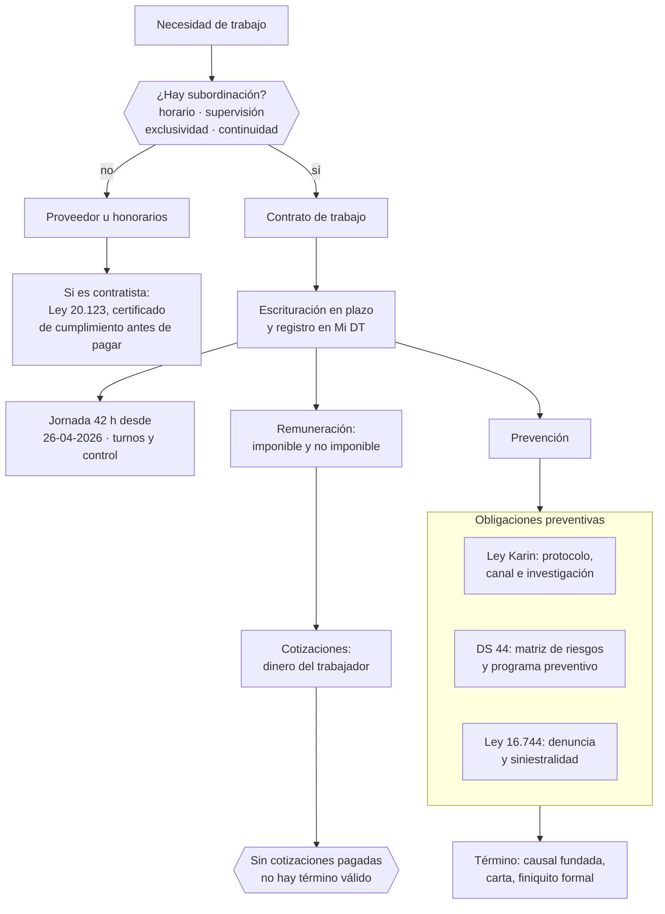

# Parte 12 — Personas, relaciones laborales y seguridad y salud

> *Contratar es la decisión que más obligaciones periódicas activa*

🟠 **Etapa 4 — El blindaje: contratos, datos y personas** · salida de la etapa: Operación contractual y laboral sin contingencias abiertas

**Estado de evidencia:** `VERIFICADO-FUENTE` · **Clases:** 14 (155–168) · **Fecha base normativa:** 07-08-2026 
**Contenido central:** Contratar o externalizar, contrato, Mi DT, 42 horas, remuneraciones, Ley Karin, DS 44 y término 
**Conceptos definidos en esta parte:** 56

## 🎯 De qué trata esta parte

La primera contratación transforma la empresa: aparecen liquidaciones mensuales, cotizaciones con fecha de pago, obligaciones preventivas y un régimen de término que no admite improvisación. Por eso la parte empieza antes del contrato, en la decisión de contratar o externalizar, y en la advertencia de que la calificación de la relación no depende del nombre del documento sino de los hechos: horario, supervisión, exclusividad y continuidad.

El contexto chileno de 2026 tiene tres cambios que obligan a revisar prácticas heredadas. La jornada ordinaria es de 42 horas semanales desde el 26 de abril de 2026, camino a 40 en 2028, lo que exige rediseñar turnos y no absorber la reducción con horas extra permanentes. La Ley Karin obliga a todas las empresas con trabajadores a tener protocolo de prevención, canal de denuncia y procedimiento de investigación con plazos. Y el DS 44 exige gestión preventiva documentada, proporcional al tamaño pero no opcional.

Hay una obligación que merece tratamiento aparte: las cotizaciones previsionales son dinero del trabajador retenido por el empleador. No pagarlas impide además poner término válido al contrato, con el efecto de seguir devengando remuneraciones hasta regularizar.

## 📚 Resultados de la parte

Al terminar esta parte podrás:

1. **Elegir la figura correcta entre trabajador dependiente, honorarios y proveedor**.
2. **Emitir contratos y registrar relaciones laborales conforme a la Dirección del Trabajo**.
3. **Liquidar remuneraciones y cotizaciones con la estructura correcta**.
4. **Cumplir las obligaciones preventivas y de investigación que exigen Ley Karin y Ley 16.744**.

## 🗺️ Mapa de la parte

## ⚖️ Marco aplicable

- Código del Trabajo
- Ley 21.561 de reducción gradual de jornada: 42 horas semanales desde el 26 de abril de 2026
- Ley 21.643 (Ley Karin) sobre acoso laboral, sexual y violencia en el trabajo
- Ley 16.744 sobre accidentes del trabajo y enfermedades profesionales y DS 44 de gestión preventiva
- Ley 20.123 sobre subcontratación y servicios transitorios

**Autoridades o contrapartes:** Dirección del Trabajo, SUSESO, Mutualidades, Previred, IPS.
**Profesionales de apoyo:** abogado laboral, encargado de personas, prevencionista de riesgos, contador de remuneraciones.

## ⚠️ Riesgos característicos

- Contratar a honorarios a alguien que en los hechos es trabajador dependiente.
- No adecuar jornada y turnos al calendario de reducción legal.
- Carecer del protocolo ley karin y del canal de denuncia antes del primer caso.
- No registrar accidentes ni mantener la matriz de riesgos exigida por ds 44.

## 📘 Las 14 clases

| # | Global | Clase | Decisión que habilita |
|---:|---:|---|---|
| 01 | 155 | [Cuándo contratar versus externalizar](class-01-cuando-contratar-versus-externalizar/README.md) | elegir la figura correcta según los hechos reales de la relación |
| 02 | 156 | [Contrato de trabajo y cláusulas esenciales](class-02-contrato-de-trabajo-y-clausulas-esenciales/README.md) | redactar contratos con cláusulas esenciales completas y funciones bien definidas |
| 03 | 157 | [Registro y gestión en Mi DT](class-03-registro-y-gestion-en-mi-dt/README.md) | definir qué actos laborales se registran, quién los registra y con qué plazo |
| 04 | 158 | [Jornada ordinaria de 42 horas en 2026](class-04-jornada-ordinaria-de-42-horas-en-2026/README.md) | adecuar contratos, turnos y dotación al tramo de jornada vigente |
| 05 | 159 | [Control de asistencia, horas extra y descansos](class-05-control-de-asistencia-horas-extra-y-descansos/README.md) | definir el sistema de control de asistencia y la política de horas extraordinarias |
| 06 | 160 | [Remuneraciones imponibles y no imponibles](class-06-remuneraciones-imponibles-y-no-imponibles/README.md) | diseñar la estructura de remuneración con haberes correctamente clasificados |
| 07 | 161 | [Cotizaciones previsionales y seguridad social](class-07-cotizaciones-previsionales-y-seguridad-social/README.md) | asegurar el pago íntegro y oportuno de cotizaciones como obligación prioritaria |
| 08 | 162 | [Vacaciones, permisos y licencias](class-08-vacaciones-permisos-y-licencias/README.md) | controlar el devengo y uso de feriados, permisos y licencias |
| 09 | 163 | [Reglamento interno y políticas](class-09-reglamento-interno-y-politicas/README.md) | determinar si corresponde reglamento interno y mantenerlo actualizado y difundido |
| 10 | 164 | [Ley Karin: prevención, denuncia e investigación](class-10-ley-karin-prevencion-denuncia-e-investigacion/README.md) | implementar protocolo, canal y procedimiento de investigación conforme a la ley |
| 11 | 165 | [Subcontratación y servicios transitorios](class-11-subcontratacion-y-servicios-transitorios/README.md) | definir los controles que se exigirán a contratistas antes de cada pago |
| 12 | 166 | [Ley 16.744 y seguro de accidentes](class-12-ley-16-744-y-seguro-de-accidentes/README.md) | asegurar afiliación, prevención y procedimiento de denuncia de accidentes |
| 13 | 167 | [Decreto 44 y gestión preventiva de riesgos](class-13-decreto-44-y-gestion-preventiva-de-riesgos/README.md) | implementar la gestión preventiva documentada que exige la normativa |
| 14 | 168 | [Término de contrato y documentación de salida](class-14-termino-de-contrato-y-documentacion-de-salida/README.md) | ejecutar el término con causal correcta y documentación completa |

## 🔤 Glosario de la parte

| Concepto | Definición operacional |
|---|---|
| **Anexo** | Documento que modifica o complementa el contrato. |
| **Canal de denuncia** | Medio confidencial para reportar. |
| **Carta de aviso** | Comunicación con causal, hechos y fecha. |
| **Causal de término** | Fundamento legal invocado para poner fin al contrato. |
| **Cláusula esencial** | Estipulación obligatoria: partes, funciones, lugar, remuneración, jornada, plazo. |
| **Contrato de trabajo** | Acuerdo escrito con las cláusulas mínimas del código del trabajo. |
| **Control de asistencia** | Registro obligatorio de entrada y salida. |
| **Cotización adicional** | Tasa variable según siniestralidad de la empresa. |
| **Cotización previsional** | Aporte obligatorio a pensiones, salud y seguro de cesantía. |
| **Declaración y no pago** | Situación en que se declara sin pagar, con consecuencias. |
| **Denuncia de accidente** | Obligación de reportar el accidente en plazo. |
| **Depósito** | Entrega del reglamento ante las autoridades correspondientes. |
| **Derecho de información y retención** | Facultad de exigir acreditación y retener pagos. |
| **Descanso** | Interrupciones y días de descanso obligatorios. |
| **Difusión** | Obligación de entregar y dejar constancia de conocimiento. |
| **Distribución de jornada** | Forma en que las horas se reparten en la semana. |
| **Documentación de salida** | Conjunto de entregas y devoluciones al término. |
| **DS 44** | Reglamento sobre gestión preventiva de riesgos laborales. |
| **Empresa principal** | La que encarga la obra y responde subsidiaria o solidariamente. |
| **EST** | Empresa de servicios transitorios, con reglas y causales propias. |
| **Externalización** | Contratación de un tercero para ejecutar una función. |
| **Feriado anual** | Días de vacaciones que corresponden por año de servicio. |
| **Finiquito** | Documento que liquida las obligaciones pendientes. |
| **Finiquito electrónico** | Suscripción del término de la relación por la plataforma. |
| **Gratificación** | Participación en utilidades con modalidades legales. |
| **Haber no imponible** | Asignación que no constituye remuneración: colación, movilización, viáticos. |
| **Honorarios** | Prestación independiente sin subordinación. |
| **Hora extraordinaria** | Tiempo trabajado sobre la jornada, con recargo legal. |
| **Investigación** | Procedimiento reglado con plazos y debido proceso. |
| **Jornada de 42 horas** | Límite vigente desde el 26 de abril de 2026. |
| **Jornada ordinaria** | Límite semanal de horas de trabajo. |
| **Ley 16.744** | Seguro social contra accidentes del trabajo y enfermedades profesionales. |
| **Ley 21.561** | Reducción gradual de la jornada a 40 horas. |
| **Ley 21.643** | Ley karin, sobre acoso laboral, sexual y violencia en el trabajo. |
| **Ley Bustos** | Impedimento de poner término al contrato sin cotizaciones pagadas. |
| **Licencia médica** | Reposo autorizado con subsidio y reglas propias. |
| **Liquidación** | Documento que detalla haberes y descuentos. |
| **Matriz de riesgos** | Identificación y evaluación de peligros por puesto. |
| **Medida de control** | Acción para eliminar o reducir el riesgo. |
| **Mi DT** | Plataforma electrónica de la dirección del trabajo. |
| **Organismo administrador** | Mutualidad o isl que administra el seguro. |
| **Pacto de horas extra** | Acuerdo escrito y temporal que las autoriza. |
| **Permiso legal** | Ausencia autorizada por ley para situaciones específicas. |
| **Plazo de escrituración** | Tiempo legal para poner el contrato por escrito. |
| **Política interna** | Norma de la empresa complementaria al reglamento. |
| **Previred** | Plataforma de declaración y pago de cotizaciones. |
| **Programa de trabajo preventivo** | Plan con actividades, responsables y plazos. |
| **Protocolo de prevención** | Documento obligatorio con medidas preventivas. |
| **Reclasificación** | Determinación de que un contrato civil encubre relación laboral. |
| **Registro de saldos** | Control de días devengados, usados y pendientes. |
| **Registro electrónico** | Obligación de informar actos laborales en la plataforma. |
| **Reglamento interno** | Documento obligatorio sobre orden, higiene y seguridad según dotación. |
| **Remuneración imponible** | Monto sobre el que se calculan cotizaciones. |
| **Subcontratación** | Ejecución de obras o servicios por un contratista para una empresa principal. |
| **Trazabilidad** | Registro que acredita el cumplimiento ante fiscalización. |
| **Vínculo de subordinación** | Dependencia que define la existencia de relación laboral. |

## 🔗 Cómo se conecta

Se activa por las decisiones de dotación de la parte 20 y por la operación de la parte 13. Sus costos entran en el flujo de la parte 09, sus contingencias aparecen en la due diligence de la parte 22 y su canal de denuncias se integra con el de la parte 19.

## 📖 Pauta bibliográfica

- Código del Trabajo; Ley 21.561 (jornada), Ley 21.643 (Ley Karin), Ley 20.123 (subcontratación).
- Ley 16.744 y DS 44 sobre gestión preventiva de riesgos laborales.
- Dirección del Trabajo — dictámenes por materia, contrastando siempre la fecha.

## 🏛️ Fuentes oficiales de la parte

**Dirección del Trabajo — Relaciones laborales y obligaciones del empleador**  
<https://www.dt.gob.cl/> · verificado 2026-08-07

- *Qué contiene:* Concentra el Código del Trabajo aplicado: dictámenes que interpretan la norma en casos concretos, la plataforma Mi DT para registrar contratos y finiquitos, y las guías de fiscalización.
- *Cómo leerla:* Los dictámenes valen más que las guías divulgativas: describen cómo la autoridad resolvió un caso real. Busca por materia y contrasta la fecha, porque un dictamen posterior puede cambiar el criterio anterior.

**Biblioteca del Congreso Nacional · LeyChile — Normativa oficial consolidada**  
<https://www.bcn.cl/leychile/> · verificado 2026-08-07

- *Qué contiene:* Publica el texto oficial y consolidado de leyes, decretos y reglamentos, con la versión vigente a una fecha, el historial de modificaciones y la tramitación que las originó.
- *Cómo leerla:* Usa siempre el selector de versión vigente a la fecha en que ejecutarás el trámite, no la última publicada. Y lee el artículo transitorio: en normas en implantación gradual —jornada, datos personales— ahí está la fecha que realmente te aplica.

---

| Anterior | Índice | Siguiente |
|---|---|---|
| [← Parte 11 · Consumidor, e-commerce, privacidad, IP y seguridad digital](../part-11-consumidor-e-commerce-privacidad-ip-y-seguridad-digital/README.md) | [Currículo](../../CURRICULUM.md) · [Programa](../../README.md) | [Parte 13 · Operaciones, compras, inventario y calidad →](../part-13-operaciones-compras-inventario-y-calidad/README.md) |
