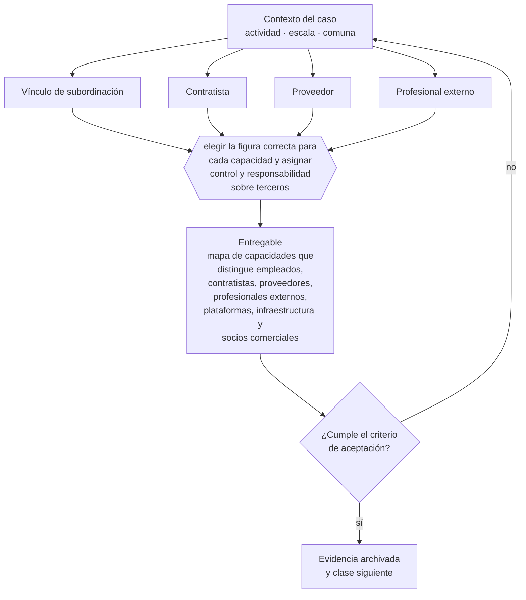

# Clase 155 — Cuándo contratar versus externalizar

> **Parte 12 · Personas, relaciones laborales y seguridad y salud** — clase 1 de 14

**Estado de evidencia:** `VERIFICADO-FUENTE` · **Jurisdicción:** Chile-first · **Fecha base normativa:** 07-08-2026 
**Decisión que habilita:** elegir la figura correcta para cada capacidad y asignar control y responsabilidad sobre terceros 
**Entregable:** mapa de capacidades que distingue empleados, contratistas, proveedores, profesionales externos, plataformas, infraestructura y socios comerciales

## 🎯 Propósito

Elegir la figura correcta según los hechos reales de la relación, porque la calificación no depende del nombre que se le ponga al contrato.

## 📚 Resultados de aprendizaje

Al finalizar esta clase podrás:

1. **Definir** con precisión los cuatro conceptos de la tabla siguiente y usarlos para describir un caso real.
2. **Explicar** por qué esta materia condiciona decisiones de otras partes del programa.
3. **Decidir** —elegir la figura correcta para cada capacidad y asignar control y responsabilidad sobre terceros— y justificar la decisión por escrito.
4. **Producir** el entregable de la clase y contrastarlo contra su criterio de aceptación.
5. **Distinguir** el dato estable del dato dinámico que exige revalidación en la fuente oficial.

## 🧩 Conceptos centrales

| Concepto | Comprensión verificable |
|---|---|
| **Vínculo de subordinación** | Dependencia que define la existencia de relación laboral. |
| **Contratista** | Persona o entidad independiente contratada para un resultado o capacidad delimitada. |
| **Proveedor** | Organización que suministra un producto o servicio bajo un contrato y nivel de servicio. |
| **Profesional externo** | Especialista independiente que aporta juicio sujeto a habilitación, ética o responsabilidad profesional. |

## 🗺️ Flujo de razonamiento

## 📖 Desarrollo

### 1. El fondo del asunto

La calificación de la relación no depende del nombre del contrato sino de los hechos: horario, supervisión, exclusividad, herramientas y continuidad. Además, una empresa con pocos empleados puede coordinar contratistas, proveedores, profesionales externos, plataformas tecnológicas, infraestructura y socios comerciales. Externalizar la ejecución no elimina la obligación de seleccionar, contratar, supervisar, auditar y reemplazar al tercero ni transfiere automáticamente la responsabilidad frente al cliente o al regulador.

### 2. Cómo se traduce en la práctica

Horario, supervisión, exclusividad, herramientas y continuidad son los indicadores que un tribunal evaluará. Un contrato a honorarios con subordinación se reclasifica como laboral, con cobro retroactivo de cotizaciones, indemnizaciones y multas, y ese pasivo aparece completo en la due diligence de la parte 22.

### 3. Marco aplicable y quién interviene

- Código del Trabajo
- Ley 21.561 de reducción gradual de jornada: 42 horas semanales desde el 26 de abril de 2026
- Ley 21.643 (Ley Karin) sobre acoso laboral, sexual y violencia en el trabajo
- Ley 16.744 sobre accidentes del trabajo y enfermedades profesionales y DS 44 de gestión preventiva
- Ley 20.123 sobre subcontratación y servicios transitorios

**Autoridades o contrapartes involucradas:** Dirección del Trabajo, SUSESO, Mutualidades, Previred, IPS.
**Profesionales de apoyo:** abogado laboral, encargado de personas, prevencionista de riesgos, contador de remuneraciones. La participación concreta depende del riesgo, del
tamaño de la empresa y de la actividad económica.

## 🔬 Caso aplicado: MEDVi

[MEDVi: empresa AI-native, red externa y control al crecer](../../../case-studies/21-medvi-empresa-ai-native-y-control.md#3-la-organización-real-no-son-solo-dos-personas)

**Lente para esta clase:** reconstruir la organización extendida y diferenciar empleados, contratistas, proveedores, profesionales externos, plataformas, infraestructura y socios comerciales.

El expediente separa hechos verificados, cifras reportadas, alegaciones periodísticas,
actuaciones regulatorias, respuesta de la empresa e interpretación pedagógica. No uses una
categoría como prueba automática de otra.

## 🧪 Taller guiado

Aplica esta clase a **una** de las siguientes líneas de negocio y repite después el ejercicio con
una segunda línea de carga regulatoria distinta:

| Línea | Carga regulatoria |
|---|---|
| SaaS B2B con IA | media |
| Servicios profesionales | baja |
| E-commerce D2C | media |
| Alimentos o foodtech | alta |
| Exportación de servicios | media |
| Fintech regulada | alta |
| Construcción o servicios técnicos | alta |

**Secuencia de trabajo:**

1. Delimita el contexto: actividad económica, escala, comuna y etapa de la empresa.
2. Reúne los antecedentes que la decisión exige y anota la fecha de cada fuente.
3. Identifica las alternativas reales, incluida la de no hacer nada.
4. Evalúa el impacto en mercado, caja, personas, regulación y operación.
5. Toma la decisión y regístrala con sus supuestos.
6. Produce el entregable.
7. Contrástalo contra el criterio de aceptación.
8. Anota lo que requiere validación profesional y programa su revisión.

### 📦 Entregable

Mapa de capacidades que distingue empleados, contratistas, proveedores, profesionales externos, plataformas, infraestructura y socios comerciales.

Debe incluir decisión, supuestos, fuentes con fecha de consulta, responsable, riesgos
identificados y próximos pasos.

## 🏆 Reto verificable

Resuelve la misma materia para una segunda línea de negocio con distinta carga regulatoria y
explica por escrito **qué cambió, por qué y qué fuente lo determina**.

## ✅ Criterio de aceptación

- [ ] cada capacidad está clasificada por figura real y no por la etiqueta comercial del contrato
- [ ] cada tercero crítico tiene dueño interno, obligaciones verificables, monitoreo y alternativa de continuidad
- [ ] cada afirmación regulatoria está referida a una fuente oficial con fecha de consulta;
- [ ] los datos dinámicos quedan marcados para revalidación;
- [ ] hay un responsable asignado y evidencia reproducible del trabajo.

## ⚠️ Errores frecuentes

**Propios de esta clase:**

- Usar pocos empleados como sinónimo de que dos personas ejecutan toda la cadena de valor.
- Externalizar una función crítica sin dueño interno, evidencia, sla, auditoría ni plan de salida.

**Característicos de la parte 12:**

- Contratar a honorarios a alguien que en los hechos es trabajador dependiente.
- No adecuar jornada y turnos al calendario de reducción legal.

## 🇨🇱 Checklist Chile

- [ ] ¿existe norma o autoridad específica para esta materia?
- [ ] ¿la fuente consultada está vigente a la fecha de ejecución?
- [ ] ¿se activa algún trámite ante el SII?
- [ ] ¿se activa algún requisito municipal o sectorial?
- [ ] ¿afecta a consumidores o al tratamiento de datos personales?
- [ ] ¿afecta a trabajadores o a la seguridad y salud en el trabajo?
- [ ] ¿afecta a impuestos, contabilidad o caja?
- [ ] ¿afecta a contratos o a propiedad intelectual?
- [ ] ¿requiere renovación, reporte periódico o revalidación?

## ❓ Preguntas de comprobación

1. ¿La persona cumple horario, recibe instrucciones y usa tus herramientas?
2. ¿Cuánto costaría una reclasificación retroactiva de las relaciones que tienes hoy?
3. ¿Qué función externalizaste sin controlar el cumplimiento del proveedor?

## 🔗 Fuentes oficiales

**Dirección del Trabajo — Relaciones laborales y obligaciones del empleador**  
<https://www.dt.gob.cl/> · verificado 2026-09-01

- *Qué contiene:* Concentra el Código del Trabajo aplicado: dictámenes que interpretan la norma en casos concretos, la plataforma Mi DT para registrar contratos y finiquitos, y las guías de fiscalización.
- *Cómo leerla:* Los dictámenes valen más que las guías divulgativas: describen cómo la autoridad resolvió un caso real. Busca por materia y contrasta la fecha, porque un dictamen posterior puede cambiar el criterio anterior.
- *Uso en esta clase:* aporta el marco de «Relaciones laborales y obligaciones del empleador» para elegir la figura correcta para cada capacidad y asignar control y responsabilidad sobre terceros.

**Biblioteca del Congreso Nacional · LeyChile — Normativa oficial consolidada**  
<https://www.bcn.cl/leychile/> · verificado 2026-09-01

- *Qué contiene:* Publica el texto oficial y consolidado de leyes, decretos y reglamentos, con la versión vigente a una fecha, el historial de modificaciones y la tramitación que las originó.
- *Cómo leerla:* Usa siempre el selector de versión vigente a la fecha en que ejecutarás el trámite, no la última publicada. Y lee el artículo transitorio: en normas en implantación gradual —jornada, datos personales— ahí está la fecha que realmente te aplica.
- *Uso en esta clase:* aporta el marco de «Normativa oficial consolidada» para elegir la figura correcta para cada capacidad y asignar control y responsabilidad sobre terceros.

**The New York Times · republicado por GV Wire — A $1.8 Billion Company With Two Employees? AI Made It Possible**  
<https://gvwire.com/2026/04/05/a-1-8-billion-company-with-two-employees-ai-made-it-possible/> · verificado 2026-10-04

- *Qué contiene:* Perfil empresarial que declara acceso del New York Times a estados financieros y contrapartes, y documenta capital inicial, tiempo de construcción, ventas, margen, herramientas de IA, contratistas y proveedores externos.
- *Cómo leerla:* Distingue cifras verificadas por el medio, afirmaciones del fundador y proyecciones. La meta de US$1.800 millones es una proyección de ventas, no valoración; dos empleados no significa dos ejecutores de toda la cadena.
- *Uso en esta clase:* aporta el marco de «A $1.8 Billion Company With Two Employees? AI Made It Possible» para elegir la figura correcta para cada capacidad y asignar control y responsabilidad sobre terceros.

**MEDVi · versión corporativa — MEDVi statement in response to external speculation**  
<https://home.medvi.org/communication> · verificado 2026-10-04

- *Qué contiene:* Declaración corporativa del 8 de abril de 2026 sobre la carta FDA, un supuesto sitio de afiliado, publicidad con posibles médicos generados por IA, correcciones y estructura de proveedores clínicos y farmacias.
- *Cómo leerla:* Trátala como la versión de MEDVi, no como verificación independiente. Contrasta cada afirmación con el destinatario y contenido de la carta FDA, archivos del sitio, contratos, responsables y evidencia de las medidas correctivas.
- *Uso en esta clase:* aporta el marco de «MEDVi statement in response to external speculation» para elegir la figura correcta para cada capacidad y asignar control y responsabilidad sobre terceros.

**U.S. Food and Drug Administration — MEDVi, LLC dba MEDVi: Warning Letter MARCS-CMS 721455**  
<https://www.fda.gov/inspections-compliance-enforcement-and-criminal-investigations/warning-letters/medvi-llc-dba-medvi-721455-02202026> · verificado 2026-10-04

- *Qué contiene:* Carta de advertencia fechada el 20 de febrero de 2026, dirigida a MEDVi, LLC dba MEDVi, sobre claims y rotulado observados por FDA en medvi.io durante diciembre de 2025.
- *Cómo leerla:* Distingue lo que FDA observó y calificó como misbranding de cualquier conclusión penal o de falsificación. Registra destinatario, dominio, claims, normas citadas, plazo de respuesta y medidas advertidas sin ampliar su alcance.
- *Uso en esta clase:* aporta el marco de «MEDVi, LLC dba MEDVi: Warning Letter MARCS-CMS 721455» para elegir la figura correcta para cada capacidad y asignar control y responsabilidad sobre terceros.

Complementos del repositorio: [glosario](../../../docs/19_GLOSSARY.md) ·
[ruta de lecturas](../../../docs/15_BOOKS_AND_LEARNING_PATH.md) ·
[catálogo de fuentes](../../../docs/16_OFFICIAL_SOURCE_CATALOG.md).

> [!IMPORTANT]
> Material educativo. Para una decisión real de alto impacto hay que verificar la fuente oficial
> vigente y validar con el profesional competente.

---

| Anterior | Índice | Siguiente |
|---|---|---|
| **Inicio de la parte** | [Parte 12](../README.md) · [Programa](../../../README.md) | [156 · Contrato de trabajo y cláusulas esenciales →](../class-02-contrato-de-trabajo-y-clausulas-esenciales/README.md) |
