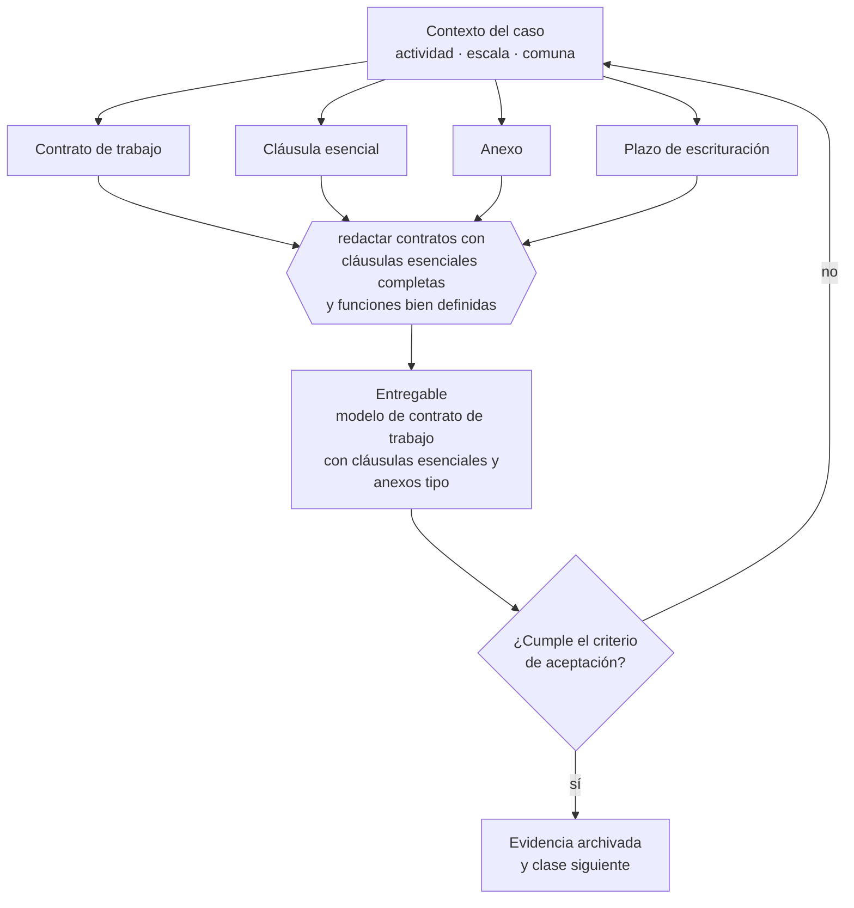

# Clase 156 — Contrato de trabajo y cláusulas esenciales

> **Parte 12 · Personas, relaciones laborales y seguridad y salud** — clase 2 de 14

**Estado de evidencia:** `VERIFICADO-FUENTE` · **Jurisdicción:** Chile-first · **Fecha base normativa:** 07-08-2026 
**Decisión que habilita:** redactar contratos con cláusulas esenciales completas y funciones bien definidas 
**Entregable:** modelo de contrato de trabajo con cláusulas esenciales y anexos tipo

## 🎯 Propósito

Redactar contratos con todas las cláusulas esenciales y funciones descritas con precisión operativa, dentro del plazo legal de escrituración.

## 📚 Resultados de aprendizaje

Al finalizar esta clase podrás:

1. **Definir** con precisión los cuatro conceptos de la tabla siguiente y usarlos para describir un caso real.
2. **Explicar** por qué esta materia condiciona decisiones de otras partes del programa.
3. **Decidir** —redactar contratos con cláusulas esenciales completas y funciones bien definidas— y justificar la decisión por escrito.
4. **Producir** el entregable de la clase y contrastarlo contra su criterio de aceptación.
5. **Distinguir** el dato estable del dato dinámico que exige revalidación en la fuente oficial.

## 🧩 Conceptos centrales

| Concepto | Comprensión verificable |
|---|---|
| **Contrato de trabajo** | Acuerdo escrito con las cláusulas mínimas del código del trabajo. |
| **Cláusula esencial** | Estipulación obligatoria: partes, funciones, lugar, remuneración, jornada, plazo. |
| **Anexo** | Documento que modifica o complementa el contrato. |
| **Plazo de escrituración** | Tiempo legal para poner el contrato por escrito. |

## 🗺️ Flujo de razonamiento

## 📖 Desarrollo

### 1. El fondo del asunto

El contrato debe escriturarse dentro del plazo legal y contener las cláusulas mínimas. La ausencia de escrituración hace presumir como estipulaciones las declaradas por el trabajador. Las funciones deben describirse con precisión suficiente para permitir la polifuncionalidad sin caer en indeterminación.

### 2. Cómo se traduce en la práctica

La falta de escrituración hace presumir como estipulaciones las que declara el trabajador, lo que traslada la carga probatoria completa al empleador. Y describir las funciones de forma vaga impide exigir cumplimiento después: la polifuncionalidad se pacta con precisión, no con ambigüedad.

### 3. Marco aplicable y quién interviene

- Código del Trabajo
- Ley 21.561 de reducción gradual de jornada: 42 horas semanales desde el 26 de abril de 2026
- Ley 21.643 (Ley Karin) sobre acoso laboral, sexual y violencia en el trabajo
- Ley 16.744 sobre accidentes del trabajo y enfermedades profesionales y DS 44 de gestión preventiva
- Ley 20.123 sobre subcontratación y servicios transitorios

**Autoridades o contrapartes involucradas:** Dirección del Trabajo, SUSESO, Mutualidades, Previred, IPS.
**Profesionales de apoyo:** abogado laboral, encargado de personas, prevencionista de riesgos, contador de remuneraciones. La participación concreta depende del riesgo, del
tamaño de la empresa y de la actividad económica.

## 🧪 Taller guiado

Aplica esta clase a **una** de las siguientes líneas de negocio y repite después el ejercicio con
una segunda línea de carga regulatoria distinta:

| Línea | Carga regulatoria |
|---|---|
| SaaS B2B con IA | media |
| Servicios profesionales | baja |
| E-commerce D2C | media |
| Alimentos o foodtech | alta |
| Exportación de servicios | media |
| Fintech regulada | alta |
| Construcción o servicios técnicos | alta |

**Secuencia de trabajo:**

1. Delimita el contexto: actividad económica, escala, comuna y etapa de la empresa.
2. Reúne los antecedentes que la decisión exige y anota la fecha de cada fuente.
3. Identifica las alternativas reales, incluida la de no hacer nada.
4. Evalúa el impacto en mercado, caja, personas, regulación y operación.
5. Toma la decisión y regístrala con sus supuestos.
6. Produce el entregable.
7. Contrástalo contra el criterio de aceptación.
8. Anota lo que requiere validación profesional y programa su revisión.

### 📦 Entregable

Modelo de contrato de trabajo con cláusulas esenciales y anexos tipo.

Debe incluir decisión, supuestos, fuentes con fecha de consulta, responsable, riesgos
identificados y próximos pasos.

## 🏆 Reto verificable

Resuelve la misma materia para una segunda línea de negocio con distinta carga regulatoria y
explica por escrito **qué cambió, por qué y qué fuente lo determina**.

## ✅ Criterio de aceptación

- [ ] el contrato contiene todas las cláusulas esenciales
- [ ] las funciones están descritas con precisión operativa
- [ ] cada afirmación regulatoria está referida a una fuente oficial con fecha de consulta;
- [ ] los datos dinámicos quedan marcados para revalidación;
- [ ] hay un responsable asignado y evidencia reproducible del trabajo.

## ⚠️ Errores frecuentes

**Propios de esta clase:**

- No escriturar dentro del plazo legal y quedar sujeto a la presunción.
- Describir las funciones de forma tan vaga que impide exigir cumplimiento.

**Característicos de la parte 12:**

- Contratar a honorarios a alguien que en los hechos es trabajador dependiente.
- No adecuar jornada y turnos al calendario de reducción legal.

## 🇨🇱 Checklist Chile

- [ ] ¿existe norma o autoridad específica para esta materia?
- [ ] ¿la fuente consultada está vigente a la fecha de ejecución?
- [ ] ¿se activa algún trámite ante el SII?
- [ ] ¿se activa algún requisito municipal o sectorial?
- [ ] ¿afecta a consumidores o al tratamiento de datos personales?
- [ ] ¿afecta a trabajadores o a la seguridad y salud en el trabajo?
- [ ] ¿afecta a impuestos, contabilidad o caja?
- [ ] ¿afecta a contratos o a propiedad intelectual?
- [ ] ¿requiere renovación, reporte periódico o revalidación?

## ❓ Preguntas de comprobación

1. ¿Escrituras los contratos dentro del plazo legal y con qué evidencia lo acreditas?
2. ¿Las funciones descritas permiten exigir lo que realmente esperas del cargo?
3. ¿Qué anexos modificaron el contrato y están firmados y archivados?

## 🔗 Fuentes oficiales

**Dirección del Trabajo — Relaciones laborales y obligaciones del empleador**  
<https://www.dt.gob.cl/> · verificado 2026-08-07

- *Qué contiene:* Concentra el Código del Trabajo aplicado: dictámenes que interpretan la norma en casos concretos, la plataforma Mi DT para registrar contratos y finiquitos, y las guías de fiscalización.
- *Cómo leerla:* Los dictámenes valen más que las guías divulgativas: describen cómo la autoridad resolvió un caso real. Busca por materia y contrasta la fecha, porque un dictamen posterior puede cambiar el criterio anterior.

**Biblioteca del Congreso Nacional · LeyChile — Normativa oficial consolidada**  
<https://www.bcn.cl/leychile/> · verificado 2026-08-07

- *Qué contiene:* Publica el texto oficial y consolidado de leyes, decretos y reglamentos, con la versión vigente a una fecha, el historial de modificaciones y la tramitación que las originó.
- *Cómo leerla:* Usa siempre el selector de versión vigente a la fecha en que ejecutarás el trámite, no la última publicada. Y lee el artículo transitorio: en normas en implantación gradual —jornada, datos personales— ahí está la fecha que realmente te aplica.

Complementos del repositorio: [glosario](../../../docs/19_GLOSSARY.md) ·
[ruta de lecturas](../../../docs/15_BOOKS_AND_LEARNING_PATH.md) ·
[catálogo de fuentes](../../../docs/16_OFFICIAL_SOURCE_CATALOG.md).

> [!IMPORTANT]
> Material educativo. Para una decisión real de alto impacto hay que verificar la fuente oficial
> vigente y validar con el profesional competente.

---

| Anterior | Índice | Siguiente |
|---|---|---|
| [← 155 · Cuándo contratar versus externalizar](../class-01-cuando-contratar-versus-externalizar/README.md) | [Parte 12](../README.md) · [Programa](../../../README.md) | [157 · Registro y gestión en Mi DT →](../class-03-registro-y-gestion-en-mi-dt/README.md) |
