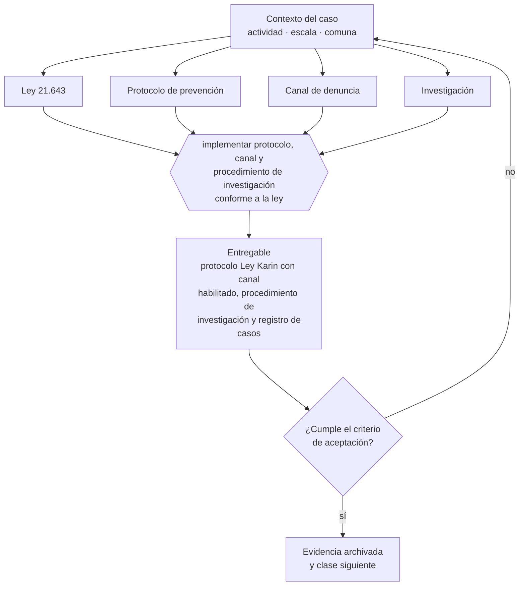

# Clase 164 — Ley Karin: prevención, denuncia e investigación

> **Parte 12 · Personas, relaciones laborales y seguridad y salud** — clase 10 de 14

**Estado de evidencia:** `VERIFICADO-FUENTE` · **Jurisdicción:** Chile-first · **Fecha base normativa:** 07-08-2026 
**Decisión que habilita:** implementar protocolo, canal y procedimiento de investigación conforme a la ley 
**Entregable:** protocolo Ley Karin con canal habilitado, procedimiento de investigación y registro de casos

## 🎯 Propósito

Implementar protocolo, canal de denuncia y procedimiento de investigación conforme a la Ley 21.643, que obliga a toda empresa con trabajadores.

## 📚 Resultados de aprendizaje

Al finalizar esta clase podrás:

1. **Definir** con precisión los cuatro conceptos de la tabla siguiente y usarlos para describir un caso real.
2. **Explicar** por qué esta materia condiciona decisiones de otras partes del programa.
3. **Decidir** —implementar protocolo, canal y procedimiento de investigación conforme a la ley— y justificar la decisión por escrito.
4. **Producir** el entregable de la clase y contrastarlo contra su criterio de aceptación.
5. **Distinguir** el dato estable del dato dinámico que exige revalidación en la fuente oficial.

## 🧩 Conceptos centrales

| Concepto | Comprensión verificable |
|---|---|
| **Ley 21.643** | Ley karin, sobre acoso laboral, sexual y violencia en el trabajo. |
| **Protocolo de prevención** | Documento obligatorio con medidas preventivas. |
| **Canal de denuncia** | Medio confidencial para reportar. |
| **Investigación** | Procedimiento reglado con plazos y debido proceso. |

## 🗺️ Flujo de razonamiento

## 📖 Desarrollo

### 1. El fondo del asunto

La Ley Karin obliga a todas las empresas con trabajadores a tener protocolo de prevención, canal de denuncia y procedimiento de investigación con plazos. La investigación puede ser interna o derivarse a la Dirección del Trabajo, y el incumplimiento del procedimiento genera responsabilidad aunque el hecho denunciado no se acredite.

### 2. Cómo se traduce en la práctica

El incumplimiento del procedimiento genera responsabilidad aunque el hecho denunciado no se acredite, porque lo que se exige es el debido proceso con plazos. Tener el protocolo sin canal operativo ni personas capacitadas para investigar es el escenario más común y el que peor resultado produce.

### 3. Marco aplicable y quién interviene

- Código del Trabajo
- Ley 21.561 de reducción gradual de jornada: 42 horas semanales desde el 26 de abril de 2026
- Ley 21.643 (Ley Karin) sobre acoso laboral, sexual y violencia en el trabajo
- Ley 16.744 sobre accidentes del trabajo y enfermedades profesionales y DS 44 de gestión preventiva
- Ley 20.123 sobre subcontratación y servicios transitorios

**Autoridades o contrapartes involucradas:** Dirección del Trabajo, SUSESO, Mutualidades, Previred, IPS.
**Profesionales de apoyo:** abogado laboral, encargado de personas, prevencionista de riesgos, contador de remuneraciones. La participación concreta depende del riesgo, del
tamaño de la empresa y de la actividad económica.

## 🧪 Taller guiado

Aplica esta clase a **una** de las siguientes líneas de negocio y repite después el ejercicio con
una segunda línea de carga regulatoria distinta:

| Línea | Carga regulatoria |
|---|---|
| SaaS B2B con IA | media |
| Servicios profesionales | baja |
| E-commerce D2C | media |
| Alimentos o foodtech | alta |
| Exportación de servicios | media |
| Fintech regulada | alta |
| Construcción o servicios técnicos | alta |

**Secuencia de trabajo:**

1. Delimita el contexto: actividad económica, escala, comuna y etapa de la empresa.
2. Reúne los antecedentes que la decisión exige y anota la fecha de cada fuente.
3. Identifica las alternativas reales, incluida la de no hacer nada.
4. Evalúa el impacto en mercado, caja, personas, regulación y operación.
5. Toma la decisión y regístrala con sus supuestos.
6. Produce el entregable.
7. Contrástalo contra el criterio de aceptación.
8. Anota lo que requiere validación profesional y programa su revisión.

### 📦 Entregable

Protocolo ley karin con canal habilitado, procedimiento de investigación y registro de casos.

Debe incluir decisión, supuestos, fuentes con fecha de consulta, responsable, riesgos
identificados y próximos pasos.

## 🏆 Reto verificable

Resuelve la misma materia para una segunda línea de negocio con distinta carga regulatoria y
explica por escrito **qué cambió, por qué y qué fuente lo determina**.

## ✅ Criterio de aceptación

- [ ] el protocolo, el canal y el procedimiento están implementados
- [ ] hay personas designadas y capacitadas para investigar
- [ ] cada afirmación regulatoria está referida a una fuente oficial con fecha de consulta;
- [ ] los datos dinámicos quedan marcados para revalidación;
- [ ] hay un responsable asignado y evidencia reproducible del trabajo.

## ⚠️ Errores frecuentes

**Propios de esta clase:**

- Tener el protocolo sin canal operativo ni personas capacitadas para investigar.
- Investigar sin respetar plazos y garantías del debido proceso.

**Característicos de la parte 12:**

- Contratar a honorarios a alguien que en los hechos es trabajador dependiente.
- No adecuar jornada y turnos al calendario de reducción legal.

## 🇨🇱 Checklist Chile

- [ ] ¿existe norma o autoridad específica para esta materia?
- [ ] ¿la fuente consultada está vigente a la fecha de ejecución?
- [ ] ¿se activa algún trámite ante el SII?
- [ ] ¿se activa algún requisito municipal o sectorial?
- [ ] ¿afecta a consumidores o al tratamiento de datos personales?
- [ ] ¿afecta a trabajadores o a la seguridad y salud en el trabajo?
- [ ] ¿afecta a impuestos, contabilidad o caja?
- [ ] ¿afecta a contratos o a propiedad intelectual?
- [ ] ¿requiere renovación, reporte periódico o revalidación?

## ❓ Preguntas de comprobación

1. ¿Tienes protocolo, canal operativo y personas designadas y capacitadas para investigar?
2. ¿A quién llega una denuncia y qué pasa si involucra a esa misma persona?
3. ¿Podrías cumplir los plazos de investigación con los recursos actuales?

## 🔗 Fuentes oficiales

**Dirección del Trabajo — Relaciones laborales y obligaciones del empleador**  
<https://www.dt.gob.cl/> · verificado 2026-08-07

- *Qué contiene:* Concentra el Código del Trabajo aplicado: dictámenes que interpretan la norma en casos concretos, la plataforma Mi DT para registrar contratos y finiquitos, y las guías de fiscalización.
- *Cómo leerla:* Los dictámenes valen más que las guías divulgativas: describen cómo la autoridad resolvió un caso real. Busca por materia y contrasta la fecha, porque un dictamen posterior puede cambiar el criterio anterior.

**Biblioteca del Congreso Nacional · LeyChile — Normativa oficial consolidada**  
<https://www.bcn.cl/leychile/> · verificado 2026-08-07

- *Qué contiene:* Publica el texto oficial y consolidado de leyes, decretos y reglamentos, con la versión vigente a una fecha, el historial de modificaciones y la tramitación que las originó.
- *Cómo leerla:* Usa siempre el selector de versión vigente a la fecha en que ejecutarás el trámite, no la última publicada. Y lee el artículo transitorio: en normas en implantación gradual —jornada, datos personales— ahí está la fecha que realmente te aplica.

Complementos del repositorio: [glosario](../../../docs/19_GLOSSARY.md) ·
[ruta de lecturas](../../../docs/15_BOOKS_AND_LEARNING_PATH.md) ·
[catálogo de fuentes](../../../docs/16_OFFICIAL_SOURCE_CATALOG.md).

> [!IMPORTANT]
> Material educativo. Para una decisión real de alto impacto hay que verificar la fuente oficial
> vigente y validar con el profesional competente.

---

| Anterior | Índice | Siguiente |
|---|---|---|
| [← 163 · Reglamento interno y políticas](../class-09-reglamento-interno-y-politicas/README.md) | [Parte 12](../README.md) · [Programa](../../../README.md) | [165 · Subcontratación y servicios transitorios →](../class-11-subcontratacion-y-servicios-transitorios/README.md) |
