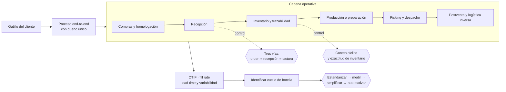

# Parte 13 — Operaciones, compras, inventario y calidad

> *Los procesos fallan en los traspasos, no en las actividades*

🔴 **Etapa 5 — Operar, vender y crecer** · salida de la etapa: Empresa habilitada, operando y creciendo con control

**Estado de evidencia:** `GUIA-PRACTICA` · **Clases:** 14 (169–182) · **Fecha base normativa:** 07-08-2026 
**Contenido central:** Procesos end-to-end, SOP, homologación, tres vías, inventario, calidad, cuello de botella y mejora 
**Conceptos definidos en esta parte:** 56

## 🎯 De qué trata esta parte

La operación es donde la promesa comercial se cumple o se rompe, y el punto de falla casi nunca está dentro de una actividad sino en el traspaso entre dos áreas. Por eso el mapeo de esta parte es end-to-end, desde el gatillo hasta el resultado que el cliente percibe, con un dueño único para todo el flujo y no un responsable por tramo.

El control más rentable de la parte es también el más simple: la conciliación de tres vías entre orden de compra, recepción y factura. Sin ella se pagan cantidades no recibidas, precios distintos a los pactados y servicios no prestados, y el descuadre aparece meses después sin posibilidad de reconstruirlo. Junto con los conteos cíclicos de inventario, forma la base del control interno operativo de cualquier pyme.

La parte incorpora dos ideas que ordenan las decisiones de capacidad. La primera: mejorar un recurso que no es el cuello de botella no aumenta la capacidad del sistema, solo acumula inventario en proceso. La segunda: automatizar un proceso inestable multiplica los errores; el orden correcto es estandarizar, medir, simplificar y solo entonces automatizar.

## 📚 Resultados de la parte

Al terminar esta parte podrás:

1. **Documentar procesos end-to-end con dueño, entrada, salida y control**.
2. **Homologar proveedores y controlar recepción contra orden de compra**.
3. **Mantener inventario confiable con trazabilidad y conteos cíclicos**.
4. **Medir OTIF, fill rate y lead time y actuar sobre el cuello de botella**.

## 🗺️ Mapa de la parte

## ⚖️ Marco aplicable

- ISO 9001 como referencia de sistema de gestión de calidad
- teoría de restricciones para capacidad y cuellos de botella
- trazabilidad de lote exigida en rubros regulados (alimentos, salud, químicos)

**Autoridades o contrapartes:** SEREMI de Salud en rubros con trazabilidad sanitaria, SERNAC en garantía y postventa.
**Profesionales de apoyo:** jefe de operaciones, comprador, encargado de calidad, prevencionista.

## ⚠️ Riesgos característicos

- Inventario teórico que no coincide con el físico y destruye la promesa de entrega.
- Proveedor crítico único sin plan alternativo.
- Recibir mercadería sin control contra orden de compra y pagar diferencias.
- Medir productividad sin medir calidad y trasladar el costo al cliente.

## 📘 Las 14 clases

| # | Global | Clase | Decisión que habilita |
|---:|---:|---|---|
| 01 | 169 | [Diseño de procesos end-to-end](class-01-diseno-de-procesos-end-to-end/README.md) | definir los procesos críticos, su dueño y sus puntos de traspaso |
| 02 | 170 | [SOP y controles operacionales](class-02-sop-y-controles-operacionales/README.md) | documentar los procedimientos críticos con controles incorporados |
| 03 | 171 | [Compras y homologación de proveedores](class-03-compras-y-homologacion-de-proveedores/README.md) | definir el proceso de homologación y qué insumos exigen segunda fuente |
| 04 | 172 | [Órdenes de compra y recepción](class-04-ordenes-de-compra-y-recepcion/README.md) | implementar el control de tres vías antes de autorizar cualquier pago |
| 05 | 173 | [Inventario, conteos y trazabilidad](class-05-inventario-conteos-y-trazabilidad/README.md) | definir la política de conteos y el nivel de trazabilidad exigido por el rubro |
| 06 | 174 | [Bodega, picking y despacho](class-06-bodega-picking-y-despacho/README.md) | diseñar el layout y los controles de preparación y despacho |
| 07 | 175 | [Logística directa e inversa](class-07-logistica-directa-e-inversa/README.md) | diseñar el flujo de devoluciones y su costo antes de prometer políticas de cambio |
| 08 | 176 | [Gestión de calidad y no conformidades](class-08-gestion-de-calidad-y-no-conformidades/README.md) | definir cómo se registran y se cierran las no conformidades |
| 09 | 177 | [Capacidad y cuellos de botella](class-09-capacidad-y-cuellos-de-botella/README.md) | identificar la restricción real del sistema antes de invertir en capacidad |
| 10 | 178 | [Make or buy](class-10-make-or-buy/README.md) | decidir qué se produce internamente y qué se compra, con criterio total |
| 11 | 179 | [Continuidad de proveedores críticos](class-11-continuidad-de-proveedores-criticos/README.md) | definir cómo se cubre la falla de cada proveedor crítico |
| 12 | 180 | [Mantenimiento y activos operativos](class-12-mantenimiento-y-activos-operativos/README.md) | priorizar el mantenimiento según criticidad y costo de la falla |
| 13 | 181 | [Indicadores OTIF, fill rate y lead time](class-13-indicadores-otif-fill-rate-y-lead-time/README.md) | definir los indicadores de servicio y su método de cálculo |
| 14 | 182 | [Mejora continua y automatización](class-14-mejora-continua-y-automatizacion/README.md) | seleccionar qué procesos se automatizan y en qué orden |

## 🔤 Glosario de la parte

| Concepto | Definición operacional |
|---|---|
| **Acción correctiva** | Medida que ataca la causa raíz. |
| **Acción inmediata** | Contención del efecto mientras se investiga. |
| **Automatización** | Ejecución de una tarea sin intervención humana. |
| **Capacidad** | Volumen máximo que el sistema puede producir en un período. |
| **Competencia núcleo** | Capacidad que sostiene la diferenciación. |
| **Conteo cíclico** | Recuento parcial y periódico por categoría. |
| **Control operacional** | Verificación incorporada en el proceso. |
| **Costo de la devolución** | Transporte, revisión, reacondicionamiento y pérdida de valor. |
| **Costo de la mala calidad** | Retrabajo, devoluciones, garantías y pérdida de clientes. |
| **Costo total de propiedad** | Costo completo incluyendo gestión, riesgo y capacidad ociosa. |
| **Criterio de evaluación** | Atributos con los que se compara: precio, calidad, plazo, riesgo. |
| **Criticidad del activo** | Impacto de su falla sobre la operación. |
| **Cuello de botella** | Recurso que limita la capacidad de todo el sistema. |
| **Dependencia creada** | Riesgo de quedar atado al proveedor elegido. |
| **Deuda de automatización** | Fragilidad acumulada por automatizar sin estandarizar. |
| **Diferencia de recepción** | Discrepancia en cantidad, calidad o precio. |
| **Disponibilidad** | Porcentaje del tiempo en que el activo está operativo. |
| **Dueño de proceso** | Responsable único de su desempeño. |
| **Evaluación periódica** | Revisión del desempeño del proveedor en el tiempo. |
| **Exactitud de inventario** | Porcentaje de coincidencia entre registro y físico. |
| **Fill rate** | Porcentaje del pedido atendido en la primera entrega. |
| **Handoff** | Punto de traspaso entre áreas donde se pierde información. |
| **Homologación** | Proceso de aprobación previa de un proveedor. |
| **Homologación de alternativa** | Proveedor sustituto ya aprobado. |
| **Layout de bodega** | Disposición física que determina la eficiencia del picking. |
| **Lead time** | Tiempo desde el pedido hasta la entrega. |
| **Logística directa** | Flujo desde la empresa al cliente. |
| **Logística inversa** | Flujo de devoluciones, cambios y reparaciones. |
| **Lote y vencimiento** | Control obligatorio en rubros regulados. |
| **Make or buy** | Decisión de producir internamente o comprar. |
| **Mantenimiento correctivo** | Reparación después de la falla. |
| **Mantenimiento preventivo** | Intervención programada para evitar la falla. |
| **Mejora continua** | Ciclo sistemático de detección y corrección. |
| **No conformidad** | Desviación respecto de un requisito. |
| **Orden de compra** | Documento que formaliza el pedido con condiciones. |
| **OTIF** | Entregas completas y a tiempo sobre el total. |
| **Picking** | Selección de productos para preparar un pedido. |
| **Plan de contingencia** | Respuesta preparada ante su falla. |
| **Proceso candidato** | Actividad repetitiva, estable y de alto volumen. |
| **Proceso end-to-end** | Secuencia completa desde el gatillo hasta el resultado para el cliente. |
| **Proveedor alternativo** | Segunda fuente aprobada para el mismo insumo. |
| **Proveedor crítico** | Aquel cuya interrupción detiene la operación. |
| **Punto de control** | Momento donde se detecta el error antes de que avance. |
| **Recepción** | Verificación de lo recibido contra lo pedido. |
| **SIPOC** | Mapa de proveedor, entrada, proceso, salida y cliente. |
| **SOP** | Procedimiento operativo estándar, escrito y ejecutable. |
| **Stock de seguridad** | Inventario que cubre el tiempo de reemplazo. |
| **Subordinación** | Alineación del resto del proceso al ritmo del cuello de botella. |
| **Trazabilidad** | Capacidad de seguir un lote desde origen hasta destino. |
| **Tres vías** | Conciliación entre orden, recepción y factura. |
| **Utilización** | Proporción de la capacidad efectivamente usada. |
| **Variabilidad** | Dispersión del lead time, que importa más que el promedio. |
| **Verificación de despacho** | Control previo a la salida. |
| **Versión vigente** | Edición actual del procedimiento, con fecha y responsable. |
| **Zonificación** | Agrupación por rotación o compatibilidad. |
| **Última milla** | Tramo final de la entrega, el más caro por unidad. |

## 🔗 Cómo se conecta

Ejecuta lo que la parte 14 vende y depende de los contratos de la parte 10 con proveedores críticos. Sus indicadores alimentan el dashboard de la parte 09 y su estandarización es requisito de la replicación de la parte 20.

## 📖 Pauta bibliográfica

- Goldratt, E. — *The Goal*: teoría de restricciones y cuello de botella.
- ISO 9001 — sistema de gestión de calidad como referencia proporcional.
- Normativa de trazabilidad de lote aplicable al rubro (alimentos, salud, químicos).

## 🏛️ Fuentes oficiales de la parte

**ChileAtiende · Autoridad Sanitaria Regional — Autorización sanitaria de alimentos**  
<https://www.chileatiende.gob.cl/fichas/172-autorizacion-sanitaria-de-alimentos> · verificado 2026-08-07

- *Qué contiene:* Detalla qué establecimientos requieren autorización sanitaria, qué antecedentes se presentan, qué condiciones de planta física se exigen y cuál es la vigencia del permiso.
- *Cómo leerla:* Léela antes de firmar el arriendo, no después: las exigencias de planta física —separación de áreas, superficies lavables, agua potable— se resuelven en el diseño y se vuelven carísimas de corregir sobre un local ya construido.

**Servicio Nacional del Consumidor — Ley 19.496, comercio electrónico y garantía legal**  
<https://www.sernac.cl/> · verificado 2026-08-07

- *Qué contiene:* Publica la interpretación aplicada de la Ley del Consumidor: deberes de información en la oferta, reglas del comercio electrónico, garantía legal, contratos de adhesión y el procedimiento de reclamos.
- *Cómo leerla:* Entra por el rubro de tu negocio y revisa las alertas y procedimientos colectivos publicados: muestran qué está fiscalizando el servicio ahora, que es mejor predictor de tu riesgo que la lectura abstracta de la ley.

---

| Anterior | Índice | Siguiente |
|---|---|---|
| [← Parte 12 · Personas, relaciones laborales y seguridad y salud](../part-12-personas-relaciones-laborales-y-seguridad-y-salud/README.md) | [Currículo](../../CURRICULUM.md) · [Programa](../../README.md) | [Parte 14 · Ventas, marketing y experiencia de cliente →](../part-14-ventas-marketing-y-experiencia-de-cliente/README.md) |
