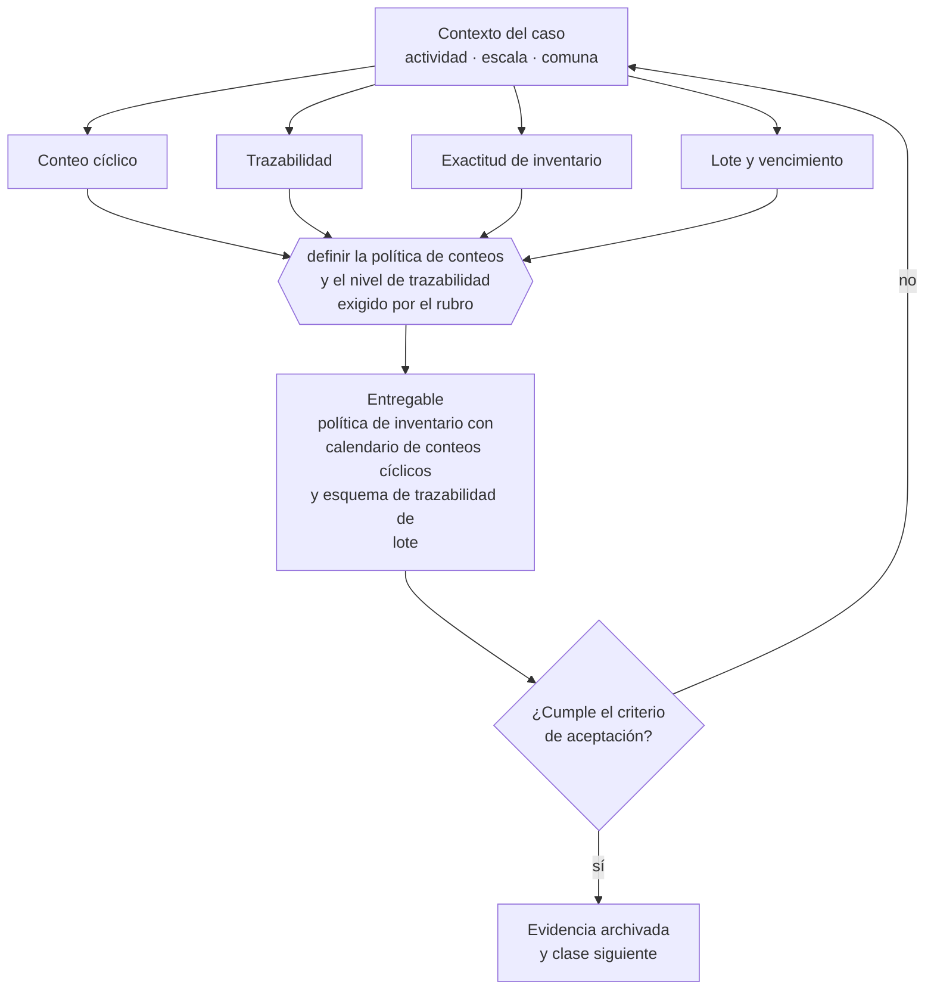

# Clase 173 — Inventario, conteos y trazabilidad

> **Parte 13 · Operaciones, compras, inventario y calidad** — clase 5 de 14

**Estado de evidencia:** `GUIA-PRACTICA` · **Jurisdicción:** Chile-first · **Fecha base normativa:** 07-08-2026 
**Decisión que habilita:** definir la política de conteos y el nivel de trazabilidad exigido por el rubro 
**Entregable:** política de inventario con calendario de conteos cíclicos y esquema de trazabilidad de lote

## 🎯 Propósito

Definir conteos cíclicos por categoría y el nivel de trazabilidad que el rubro exige, en vez de un único inventario anual.

## 📚 Resultados de aprendizaje

Al finalizar esta clase podrás:

1. **Definir** con precisión los cuatro conceptos de la tabla siguiente y usarlos para describir un caso real.
2. **Explicar** por qué esta materia condiciona decisiones de otras partes del programa.
3. **Decidir** —definir la política de conteos y el nivel de trazabilidad exigido por el rubro— y justificar la decisión por escrito.
4. **Producir** el entregable de la clase y contrastarlo contra su criterio de aceptación.
5. **Distinguir** el dato estable del dato dinámico que exige revalidación en la fuente oficial.

## 🧩 Conceptos centrales

| Concepto | Comprensión verificable |
|---|---|
| **Conteo cíclico** | Recuento parcial y periódico por categoría. |
| **Trazabilidad** | Capacidad de seguir un lote desde origen hasta destino. |
| **Exactitud de inventario** | Porcentaje de coincidencia entre registro y físico. |
| **Lote y vencimiento** | Control obligatorio en rubros regulados. |

## 🗺️ Flujo de razonamiento

## 📖 Desarrollo

### 1. El fondo del asunto

El conteo cíclico frecuente por categoría detecta problemas antes que el inventario anual completo, y no detiene la operación. En alimentos, medicamentos y químicos la trazabilidad de lote es obligatoria y debe permitir un retiro de producto en horas, no en días.

### 2. Cómo se traduce en la práctica

El conteo cíclico detecta problemas antes y no detiene la operación. En alimentos, medicamentos y químicos la trazabilidad de lote es obligatoria y debe permitir un retiro de producto en horas: si el sistema no lo permite, el incumplimiento se descubre exactamente cuando hay que ejecutar el retiro.

### 3. Marco aplicable y quién interviene

- ISO 9001 como referencia de sistema de gestión de calidad
- teoría de restricciones para capacidad y cuellos de botella
- trazabilidad de lote exigida en rubros regulados (alimentos, salud, químicos)

**Autoridades o contrapartes involucradas:** SEREMI de Salud en rubros con trazabilidad sanitaria, SERNAC en garantía y postventa.
**Profesionales de apoyo:** jefe de operaciones, comprador, encargado de calidad, prevencionista. La participación concreta depende del riesgo, del
tamaño de la empresa y de la actividad económica.

## 🧪 Taller guiado

Aplica esta clase a **una** de las siguientes líneas de negocio y repite después el ejercicio con
una segunda línea de carga regulatoria distinta:

| Línea | Carga regulatoria |
|---|---|
| SaaS B2B con IA | media |
| Servicios profesionales | baja |
| E-commerce D2C | media |
| Alimentos o foodtech | alta |
| Exportación de servicios | media |
| Fintech regulada | alta |
| Construcción o servicios técnicos | alta |

**Secuencia de trabajo:**

1. Delimita el contexto: actividad económica, escala, comuna y etapa de la empresa.
2. Reúne los antecedentes que la decisión exige y anota la fecha de cada fuente.
3. Identifica las alternativas reales, incluida la de no hacer nada.
4. Evalúa el impacto en mercado, caja, personas, regulación y operación.
5. Toma la decisión y regístrala con sus supuestos.
6. Produce el entregable.
7. Contrástalo contra el criterio de aceptación.
8. Anota lo que requiere validación profesional y programa su revisión.

### 📦 Entregable

Política de inventario con calendario de conteos cíclicos y esquema de trazabilidad de lote.

Debe incluir decisión, supuestos, fuentes con fecha de consulta, responsable, riesgos
identificados y próximos pasos.

## 🏆 Reto verificable

Resuelve la misma materia para una segunda línea de negocio con distinta carga regulatoria y
explica por escrito **qué cambió, por qué y qué fuente lo determina**.

## ✅ Criterio de aceptación

- [ ] existe calendario de conteos cíclicos por categoría
- [ ] la trazabilidad permite un retiro de producto en el plazo exigido
- [ ] cada afirmación regulatoria está referida a una fuente oficial con fecha de consulta;
- [ ] los datos dinámicos quedan marcados para revalidación;
- [ ] hay un responsable asignado y evidencia reproducible del trabajo.

## ⚠️ Errores frecuentes

**Propios de esta clase:**

- Hacer un solo inventario anual y descubrir diferencias imposibles de explicar.
- Operar en rubro regulado sin trazabilidad de lote.

**Característicos de la parte 13:**

- Inventario teórico que no coincide con el físico y destruye la promesa de entrega.
- Proveedor crítico único sin plan alternativo.

## 🇨🇱 Checklist Chile

- [ ] ¿existe norma o autoridad específica para esta materia?
- [ ] ¿la fuente consultada está vigente a la fecha de ejecución?
- [ ] ¿se activa algún trámite ante el SII?
- [ ] ¿se activa algún requisito municipal o sectorial?
- [ ] ¿afecta a consumidores o al tratamiento de datos personales?
- [ ] ¿afecta a trabajadores o a la seguridad y salud en el trabajo?
- [ ] ¿afecta a impuestos, contabilidad o caja?
- [ ] ¿afecta a contratos o a propiedad intelectual?
- [ ] ¿requiere renovación, reporte periódico o revalidación?

## ❓ Preguntas de comprobación

1. ¿Cuál es tu exactitud de inventario y cómo la mides?
2. ¿Podrías identificar y retirar un lote específico y en cuánto tiempo?
3. ¿Haces conteos cíclicos o un solo inventario anual?

## 🔗 Fuentes oficiales

**ChileAtiende · Autoridad Sanitaria Regional — Autorización sanitaria de alimentos**  
<https://www.chileatiende.gob.cl/fichas/172-autorizacion-sanitaria-de-alimentos> · verificado 2026-08-19

- *Qué contiene:* Detalla qué establecimientos requieren autorización sanitaria, qué antecedentes se presentan, qué condiciones de planta física se exigen y cuál es la vigencia del permiso.
- *Cómo leerla:* Léela antes de firmar el arriendo, no después: las exigencias de planta física —separación de áreas, superficies lavables, agua potable— se resuelven en el diseño y se vuelven carísimas de corregir sobre un local ya construido.
- *Uso en esta clase:* aporta el marco de «Autorización sanitaria de alimentos» para definir la política de conteos y el nivel de trazabilidad exigido por el rubro.

Complementos del repositorio: [glosario](../../../docs/19_GLOSSARY.md) ·
[ruta de lecturas](../../../docs/15_BOOKS_AND_LEARNING_PATH.md) ·
[catálogo de fuentes](../../../docs/16_OFFICIAL_SOURCE_CATALOG.md).

> [!IMPORTANT]
> Material educativo. Para una decisión real de alto impacto hay que verificar la fuente oficial
> vigente y validar con el profesional competente.

---

| Anterior | Índice | Siguiente |
|---|---|---|
| [← 172 · Órdenes de compra y recepción](../class-04-ordenes-de-compra-y-recepcion/README.md) | [Parte 13](../README.md) · [Programa](../../../README.md) | [174 · Bodega, picking y despacho →](../class-06-bodega-picking-y-despacho/README.md) |
