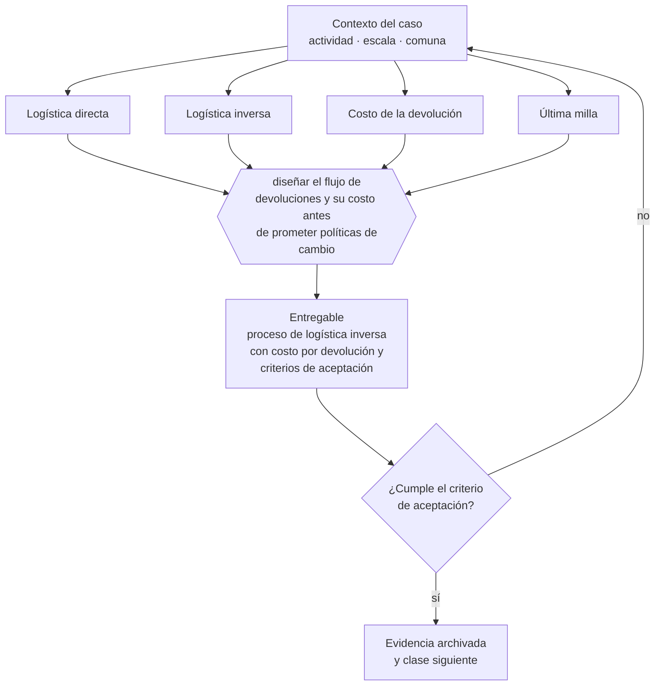

# Clase 175 — Logística directa e inversa

> **Parte 13 · Operaciones, compras, inventario y calidad** — clase 7 de 14

**Estado de evidencia:** `GUIA-PRACTICA` · **Jurisdicción:** Chile-first · **Fecha base normativa:** 07-08-2026 
**Decisión que habilita:** diseñar el flujo de devoluciones y su costo antes de prometer políticas de cambio 
**Entregable:** proceso de logística inversa con costo por devolución y criterios de aceptación

## 🎯 Propósito

Costear la logística inversa antes de prometer políticas de cambio, porque recibir, revisar y reponer puede costar más que el margen del pedido.

## 📚 Resultados de aprendizaje

Al finalizar esta clase podrás:

1. **Definir** con precisión los cuatro conceptos de la tabla siguiente y usarlos para describir un caso real.
2. **Explicar** por qué esta materia condiciona decisiones de otras partes del programa.
3. **Decidir** —diseñar el flujo de devoluciones y su costo antes de prometer políticas de cambio— y justificar la decisión por escrito.
4. **Producir** el entregable de la clase y contrastarlo contra su criterio de aceptación.
5. **Distinguir** el dato estable del dato dinámico que exige revalidación en la fuente oficial.

## 🧩 Conceptos centrales

| Concepto | Comprensión verificable |
|---|---|
| **Logística directa** | Flujo desde la empresa al cliente. |
| **Logística inversa** | Flujo de devoluciones, cambios y reparaciones. |
| **Costo de la devolución** | Transporte, revisión, reacondicionamiento y pérdida de valor. |
| **Última milla** | Tramo final de la entrega, el más caro por unidad. |

## 🗺️ Flujo de razonamiento

## 📖 Desarrollo

### 1. El fondo del asunto

La logística inversa se subestima sistemáticamente en e-commerce: recibir, revisar, reacondicionar y reponer un producto devuelto puede costar más que el margen del pedido. Diseñarla desde el inicio, con criterios claros de aceptación, evita que la tasa de devolución destruya la rentabilidad.

### 2. Cómo se traduce en la práctica

En e-commerce la tasa de devolución es una variable estructural del modelo, no un incidente. Ofrecer devolución sin costo sin haber calculado su efecto en la contribución por pedido es una decisión comercial que se paga en margen, y no reacondicionar el producto devuelto pierde su valor completo.

### 3. Marco aplicable y quién interviene

- ISO 9001 como referencia de sistema de gestión de calidad
- teoría de restricciones para capacidad y cuellos de botella
- trazabilidad de lote exigida en rubros regulados (alimentos, salud, químicos)

**Autoridades o contrapartes involucradas:** SEREMI de Salud en rubros con trazabilidad sanitaria, SERNAC en garantía y postventa.
**Profesionales de apoyo:** jefe de operaciones, comprador, encargado de calidad, prevencionista. La participación concreta depende del riesgo, del
tamaño de la empresa y de la actividad económica.

## 🧪 Taller guiado

Aplica esta clase a **una** de las siguientes líneas de negocio y repite después el ejercicio con
una segunda línea de carga regulatoria distinta:

| Línea | Carga regulatoria |
|---|---|
| SaaS B2B con IA | media |
| Servicios profesionales | baja |
| E-commerce D2C | media |
| Alimentos o foodtech | alta |
| Exportación de servicios | media |
| Fintech regulada | alta |
| Construcción o servicios técnicos | alta |

**Secuencia de trabajo:**

1. Delimita el contexto: actividad económica, escala, comuna y etapa de la empresa.
2. Reúne los antecedentes que la decisión exige y anota la fecha de cada fuente.
3. Identifica las alternativas reales, incluida la de no hacer nada.
4. Evalúa el impacto en mercado, caja, personas, regulación y operación.
5. Toma la decisión y regístrala con sus supuestos.
6. Produce el entregable.
7. Contrástalo contra el criterio de aceptación.
8. Anota lo que requiere validación profesional y programa su revisión.

### 📦 Entregable

Proceso de logística inversa con costo por devolución y criterios de aceptación.

Debe incluir decisión, supuestos, fuentes con fecha de consulta, responsable, riesgos
identificados y próximos pasos.

## 🏆 Reto verificable

Resuelve la misma materia para una segunda línea de negocio con distinta carga regulatoria y
explica por escrito **qué cambió, por qué y qué fuente lo determina**.

## ✅ Criterio de aceptación

- [ ] el costo por devolución está calculado
- [ ] los criterios de aceptación de devolución son operables
- [ ] cada afirmación regulatoria está referida a una fuente oficial con fecha de consulta;
- [ ] los datos dinámicos quedan marcados para revalidación;
- [ ] hay un responsable asignado y evidencia reproducible del trabajo.

## ⚠️ Errores frecuentes

**Propios de esta clase:**

- Ofrecer devolución sin costo sin haber calculado su efecto en la contribución.
- No reacondicionar y perder el valor completo del producto devuelto.

**Característicos de la parte 13:**

- Inventario teórico que no coincide con el físico y destruye la promesa de entrega.
- Proveedor crítico único sin plan alternativo.

## 🇨🇱 Checklist Chile

- [ ] ¿existe norma o autoridad específica para esta materia?
- [ ] ¿la fuente consultada está vigente a la fecha de ejecución?
- [ ] ¿se activa algún trámite ante el SII?
- [ ] ¿se activa algún requisito municipal o sectorial?
- [ ] ¿afecta a consumidores o al tratamiento de datos personales?
- [ ] ¿afecta a trabajadores o a la seguridad y salud en el trabajo?
- [ ] ¿afecta a impuestos, contabilidad o caja?
- [ ] ¿afecta a contratos o a propiedad intelectual?
- [ ] ¿requiere renovación, reporte periódico o revalidación?

## ❓ Preguntas de comprobación

1. ¿Cuánto te cuesta procesar una devolución, incluido el reacondicionamiento?
2. ¿Qué tasa de devolución tienes y cómo afecta tu contribución por pedido?
3. ¿Qué haces con el producto devuelto: se repone, se liquida o se pierde?

## 🔗 Fuentes oficiales

**Servicio Nacional del Consumidor — Ley 19.496, comercio electrónico y garantía legal**  
<https://www.sernac.cl/> · verificado 2026-08-07

- *Qué contiene:* Publica la interpretación aplicada de la Ley del Consumidor: deberes de información en la oferta, reglas del comercio electrónico, garantía legal, contratos de adhesión y el procedimiento de reclamos.
- *Cómo leerla:* Entra por el rubro de tu negocio y revisa las alertas y procedimientos colectivos publicados: muestran qué está fiscalizando el servicio ahora, que es mejor predictor de tu riesgo que la lectura abstracta de la ley.

Complementos del repositorio: [glosario](../../../docs/19_GLOSSARY.md) ·
[ruta de lecturas](../../../docs/15_BOOKS_AND_LEARNING_PATH.md) ·
[catálogo de fuentes](../../../docs/16_OFFICIAL_SOURCE_CATALOG.md).

> [!IMPORTANT]
> Material educativo. Para una decisión real de alto impacto hay que verificar la fuente oficial
> vigente y validar con el profesional competente.

---

| Anterior | Índice | Siguiente |
|---|---|---|
| [← 174 · Bodega, picking y despacho](../class-06-bodega-picking-y-despacho/README.md) | [Parte 13](../README.md) · [Programa](../../../README.md) | [176 · Gestión de calidad y no conformidades →](../class-08-gestion-de-calidad-y-no-conformidades/README.md) |
