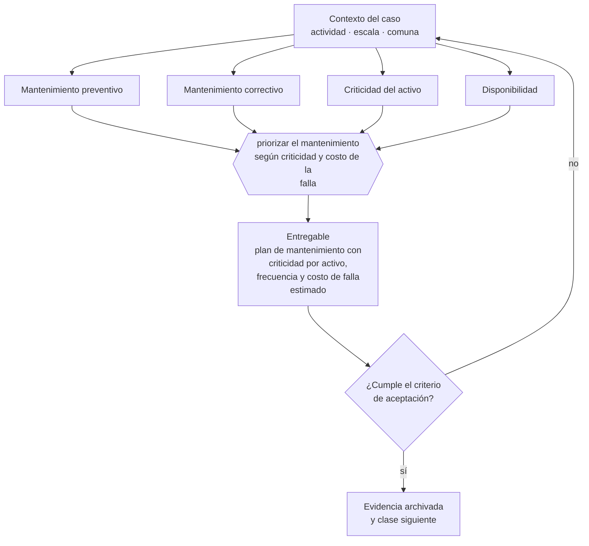

# Clase 180 — Mantenimiento y activos operativos

> **Parte 13 · Operaciones, compras, inventario y calidad** — clase 12 de 14

**Estado de evidencia:** `GUIA-PRACTICA` · **Jurisdicción:** Chile-first · **Fecha base normativa:** 07-08-2026 
**Decisión que habilita:** priorizar el mantenimiento según criticidad y costo de la falla 
**Entregable:** plan de mantenimiento con criticidad por activo, frecuencia y costo de falla estimado

## 🎯 Propósito

Priorizar el mantenimiento por criticidad y costo de la falla, en vez de aplicar la misma frecuencia a todos los activos.

## 📚 Resultados de aprendizaje

Al finalizar esta clase podrás:

1. **Definir** con precisión los cuatro conceptos de la tabla siguiente y usarlos para describir un caso real.
2. **Explicar** por qué esta materia condiciona decisiones de otras partes del programa.
3. **Decidir** —priorizar el mantenimiento según criticidad y costo de la falla— y justificar la decisión por escrito.
4. **Producir** el entregable de la clase y contrastarlo contra su criterio de aceptación.
5. **Distinguir** el dato estable del dato dinámico que exige revalidación en la fuente oficial.

## 🧩 Conceptos centrales

| Concepto | Comprensión verificable |
|---|---|
| **Mantenimiento preventivo** | Intervención programada para evitar la falla. |
| **Mantenimiento correctivo** | Reparación después de la falla. |
| **Criticidad del activo** | Impacto de su falla sobre la operación. |
| **Disponibilidad** | Porcentaje del tiempo en que el activo está operativo. |

## 🗺️ Flujo de razonamiento

## 📖 Desarrollo

### 1. El fondo del asunto

El mantenimiento preventivo cuesta menos que la falla en activos críticos, pero exige planificación y detención programada. Priorizar por criticidad evita el extremo opuesto: mantener todo con la misma frecuencia consume recursos sin reducir el riesgo donde importa.

### 2. Cómo se traduce en la práctica

El preventivo cuesta menos que la falla en activos críticos pero exige planificación y detención programada. El extremo opuesto también desperdicia: mantener todo con igual frecuencia consume recursos sin reducir el riesgo donde realmente importa, que es donde la falla detiene la operación.

### 3. Marco aplicable y quién interviene

- ISO 9001 como referencia de sistema de gestión de calidad
- teoría de restricciones para capacidad y cuellos de botella
- trazabilidad de lote exigida en rubros regulados (alimentos, salud, químicos)

**Autoridades o contrapartes involucradas:** SEREMI de Salud en rubros con trazabilidad sanitaria, SERNAC en garantía y postventa.
**Profesionales de apoyo:** jefe de operaciones, comprador, encargado de calidad, prevencionista. La participación concreta depende del riesgo, del
tamaño de la empresa y de la actividad económica.

## 🧪 Taller guiado

Aplica esta clase a **una** de las siguientes líneas de negocio y repite después el ejercicio con
una segunda línea de carga regulatoria distinta:

| Línea | Carga regulatoria |
|---|---|
| SaaS B2B con IA | media |
| Servicios profesionales | baja |
| E-commerce D2C | media |
| Alimentos o foodtech | alta |
| Exportación de servicios | media |
| Fintech regulada | alta |
| Construcción o servicios técnicos | alta |

**Secuencia de trabajo:**

1. Delimita el contexto: actividad económica, escala, comuna y etapa de la empresa.
2. Reúne los antecedentes que la decisión exige y anota la fecha de cada fuente.
3. Identifica las alternativas reales, incluida la de no hacer nada.
4. Evalúa el impacto en mercado, caja, personas, regulación y operación.
5. Toma la decisión y regístrala con sus supuestos.
6. Produce el entregable.
7. Contrástalo contra el criterio de aceptación.
8. Anota lo que requiere validación profesional y programa su revisión.

### 📦 Entregable

Plan de mantenimiento con criticidad por activo, frecuencia y costo de falla estimado.

Debe incluir decisión, supuestos, fuentes con fecha de consulta, responsable, riesgos
identificados y próximos pasos.

## 🏆 Reto verificable

Resuelve la misma materia para una segunda línea de negocio con distinta carga regulatoria y
explica por escrito **qué cambió, por qué y qué fuente lo determina**.

## ✅ Criterio de aceptación

- [ ] los activos están clasificados por criticidad
- [ ] el plan asocia frecuencia al costo de la falla
- [ ] cada afirmación regulatoria está referida a una fuente oficial con fecha de consulta;
- [ ] los datos dinámicos quedan marcados para revalidación;
- [ ] hay un responsable asignado y evidencia reproducible del trabajo.

## ⚠️ Errores frecuentes

**Propios de esta clase:**

- Operar solo con mantenimiento correctivo en activos críticos.
- Aplicar la misma frecuencia preventiva a activos de criticidad muy distinta.

**Característicos de la parte 13:**

- Inventario teórico que no coincide con el físico y destruye la promesa de entrega.
- Proveedor crítico único sin plan alternativo.

## 🇨🇱 Checklist Chile

- [ ] ¿existe norma o autoridad específica para esta materia?
- [ ] ¿la fuente consultada está vigente a la fecha de ejecución?
- [ ] ¿se activa algún trámite ante el SII?
- [ ] ¿se activa algún requisito municipal o sectorial?
- [ ] ¿afecta a consumidores o al tratamiento de datos personales?
- [ ] ¿afecta a trabajadores o a la seguridad y salud en el trabajo?
- [ ] ¿afecta a impuestos, contabilidad o caja?
- [ ] ¿afecta a contratos o a propiedad intelectual?
- [ ] ¿requiere renovación, reporte periódico o revalidación?

## ❓ Preguntas de comprobación

1. ¿Qué activos detienen tu operación si fallan y cuánto cuesta cada hora detenida?
2. ¿Operas con mantenimiento preventivo o solo correctivo en esos activos?
3. ¿Qué disponibilidad tienen tus activos críticos y cómo la mides?

## 🔗 Fuentes oficiales

**ChileAtiende · Autoridad Sanitaria Regional — Autorización sanitaria de alimentos**  
<https://www.chileatiende.gob.cl/fichas/172-autorizacion-sanitaria-de-alimentos> · verificado 2026-08-19

- *Qué contiene:* Detalla qué establecimientos requieren autorización sanitaria, qué antecedentes se presentan, qué condiciones de planta física se exigen y cuál es la vigencia del permiso.
- *Cómo leerla:* Léela antes de firmar el arriendo, no después: las exigencias de planta física —separación de áreas, superficies lavables, agua potable— se resuelven en el diseño y se vuelven carísimas de corregir sobre un local ya construido.
- *Uso en esta clase:* aporta el marco de «Autorización sanitaria de alimentos» para priorizar el mantenimiento según criticidad y costo de la falla.

**Servicio Nacional del Consumidor — Ley 19.496, comercio electrónico y garantía legal**  
<https://www.sernac.cl/> · verificado 2026-08-19

- *Qué contiene:* Publica la interpretación aplicada de la Ley del Consumidor: deberes de información en la oferta, reglas del comercio electrónico, garantía legal, contratos de adhesión y el procedimiento de reclamos.
- *Cómo leerla:* Entra por el rubro de tu negocio y revisa las alertas y procedimientos colectivos publicados: muestran qué está fiscalizando el servicio ahora, que es mejor predictor de tu riesgo que la lectura abstracta de la ley.
- *Uso en esta clase:* aporta el marco de «Ley 19.496, comercio electrónico y garantía legal» para priorizar el mantenimiento según criticidad y costo de la falla.

Complementos del repositorio: [glosario](../../../docs/19_GLOSSARY.md) ·
[ruta de lecturas](../../../docs/15_BOOKS_AND_LEARNING_PATH.md) ·
[catálogo de fuentes](../../../docs/16_OFFICIAL_SOURCE_CATALOG.md).

> [!IMPORTANT]
> Material educativo. Para una decisión real de alto impacto hay que verificar la fuente oficial
> vigente y validar con el profesional competente.

---

| Anterior | Índice | Siguiente |
|---|---|---|
| [← 179 · Continuidad de proveedores críticos](../class-11-continuidad-de-proveedores-criticos/README.md) | [Parte 13](../README.md) · [Programa](../../../README.md) | [181 · Indicadores OTIF, fill rate y lead time →](../class-13-indicadores-otif-fill-rate-y-lead-time/README.md) |
