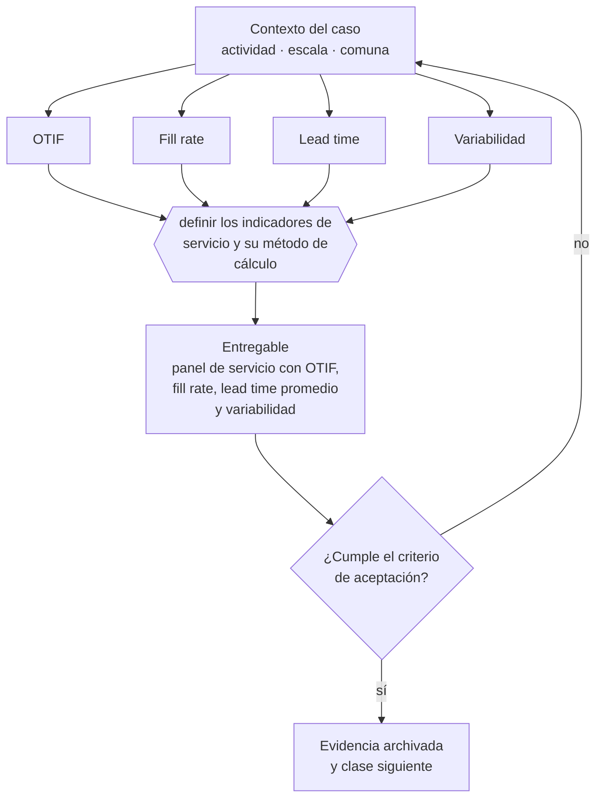

# Clase 181 — Indicadores OTIF, fill rate y lead time

> **Parte 13 · Operaciones, compras, inventario y calidad** — clase 13 de 14

**Estado de evidencia:** `GUIA-PRACTICA` · **Jurisdicción:** Chile-first · **Fecha base normativa:** 07-08-2026 
**Decisión que habilita:** definir los indicadores de servicio y su método de cálculo 
**Entregable:** panel de servicio con OTIF, fill rate, lead time promedio y variabilidad

## 🎯 Propósito

Medir el servicio con criterio estricto —completo y a tiempo— y reportar variabilidad además de promedio, porque el cliente experimenta la variabilidad.

## 📚 Resultados de aprendizaje

Al finalizar esta clase podrás:

1. **Definir** con precisión los cuatro conceptos de la tabla siguiente y usarlos para describir un caso real.
2. **Explicar** por qué esta materia condiciona decisiones de otras partes del programa.
3. **Decidir** —definir los indicadores de servicio y su método de cálculo— y justificar la decisión por escrito.
4. **Producir** el entregable de la clase y contrastarlo contra su criterio de aceptación.
5. **Distinguir** el dato estable del dato dinámico que exige revalidación en la fuente oficial.

## 🧩 Conceptos centrales

| Concepto | Comprensión verificable |
|---|---|
| **OTIF** | Entregas completas y a tiempo sobre el total. |
| **Fill rate** | Porcentaje del pedido atendido en la primera entrega. |
| **Lead time** | Tiempo desde el pedido hasta la entrega. |
| **Variabilidad** | Dispersión del lead time, que importa más que el promedio. |

## 🗺️ Flujo de razonamiento

## 📖 Desarrollo

### 1. El fondo del asunto

El cliente experimenta la variabilidad, no el promedio: un lead time de cinco días con desviación de cuatro es peor que uno de siete días consistente. Medir OTIF con criterio estricto —completo y a tiempo— evita el autoengaño de reportar cumplimiento parcial como éxito.

### 2. Cómo se traduce en la práctica

Un lead time de cinco días con desviación de cuatro es peor que uno de siete días consistente, porque impide planificar. Reportar entregas parciales como cumplidas produce indicadores en verde y clientes molestos, que es la combinación que hace inútil todo el tablero.

### 3. Marco aplicable y quién interviene

- ISO 9001 como referencia de sistema de gestión de calidad
- teoría de restricciones para capacidad y cuellos de botella
- trazabilidad de lote exigida en rubros regulados (alimentos, salud, químicos)

**Autoridades o contrapartes involucradas:** SEREMI de Salud en rubros con trazabilidad sanitaria, SERNAC en garantía y postventa.
**Profesionales de apoyo:** jefe de operaciones, comprador, encargado de calidad, prevencionista. La participación concreta depende del riesgo, del
tamaño de la empresa y de la actividad económica.

## 🧪 Taller guiado

Aplica esta clase a **una** de las siguientes líneas de negocio y repite después el ejercicio con
una segunda línea de carga regulatoria distinta:

| Línea | Carga regulatoria |
|---|---|
| SaaS B2B con IA | media |
| Servicios profesionales | baja |
| E-commerce D2C | media |
| Alimentos o foodtech | alta |
| Exportación de servicios | media |
| Fintech regulada | alta |
| Construcción o servicios técnicos | alta |

**Secuencia de trabajo:**

1. Delimita el contexto: actividad económica, escala, comuna y etapa de la empresa.
2. Reúne los antecedentes que la decisión exige y anota la fecha de cada fuente.
3. Identifica las alternativas reales, incluida la de no hacer nada.
4. Evalúa el impacto en mercado, caja, personas, regulación y operación.
5. Toma la decisión y regístrala con sus supuestos.
6. Produce el entregable.
7. Contrástalo contra el criterio de aceptación.
8. Anota lo que requiere validación profesional y programa su revisión.

### 📦 Entregable

Panel de servicio con otif, fill rate, lead time promedio y variabilidad.

Debe incluir decisión, supuestos, fuentes con fecha de consulta, responsable, riesgos
identificados y próximos pasos.

## 🏆 Reto verificable

Resuelve la misma materia para una segunda línea de negocio con distinta carga regulatoria y
explica por escrito **qué cambió, por qué y qué fuente lo determina**.

## ✅ Criterio de aceptación

- [ ] OTIF se mide con criterio de completo y a tiempo
- [ ] se reporta variabilidad además del promedio
- [ ] cada afirmación regulatoria está referida a una fuente oficial con fecha de consulta;
- [ ] los datos dinámicos quedan marcados para revalidación;
- [ ] hay un responsable asignado y evidencia reproducible del trabajo.

## ⚠️ Errores frecuentes

**Propios de esta clase:**

- Reportar entregas parciales como cumplidas.
- Medir solo el promedio del lead time e ignorar la dispersión.

**Característicos de la parte 13:**

- Inventario teórico que no coincide con el físico y destruye la promesa de entrega.
- Proveedor crítico único sin plan alternativo.

## 🇨🇱 Checklist Chile

- [ ] ¿existe norma o autoridad específica para esta materia?
- [ ] ¿la fuente consultada está vigente a la fecha de ejecución?
- [ ] ¿se activa algún trámite ante el SII?
- [ ] ¿se activa algún requisito municipal o sectorial?
- [ ] ¿afecta a consumidores o al tratamiento de datos personales?
- [ ] ¿afecta a trabajadores o a la seguridad y salud en el trabajo?
- [ ] ¿afecta a impuestos, contabilidad o caja?
- [ ] ¿afecta a contratos o a propiedad intelectual?
- [ ] ¿requiere renovación, reporte periódico o revalidación?

## ❓ Preguntas de comprobación

1. ¿Mides OTIF con criterio de completo y a tiempo o aceptas parciales?
2. ¿Cuál es la desviación de tu lead time, no solo el promedio?
3. ¿Coinciden tus indicadores en verde con la percepción de tus clientes?

## 🔗 Fuentes oficiales

**ChileAtiende · Autoridad Sanitaria Regional — Autorización sanitaria de alimentos**  
<https://www.chileatiende.gob.cl/fichas/172-autorizacion-sanitaria-de-alimentos> · verificado 2026-08-19

- *Qué contiene:* Detalla qué establecimientos requieren autorización sanitaria, qué antecedentes se presentan, qué condiciones de planta física se exigen y cuál es la vigencia del permiso.
- *Cómo leerla:* Léela antes de firmar el arriendo, no después: las exigencias de planta física —separación de áreas, superficies lavables, agua potable— se resuelven en el diseño y se vuelven carísimas de corregir sobre un local ya construido.
- *Uso en esta clase:* aporta el marco de «Autorización sanitaria de alimentos» para definir los indicadores de servicio y su método de cálculo.

**Servicio Nacional del Consumidor — Ley 19.496, comercio electrónico y garantía legal**  
<https://www.sernac.cl/> · verificado 2026-08-19

- *Qué contiene:* Publica la interpretación aplicada de la Ley del Consumidor: deberes de información en la oferta, reglas del comercio electrónico, garantía legal, contratos de adhesión y el procedimiento de reclamos.
- *Cómo leerla:* Entra por el rubro de tu negocio y revisa las alertas y procedimientos colectivos publicados: muestran qué está fiscalizando el servicio ahora, que es mejor predictor de tu riesgo que la lectura abstracta de la ley.
- *Uso en esta clase:* aporta el marco de «Ley 19.496, comercio electrónico y garantía legal» para definir los indicadores de servicio y su método de cálculo.

Complementos del repositorio: [glosario](../../../docs/19_GLOSSARY.md) ·
[ruta de lecturas](../../../docs/15_BOOKS_AND_LEARNING_PATH.md) ·
[catálogo de fuentes](../../../docs/16_OFFICIAL_SOURCE_CATALOG.md).

> [!IMPORTANT]
> Material educativo. Para una decisión real de alto impacto hay que verificar la fuente oficial
> vigente y validar con el profesional competente.

---

| Anterior | Índice | Siguiente |
|---|---|---|
| [← 180 · Mantenimiento y activos operativos](../class-12-mantenimiento-y-activos-operativos/README.md) | [Parte 13](../README.md) · [Programa](../../../README.md) | [182 · Mejora continua y automatización →](../class-14-mejora-continua-y-automatizacion/README.md) |
