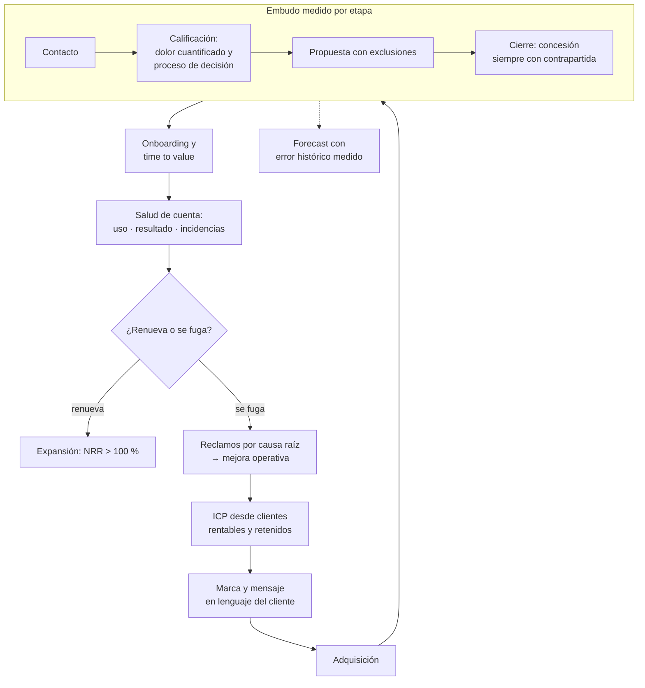

# Parte 14 — Ventas, marketing y experiencia de cliente

> *Vender de forma repetible exige un sistema, no talento individual*

🔴 **Etapa 5 — Operar, vender y crecer** · salida de la etapa: Empresa habilitada, operando y creciendo con control

**Estado de evidencia:** `GUIA-PRACTICA` · **Clases:** 14 (183–196) · **Fecha base normativa:** 07-08-2026 
**Contenido central:** ICP, marca y mensaje, embudo, contenidos, atribución, prospección, CRM, onboarding y forecast 
**Conceptos definidos en esta parte:** 56

## 🎯 De qué trata esta parte

Un buen vendedor produce ventas; un sistema comercial produce ventas predecibles. La diferencia importa porque la empresa planifica caja, contrataciones e inventario sobre el forecast, y un forecast sin método es una ilusión costosa. Esta parte construye ese sistema desde el perfil de cliente ideal hasta el forecast con error medido.

El punto de partida es contraintuitivo: el ICP se construye mirando a los clientes que retienen y son rentables, no a los que cerraron más rápido. De ahí salen las señales de ajuste que permiten descalificar temprano, que es una capacidad y no una pérdida. Cada oportunidad perseguida sin ajuste consume tiempo comercial que no vuelve.

La segunda mitad de la parte se ocupa de lo que ocurre después de la venta, que es donde se decide la rentabilidad real. El onboarding determina la retención más que cualquier acción posterior; el indicador de salud de cuenta permite intervenir cuando todavía es posible; y los reclamos, clasificados por causa raíz, son la fuente de mejora operativa más barata que existe y la más ignorada.

## 📚 Resultados de la parte

Al terminar esta parte podrás:

1. **Definir ICP y mensaje con evidencia de los clientes que sí retienen**.
2. **Operar un embudo medible desde el primer contacto hasta la renovación**.
3. **Calificar oportunidades con criterio y no por entusiasmo del vendedor**.
4. **Producir un forecast que la empresa pueda usar para planificar caja**.

## 🗺️ Mapa de la parte

## ⚖️ Marco aplicable

- embudo de adquisición y métricas por etapa
- calificación estructurada de oportunidades y discovery comercial
- revenue operations como integración de marketing, ventas y postventa

**Autoridades o contrapartes:** SERNAC en publicidad y ofertas, SUBTEL y SERNAC en contacto no solicitado.
**Profesionales de apoyo:** responsable comercial, marketing, customer success, abogado de consumo.

## ⚠️ Riesgos característicos

- Publicidad con condiciones no informadas que constituye infracción a la ley del consumidor.
- Pipeline inflado que produce decisiones de contratación equivocadas.
- Invertir en adquisición con cac superior al margen de contribución.
- No medir retención y crecer sobre una base que se fuga.

## 📘 Las 14 clases

| # | Global | Clase | Decisión que habilita |
|---:|---:|---|---|
| 01 | 183 | [ICP y segmentación comercial](class-01-icp-y-segmentacion-comercial/README.md) | definir a qué cuentas se dedica el tiempo comercial y a cuáles no |
| 02 | 184 | [Marca, posicionamiento y mensaje](class-02-marca-posicionamiento-y-mensaje/README.md) | definir el mensaje central y asegurar su consistencia y protección |
| 03 | 185 | [Embudo de adquisición](class-03-embudo-de-adquisicion/README.md) | identificar en qué etapa se pierde la mayor proporción y actuar ahí |
| 04 | 186 | [Marketing de contenidos](class-04-marketing-de-contenidos/README.md) | definir qué contenido se produce y cómo se distribuye |
| 05 | 187 | [Publicidad digital y atribución](class-05-publicidad-digital-y-atribucion/README.md) | decidir dónde invertir según el CAC por canal y su saturación |
| 06 | 188 | [Prospección B2B](class-06-prospeccion-b2b/README.md) | definir la lista objetivo y la secuencia de contacto |
| 07 | 189 | [Discovery comercial y calificación](class-07-discovery-comercial-y-calificacion/README.md) | calificar la oportunidad antes de invertir esfuerzo en la propuesta |
| 08 | 190 | [Propuesta, negociación y cierre](class-08-propuesta-negociacion-y-cierre/README.md) | definir la política de concesiones y qué se exige a cambio |
| 09 | 191 | [CRM y pipeline](class-09-crm-y-pipeline/README.md) | definir las reglas de higiene del pipeline y su revisión periódica |
| 10 | 192 | [Onboarding de clientes](class-10-onboarding-de-clientes/README.md) | diseñar el onboarding y definir el hito de activación |
| 11 | 193 | [Customer success y expansión](class-11-customer-success-y-expansion/README.md) | definir el indicador de salud de cuenta y las intervenciones por nivel de riesgo |
| 12 | 194 | [Soporte, reclamos y voz del cliente](class-12-soporte-reclamos-y-voz-del-cliente/README.md) | definir cómo se registran, resuelven y analizan los reclamos |
| 13 | 195 | [Referidos, partners y canales](class-13-referidos-partners-y-canales/README.md) | definir el programa de referidos y las reglas del canal indirecto |
| 14 | 196 | [Revenue operations y forecast](class-14-revenue-operations-y-forecast/README.md) | instalar un forecast con medición de error y definiciones comunes entre áreas |

## 🔤 Glosario de la parte

| Concepto | Definición operacional |
|---|---|
| **Activo de contenido** | Material que sigue generando resultados con el tiempo. |
| **Atribución** | Asignación del resultado a los canales que lo produjeron. |
| **CAC por canal** | Costo de adquisición desagregado. |
| **Calificación** | Evaluación de ajuste, necesidad, presupuesto y decisión. |
| **Canal indirecto** | Venta a través de un tercero. |
| **Canal saturado** | Aquel cuyo costo sube sin aumentar resultados. |
| **Causa raíz** | Origen operativo del reclamo. |
| **Cierre** | Acuerdo formalizado con documento y condiciones. |
| **Concesión** | Cesión otorgada en la negociación. |
| **Conflicto de canal** | Competencia entre el canal directo y el indirecto. |
| **Consistencia** | Repetición del mismo mensaje en todos los puntos de contacto. |
| **Contenido** | Material que resuelve un problema del cliente antes de vender. |
| **Contrapartida** | Valor obtenido a cambio de una concesión. |
| **CRM** | Sistema que registra cuentas, contactos y oportunidades. |
| **Cuello de botella del embudo** | Etapa donde se pierde la mayor proporción. |
| **Customer success** | Función que asegura que el cliente obtenga el resultado esperado. |
| **Definición común** | Criterio único de etapa y de dato entre áreas. |
| **Descalificación** | Decisión de no perseguir una oportunidad. |
| **Discovery comercial** | Conversación que diagnostica antes de proponer. |
| **Distribución** | Mecanismo por el que el contenido llega a la audiencia. |
| **Dolor cuantificado** | Costo del problema expresado en dinero o tiempo. |
| **Embudo** | Secuencia de etapas desde el primer contacto hasta la venta. |
| **Expansión** | Aumento de ingreso dentro de la base existente. |
| **Forecast** | Proyección de ingresos por período. |
| **Higiene de datos** | Calidad y actualización de la información registrada. |
| **Hito de activación** | Evento que indica que el cliente está usando efectivamente. |
| **ICP comercial** | Perfil de cuenta con mayor probabilidad de cerrar y retener. |
| **Intención de búsqueda** | Necesidad detrás de una consulta. |
| **Lista de cuentas objetivo** | Conjunto acotado de empresas priorizadas. |
| **Marca** | Conjunto de asociaciones que reducen el riesgo percibido. |
| **Mensaje** | Formulación de la promesa en el lenguaje del cliente. |
| **Onboarding** | Proceso de puesta en marcha del cliente nuevo. |
| **Partner** | Empresa que aporta acceso a clientes o capacidades complementarias. |
| **Pipeline** | Conjunto de oportunidades abiertas con etapa y monto. |
| **Probabilidad por etapa** | Factor histórico de cierre según la etapa. |
| **Proceso de decisión del cliente** | Pasos internos que la compra debe recorrer. |
| **Propuesta** | Documento que formaliza alcance, precio y condiciones. |
| **Prospección** | Búsqueda activa de oportunidades nuevas. |
| **Prueba social** | Evidencia de terceros que respalda la promesa. |
| **Reclamo** | Manifestación formal de insatisfacción. |
| **Referido** | Cliente que llega recomendado por otro. |
| **Revenue operations** | Integración de datos y procesos de marketing, ventas y postventa. |
| **Salud de cuenta** | Indicador compuesto que anticipa renovación o fuga. |
| **Secuencia** | Serie planificada de contactos por distintos canales. |
| **Sesgo del forecast** | Desviación sistemática entre proyección y realidad. |
| **Señal de ajuste** | Atributo observable que predice éxito con el cliente. |
| **Señal de riesgo** | Comportamiento que anticipa la salida del cliente. |
| **Tasa de conversión** | Proporción que avanza de una etapa a la siguiente. |
| **Tasa de respuesta** | Proporción de contactos que responden. |
| **Territorio** | Asignación de cuentas por criterio geográfico o vertical. |
| **Tiempo de resolución** | Plazo desde el ingreso hasta el cierre. |
| **Time to value** | Tiempo hasta que el cliente obtiene el primer resultado. |
| **Traspaso comercial** | Entrega ordenada desde ventas a la operación. |
| **Velocidad** | Tiempo promedio entre etapas. |
| **Ventana de atribución** | Período dentro del cual se atribuye la conversión. |
| **Voz del cliente** | Información estructurada proveniente de reclamos y consultas. |

## 🔗 Cómo se conecta

Consume el posicionamiento de la parte 04 y el precio de la parte 09, y entrega demanda a la operación de la parte 13. Su publicidad y sus condiciones de oferta quedan sujetas a la parte 11.

## 📖 Pauta bibliográfica

- Dixon, M. y Adamson, B. — *The Challenger Sale*: calificación y enseñanza comercial.
- Mehta, N. — *Customer Success*: salud de cuenta y retención neta.
- SERNAC — reglas de publicidad, ofertas y contacto no solicitado.

## 🏛️ Fuentes oficiales de la parte

**Servicio Nacional del Consumidor — Ley 19.496, comercio electrónico y garantía legal**  
<https://www.sernac.cl/> · verificado 2026-08-19

- *Qué contiene:* Publica la interpretación aplicada de la Ley del Consumidor: deberes de información en la oferta, reglas del comercio electrónico, garantía legal, contratos de adhesión y el procedimiento de reclamos.
- *Cómo leerla:* Entra por el rubro de tu negocio y revisa las alertas y procedimientos colectivos publicados: muestran qué está fiscalizando el servicio ahora, que es mejor predictor de tu riesgo que la lectura abstracta de la ley.

**Biblioteca del Congreso Nacional · LeyChile — Normativa oficial consolidada**  
<https://www.bcn.cl/leychile/> · verificado 2026-08-19

- *Qué contiene:* Publica el texto oficial y consolidado de leyes, decretos y reglamentos, con la versión vigente a una fecha, el historial de modificaciones y la tramitación que las originó.
- *Cómo leerla:* Usa siempre el selector de versión vigente a la fecha en que ejecutarás el trámite, no la última publicada. Y lee el artículo transitorio: en normas en implantación gradual —jornada, datos personales— ahí está la fecha que realmente te aplica.

---

| Anterior | Índice | Siguiente |
|---|---|---|
| [← Parte 13 · Operaciones, compras, inventario y calidad](../part-13-operaciones-compras-inventario-y-calidad/README.md) | [Currículo](../../CURRICULUM.md) · [Programa](../../README.md) | [Parte 15 · Tecnología, datos, IA y operación digital →](../part-15-tecnologia-datos-ia-y-operacion-digital/README.md) |
