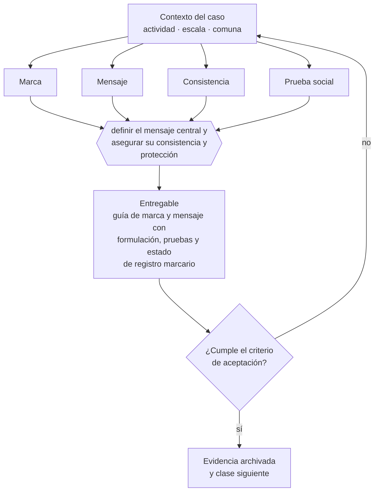

# Clase 184 — Marca, posicionamiento y mensaje

> **Parte 14 · Ventas, marketing y experiencia de cliente** — clase 2 de 14

**Estado de evidencia:** `GUIA-PRACTICA` · **Jurisdicción:** Chile-first · **Fecha base normativa:** 07-08-2026 
**Decisión que habilita:** definir el mensaje central y asegurar su consistencia y protección 
**Entregable:** guía de marca y mensaje con formulación, pruebas y estado de registro marcario

## 🎯 Propósito

Formular el mensaje en el lenguaje del cliente y sostenerlo el tiempo suficiente para que se instale una asociación.

## 📚 Resultados de aprendizaje

Al finalizar esta clase podrás:

1. **Definir** con precisión los cuatro conceptos de la tabla siguiente y usarlos para describir un caso real.
2. **Explicar** por qué esta materia condiciona decisiones de otras partes del programa.
3. **Decidir** —definir el mensaje central y asegurar su consistencia y protección— y justificar la decisión por escrito.
4. **Producir** el entregable de la clase y contrastarlo contra su criterio de aceptación.
5. **Distinguir** el dato estable del dato dinámico que exige revalidación en la fuente oficial.

## 🧩 Conceptos centrales

| Concepto | Comprensión verificable |
|---|---|
| **Marca** | Conjunto de asociaciones que reducen el riesgo percibido. |
| **Mensaje** | Formulación de la promesa en el lenguaje del cliente. |
| **Consistencia** | Repetición del mismo mensaje en todos los puntos de contacto. |
| **Prueba social** | Evidencia de terceros que respalda la promesa. |

## 🗺️ Flujo de razonamiento

## 📖 Desarrollo

### 1. El fondo del asunto

El mensaje debe usar las palabras del cliente y no la jerga interna. La consistencia importa más que la creatividad: cambiar el mensaje cada trimestre impide que se instale ninguna asociación. La marca debe estar registrada antes de invertir en construirla.

### 2. Cómo se traduce en la práctica

Cambiar el mensaje cada trimestre impide que se construya cualquier posicionamiento; la consistencia importa más que la creatividad. Y antes de invertir en marca hay que registrarla en INAPI en las clases donde se opera, porque el reconocimiento construido sobre un signo ajeno se pierde entero.

### 3. Marco aplicable y quién interviene

- embudo de adquisición y métricas por etapa
- calificación estructurada de oportunidades y discovery comercial
- revenue operations como integración de marketing, ventas y postventa

**Autoridades o contrapartes involucradas:** SERNAC en publicidad y ofertas, SUBTEL y SERNAC en contacto no solicitado.
**Profesionales de apoyo:** responsable comercial, marketing, customer success, abogado de consumo. La participación concreta depende del riesgo, del
tamaño de la empresa y de la actividad económica.

## 🧪 Taller guiado

Aplica esta clase a **una** de las siguientes líneas de negocio y repite después el ejercicio con
una segunda línea de carga regulatoria distinta:

| Línea | Carga regulatoria |
|---|---|
| SaaS B2B con IA | media |
| Servicios profesionales | baja |
| E-commerce D2C | media |
| Alimentos o foodtech | alta |
| Exportación de servicios | media |
| Fintech regulada | alta |
| Construcción o servicios técnicos | alta |

**Secuencia de trabajo:**

1. Delimita el contexto: actividad económica, escala, comuna y etapa de la empresa.
2. Reúne los antecedentes que la decisión exige y anota la fecha de cada fuente.
3. Identifica las alternativas reales, incluida la de no hacer nada.
4. Evalúa el impacto en mercado, caja, personas, regulación y operación.
5. Toma la decisión y regístrala con sus supuestos.
6. Produce el entregable.
7. Contrástalo contra el criterio de aceptación.
8. Anota lo que requiere validación profesional y programa su revisión.

### 📦 Entregable

Guía de marca y mensaje con formulación, pruebas y estado de registro marcario.

Debe incluir decisión, supuestos, fuentes con fecha de consulta, responsable, riesgos
identificados y próximos pasos.

## 🏆 Reto verificable

Resuelve la misma materia para una segunda línea de negocio con distinta carga regulatoria y
explica por escrito **qué cambió, por qué y qué fuente lo determina**.

## ✅ Criterio de aceptación

- [ ] el mensaje usa lenguaje del cliente verificado
- [ ] el estado de registro marcario está confirmado
- [ ] cada afirmación regulatoria está referida a una fuente oficial con fecha de consulta;
- [ ] los datos dinámicos quedan marcados para revalidación;
- [ ] hay un responsable asignado y evidencia reproducible del trabajo.

## ⚠️ Errores frecuentes

**Propios de esta clase:**

- Cambiar el mensaje antes de que alcance a instalarse.
- Invertir en marca sin haberla registrado en inapi.

**Característicos de la parte 14:**

- Publicidad con condiciones no informadas que constituye infracción a la ley del consumidor.
- Pipeline inflado que produce decisiones de contratación equivocadas.

## 🇨🇱 Checklist Chile

- [ ] ¿existe norma o autoridad específica para esta materia?
- [ ] ¿la fuente consultada está vigente a la fecha de ejecución?
- [ ] ¿se activa algún trámite ante el SII?
- [ ] ¿se activa algún requisito municipal o sectorial?
- [ ] ¿afecta a consumidores o al tratamiento de datos personales?
- [ ] ¿afecta a trabajadores o a la seguridad y salud en el trabajo?
- [ ] ¿afecta a impuestos, contabilidad o caja?
- [ ] ¿afecta a contratos o a propiedad intelectual?
- [ ] ¿requiere renovación, reporte periódico o revalidación?

## ❓ Preguntas de comprobación

1. ¿Tu mensaje usa las palabras del cliente o la jerga interna de tu empresa?
2. ¿Cuántas veces cambiaste el mensaje central los últimos dos años?
3. ¿Está registrada la marca sobre la que estás invirtiendo?

## 🔗 Fuentes oficiales

**Instituto Nacional de Propiedad Industrial — Marcas, patentes y diseños industriales**  
<https://www.inapi.cl/> · verificado 2026-08-19

- *Qué contiene:* Administra el registro de marcas, patentes, diseños e indicaciones geográficas, y ofrece el buscador público de solicitudes y registros vigentes por clase.
- *Cómo leerla:* Empieza siempre por el buscador de anterioridades y por clases, no por el formulario de solicitud. Una marca disponible en tu clase puede estar tomada en la clase donde realmente operas, y eso solo se ve buscando por actividad.
- *Uso en esta clase:* aporta el marco de «Marcas, patentes y diseños industriales» para definir el mensaje central y asegurar su consistencia y protección.

**Servicio Nacional del Consumidor — Ley 19.496, comercio electrónico y garantía legal**  
<https://www.sernac.cl/> · verificado 2026-08-19

- *Qué contiene:* Publica la interpretación aplicada de la Ley del Consumidor: deberes de información en la oferta, reglas del comercio electrónico, garantía legal, contratos de adhesión y el procedimiento de reclamos.
- *Cómo leerla:* Entra por el rubro de tu negocio y revisa las alertas y procedimientos colectivos publicados: muestran qué está fiscalizando el servicio ahora, que es mejor predictor de tu riesgo que la lectura abstracta de la ley.
- *Uso en esta clase:* aporta el marco de «Ley 19.496, comercio electrónico y garantía legal» para definir el mensaje central y asegurar su consistencia y protección.

Complementos del repositorio: [glosario](../../../docs/19_GLOSSARY.md) ·
[ruta de lecturas](../../../docs/15_BOOKS_AND_LEARNING_PATH.md) ·
[catálogo de fuentes](../../../docs/16_OFFICIAL_SOURCE_CATALOG.md).

> [!IMPORTANT]
> Material educativo. Para una decisión real de alto impacto hay que verificar la fuente oficial
> vigente y validar con el profesional competente.

---

| Anterior | Índice | Siguiente |
|---|---|---|
| [← 183 · ICP y segmentación comercial](../class-01-icp-y-segmentacion-comercial/README.md) | [Parte 14](../README.md) · [Programa](../../../README.md) | [185 · Embudo de adquisición →](../class-03-embudo-de-adquisicion/README.md) |
