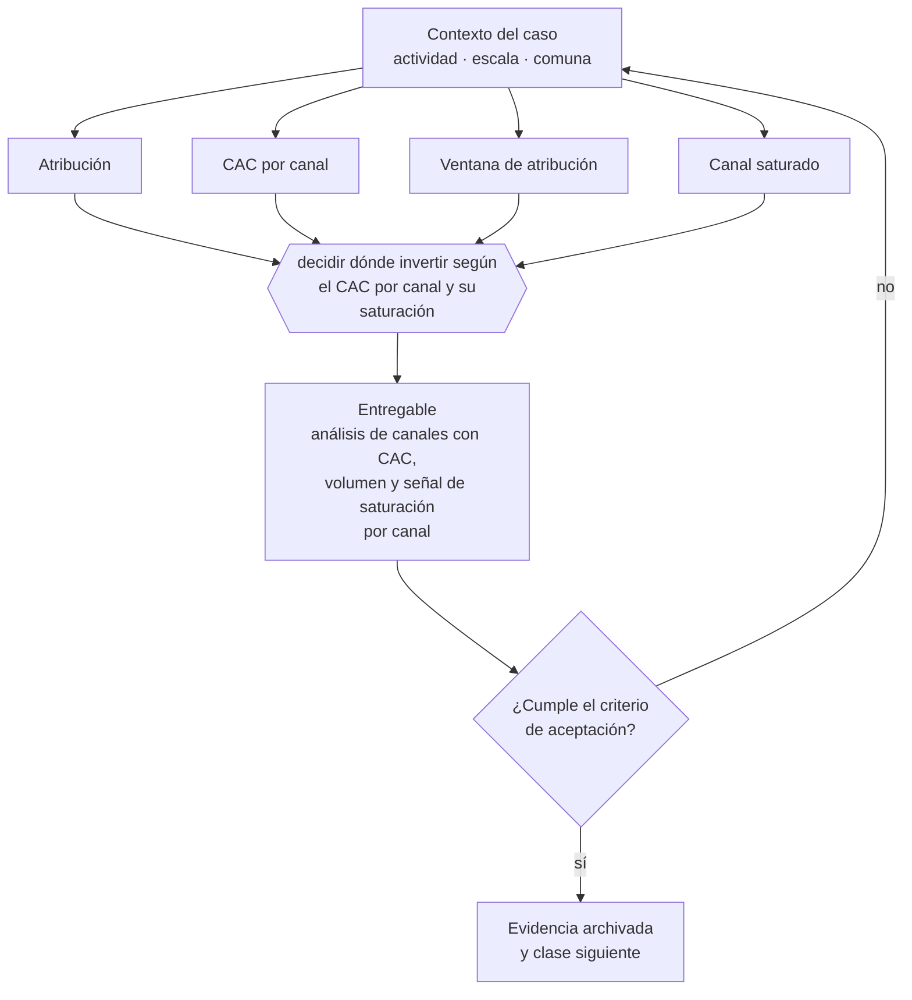

# Clase 187 — Publicidad digital y atribución

> **Parte 14 · Ventas, marketing y experiencia de cliente** — clase 5 de 14

**Estado de evidencia:** `GUIA-PRACTICA` · **Jurisdicción:** Chile-first · **Fecha base normativa:** 07-08-2026 
**Decisión que habilita:** decidir dónde invertir según el CAC por canal y su saturación 
**Entregable:** análisis de canales con CAC, volumen y señal de saturación por canal

## 🎯 Propósito

Decidir la inversión publicitaria por CAC por canal y señales de saturación, no por costo por clic.

## 📚 Resultados de aprendizaje

Al finalizar esta clase podrás:

1. **Definir** con precisión los cuatro conceptos de la tabla siguiente y usarlos para describir un caso real.
2. **Explicar** por qué esta materia condiciona decisiones de otras partes del programa.
3. **Decidir** —decidir dónde invertir según el CAC por canal y su saturación— y justificar la decisión por escrito.
4. **Producir** el entregable de la clase y contrastarlo contra su criterio de aceptación.
5. **Distinguir** el dato estable del dato dinámico que exige revalidación en la fuente oficial.

## 🧩 Conceptos centrales

| Concepto | Comprensión verificable |
|---|---|
| **Atribución** | Asignación del resultado a los canales que lo produjeron. |
| **CAC por canal** | Costo de adquisición desagregado. |
| **Ventana de atribución** | Período dentro del cual se atribuye la conversión. |
| **Canal saturado** | Aquel cuyo costo sube sin aumentar resultados. |

## 🗺️ Flujo de razonamiento

## 📖 Desarrollo

### 1. El fondo del asunto

Sin atribución, la inversión publicitaria se decide por intuición. Ningún modelo de atribución es exacto, pero cualquiera consistente permite comparar canales. La señal de saturación es que el CAC sube mientras el volumen se mantiene: ahí conviene diversificar y no aumentar presupuesto.

### 2. Cómo se traduce en la práctica

Ningún modelo de atribución es exacto, pero cualquiera consistente permite comparar canales entre sí. La señal de saturación es que el CAC sube mientras el volumen se mantiene: ahí conviene diversificar en vez de aumentar presupuesto, que es la reacción instintiva y equivocada.

### 3. Marco aplicable y quién interviene

- embudo de adquisición y métricas por etapa
- calificación estructurada de oportunidades y discovery comercial
- revenue operations como integración de marketing, ventas y postventa

**Autoridades o contrapartes involucradas:** SERNAC en publicidad y ofertas, SUBTEL y SERNAC en contacto no solicitado.
**Profesionales de apoyo:** responsable comercial, marketing, customer success, abogado de consumo. La participación concreta depende del riesgo, del
tamaño de la empresa y de la actividad económica.

## 🧪 Taller guiado

Aplica esta clase a **una** de las siguientes líneas de negocio y repite después el ejercicio con
una segunda línea de carga regulatoria distinta:

| Línea | Carga regulatoria |
|---|---|
| SaaS B2B con IA | media |
| Servicios profesionales | baja |
| E-commerce D2C | media |
| Alimentos o foodtech | alta |
| Exportación de servicios | media |
| Fintech regulada | alta |
| Construcción o servicios técnicos | alta |

**Secuencia de trabajo:**

1. Delimita el contexto: actividad económica, escala, comuna y etapa de la empresa.
2. Reúne los antecedentes que la decisión exige y anota la fecha de cada fuente.
3. Identifica las alternativas reales, incluida la de no hacer nada.
4. Evalúa el impacto en mercado, caja, personas, regulación y operación.
5. Toma la decisión y regístrala con sus supuestos.
6. Produce el entregable.
7. Contrástalo contra el criterio de aceptación.
8. Anota lo que requiere validación profesional y programa su revisión.

### 📦 Entregable

Análisis de canales con cac, volumen y señal de saturación por canal.

Debe incluir decisión, supuestos, fuentes con fecha de consulta, responsable, riesgos
identificados y próximos pasos.

## 🏆 Reto verificable

Resuelve la misma materia para una segunda línea de negocio con distinta carga regulatoria y
explica por escrito **qué cambió, por qué y qué fuente lo determina**.

## ✅ Criterio de aceptación

- [ ] el CAC está calculado por canal
- [ ] se identifica la señal de saturación con datos
- [ ] cada afirmación regulatoria está referida a una fuente oficial con fecha de consulta;
- [ ] los datos dinámicos quedan marcados para revalidación;
- [ ] hay un responsable asignado y evidencia reproducible del trabajo.

## ⚠️ Errores frecuentes

**Propios de esta clase:**

- Evaluar canales por costo por clic en vez de por costo por cliente.
- Aumentar presupuesto en un canal saturado.

**Característicos de la parte 14:**

- Publicidad con condiciones no informadas que constituye infracción a la ley del consumidor.
- Pipeline inflado que produce decisiones de contratación equivocadas.

## 🇨🇱 Checklist Chile

- [ ] ¿existe norma o autoridad específica para esta materia?
- [ ] ¿la fuente consultada está vigente a la fecha de ejecución?
- [ ] ¿se activa algún trámite ante el SII?
- [ ] ¿se activa algún requisito municipal o sectorial?
- [ ] ¿afecta a consumidores o al tratamiento de datos personales?
- [ ] ¿afecta a trabajadores o a la seguridad y salud en el trabajo?
- [ ] ¿afecta a impuestos, contabilidad o caja?
- [ ] ¿afecta a contratos o a propiedad intelectual?
- [ ] ¿requiere renovación, reporte periódico o revalidación?

## ❓ Preguntas de comprobación

1. ¿Cuál es tu CAC por canal y no solo tu costo por clic?
2. ¿Qué canal muestra CAC creciente con volumen estancado?
3. ¿Qué ventana de atribución usas y por qué esa?

## 🔗 Fuentes oficiales

**Servicio Nacional del Consumidor — Ley 19.496, comercio electrónico y garantía legal**  
<https://www.sernac.cl/> · verificado 2026-08-07

- *Qué contiene:* Publica la interpretación aplicada de la Ley del Consumidor: deberes de información en la oferta, reglas del comercio electrónico, garantía legal, contratos de adhesión y el procedimiento de reclamos.
- *Cómo leerla:* Entra por el rubro de tu negocio y revisa las alertas y procedimientos colectivos publicados: muestran qué está fiscalizando el servicio ahora, que es mejor predictor de tu riesgo que la lectura abstracta de la ley.

**Biblioteca del Congreso Nacional · LeyChile — Normativa oficial consolidada**  
<https://www.bcn.cl/leychile/> · verificado 2026-08-07

- *Qué contiene:* Publica el texto oficial y consolidado de leyes, decretos y reglamentos, con la versión vigente a una fecha, el historial de modificaciones y la tramitación que las originó.
- *Cómo leerla:* Usa siempre el selector de versión vigente a la fecha en que ejecutarás el trámite, no la última publicada. Y lee el artículo transitorio: en normas en implantación gradual —jornada, datos personales— ahí está la fecha que realmente te aplica.

Complementos del repositorio: [glosario](../../../docs/19_GLOSSARY.md) ·
[ruta de lecturas](../../../docs/15_BOOKS_AND_LEARNING_PATH.md) ·
[catálogo de fuentes](../../../docs/16_OFFICIAL_SOURCE_CATALOG.md).

> [!IMPORTANT]
> Material educativo. Para una decisión real de alto impacto hay que verificar la fuente oficial
> vigente y validar con el profesional competente.

---

| Anterior | Índice | Siguiente |
|---|---|---|
| [← 186 · Marketing de contenidos](../class-04-marketing-de-contenidos/README.md) | [Parte 14](../README.md) · [Programa](../../../README.md) | [188 · Prospección B2B →](../class-06-prospeccion-b2b/README.md) |
