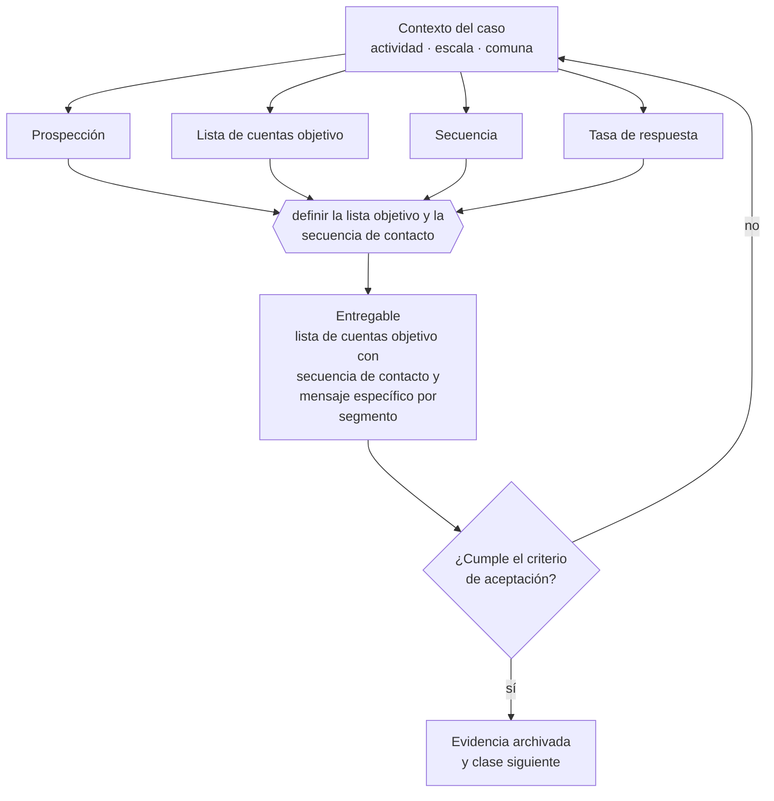

# Clase 188 — Prospección B2B

> **Parte 14 · Ventas, marketing y experiencia de cliente** — clase 6 de 14

**Estado de evidencia:** `GUIA-PRACTICA` · **Jurisdicción:** Chile-first · **Fecha base normativa:** 07-08-2026 
**Decisión que habilita:** definir la lista objetivo y la secuencia de contacto 
**Entregable:** lista de cuentas objetivo con secuencia de contacto y mensaje específico por segmento

## 🎯 Propósito

Prospectar con listas acotadas y mensajes específicos, respetando las reglas de comunicación comercial no solicitada.

## 📚 Resultados de aprendizaje

Al finalizar esta clase podrás:

1. **Definir** con precisión los cuatro conceptos de la tabla siguiente y usarlos para describir un caso real.
2. **Explicar** por qué esta materia condiciona decisiones de otras partes del programa.
3. **Decidir** —definir la lista objetivo y la secuencia de contacto— y justificar la decisión por escrito.
4. **Producir** el entregable de la clase y contrastarlo contra su criterio de aceptación.
5. **Distinguir** el dato estable del dato dinámico que exige revalidación en la fuente oficial.

## 🧩 Conceptos centrales

| Concepto | Comprensión verificable |
|---|---|
| **Prospección** | Búsqueda activa de oportunidades nuevas. |
| **Lista de cuentas objetivo** | Conjunto acotado de empresas priorizadas. |
| **Secuencia** | Serie planificada de contactos por distintos canales. |
| **Tasa de respuesta** | Proporción de contactos que responden. |

## 🗺️ Flujo de razonamiento

## 📖 Desarrollo

### 1. El fondo del asunto

La prospección B2B funciona con listas acotadas y mensajes específicos: cien cuentas bien investigadas producen más que mil contactos genéricos. El contacto comercial no solicitado debe respetar las reglas de comunicaciones publicitarias y ofrecer mecanismo de exclusión.

### 2. Cómo se traduce en la práctica

Cien cuentas bien investigadas producen más que mil contactos genéricos, porque el mensaje puede referirse al problema concreto de esa empresa. El contacto no solicitado debe además ofrecer mecanismo de exclusión y respetar las solicitudes de baja: incumplirlo genera reclamos y expone a la empresa.

### 3. Marco aplicable y quién interviene

- embudo de adquisición y métricas por etapa
- calificación estructurada de oportunidades y discovery comercial
- revenue operations como integración de marketing, ventas y postventa

**Autoridades o contrapartes involucradas:** SERNAC en publicidad y ofertas, SUBTEL y SERNAC en contacto no solicitado.
**Profesionales de apoyo:** responsable comercial, marketing, customer success, abogado de consumo. La participación concreta depende del riesgo, del
tamaño de la empresa y de la actividad económica.

## 🧪 Taller guiado

Aplica esta clase a **una** de las siguientes líneas de negocio y repite después el ejercicio con
una segunda línea de carga regulatoria distinta:

| Línea | Carga regulatoria |
|---|---|
| SaaS B2B con IA | media |
| Servicios profesionales | baja |
| E-commerce D2C | media |
| Alimentos o foodtech | alta |
| Exportación de servicios | media |
| Fintech regulada | alta |
| Construcción o servicios técnicos | alta |

**Secuencia de trabajo:**

1. Delimita el contexto: actividad económica, escala, comuna y etapa de la empresa.
2. Reúne los antecedentes que la decisión exige y anota la fecha de cada fuente.
3. Identifica las alternativas reales, incluida la de no hacer nada.
4. Evalúa el impacto en mercado, caja, personas, regulación y operación.
5. Toma la decisión y regístrala con sus supuestos.
6. Produce el entregable.
7. Contrástalo contra el criterio de aceptación.
8. Anota lo que requiere validación profesional y programa su revisión.

### 📦 Entregable

Lista de cuentas objetivo con secuencia de contacto y mensaje específico por segmento.

Debe incluir decisión, supuestos, fuentes con fecha de consulta, responsable, riesgos
identificados y próximos pasos.

## 🏆 Reto verificable

Resuelve la misma materia para una segunda línea de negocio con distinta carga regulatoria y
explica por escrito **qué cambió, por qué y qué fuente lo determina**.

## ✅ Criterio de aceptación

- [ ] la lista está acotada y priorizada con criterio
- [ ] los envíos respetan el mecanismo de exclusión
- [ ] cada afirmación regulatoria está referida a una fuente oficial con fecha de consulta;
- [ ] los datos dinámicos quedan marcados para revalidación;
- [ ] hay un responsable asignado y evidencia reproducible del trabajo.

## ⚠️ Errores frecuentes

**Propios de esta clase:**

- Enviar el mismo mensaje genérico a listas amplias.
- Contactar sin ofrecer mecanismo de exclusión ni respetar solicitudes de baja.

**Característicos de la parte 14:**

- Publicidad con condiciones no informadas que constituye infracción a la ley del consumidor.
- Pipeline inflado que produce decisiones de contratación equivocadas.

## 🇨🇱 Checklist Chile

- [ ] ¿existe norma o autoridad específica para esta materia?
- [ ] ¿la fuente consultada está vigente a la fecha de ejecución?
- [ ] ¿se activa algún trámite ante el SII?
- [ ] ¿se activa algún requisito municipal o sectorial?
- [ ] ¿afecta a consumidores o al tratamiento de datos personales?
- [ ] ¿afecta a trabajadores o a la seguridad y salud en el trabajo?
- [ ] ¿afecta a impuestos, contabilidad o caja?
- [ ] ¿afecta a contratos o a propiedad intelectual?
- [ ] ¿requiere renovación, reporte periódico o revalidación?

## ❓ Preguntas de comprobación

1. ¿Cuántas cuentas tiene tu lista objetivo y qué las hace prioritarias?
2. ¿Tu mensaje se refiere a algo específico de esa empresa o es genérico?
3. ¿Ofreces mecanismo de baja y respetas las solicitudes recibidas?

## 🔗 Fuentes oficiales

**Servicio Nacional del Consumidor — Ley 19.496, comercio electrónico y garantía legal**  
<https://www.sernac.cl/> · verificado 2026-08-19

- *Qué contiene:* Publica la interpretación aplicada de la Ley del Consumidor: deberes de información en la oferta, reglas del comercio electrónico, garantía legal, contratos de adhesión y el procedimiento de reclamos.
- *Cómo leerla:* Entra por el rubro de tu negocio y revisa las alertas y procedimientos colectivos publicados: muestran qué está fiscalizando el servicio ahora, que es mejor predictor de tu riesgo que la lectura abstracta de la ley.
- *Uso en esta clase:* aporta el marco de «Ley 19.496, comercio electrónico y garantía legal» para definir la lista objetivo y la secuencia de contacto.

Complementos del repositorio: [glosario](../../../docs/19_GLOSSARY.md) ·
[ruta de lecturas](../../../docs/15_BOOKS_AND_LEARNING_PATH.md) ·
[catálogo de fuentes](../../../docs/16_OFFICIAL_SOURCE_CATALOG.md).

> [!IMPORTANT]
> Material educativo. Para una decisión real de alto impacto hay que verificar la fuente oficial
> vigente y validar con el profesional competente.

---

| Anterior | Índice | Siguiente |
|---|---|---|
| [← 187 · Publicidad digital y atribución](../class-05-publicidad-digital-y-atribucion/README.md) | [Parte 14](../README.md) · [Programa](../../../README.md) | [189 · Discovery comercial y calificación →](../class-07-discovery-comercial-y-calificacion/README.md) |
