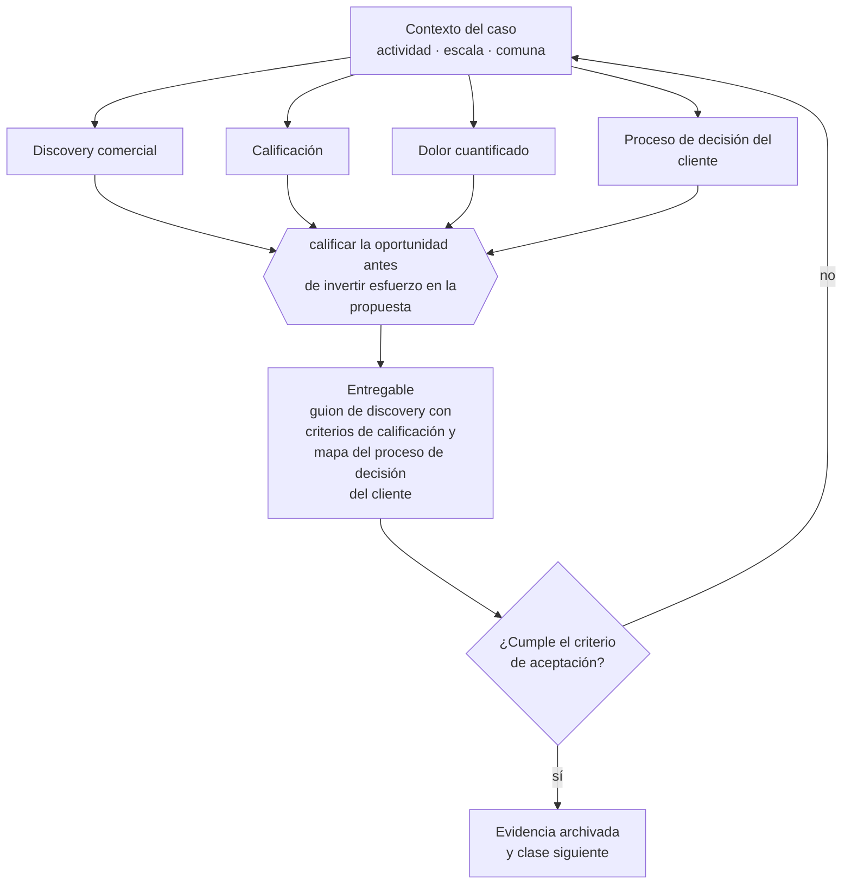

# Clase 189 — Discovery comercial y calificación

> **Parte 14 · Ventas, marketing y experiencia de cliente** — clase 7 de 14

**Estado de evidencia:** `GUIA-PRACTICA` · **Jurisdicción:** Chile-first · **Fecha base normativa:** 07-08-2026 
**Decisión que habilita:** calificar la oportunidad antes de invertir esfuerzo en la propuesta 
**Entregable:** guion de discovery con criterios de calificación y mapa del proceso de decisión del cliente

## 🎯 Propósito

Calificar preguntando por el proceso de decisión del cliente y no solo por su presupuesto, que es lo que hace realista el forecast.

## 📚 Resultados de aprendizaje

Al finalizar esta clase podrás:

1. **Definir** con precisión los cuatro conceptos de la tabla siguiente y usarlos para describir un caso real.
2. **Explicar** por qué esta materia condiciona decisiones de otras partes del programa.
3. **Decidir** —calificar la oportunidad antes de invertir esfuerzo en la propuesta— y justificar la decisión por escrito.
4. **Producir** el entregable de la clase y contrastarlo contra su criterio de aceptación.
5. **Distinguir** el dato estable del dato dinámico que exige revalidación en la fuente oficial.

## 🧩 Conceptos centrales

| Concepto | Comprensión verificable |
|---|---|
| **Discovery comercial** | Conversación que diagnostica antes de proponer. |
| **Calificación** | Evaluación de ajuste, necesidad, presupuesto y decisión. |
| **Dolor cuantificado** | Costo del problema expresado en dinero o tiempo. |
| **Proceso de decisión del cliente** | Pasos internos que la compra debe recorrer. |

## 🗺️ Flujo de razonamiento

## 📖 Desarrollo

### 1. El fondo del asunto

La calificación falla cuando se pregunta por presupuesto y no por proceso de decisión: en muchas empresas chilenas el presupuesto se crea si el caso es bueno, pero el proceso de aprobación es inamovible. Conocerlo temprano evita forecast optimistas que nunca cierran.

### 2. Cómo se traduce en la práctica

En muchas empresas chilenas el presupuesto se crea si el caso es bueno, pero el proceso de aprobación es inamovible: quién firma, con qué documento, en qué instancia y con cuánta anticipación. Conocerlo temprano evita forecast optimistas que nunca cierran y contrataciones basadas en ellos.

### 3. Marco aplicable y quién interviene

- embudo de adquisición y métricas por etapa
- calificación estructurada de oportunidades y discovery comercial
- revenue operations como integración de marketing, ventas y postventa

**Autoridades o contrapartes involucradas:** SERNAC en publicidad y ofertas, SUBTEL y SERNAC en contacto no solicitado.
**Profesionales de apoyo:** responsable comercial, marketing, customer success, abogado de consumo. La participación concreta depende del riesgo, del
tamaño de la empresa y de la actividad económica.

## 🧪 Taller guiado

Aplica esta clase a **una** de las siguientes líneas de negocio y repite después el ejercicio con
una segunda línea de carga regulatoria distinta:

| Línea | Carga regulatoria |
|---|---|
| SaaS B2B con IA | media |
| Servicios profesionales | baja |
| E-commerce D2C | media |
| Alimentos o foodtech | alta |
| Exportación de servicios | media |
| Fintech regulada | alta |
| Construcción o servicios técnicos | alta |

**Secuencia de trabajo:**

1. Delimita el contexto: actividad económica, escala, comuna y etapa de la empresa.
2. Reúne los antecedentes que la decisión exige y anota la fecha de cada fuente.
3. Identifica las alternativas reales, incluida la de no hacer nada.
4. Evalúa el impacto en mercado, caja, personas, regulación y operación.
5. Toma la decisión y regístrala con sus supuestos.
6. Produce el entregable.
7. Contrástalo contra el criterio de aceptación.
8. Anota lo que requiere validación profesional y programa su revisión.

### 📦 Entregable

Guion de discovery con criterios de calificación y mapa del proceso de decisión del cliente.

Debe incluir decisión, supuestos, fuentes con fecha de consulta, responsable, riesgos
identificados y próximos pasos.

## 🏆 Reto verificable

Resuelve la misma materia para una segunda línea de negocio con distinta carga regulatoria y
explica por escrito **qué cambió, por qué y qué fuente lo determina**.

## ✅ Criterio de aceptación

- [ ] el dolor está cuantificado en dinero o tiempo
- [ ] el proceso de decisión del cliente está mapeado
- [ ] cada afirmación regulatoria está referida a una fuente oficial con fecha de consulta;
- [ ] los datos dinámicos quedan marcados para revalidación;
- [ ] hay un responsable asignado y evidencia reproducible del trabajo.

## ⚠️ Errores frecuentes

**Propios de esta clase:**

- Proponer antes de haber cuantificado el dolor.
- Calificar por interés del interlocutor sin conocer el proceso de aprobación.

**Característicos de la parte 14:**

- Publicidad con condiciones no informadas que constituye infracción a la ley del consumidor.
- Pipeline inflado que produce decisiones de contratación equivocadas.

## 🇨🇱 Checklist Chile

- [ ] ¿existe norma o autoridad específica para esta materia?
- [ ] ¿la fuente consultada está vigente a la fecha de ejecución?
- [ ] ¿se activa algún trámite ante el SII?
- [ ] ¿se activa algún requisito municipal o sectorial?
- [ ] ¿afecta a consumidores o al tratamiento de datos personales?
- [ ] ¿afecta a trabajadores o a la seguridad y salud en el trabajo?
- [ ] ¿afecta a impuestos, contabilidad o caja?
- [ ] ¿afecta a contratos o a propiedad intelectual?
- [ ] ¿requiere renovación, reporte periódico o revalidación?

## ❓ Preguntas de comprobación

1. ¿Conoces el proceso interno de aprobación de tus tres oportunidades principales?
2. ¿Está cuantificado en dinero o tiempo el dolor del cliente?
3. ¿Quién firma y qué documento necesita para autorizar?

## 🔗 Fuentes oficiales

**Servicio Nacional del Consumidor — Ley 19.496, comercio electrónico y garantía legal**  
<https://www.sernac.cl/> · verificado 2026-08-19

- *Qué contiene:* Publica la interpretación aplicada de la Ley del Consumidor: deberes de información en la oferta, reglas del comercio electrónico, garantía legal, contratos de adhesión y el procedimiento de reclamos.
- *Cómo leerla:* Entra por el rubro de tu negocio y revisa las alertas y procedimientos colectivos publicados: muestran qué está fiscalizando el servicio ahora, que es mejor predictor de tu riesgo que la lectura abstracta de la ley.
- *Uso en esta clase:* aporta el marco de «Ley 19.496, comercio electrónico y garantía legal» para calificar la oportunidad antes de invertir esfuerzo en la propuesta.

**Biblioteca del Congreso Nacional · LeyChile — Normativa oficial consolidada**  
<https://www.bcn.cl/leychile/> · verificado 2026-08-19

- *Qué contiene:* Publica el texto oficial y consolidado de leyes, decretos y reglamentos, con la versión vigente a una fecha, el historial de modificaciones y la tramitación que las originó.
- *Cómo leerla:* Usa siempre el selector de versión vigente a la fecha en que ejecutarás el trámite, no la última publicada. Y lee el artículo transitorio: en normas en implantación gradual —jornada, datos personales— ahí está la fecha que realmente te aplica.
- *Uso en esta clase:* aporta el marco de «Normativa oficial consolidada» para calificar la oportunidad antes de invertir esfuerzo en la propuesta.

Complementos del repositorio: [glosario](../../../docs/19_GLOSSARY.md) ·
[ruta de lecturas](../../../docs/15_BOOKS_AND_LEARNING_PATH.md) ·
[catálogo de fuentes](../../../docs/16_OFFICIAL_SOURCE_CATALOG.md).

> [!IMPORTANT]
> Material educativo. Para una decisión real de alto impacto hay que verificar la fuente oficial
> vigente y validar con el profesional competente.

---

| Anterior | Índice | Siguiente |
|---|---|---|
| [← 188 · Prospección B2B](../class-06-prospeccion-b2b/README.md) | [Parte 14](../README.md) · [Programa](../../../README.md) | [190 · Propuesta, negociación y cierre →](../class-08-propuesta-negociacion-y-cierre/README.md) |
