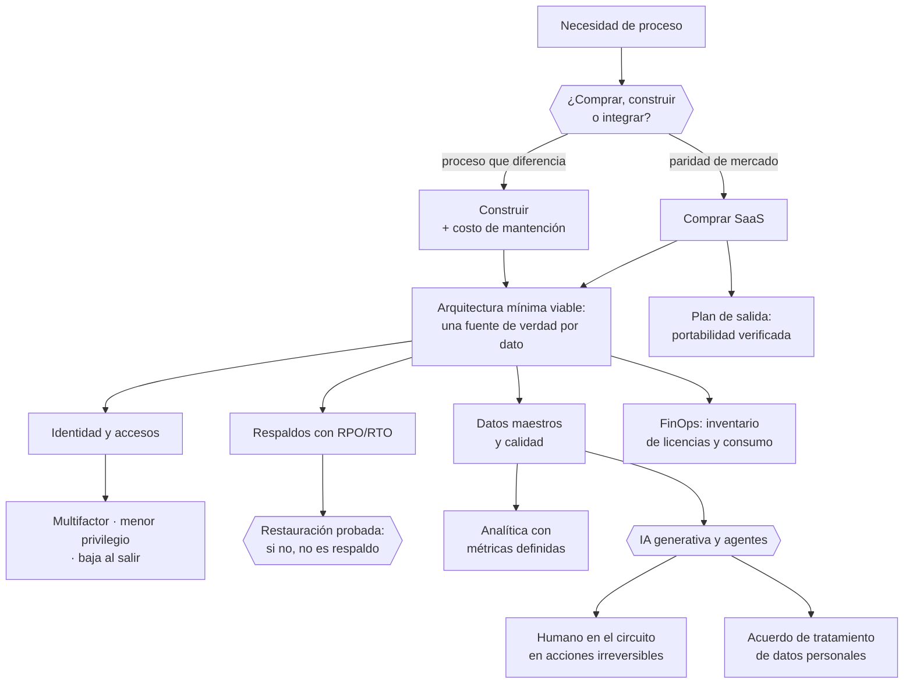

# Parte 15 — Tecnología, datos, IA y operación digital

> *La empresa moderna corre sobre software de terceros*

**Estado de evidencia:** `DINAMICO` · **Clases:** 14 (197–210) · **Fecha base normativa:** 07-08-2026 
**Conceptos definidos en esta parte:** 56

## 🎯 De qué trata esta parte

Casi ninguna pyme construye su tecnología: la contrata. Eso cambia la naturaleza del problema, que deja de ser técnico y pasa a ser de gobierno: qué sistemas son fuente de verdad de qué dato, quién tiene acceso a qué, qué pasa si un proveedor cambia sus reglas y cómo se sale de él. Esta parte trata la arquitectura mínima viable como una decisión de riesgo y costo, no de preferencia.

Cuatro controles cubren la mayor parte del riesgo de seguridad de una empresa pequeña: autenticación multifactor en todos los accesos, actualizaciones al día, respaldos probados con una restauración real, y formación básica del equipo frente a la ingeniería social. Son baratos y se omiten por comodidad hasta el primer fraude por correo. Un respaldo que nunca se restauró no es un respaldo: es una hipótesis.

La incorporación de IA generativa merece su propio marco. El orden razonable es proceso, datos, digitalización y luego modelo, porque automatizar un proceso desordenado produce desorden más rápido. Y cada uso de IA sobre datos de clientes activa obligaciones de protección de datos que hay que resolver antes, con acuerdo de tratamiento y revisión humana en las decisiones con efecto.

## 📚 Resultados de la parte

Al terminar esta parte podrás:

1. **Definir una arquitectura mínima viable y justificar cada pieza por costo y riesgo**.
2. **Implantar identidad, accesos y gestión de secretos con principio de menor privilegio**.
3. **Probar respaldos con una restauración real y no solo confiar en el respaldo programado**.
4. **Usar IA en operaciones con trazabilidad, revisión humana y control de datos**.

## 🗺️ Mapa de la parte

## ⚖️ Marco aplicable

- Ley 21.663 Marco de Ciberseguridad y su reglamentación
- Ley 21.719 en lo relativo a tratamiento automatizado y decisiones basadas en datos
- controles de referencia tipo CIS Controls y NIST CSF adaptados a pyme

**Autoridades o contrapartes:** ANCI, CSIRT Nacional, Agencia de Protección de Datos Personales (en implementación).
**Profesionales de apoyo:** responsable de TI, consultor de ciberseguridad, analista de datos, abogado de datos.

## ⚠️ Riesgos característicos

- Respaldos que nunca se probaron y no restauran cuando se necesitan.
- Accesos compartidos y credenciales que sobreviven a la salida de una persona.
- Cargar datos personales o confidenciales de clientes en herramientas de ia sin base contractual.
- Dependencia de un saas sin plan de salida ni exportación de datos.

## 📘 Las 14 clases

| # | Global | Clase | Decisión que habilita |
|---:|---:|---|---|
| 01 | 197 | [Arquitectura tecnológica mínima viable](class-01-arquitectura-tecnologica-minima-viable/README.md) | definir el conjunto mínimo de sistemas y cuál es fuente de verdad para cada dato |
| 02 | 198 | [Comprar, construir o integrar software](class-02-comprar-construir-o-integrar-software/README.md) | decidir qué se compra, qué se construye y qué se integra |
| 03 | 199 | [Dominio, correo, identidad y accesos](class-03-dominio-correo-identidad-y-accesos/README.md) | definir la administración de identidad y el ciclo de vida de los accesos |
| 04 | 200 | [Cloud, hosting y continuidad](class-04-cloud-hosting-y-continuidad/README.md) | elegir infraestructura considerando disponibilidad, ubicación de datos y costo de salida |
| 05 | 201 | [Backups y recuperación](class-05-backups-y-recuperacion/README.md) | definir RPO, RTO y calendario de pruebas de restauración |
| 06 | 202 | [Ciberseguridad por capas para pyme](class-06-ciberseguridad-por-capas-para-pyme/README.md) | implementar los controles básicos que cubren la mayor parte del riesgo |
| 07 | 203 | [Gestión de secretos y privilegios](class-07-gestion-de-secretos-y-privilegios/README.md) | definir cómo se almacenan, comparten y rotan las credenciales |
| 08 | 204 | [Datos maestros y calidad de datos](class-08-datos-maestros-y-calidad-de-datos/README.md) | definir las entidades maestras, sus reglas de calidad y su responsable |
| 09 | 205 | [Analítica y BI empresarial](class-09-analitica-y-bi-empresarial/README.md) | definir el conjunto de métricas oficiales con fórmula y fuente |
| 10 | 206 | [Automatización de procesos](class-10-automatizacion-de-procesos/README.md) | definir el alcance de la automatización, sus excepciones y su monitoreo |
| 11 | 207 | [IA generativa en operaciones](class-11-ia-generativa-en-operaciones/README.md) | definir casos de uso permitidos, datos autorizados y control de revisión |
| 12 | 208 | [Agentes de IA con humano en el circuito](class-12-agentes-de-ia-con-humano-en-el-circuito/README.md) | definir qué puede ejecutar un agente y qué requiere aprobación humana |
| 13 | 209 | [Riesgo de proveedores tecnológicos y SaaS](class-13-riesgo-de-proveedores-tecnologicos-y-saas/README.md) | definir qué se evalúa antes de contratar un proveedor tecnológico |
| 14 | 210 | [Gobierno tecnológico y costos FinOps](class-14-gobierno-tecnologico-y-costos-finops/README.md) | instalar la revisión periódica de costos y licencias tecnológicas |

## 🔤 Glosario de la parte

| Concepto | Definición operacional |
|---|---|
| **Actualización** | Aplicación de parches de seguridad. |
| **Agente** | Sistema que ejecuta acciones de forma autónoma para lograr un objetivo. |
| **Alcance de acción** | Conjunto de operaciones que el agente puede ejecutar. |
| **Analítica** | Transformación de datos en información para decidir. |
| **Arquitectura mínima viable** | Conjunto mínimo de sistemas que sostiene la operación. |
| **Autenticación multifactor** | Verificación con más de un factor. |
| **Automatización de procesos** | Ejecución sin intervención humana de tareas definidas. |
| **Autoservicio** | Capacidad de los usuarios de obtener información sin intermediarios. |
| **Bloqueo de proveedor** | Dificultad de migrar por dependencia técnica. |
| **Caso de uso acotado** | Aplicación con entrada, salida y criterio de calidad definidos. |
| **Ciclo de vida del acceso** | Alta, modificación y baja de permisos. |
| **Cloud** | Infraestructura contratada como servicio. |
| **Cláusula de salida** | Derecho a terminar y obtener los datos. |
| **Comprar** | Adquirir una solución existente. |
| **Concientización** | Formación de las personas frente a ingeniería social. |
| **Construir** | Desarrollar a medida. |
| **Costo de mantención** | Esfuerzo continuo de sostener lo construido. |
| **Costo total** | Licencias, implementación, soporte y salida. |
| **Cuenta privilegiada** | Acceso con permisos administrativos. |
| **Dato de entrada** | Información que se entrega al modelo, con sus implicancias de confidencialidad. |
| **Dato maestro** | Información de referencia usada por varios procesos. |
| **Defensa en capas** | Controles superpuestos que reducen el riesgo acumulado. |
| **Definición de métrica** | Fórmula y fuente acordadas. |
| **Disponibilidad** | Porcentaje de tiempo operativo comprometido. |
| **Dominio** | Nombre en internet que identifica a la empresa. |
| **Duplicado** | Registro repetido que fragmenta la información. |
| **Evaluación de proveedor** | Revisión de seguridad, continuidad y cumplimiento. |
| **Excepción** | Caso que el flujo automatizado no cubre. |
| **FinOps** | Disciplina de control de costos de servicios en la nube. |
| **Gestor de secretos** | Herramienta que almacena y controla el acceso a credenciales. |
| **Gobierno tecnológico** | Reglas de decisión sobre adquisición y uso de tecnología. |
| **Humano en el circuito** | Punto obligatorio de aprobación antes de una acción con efecto. |
| **IA generativa** | Modelo que produce texto, imagen o código a partir de instrucciones. |
| **Identidad corporativa** | Cuentas de usuario administradas centralmente. |
| **Indicador** | Medida asociada a un objetivo. |
| **Integración** | Conexión que evita reingreso manual de datos. |
| **Integrar** | Conectar soluciones existentes. |
| **Licencia ociosa** | Suscripción pagada y no usada. |
| **Menor privilegio** | Acceso limitado a lo estrictamente necesario. |
| **Monitoreo** | Vigilancia de que la automatización sigue funcionando. |
| **Portabilidad** | Capacidad de exportar datos en formato usable. |
| **Presupuesto tecnológico** | Asignación anual con criterio de priorización. |
| **Prueba de restauración** | Ejercicio que verifica que el respaldo funciona. |
| **Punto de reversión** | Mecanismo para volver al proceso manual. |
| **Región** | Ubicación geográfica de los datos. |
| **Regla de calidad** | Criterio que define un dato válido. |
| **Respaldo** | Copia de datos que permite restaurar. |
| **Responsable del dato** | Persona a cargo de su exactitud. |
| **Revisión humana** | Control que valida la salida antes de que produzca efecto. |
| **Riesgo de proveedor** | Exposición derivada de depender de un tercero tecnológico. |
| **Rotación** | Cambio periódico de credenciales. |
| **RPO** | Máxima pérdida de datos aceptable, medida en tiempo. |
| **RTO** | Tiempo máximo aceptable para restaurar el servicio. |
| **Secreto** | Credencial, clave o token que da acceso a un sistema. |
| **Sistema de registro** | Fuente única de verdad para un tipo de dato. |
| **Trazabilidad** | Registro de qué hizo el agente, con qué datos y con qué resultado. |

## 🔗 Cómo se conecta

Habilita la operación de la parte 13 y el CRM de la parte 14. Sus obligaciones de datos vienen de la parte 11, sus contratos de proveedor de la parte 10, y su continuidad se prueba en el plan de recuperación de la parte 21.

## 📖 Pauta bibliográfica

- Ley 21.663 Marco de Ciberseguridad y Ley 21.719 en tratamiento automatizado.
- CIS Controls v8 — controles priorizados y proporcionales para organizaciones pequeñas.
- NIST Cybersecurity Framework — funciones identificar, proteger, detectar, responder y recuperar.

## 🏛️ Fuentes oficiales de la parte

**Biblioteca del Congreso Nacional · LeyChile — Normativa oficial consolidada**  
<https://www.bcn.cl/leychile/> · verificado 2026-08-07

- *Qué contiene:* Publica el texto oficial y consolidado de leyes, decretos y reglamentos, con la versión vigente a una fecha, el historial de modificaciones y la tramitación que las originó.
- *Cómo leerla:* Usa siempre el selector de versión vigente a la fecha en que ejecutarás el trámite, no la última publicada. Y lee el artículo transitorio: en normas en implantación gradual —jornada, datos personales— ahí está la fecha que realmente te aplica.

**Corporación de Fomento de la Producción — Innovación, inversión y garantías**  
<https://www.corfo.cl/> · verificado 2026-08-07

- *Qué contiene:* Reúne los instrumentos de fomento a la innovación y la inversión, incluidos programas de capital semilla, escalamiento, garantías y cobertura de riesgo para el sistema financiero.
- *Cómo leerla:* Filtra por etapa de la empresa antes que por monto. Y verifica el componente de innovación que exige cada instrumento: presentar una expansión comercial como innovación es la causa más común de rechazo.

---

| Anterior | Índice | Siguiente |
|---|---|---|
| [← Parte 14 · Ventas, marketing y experiencia de cliente](../part-14-ventas-marketing-y-experiencia-de-cliente/README.md) | [Currículo](../../CURRICULUM.md) · [Programa](../../README.md) | [Parte 16 · Financiamiento, banca, fondos e inversión →](../part-16-financiamiento-banca-fondos-e-inversion/README.md) |
