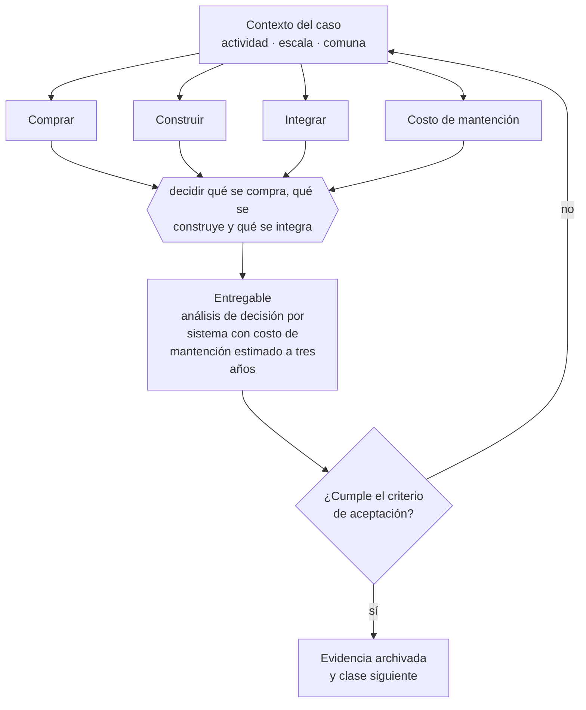

# Clase 198 — Comprar, construir o integrar software

> **Parte 15 · Tecnología, datos, IA y operación digital** — clase 2 de 14

**Estado de evidencia:** `DINAMICO` · **Jurisdicción:** Chile-first · **Fecha base normativa:** 07-08-2026 
**Decisión que habilita:** decidir qué se compra, qué se construye y qué se integra 
**Entregable:** análisis de decisión por sistema con costo de mantención estimado a tres años

## 🎯 Propósito

Decidir comprar, construir o integrar considerando el costo de mantención a tres años, que es lo que más se subestima.

## 📚 Resultados de aprendizaje

Al finalizar esta clase podrás:

1. **Definir** con precisión los cuatro conceptos de la tabla siguiente y usarlos para describir un caso real.
2. **Explicar** por qué esta materia condiciona decisiones de otras partes del programa.
3. **Decidir** —decidir qué se compra, qué se construye y qué se integra— y justificar la decisión por escrito.
4. **Producir** el entregable de la clase y contrastarlo contra su criterio de aceptación.
5. **Distinguir** el dato estable del dato dinámico que exige revalidación en la fuente oficial.

## 🧩 Conceptos centrales

| Concepto | Comprensión verificable |
|---|---|
| **Comprar** | Adquirir una solución existente. |
| **Construir** | Desarrollar a medida. |
| **Integrar** | Conectar soluciones existentes. |
| **Costo de mantención** | Esfuerzo continuo de sostener lo construido. |

## 🗺️ Flujo de razonamiento

## 📖 Desarrollo

### 1. El fondo del asunto

Construir a medida se justifica cuando el proceso es la diferenciación y no existe solución adecuada. En todo lo demás, comprar e integrar es más barato considerando mantención, seguridad y evolución. El costo de mantener software propio se subestima de forma sistemática.

### 2. Cómo se traduce en la práctica

Construir a medida se justifica cuando el proceso es la diferenciación y no existe solución adecuada; en todo lo demás comprar e integrar sale más barato considerando mantención, seguridad y evolución. El software propio no termina cuando se entrega: empieza a costar ahí.

### 3. Marco aplicable y quién interviene

- Ley 21.663 Marco de Ciberseguridad y su reglamentación
- Ley 21.719 en lo relativo a tratamiento automatizado y decisiones basadas en datos
- controles de referencia tipo CIS Controls y NIST CSF adaptados a pyme

**Autoridades o contrapartes involucradas:** ANCI, CSIRT Nacional, Agencia de Protección de Datos Personales (en implementación).
**Profesionales de apoyo:** responsable de TI, consultor de ciberseguridad, analista de datos, abogado de datos. La participación concreta depende del riesgo, del
tamaño de la empresa y de la actividad económica.

## 🧪 Taller guiado

Aplica esta clase a **una** de las siguientes líneas de negocio y repite después el ejercicio con
una segunda línea de carga regulatoria distinta:

| Línea | Carga regulatoria |
|---|---|
| SaaS B2B con IA | media |
| Servicios profesionales | baja |
| E-commerce D2C | media |
| Alimentos o foodtech | alta |
| Exportación de servicios | media |
| Fintech regulada | alta |
| Construcción o servicios técnicos | alta |

**Secuencia de trabajo:**

1. Delimita el contexto: actividad económica, escala, comuna y etapa de la empresa.
2. Reúne los antecedentes que la decisión exige y anota la fecha de cada fuente.
3. Identifica las alternativas reales, incluida la de no hacer nada.
4. Evalúa el impacto en mercado, caja, personas, regulación y operación.
5. Toma la decisión y regístrala con sus supuestos.
6. Produce el entregable.
7. Contrástalo contra el criterio de aceptación.
8. Anota lo que requiere validación profesional y programa su revisión.

### 📦 Entregable

Análisis de decisión por sistema con costo de mantención estimado a tres años.

Debe incluir decisión, supuestos, fuentes con fecha de consulta, responsable, riesgos
identificados y próximos pasos.

## 🏆 Reto verificable

Resuelve la misma materia para una segunda línea de negocio con distinta carga regulatoria y
explica por escrito **qué cambió, por qué y qué fuente lo determina**.

## ✅ Criterio de aceptación

- [ ] la decisión considera costo de mantención a tres años
- [ ] lo construido corresponde a procesos que diferencian
- [ ] cada afirmación regulatoria está referida a una fuente oficial con fecha de consulta;
- [ ] los datos dinámicos quedan marcados para revalidación;
- [ ] hay un responsable asignado y evidencia reproducible del trabajo.

## ⚠️ Errores frecuentes

**Propios de esta clase:**

- Construir a medida procesos que no diferencian.
- Comprar soluciones que no se integran y generar reingreso manual.

**Característicos de la parte 15:**

- Respaldos que nunca se probaron y no restauran cuando se necesitan.
- Accesos compartidos y credenciales que sobreviven a la salida de una persona.

## 🇨🇱 Checklist Chile

- [ ] ¿existe norma o autoridad específica para esta materia?
- [ ] ¿la fuente consultada está vigente a la fecha de ejecución?
- [ ] ¿se activa algún trámite ante el SII?
- [ ] ¿se activa algún requisito municipal o sectorial?
- [ ] ¿afecta a consumidores o al tratamiento de datos personales?
- [ ] ¿afecta a trabajadores o a la seguridad y salud en el trabajo?
- [ ] ¿afecta a impuestos, contabilidad o caja?
- [ ] ¿afecta a contratos o a propiedad intelectual?
- [ ] ¿requiere renovación, reporte periódico o revalidación?

## ❓ Preguntas de comprobación

1. ¿Qué construiste a medida que en realidad no diferencia tu negocio?
2. ¿Cuánto cuesta al año mantener lo que ya construiste?
3. ¿Qué soluciones compradas no se integran y generan reingreso manual?

## 🔗 Fuentes oficiales

**Biblioteca del Congreso Nacional · LeyChile — Normativa oficial consolidada**  
<https://www.bcn.cl/leychile/> · verificado 2026-08-19

- *Qué contiene:* Publica el texto oficial y consolidado de leyes, decretos y reglamentos, con la versión vigente a una fecha, el historial de modificaciones y la tramitación que las originó.
- *Cómo leerla:* Usa siempre el selector de versión vigente a la fecha en que ejecutarás el trámite, no la última publicada. Y lee el artículo transitorio: en normas en implantación gradual —jornada, datos personales— ahí está la fecha que realmente te aplica.
- *Uso en esta clase:* aporta el marco de «Normativa oficial consolidada» para decidir qué se compra, qué se construye y qué se integra.

**Corporación de Fomento de la Producción — Innovación, inversión y garantías**  
<https://www.corfo.cl/> · verificado 2026-08-19

- *Qué contiene:* Reúne los instrumentos de fomento a la innovación y la inversión, incluidos programas de capital semilla, escalamiento, garantías y cobertura de riesgo para el sistema financiero.
- *Cómo leerla:* Filtra por etapa de la empresa antes que por monto. Y verifica el componente de innovación que exige cada instrumento: presentar una expansión comercial como innovación es la causa más común de rechazo.
- *Uso en esta clase:* aporta el marco de «Innovación, inversión y garantías» para decidir qué se compra, qué se construye y qué se integra.

Complementos del repositorio: [glosario](../../../docs/19_GLOSSARY.md) ·
[ruta de lecturas](../../../docs/15_BOOKS_AND_LEARNING_PATH.md) ·
[catálogo de fuentes](../../../docs/16_OFFICIAL_SOURCE_CATALOG.md).

> [!IMPORTANT]
> Material educativo. Para una decisión real de alto impacto hay que verificar la fuente oficial
> vigente y validar con el profesional competente.

---

| Anterior | Índice | Siguiente |
|---|---|---|
| [← 197 · Arquitectura tecnológica mínima viable](../class-01-arquitectura-tecnologica-minima-viable/README.md) | [Parte 15](../README.md) · [Programa](../../../README.md) | [199 · Dominio, correo, identidad y accesos →](../class-03-dominio-correo-identidad-y-accesos/README.md) |
