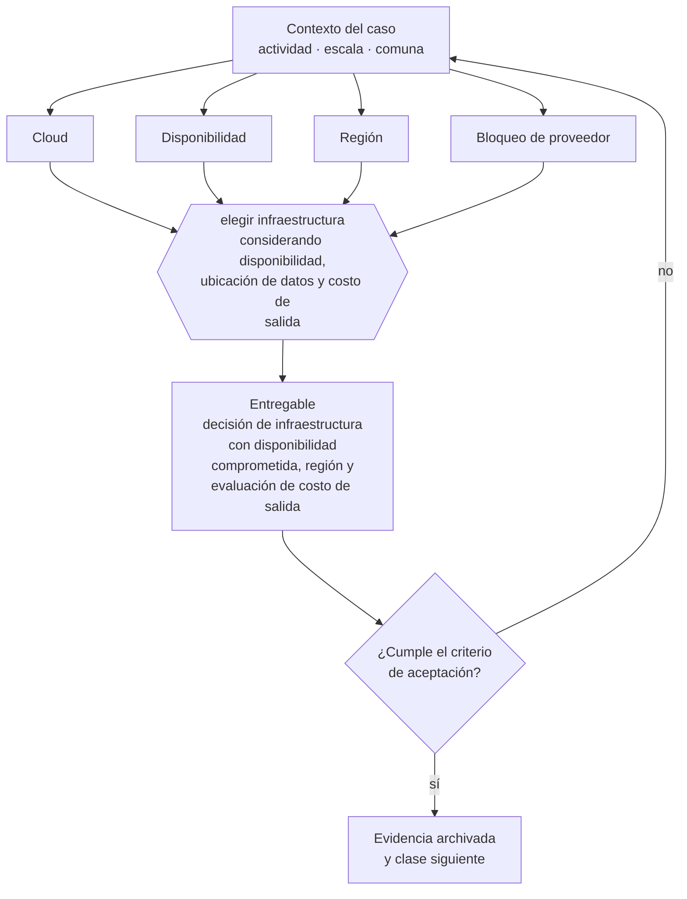

# Clase 200 — Cloud, hosting y continuidad

> **Parte 15 · Tecnología, datos, IA y operación digital** — clase 4 de 14

**Estado de evidencia:** `DINAMICO` · **Jurisdicción:** Chile-first · **Fecha base normativa:** 07-08-2026 
**Decisión que habilita:** elegir infraestructura considerando disponibilidad, ubicación de datos y costo de salida 
**Entregable:** decisión de infraestructura con disponibilidad comprometida, región y evaluación de costo de salida

## 🎯 Propósito

Elegir infraestructura evaluando disponibilidad, ubicación de los datos y costo de salida, no solo precio mensual.

## 📚 Resultados de aprendizaje

Al finalizar esta clase podrás:

1. **Definir** con precisión los cuatro conceptos de la tabla siguiente y usarlos para describir un caso real.
2. **Explicar** por qué esta materia condiciona decisiones de otras partes del programa.
3. **Decidir** —elegir infraestructura considerando disponibilidad, ubicación de datos y costo de salida— y justificar la decisión por escrito.
4. **Producir** el entregable de la clase y contrastarlo contra su criterio de aceptación.
5. **Distinguir** el dato estable del dato dinámico que exige revalidación en la fuente oficial.

## 🧩 Conceptos centrales

| Concepto | Comprensión verificable |
|---|---|
| **Cloud** | Infraestructura contratada como servicio. |
| **Disponibilidad** | Porcentaje de tiempo operativo comprometido. |
| **Región** | Ubicación geográfica de los datos. |
| **Bloqueo de proveedor** | Dificultad de migrar por dependencia técnica. |

## 🗺️ Flujo de razonamiento

## 📖 Desarrollo

### 1. El fondo del asunto

La ubicación de los datos importa por normativa y por latencia. La dependencia del proveedor se acumula silenciosamente con cada servicio propietario que se adopta; evaluar el costo de salida al momento de entrar es lo que mantiene la opción abierta.

### 2. Cómo se traduce en la práctica

La ubicación importa por normativa y por latencia, y con la Ley 21.719 las transferencias internacionales de datos personales tienen exigencias propias. La dependencia del proveedor se acumula silenciosamente con cada servicio propietario adoptado: evaluar el costo de salida al entrar es lo que mantiene la opción abierta.

### 3. Marco aplicable y quién interviene

- Ley 21.663 Marco de Ciberseguridad y su reglamentación
- Ley 21.719 en lo relativo a tratamiento automatizado y decisiones basadas en datos
- controles de referencia tipo CIS Controls y NIST CSF adaptados a pyme

**Autoridades o contrapartes involucradas:** ANCI, CSIRT Nacional, Agencia de Protección de Datos Personales (en implementación).
**Profesionales de apoyo:** responsable de TI, consultor de ciberseguridad, analista de datos, abogado de datos. La participación concreta depende del riesgo, del
tamaño de la empresa y de la actividad económica.

## 🧪 Taller guiado

Aplica esta clase a **una** de las siguientes líneas de negocio y repite después el ejercicio con
una segunda línea de carga regulatoria distinta:

| Línea | Carga regulatoria |
|---|---|
| SaaS B2B con IA | media |
| Servicios profesionales | baja |
| E-commerce D2C | media |
| Alimentos o foodtech | alta |
| Exportación de servicios | media |
| Fintech regulada | alta |
| Construcción o servicios técnicos | alta |

**Secuencia de trabajo:**

1. Delimita el contexto: actividad económica, escala, comuna y etapa de la empresa.
2. Reúne los antecedentes que la decisión exige y anota la fecha de cada fuente.
3. Identifica las alternativas reales, incluida la de no hacer nada.
4. Evalúa el impacto en mercado, caja, personas, regulación y operación.
5. Toma la decisión y regístrala con sus supuestos.
6. Produce el entregable.
7. Contrástalo contra el criterio de aceptación.
8. Anota lo que requiere validación profesional y programa su revisión.

### 📦 Entregable

Decisión de infraestructura con disponibilidad comprometida, región y evaluación de costo de salida.

Debe incluir decisión, supuestos, fuentes con fecha de consulta, responsable, riesgos
identificados y próximos pasos.

## 🏆 Reto verificable

Resuelve la misma materia para una segunda línea de negocio con distinta carga regulatoria y
explica por escrito **qué cambió, por qué y qué fuente lo determina**.

## ✅ Criterio de aceptación

- [ ] la ubicación de los datos está identificada
- [ ] el costo de salida está evaluado
- [ ] cada afirmación regulatoria está referida a una fuente oficial con fecha de consulta;
- [ ] los datos dinámicos quedan marcados para revalidación;
- [ ] hay un responsable asignado y evidencia reproducible del trabajo.

## ⚠️ Errores frecuentes

**Propios de esta clase:**

- Elegir proveedor sin evaluar el costo de una eventual migración.
- Desconocer en qué país residen los datos de clientes.

**Característicos de la parte 15:**

- Respaldos que nunca se probaron y no restauran cuando se necesitan.
- Accesos compartidos y credenciales que sobreviven a la salida de una persona.

## 🇨🇱 Checklist Chile

- [ ] ¿existe norma o autoridad específica para esta materia?
- [ ] ¿la fuente consultada está vigente a la fecha de ejecución?
- [ ] ¿se activa algún trámite ante el SII?
- [ ] ¿se activa algún requisito municipal o sectorial?
- [ ] ¿afecta a consumidores o al tratamiento de datos personales?
- [ ] ¿afecta a trabajadores o a la seguridad y salud en el trabajo?
- [ ] ¿afecta a impuestos, contabilidad o caja?
- [ ] ¿afecta a contratos o a propiedad intelectual?
- [ ] ¿requiere renovación, reporte periódico o revalidación?

## ❓ Preguntas de comprobación

1. ¿En qué país residen los datos de tus clientes y lo sabes con certeza?
2. ¿Cuánto costaría migrar a otro proveedor si tuvieras que hacerlo?
3. ¿Qué disponibilidad te comprometió el proveedor y cómo la verificas?

## 🔗 Fuentes oficiales

**Biblioteca del Congreso Nacional · LeyChile — Normativa oficial consolidada**  
<https://www.bcn.cl/leychile/> · verificado 2026-08-07

- *Qué contiene:* Publica el texto oficial y consolidado de leyes, decretos y reglamentos, con la versión vigente a una fecha, el historial de modificaciones y la tramitación que las originó.
- *Cómo leerla:* Usa siempre el selector de versión vigente a la fecha en que ejecutarás el trámite, no la última publicada. Y lee el artículo transitorio: en normas en implantación gradual —jornada, datos personales— ahí está la fecha que realmente te aplica.

Complementos del repositorio: [glosario](../../../docs/19_GLOSSARY.md) ·
[ruta de lecturas](../../../docs/15_BOOKS_AND_LEARNING_PATH.md) ·
[catálogo de fuentes](../../../docs/16_OFFICIAL_SOURCE_CATALOG.md).

> [!IMPORTANT]
> Material educativo. Para una decisión real de alto impacto hay que verificar la fuente oficial
> vigente y validar con el profesional competente.

---

| Anterior | Índice | Siguiente |
|---|---|---|
| [← 199 · Dominio, correo, identidad y accesos](../class-03-dominio-correo-identidad-y-accesos/README.md) | [Parte 15](../README.md) · [Programa](../../../README.md) | [201 · Backups y recuperación →](../class-05-backups-y-recuperacion/README.md) |
