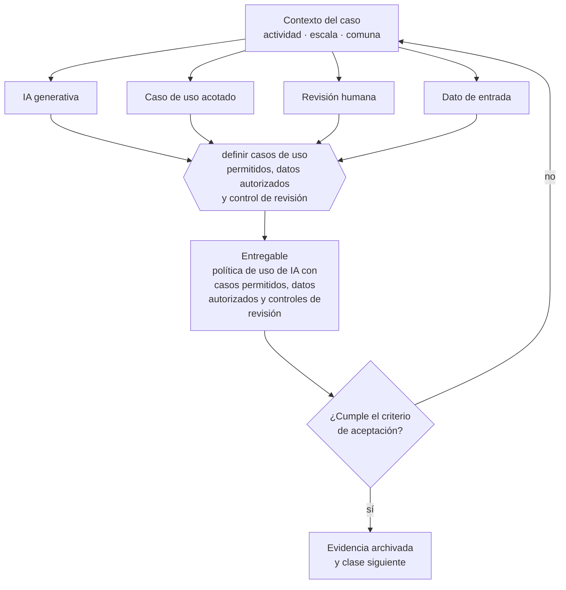

# Clase 207 — IA generativa en operaciones

> **Parte 15 · Tecnología, datos, IA y operación digital** — clase 11 de 14

**Estado de evidencia:** `DINAMICO` · **Jurisdicción:** Chile-first · **Fecha base normativa:** 07-08-2026 
**Decisión que habilita:** definir casos de uso permitidos, datos autorizados y control de revisión 
**Entregable:** política de uso de IA con casos permitidos, datos autorizados y controles de revisión

## 🎯 Propósito

Definir qué datos pueden entregarse a un modelo, quién revisa la salida y qué se registra, antes de incorporar IA a la operación.

## 📚 Resultados de aprendizaje

Al finalizar esta clase podrás:

1. **Definir** con precisión los cuatro conceptos de la tabla siguiente y usarlos para describir un caso real.
2. **Explicar** por qué esta materia condiciona decisiones de otras partes del programa.
3. **Decidir** —definir casos de uso permitidos, datos autorizados y control de revisión— y justificar la decisión por escrito.
4. **Producir** el entregable de la clase y contrastarlo contra su criterio de aceptación.
5. **Distinguir** el dato estable del dato dinámico que exige revalidación en la fuente oficial.

## 🧩 Conceptos centrales

| Concepto | Comprensión verificable |
|---|---|
| **IA generativa** | Modelo que produce texto, imagen o código a partir de instrucciones. |
| **Caso de uso acotado** | Aplicación con entrada, salida y criterio de calidad definidos. |
| **Revisión humana** | Control que valida la salida antes de que produzca efecto. |
| **Dato de entrada** | Información que se entrega al modelo, con sus implicancias de confidencialidad. |

## 🗺️ Flujo de razonamiento

## 📖 Desarrollo

### 1. El fondo del asunto

El uso responsable en operaciones exige tres definiciones: qué datos se pueden entregar al modelo, quién revisa la salida y qué se registra. Entregar datos de clientes a un servicio sin acuerdo de tratamiento puede constituir una cesión no autorizada bajo la normativa de datos personales.

### 2. Cómo se traduce en la práctica

Entregar datos de clientes a un servicio sin acuerdo de tratamiento puede constituir una cesión no autorizada bajo la normativa de datos personales. Y publicar salidas de modelos sin revisión humana en materias de riesgo —legal, tributaria, médica— traslada al cliente un error que la empresa no detectó.

### 3. Marco aplicable y quién interviene

- Ley 21.663 Marco de Ciberseguridad y su reglamentación
- Ley 21.719 en lo relativo a tratamiento automatizado y decisiones basadas en datos
- controles de referencia tipo CIS Controls y NIST CSF adaptados a pyme

**Autoridades o contrapartes involucradas:** ANCI, CSIRT Nacional, Agencia de Protección de Datos Personales (en implementación).
**Profesionales de apoyo:** responsable de TI, consultor de ciberseguridad, analista de datos, abogado de datos. La participación concreta depende del riesgo, del
tamaño de la empresa y de la actividad económica.

## 🧪 Taller guiado

Aplica esta clase a **una** de las siguientes líneas de negocio y repite después el ejercicio con
una segunda línea de carga regulatoria distinta:

| Línea | Carga regulatoria |
|---|---|
| SaaS B2B con IA | media |
| Servicios profesionales | baja |
| E-commerce D2C | media |
| Alimentos o foodtech | alta |
| Exportación de servicios | media |
| Fintech regulada | alta |
| Construcción o servicios técnicos | alta |

**Secuencia de trabajo:**

1. Delimita el contexto: actividad económica, escala, comuna y etapa de la empresa.
2. Reúne los antecedentes que la decisión exige y anota la fecha de cada fuente.
3. Identifica las alternativas reales, incluida la de no hacer nada.
4. Evalúa el impacto en mercado, caja, personas, regulación y operación.
5. Toma la decisión y regístrala con sus supuestos.
6. Produce el entregable.
7. Contrástalo contra el criterio de aceptación.
8. Anota lo que requiere validación profesional y programa su revisión.

### 📦 Entregable

Política de uso de ia con casos permitidos, datos autorizados y controles de revisión.

Debe incluir decisión, supuestos, fuentes con fecha de consulta, responsable, riesgos
identificados y próximos pasos.

## 🏆 Reto verificable

Resuelve la misma materia para una segunda línea de negocio con distinta carga regulatoria y
explica por escrito **qué cambió, por qué y qué fuente lo determina**.

## ✅ Criterio de aceptación

- [ ] los datos autorizados están definidos por categoría
- [ ] cada caso de uso tiene control de revisión asignado
- [ ] cada afirmación regulatoria está referida a una fuente oficial con fecha de consulta;
- [ ] los datos dinámicos quedan marcados para revalidación;
- [ ] hay un responsable asignado y evidencia reproducible del trabajo.

## ⚠️ Errores frecuentes

**Propios de esta clase:**

- Cargar datos personales o confidenciales de clientes sin base contractual.
- Publicar salidas de modelos sin revisión humana en materias de riesgo.

**Característicos de la parte 15:**

- Respaldos que nunca se probaron y no restauran cuando se necesitan.
- Accesos compartidos y credenciales que sobreviven a la salida de una persona.

## 🇨🇱 Checklist Chile

- [ ] ¿existe norma o autoridad específica para esta materia?
- [ ] ¿la fuente consultada está vigente a la fecha de ejecución?
- [ ] ¿se activa algún trámite ante el SII?
- [ ] ¿se activa algún requisito municipal o sectorial?
- [ ] ¿afecta a consumidores o al tratamiento de datos personales?
- [ ] ¿afecta a trabajadores o a la seguridad y salud en el trabajo?
- [ ] ¿afecta a impuestos, contabilidad o caja?
- [ ] ¿afecta a contratos o a propiedad intelectual?
- [ ] ¿requiere renovación, reporte periódico o revalidación?

## ❓ Preguntas de comprobación

1. ¿Qué categorías de datos están autorizadas para entrar a un modelo y quién lo decidió?
2. ¿Tienes acuerdo de tratamiento con el proveedor del modelo?
3. ¿Quién revisa la salida antes de que llegue a un cliente?

## 🔗 Fuentes oficiales

**Biblioteca del Congreso Nacional · LeyChile — Normativa oficial consolidada**  
<https://www.bcn.cl/leychile/> · verificado 2026-08-07

- *Qué contiene:* Publica el texto oficial y consolidado de leyes, decretos y reglamentos, con la versión vigente a una fecha, el historial de modificaciones y la tramitación que las originó.
- *Cómo leerla:* Usa siempre el selector de versión vigente a la fecha en que ejecutarás el trámite, no la última publicada. Y lee el artículo transitorio: en normas en implantación gradual —jornada, datos personales— ahí está la fecha que realmente te aplica.

Complementos del repositorio: [glosario](../../../docs/19_GLOSSARY.md) ·
[ruta de lecturas](../../../docs/15_BOOKS_AND_LEARNING_PATH.md) ·
[catálogo de fuentes](../../../docs/16_OFFICIAL_SOURCE_CATALOG.md).

> [!IMPORTANT]
> Material educativo. Para una decisión real de alto impacto hay que verificar la fuente oficial
> vigente y validar con el profesional competente.

---

| Anterior | Índice | Siguiente |
|---|---|---|
| [← 206 · Automatización de procesos](../class-10-automatizacion-de-procesos/README.md) | [Parte 15](../README.md) · [Programa](../../../README.md) | [208 · Agentes de IA con humano en el circuito →](../class-12-agentes-de-ia-con-humano-en-el-circuito/README.md) |
