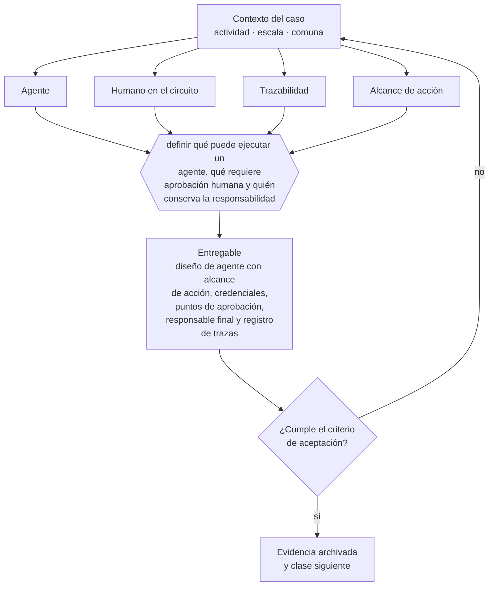

# Clase 208 — Agentes de IA con humano en el circuito

> **Parte 15 · Tecnología, datos, IA y operación digital** — clase 12 de 14

**Estado de evidencia:** `DINAMICO` · **Jurisdicción:** Chile-first · **Fecha base normativa:** 07-08-2026 
**Decisión que habilita:** definir qué puede ejecutar un agente, qué requiere aprobación humana y quién conserva la responsabilidad 
**Entregable:** diseño de agente con alcance de acción, credenciales, puntos de aprobación, responsable final y registro de trazas

## 🎯 Propósito

Limitar el alcance de acción de un agente y exigir aprobación humana en operaciones irreversibles: pagos, envíos, publicaciones y borrados.

## 📚 Resultados de aprendizaje

Al finalizar esta clase podrás:

1. **Definir** con precisión los cuatro conceptos de la tabla siguiente y usarlos para describir un caso real.
2. **Explicar** por qué esta materia condiciona decisiones de otras partes del programa.
3. **Decidir** —definir qué puede ejecutar un agente, qué requiere aprobación humana y quién conserva la responsabilidad— y justificar la decisión por escrito.
4. **Producir** el entregable de la clase y contrastarlo contra su criterio de aceptación.
5. **Distinguir** el dato estable del dato dinámico que exige revalidación en la fuente oficial.

## 🧩 Conceptos centrales

| Concepto | Comprensión verificable |
|---|---|
| **Agente** | Sistema que ejecuta acciones de forma autónoma para lograr un objetivo. |
| **Humano en el circuito** | Punto obligatorio de aprobación antes de una acción con efecto. |
| **Trazabilidad** | Registro de qué hizo el agente, con qué datos y con qué resultado. |
| **Alcance de acción** | Conjunto de operaciones que el agente puede ejecutar. |

## 🗺️ Flujo de razonamiento

## 📖 Desarrollo

### 1. El fondo del asunto

Un agente que actúa sobre sistemas reales debe tener alcance limitado, credenciales propias con menor privilegio y aprobación humana para acciones irreversibles: pagos, envíos, publicaciones y borrados. En actividades reguladas, la revisión debe ubicarse antes del claim, de la decisión clínica, de la dispensación o de la comunicación al cliente; automatizar no cambia quién responde por el resultado. La trazabilidad es lo que permite auditar y corregir cuando algo sale mal.

### 2. Cómo se traduce en la práctica

Un agente con credenciales amplias por comodidad es un riesgo operativo que no se percibe hasta el primer error a escala. La trazabilidad —qué hizo, con qué datos, con qué resultado— es lo que permite auditar y corregir; sin ella, un comportamiento inesperado es imposible de reconstruir.

### 3. Marco aplicable y quién interviene

- Ley 21.663 Marco de Ciberseguridad y su reglamentación
- Ley 21.719 en lo relativo a tratamiento automatizado y decisiones basadas en datos
- controles de referencia tipo CIS Controls y NIST CSF adaptados a pyme

**Autoridades o contrapartes involucradas:** ANCI, CSIRT Nacional, Agencia de Protección de Datos Personales (en implementación).
**Profesionales de apoyo:** responsable de TI, consultor de ciberseguridad, analista de datos, abogado de datos. La participación concreta depende del riesgo, del
tamaño de la empresa y de la actividad económica.

## 🔬 Caso aplicado: MEDVi

[MEDVi: empresa AI-native, red externa y control al crecer](../../../case-studies/21-medvi-empresa-ai-native-y-control.md#7-founder-bottleneck-y-matrices-de-tension)

**Lente para esta clase:** evaluar la tensión automatización × supervisión y responder quién conserva la responsabilidad cuando la ejecución se automatiza o externaliza.

El expediente separa hechos verificados, cifras reportadas, alegaciones periodísticas,
actuaciones regulatorias, respuesta de la empresa e interpretación pedagógica. No uses una
categoría como prueba automática de otra.

## 🧪 Taller guiado

Aplica esta clase a **una** de las siguientes líneas de negocio y repite después el ejercicio con
una segunda línea de carga regulatoria distinta:

| Línea | Carga regulatoria |
|---|---|
| SaaS B2B con IA | media |
| Servicios profesionales | baja |
| E-commerce D2C | media |
| Alimentos o foodtech | alta |
| Exportación de servicios | media |
| Fintech regulada | alta |
| Construcción o servicios técnicos | alta |

**Secuencia de trabajo:**

1. Delimita el contexto: actividad económica, escala, comuna y etapa de la empresa.
2. Reúne los antecedentes que la decisión exige y anota la fecha de cada fuente.
3. Identifica las alternativas reales, incluida la de no hacer nada.
4. Evalúa el impacto en mercado, caja, personas, regulación y operación.
5. Toma la decisión y regístrala con sus supuestos.
6. Produce el entregable.
7. Contrástalo contra el criterio de aceptación.
8. Anota lo que requiere validación profesional y programa su revisión.

### 📦 Entregable

Diseño de agente con alcance de acción, credenciales, puntos de aprobación, responsable final y registro de trazas.

Debe incluir decisión, supuestos, fuentes con fecha de consulta, responsable, riesgos
identificados y próximos pasos.

## 🏆 Reto verificable

Resuelve la misma materia para una segunda línea de negocio con distinta carga regulatoria y
explica por escrito **qué cambió, por qué y qué fuente lo determina**.

## ✅ Criterio de aceptación

- [ ] las acciones reguladas e irreversibles requieren aprobación humana identificada
- [ ] existe registro completo de trazas, excepciones, correcciones y responsable final
- [ ] cada afirmación regulatoria está referida a una fuente oficial con fecha de consulta;
- [ ] los datos dinámicos quedan marcados para revalidación;
- [ ] hay un responsable asignado y evidencia reproducible del trabajo.

## ⚠️ Errores frecuentes

**Propios de esta clase:**

- Medir productividad de la automatización sin medir errores, reclamos, excepciones y cumplimiento.
- Permitir acciones reguladas o irreversibles sin aprobación humana competente.

**Característicos de la parte 15:**

- Respaldos que nunca se probaron y no restauran cuando se necesitan.
- Accesos compartidos y credenciales que sobreviven a la salida de una persona.

## 🇨🇱 Checklist Chile

- [ ] ¿existe norma o autoridad específica para esta materia?
- [ ] ¿la fuente consultada está vigente a la fecha de ejecución?
- [ ] ¿se activa algún trámite ante el SII?
- [ ] ¿se activa algún requisito municipal o sectorial?
- [ ] ¿afecta a consumidores o al tratamiento de datos personales?
- [ ] ¿afecta a trabajadores o a la seguridad y salud en el trabajo?
- [ ] ¿afecta a impuestos, contabilidad o caja?
- [ ] ¿afecta a contratos o a propiedad intelectual?
- [ ] ¿requiere renovación, reporte periódico o revalidación?

## ❓ Preguntas de comprobación

1. ¿Qué acciones puede ejecutar tu agente sin aprobación humana?
2. ¿Tiene credenciales propias con menor privilegio o usa las de una persona?
3. ¿Podrías reconstruir qué hizo el agente hace dos semanas?

## 🔗 Fuentes oficiales

**Biblioteca del Congreso Nacional · LeyChile — Normativa oficial consolidada**  
<https://www.bcn.cl/leychile/> · verificado 2026-09-01

- *Qué contiene:* Publica el texto oficial y consolidado de leyes, decretos y reglamentos, con la versión vigente a una fecha, el historial de modificaciones y la tramitación que las originó.
- *Cómo leerla:* Usa siempre el selector de versión vigente a la fecha en que ejecutarás el trámite, no la última publicada. Y lee el artículo transitorio: en normas en implantación gradual —jornada, datos personales— ahí está la fecha que realmente te aplica.
- *Uso en esta clase:* aporta el marco de «Normativa oficial consolidada» para definir qué puede ejecutar un agente, qué requiere aprobación humana y quién conserva la responsabilidad.

**The New York Times · republicado por GV Wire — A $1.8 Billion Company With Two Employees? AI Made It Possible**  
<https://gvwire.com/2026/04/05/a-1-8-billion-company-with-two-employees-ai-made-it-possible/> · verificado 2026-10-04

- *Qué contiene:* Perfil empresarial que declara acceso del New York Times a estados financieros y contrapartes, y documenta capital inicial, tiempo de construcción, ventas, margen, herramientas de IA, contratistas y proveedores externos.
- *Cómo leerla:* Distingue cifras verificadas por el medio, afirmaciones del fundador y proyecciones. La meta de US$1.800 millones es una proyección de ventas, no valoración; dos empleados no significa dos ejecutores de toda la cadena.
- *Uso en esta clase:* aporta el marco de «A $1.8 Billion Company With Two Employees? AI Made It Possible» para definir qué puede ejecutar un agente, qué requiere aprobación humana y quién conserva la responsabilidad.

**U.S. Food and Drug Administration — MEDVi, LLC dba MEDVi: Warning Letter MARCS-CMS 721455**  
<https://www.fda.gov/inspections-compliance-enforcement-and-criminal-investigations/warning-letters/medvi-llc-dba-medvi-721455-02202026> · verificado 2026-10-04

- *Qué contiene:* Carta de advertencia fechada el 20 de febrero de 2026, dirigida a MEDVi, LLC dba MEDVi, sobre claims y rotulado observados por FDA en medvi.io durante diciembre de 2025.
- *Cómo leerla:* Distingue lo que FDA observó y calificó como misbranding de cualquier conclusión penal o de falsificación. Registra destinatario, dominio, claims, normas citadas, plazo de respuesta y medidas advertidas sin ampliar su alcance.
- *Uso en esta clase:* aporta el marco de «MEDVi, LLC dba MEDVi: Warning Letter MARCS-CMS 721455» para definir qué puede ejecutar un agente, qué requiere aprobación humana y quién conserva la responsabilidad.

**U.S. Food and Drug Administration — FDA's Concerns with Unapproved GLP-1 Drugs Used for Weight Loss**  
<https://www.fda.gov/drugs/drug-alerts-and-statements/fdas-concerns-unapproved-glp-1-drugs-used-weight-loss> · verificado 2026-10-04

- *Qué contiene:* Describe riesgos y señales de alerta de versiones no aprobadas de GLP-1, incluidos claims de equivalencia, dosificación, almacenamiento, formas salinas, productos fraudulentos y reportes de eventos adversos.
- *Cómo leerla:* Separa riesgos generales del mercado de una imputación a una empresa concreta. Usa la carta específica de MEDVi para atribuciones del caso y esta página para el contexto farmacéutico y de telehealth.
- *Uso en esta clase:* aporta el marco de «FDA's Concerns with Unapproved GLP-1 Drugs Used for Weight Loss» para definir qué puede ejecutar un agente, qué requiere aprobación humana y quién conserva la responsabilidad.

Complementos del repositorio: [glosario](../../../docs/19_GLOSSARY.md) ·
[ruta de lecturas](../../../docs/15_BOOKS_AND_LEARNING_PATH.md) ·
[catálogo de fuentes](../../../docs/16_OFFICIAL_SOURCE_CATALOG.md).

> [!IMPORTANT]
> Material educativo. Para una decisión real de alto impacto hay que verificar la fuente oficial
> vigente y validar con el profesional competente.

---

| Anterior | Índice | Siguiente |
|---|---|---|
| [← 207 · IA generativa en operaciones](../class-11-ia-generativa-en-operaciones/README.md) | [Parte 15](../README.md) · [Programa](../../../README.md) | [209 · Riesgo de proveedores tecnológicos y SaaS →](../class-13-riesgo-de-proveedores-tecnologicos-y-saas/README.md) |
