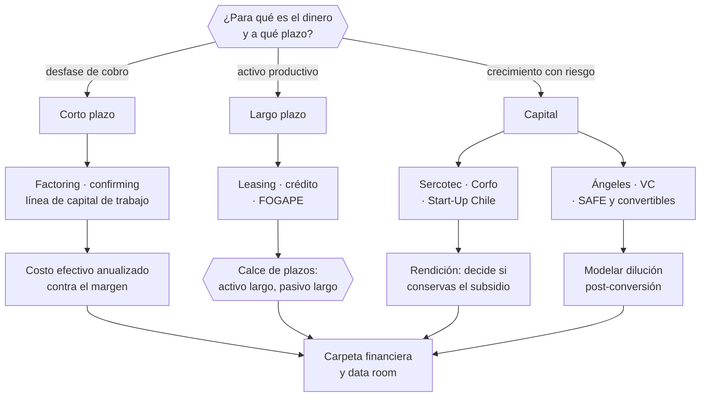

# Parte 16 — Financiamiento, banca, fondos e inversión

> *Financiar es elegir de quién depender*

**Estado de evidencia:** `DINAMICO` · **Clases:** 14 (211–224) · **Fecha base normativa:** 07-08-2026 
**Conceptos definidos en esta parte:** 55

## 🎯 De qué trata esta parte

Cada fuente de financiamiento tiene un dueño, un plazo y una exigencia. La banca pide capacidad de pago demostrable y garantías; los instrumentos públicos piden cumplir un perfil y rendir el gasto; el capital privado pide crecimiento y participación. La decisión correcta no es la más barata sino la que calza con el uso del dinero y con el perfil real del negocio.

La regla técnica que ordena la parte es el calce de plazos: los activos de largo plazo se financian con pasivos de largo plazo. Financiar una máquina con una línea renovable expone a la empresa a que el banco no renueve justo cuando más lo necesita. La segunda regla, menos elegante y más frecuente, es que el factoring resuelve un desfase temporal pero usado de forma estructural consume el margen mes a mes.

En el capital de riesgo la parte es deliberadamente cauta. El modelo de un fondo depende de pocos resultados extraordinarios, de modo que levantar capital de riesgo en un negocio de crecimiento moderado desalinea incentivos y presiona hacia decisiones que destruyen una empresa que era viable. Los instrumentos convertibles, además, se acumulan y convierten juntos: sin modelar la tabla de capitalización post-conversión, nadie sabe qué está entregando.

## 📚 Resultados de la parte

Al terminar esta parte podrás:

1. **Elegir el instrumento de financiamiento coherente con el uso del dinero y el plazo**.
2. **Presentar una carpeta financiera que resista evaluación bancaria**.
3. **Postular a instrumentos públicos con la documentación exigida**.
4. **Entender el costo real de la dilución antes de levantar capital**.

## 🗺️ Mapa de la parte

## ⚖️ Marco aplicable

- FOGAPE y sistema de garantías estatales
- Ley 21.521 Fintec para plataformas de financiamiento colectivo
- instrumentos SAFE, notas convertibles y aumentos de capital en SpA

**Autoridades o contrapartes:** CMF, CORFO, SERCOTEC, BancoEstado y banca comercial.
**Profesionales de apoyo:** CFO, abogado corporativo, asesor financiero, contador.

## ⚠️ Riesgos característicos

- Financiar activos de largo plazo con líneas de corto plazo.
- Usar factoring de forma estructural y erosionar el margen.
- Firmar instrumentos convertibles sin modelar la dilución en el escenario de conversión.
- Postular a fondos públicos sin cumplir el requisito formal y perder la convocatoria.

## 📘 Las 14 clases

| # | Global | Clase | Decisión que habilita |
|---:|---:|---|---|
| 01 | 211 | [Bootstrapping y reinversión](class-01-bootstrapping-y-reinversion/README.md) | decidir si el crecimiento se financia con caja propia o con capital externo |
| 02 | 212 | [Cuenta bancaria, medios de pago y conciliación](class-02-cuenta-bancaria-medios-de-pago-y-conciliacion/README.md) | elegir medios de pago según comisión, plazo de abono y perfil de cliente |
| 03 | 213 | [Crédito comercial y capital de trabajo](class-03-credito-comercial-y-capital-de-trabajo/README.md) | preparar la carpeta bancaria y evaluar las condiciones antes de aceptar |
| 04 | 214 | [Leasing, factoring y confirming](class-04-leasing-factoring-y-confirming/README.md) | determinar qué instrumento corresponde y a qué costo efectivo |
| 05 | 215 | [FOGAPE, garantías y evaluación bancaria](class-05-fogape-garantias-y-evaluacion-bancaria/README.md) | evaluar si corresponde acceder a garantías estatales y qué exige el proceso |
| 06 | 216 | [SERCOTEC y programas de fomento](class-06-sercotec-y-programas-de-fomento/README.md) | determinar a qué instrumentos la empresa es elegible y cuándo postular |
| 07 | 217 | [CORFO y financiamiento para innovación](class-07-corfo-y-financiamiento-para-innovacion/README.md) | determinar si el proyecto califica como innovación y si la contrapartida está disponible |
| 08 | 218 | [Start-Up Chile y ecosistema emprendedor](class-08-start-up-chile-y-ecosistema-emprendedor/README.md) | determinar si el programa aporta lo que la empresa necesita en esta etapa |
| 09 | 219 | [Ángeles y capital semilla privado](class-09-angeles-y-capital-semilla-privado/README.md) | definir qué se busca del inversionista además del capital y qué condiciones se aceptan |
| 10 | 220 | [Venture capital y rondas](class-10-venture-capital-y-rondas/README.md) | determinar si el perfil del negocio es compatible con capital de riesgo |
| 11 | 221 | [SAFE, notas convertibles y equity](class-11-safe-notas-convertibles-y-equity/README.md) | definir qué instrumento se usa y modelar la dilución en la conversión |
| 12 | 222 | [Valoración empresarial básica](class-12-valoracion-empresarial-basica/README.md) | estimar el valor de la empresa e identificar qué lo deprime |
| 13 | 223 | [Data room y due diligence de inversión](class-13-data-room-y-due-diligence-de-inversion/README.md) | preparar el data room y corregir hallazgos antes de abrir el proceso |
| 14 | 224 | [Costo de dilución y estrategia de financiamiento](class-14-costo-de-dilucion-y-estrategia-de-financiamiento/README.md) | planificar la secuencia de financiamiento y qué hito habilita cada ronda |

## 🔤 Glosario de la parte

| Concepto | Definición operacional |
|---|---|
| **Aceleradora** | Programa que aporta capital, mentoría y red a cambio de participación o compromiso. |
| **Bootstrapping** | Financiamiento con recursos propios y con la caja del negocio. |
| **Capital semilla** | Inversión para validar y comenzar a escalar. |
| **Carpeta bancaria** | Documentación exigida para evaluar el crédito. |
| **Cofinanciamiento** | Aporte propio exigido junto al subsidio. |
| **Cohorte** | Grupo de empresas que participa en el mismo período. |
| **Comisión** | Costo del medio de pago sobre la venta. |
| **Comportamiento de pago** | Historial que condiciona el acceso al crédito. |
| **Compromiso de permanencia** | Obligación asociada al beneficio recibido. |
| **Conciliación de recaudación** | Cuadratura entre ventas, abonos y comisiones. |
| **Confirming** | Pago a proveedores gestionado por una entidad financiera. |
| **Contrapartida** | Aporte del beneficiario, en dinero o valorizado. |
| **Control** | Grado de decisión que se conserva al no diluirse. |
| **Conversión** | Momento en que el instrumento se transforma en acciones. |
| **Convocatoria** | Llamado con bases, plazos y requisitos específicos. |
| **CORFO** | Agencia de fomento a la innovación e inversión. |
| **Costo de oportunidad** | Retorno alternativo del capital reinvertido. |
| **Costo efectivo** | Tasa real incluyendo comisiones y plazos. |
| **Covenant** | Condición que el deudor se obliga a mantener. |
| **Data room** | Repositorio ordenado de información para el inversionista. |
| **Descuento por tamaño y dependencia** | Ajuste por riesgo de empresa pequeña o dependiente del fundador. |
| **Descuento y valuation cap** | Mecanismos que fijan el precio de conversión. |
| **Dilución** | Reducción del porcentaje de los accionistas existentes. |
| **Due diligence** | Proceso de verificación previo a la inversión. |
| **Estrategia de financiamiento** | Secuencia planificada de instrumentos y montos. |
| **Evaluación bancaria** | Análisis de capacidad de pago y comportamiento. |
| **Expectativa de retorno** | Múltiplo que el fondo necesita para su propia rentabilidad. |
| **Factoring** | Cesión de facturas para anticipar el cobro. |
| **Flujo descontado** | Valoración por proyección de flujos futuros. |
| **FOGAPE** | Fondo de garantía estatal para pequeños empresarios. |
| **Garantía** | Respaldo exigido para el otorgamiento. |
| **Garantía estatal** | Respaldo que reduce el riesgo del banco. |
| **Hallazgo** | Problema detectado que afecta precio o condiciones. |
| **Innovación** | Desarrollo de solución nueva con riesgo técnico o de mercado. |
| **Instrumento** | Programa específico con objetivo y reglas propias. |
| **Inversionista ángel** | Persona que invierte capital propio en etapa temprana. |
| **Leasing** | Arriendo con opción de compra de un activo. |
| **Línea de crédito** | Cupo disponible para capital de trabajo. |
| **Medio de pago** | Instrumento con el que el cliente paga. |
| **Múltiplo** | Factor aplicado sobre ventas o ebitda según el sector. |
| **Nota convertible** | Préstamo que convierte en participación bajo condiciones. |
| **Plazo de abono** | Tiempo hasta que el dinero está disponible. |
| **Punto de no dilución** | Monto a partir del cual conviene otra fuente. |
| **Red** | Acceso a inversionistas, clientes y talento. |
| **Reinversión** | Utilidad destinada a financiar crecimiento. |
| **Rendición** | Obligación de documentar el uso de los fondos. |
| **Ronda** | Evento de levantamiento con condiciones y monto definidos. |
| **SAFE** | Acuerdo de inversión que convierte en acciones en un evento futuro. |
| **SERCOTEC** | Servicio de apoyo a micro y pequeñas empresas. |
| **Term sheet** | Documento con las condiciones principales de la inversión. |
| **Valor absoluto** | Valor de la participación en dinero, no en porcentaje. |
| **Valoración** | Estimación del valor económico de la empresa. |
| **Valorización pre-money** | Valor de la empresa antes de la inversión. |
| **Venture capital** | Fondo que invierte en empresas de alto crecimiento. |
| **Índice** | Estructura del data room que permite encontrar cada documento. |

## 🔗 Cómo se conecta

Se apoya en los estados financieros de la parte 08 y en las proyecciones de la parte 09. La estructura societaria de la parte 05 determina qué instrumentos son posibles, y el data room que aquí se arma es el mismo que exige la parte 22.

## 📖 Pauta bibliográfica

- Ley 21.521 Fintec y normativa CMF sobre plataformas de financiamiento.
- Feld, B. y Mendelson, J. — *Venture Deals*: qué negocia realmente un term sheet.
- Corfo y Sercotec — bases de convocatorias vigentes, leídas desde la sección de rendición.

## 🏛️ Fuentes oficiales de la parte

**Corporación de Fomento de la Producción — Innovación, inversión y garantías**  
<https://www.corfo.cl/> · verificado 2026-08-07

- *Qué contiene:* Reúne los instrumentos de fomento a la innovación y la inversión, incluidos programas de capital semilla, escalamiento, garantías y cobertura de riesgo para el sistema financiero.
- *Cómo leerla:* Filtra por etapa de la empresa antes que por monto. Y verifica el componente de innovación que exige cada instrumento: presentar una expansión comercial como innovación es la causa más común de rechazo.

**Servicio de Cooperación Técnica — Fomento para micro y pequeñas empresas**  
<https://www.sercotec.cl/> · verificado 2026-08-07

- *Qué contiene:* Publica las convocatorias vigentes con sus bases: perfil de empresa elegible, monto del subsidio, cofinanciamiento exigido, gastos financiables y obligaciones de rendición.
- *Cómo leerla:* Lee las bases desde el final: la sección de rendición decide si podrás quedarte con el subsidio. Muchos proyectos se adjudican y después devuelven fondos por no poder acreditar el gasto en la forma exigida.

**Start-Up Chile · CORFO — Aceleración de startups**  
<https://startupchile.org/> · verificado 2026-08-07

- *Qué contiene:* Describe los programas de aceleración, sus cohortes, el aporte que entregan y las contrapartidas exigidas en permanencia, reporte y actividades.
- *Cómo leerla:* Evalúa el programa por la red y la validación que aporta, no por el monto. La contrapartida de permanencia tiene costo operativo real y debe compararse contra lo que la empresa necesita en su etapa.

**Comisión para el Mercado Financiero — Registro de Prestadores de Servicios Financieros · Ley 21.521**  
<https://www.cmfchile.cl/portal/principal/613/w3-propertyvalue-18591.html> · verificado 2026-08-07

- *Qué contiene:* Establece qué servicios financieros tecnológicos requieren inscripción o autorización ante la CMF, con qué requisitos de capital, gobierno corporativo y gestión de riesgos.
- *Cómo leerla:* Califica primero tu servicio contra la lista de actividades reguladas; el nombre comercial no decide. Si califica, los requisitos de capital y gobierno son la variable que define si el modelo es viable, antes que el producto.

**Biblioteca del Congreso Nacional · LeyChile — Normativa oficial consolidada**  
<https://www.bcn.cl/leychile/> · verificado 2026-08-07

- *Qué contiene:* Publica el texto oficial y consolidado de leyes, decretos y reglamentos, con la versión vigente a una fecha, el historial de modificaciones y la tramitación que las originó.
- *Cómo leerla:* Usa siempre el selector de versión vigente a la fecha en que ejecutarás el trámite, no la última publicada. Y lee el artículo transitorio: en normas en implantación gradual —jornada, datos personales— ahí está la fecha que realmente te aplica.

---

| Anterior | Índice | Siguiente |
|---|---|---|
| [← Parte 15 · Tecnología, datos, IA y operación digital](../part-15-tecnologia-datos-ia-y-operacion-digital/README.md) | [Currículo](../../CURRICULUM.md) · [Programa](../../README.md) | [Parte 17 · Permisos, patentes y regulación sectorial →](../part-17-permisos-patentes-y-regulacion-sectorial/README.md) |
