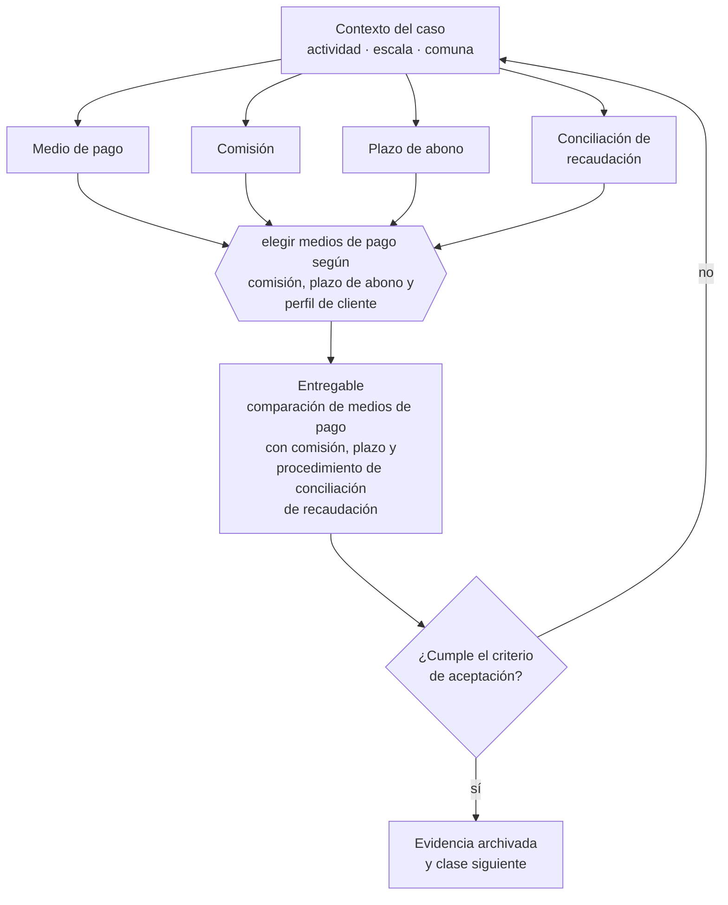

# Clase 212 — Cuenta bancaria, medios de pago y conciliación

> **Parte 16 · Financiamiento, banca, fondos e inversión** — clase 2 de 14

**Estado de evidencia:** `DINAMICO` · **Jurisdicción:** Chile-first · **Fecha base normativa:** 07-08-2026 
**Decisión que habilita:** elegir medios de pago según comisión, plazo de abono y perfil de cliente 
**Entregable:** comparación de medios de pago con comisión, plazo y procedimiento de conciliación de recaudación

## 🎯 Propósito

Elegir medios de pago considerando comisión y plazo de abono, y conciliar la recaudación para detectar abonos faltantes y contracargos.

## 📚 Resultados de aprendizaje

Al finalizar esta clase podrás:

1. **Definir** con precisión los cuatro conceptos de la tabla siguiente y usarlos para describir un caso real.
2. **Explicar** por qué esta materia condiciona decisiones de otras partes del programa.
3. **Decidir** —elegir medios de pago según comisión, plazo de abono y perfil de cliente— y justificar la decisión por escrito.
4. **Producir** el entregable de la clase y contrastarlo contra su criterio de aceptación.
5. **Distinguir** el dato estable del dato dinámico que exige revalidación en la fuente oficial.

## 🧩 Conceptos centrales

| Concepto | Comprensión verificable |
|---|---|
| **Medio de pago** | Instrumento con el que el cliente paga. |
| **Comisión** | Costo del medio de pago sobre la venta. |
| **Plazo de abono** | Tiempo hasta que el dinero está disponible. |
| **Conciliación de recaudación** | Cuadratura entre ventas, abonos y comisiones. |

## 🗺️ Flujo de razonamiento

## 📖 Desarrollo

### 1. El fondo del asunto

Cada medio de pago tiene comisión y plazo de abono distintos, y ambos afectan la caja. La conciliación de recaudación es indispensable: sin ella no se detectan abonos faltantes, comisiones mal aplicadas ni contracargos, que se descubren meses después sin poder reclamarlos.

### 2. Cómo se traduce en la práctica

Cada medio tiene comisión y plazo distintos y ambos afectan la caja. Sin conciliación de recaudación no se detectan abonos que nunca llegaron, comisiones mal aplicadas ni contracargos, y esos hallazgos aparecen meses después cuando ya no se pueden reclamar.

### 3. Marco aplicable y quién interviene

- FOGAPE y sistema de garantías estatales
- Ley 21.521 Fintec para plataformas de financiamiento colectivo
- instrumentos SAFE, notas convertibles y aumentos de capital en SpA

**Autoridades o contrapartes involucradas:** CMF, CORFO, SERCOTEC, BancoEstado y banca comercial.
**Profesionales de apoyo:** CFO, abogado corporativo, asesor financiero, contador. La participación concreta depende del riesgo, del
tamaño de la empresa y de la actividad económica.

## 🧪 Taller guiado

Aplica esta clase a **una** de las siguientes líneas de negocio y repite después el ejercicio con
una segunda línea de carga regulatoria distinta:

| Línea | Carga regulatoria |
|---|---|
| SaaS B2B con IA | media |
| Servicios profesionales | baja |
| E-commerce D2C | media |
| Alimentos o foodtech | alta |
| Exportación de servicios | media |
| Fintech regulada | alta |
| Construcción o servicios técnicos | alta |

**Secuencia de trabajo:**

1. Delimita el contexto: actividad económica, escala, comuna y etapa de la empresa.
2. Reúne los antecedentes que la decisión exige y anota la fecha de cada fuente.
3. Identifica las alternativas reales, incluida la de no hacer nada.
4. Evalúa el impacto en mercado, caja, personas, regulación y operación.
5. Toma la decisión y regístrala con sus supuestos.
6. Produce el entregable.
7. Contrástalo contra el criterio de aceptación.
8. Anota lo que requiere validación profesional y programa su revisión.

### 📦 Entregable

Comparación de medios de pago con comisión, plazo y procedimiento de conciliación de recaudación.

Debe incluir decisión, supuestos, fuentes con fecha de consulta, responsable, riesgos
identificados y próximos pasos.

## 🏆 Reto verificable

Resuelve la misma materia para una segunda línea de negocio con distinta carga regulatoria y
explica por escrito **qué cambió, por qué y qué fuente lo determina**.

## ✅ Criterio de aceptación

- [ ] la comparación incluye comisión y plazo de abono
- [ ] existe procedimiento de conciliación con periodicidad definida
- [ ] cada afirmación regulatoria está referida a una fuente oficial con fecha de consulta;
- [ ] los datos dinámicos quedan marcados para revalidación;
- [ ] hay un responsable asignado y evidencia reproducible del trabajo.

## ⚠️ Errores frecuentes

**Propios de esta clase:**

- Elegir medio de pago por comisión sin considerar el plazo de abono.
- No conciliar la recaudación y perder abonos no acreditados.

**Característicos de la parte 16:**

- Financiar activos de largo plazo con líneas de corto plazo.
- Usar factoring de forma estructural y erosionar el margen.

## 🇨🇱 Checklist Chile

- [ ] ¿existe norma o autoridad específica para esta materia?
- [ ] ¿la fuente consultada está vigente a la fecha de ejecución?
- [ ] ¿se activa algún trámite ante el SII?
- [ ] ¿se activa algún requisito municipal o sectorial?
- [ ] ¿afecta a consumidores o al tratamiento de datos personales?
- [ ] ¿afecta a trabajadores o a la seguridad y salud en el trabajo?
- [ ] ¿afecta a impuestos, contabilidad o caja?
- [ ] ¿afecta a contratos o a propiedad intelectual?
- [ ] ¿requiere renovación, reporte periódico o revalidación?

## ❓ Preguntas de comprobación

1. ¿Cuál es la comisión y el plazo de abono de cada medio de pago que usas?
2. ¿Concilias lo vendido contra lo efectivamente abonado y con qué frecuencia?
3. ¿Cuántos contracargos tuviste el último año y los detectaste a tiempo?

## 🔗 Fuentes oficiales

**Comisión para el Mercado Financiero — Registro de Prestadores de Servicios Financieros · Ley 21.521**  
<https://www.cmfchile.cl/portal/principal/613/w3-propertyvalue-18591.html> · verificado 2026-08-07

- *Qué contiene:* Establece qué servicios financieros tecnológicos requieren inscripción o autorización ante la CMF, con qué requisitos de capital, gobierno corporativo y gestión de riesgos.
- *Cómo leerla:* Califica primero tu servicio contra la lista de actividades reguladas; el nombre comercial no decide. Si califica, los requisitos de capital y gobierno son la variable que define si el modelo es viable, antes que el producto.

Complementos del repositorio: [glosario](../../../docs/19_GLOSSARY.md) ·
[ruta de lecturas](../../../docs/15_BOOKS_AND_LEARNING_PATH.md) ·
[catálogo de fuentes](../../../docs/16_OFFICIAL_SOURCE_CATALOG.md).

> [!IMPORTANT]
> Material educativo. Para una decisión real de alto impacto hay que verificar la fuente oficial
> vigente y validar con el profesional competente.

---

| Anterior | Índice | Siguiente |
|---|---|---|
| [← 211 · Bootstrapping y reinversión](../class-01-bootstrapping-y-reinversion/README.md) | [Parte 16](../README.md) · [Programa](../../../README.md) | [213 · Crédito comercial y capital de trabajo →](../class-03-credito-comercial-y-capital-de-trabajo/README.md) |
