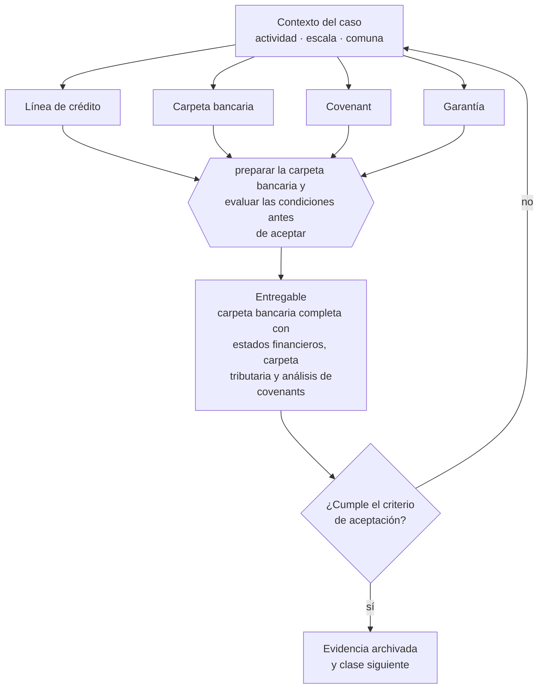

# Clase 213 — Crédito comercial y capital de trabajo

> **Parte 16 · Financiamiento, banca, fondos e inversión** — clase 3 de 14

**Estado de evidencia:** `DINAMICO` · **Jurisdicción:** Chile-first · **Fecha base normativa:** 07-08-2026 
**Decisión que habilita:** preparar la carpeta bancaria y evaluar las condiciones antes de aceptar 
**Entregable:** carpeta bancaria completa con estados financieros, carpeta tributaria y análisis de covenants

## 🎯 Propósito

Preparar la carpeta bancaria completa antes de solicitar crédito, porque la calidad de la información cambia materialmente las condiciones ofrecidas.

## 📚 Resultados de aprendizaje

Al finalizar esta clase podrás:

1. **Definir** con precisión los cuatro conceptos de la tabla siguiente y usarlos para describir un caso real.
2. **Explicar** por qué esta materia condiciona decisiones de otras partes del programa.
3. **Decidir** —preparar la carpeta bancaria y evaluar las condiciones antes de aceptar— y justificar la decisión por escrito.
4. **Producir** el entregable de la clase y contrastarlo contra su criterio de aceptación.
5. **Distinguir** el dato estable del dato dinámico que exige revalidación en la fuente oficial.

## 🧩 Conceptos centrales

| Concepto | Comprensión verificable |
|---|---|
| **Línea de crédito** | Cupo disponible para capital de trabajo. |
| **Carpeta bancaria** | Documentación exigida para evaluar el crédito. |
| **Covenant** | Condición que el deudor se obliga a mantener. |
| **Garantía** | Respaldo exigido para el otorgamiento. |

## 🗺️ Flujo de razonamiento

## 📖 Desarrollo

### 1. El fondo del asunto

El banco evalúa capacidad de pago, comportamiento histórico y garantías. Presentar estados financieros ordenados y carpeta tributaria al día cambia materialmente las condiciones ofrecidas. Los covenants deben leerse antes de firmar: incumplirlos puede hacer exigible toda la deuda.

### 2. Cómo se traduce en la práctica

El banco evalúa capacidad de pago, comportamiento histórico y garantías, y presentar estados financieros ordenados con carpeta tributaria al día mejora la oferta. Los covenants deben leerse antes de firmar: incumplirlos puede hacer exigible toda la deuda de forma anticipada.

### 3. Marco aplicable y quién interviene

- FOGAPE y sistema de garantías estatales
- Ley 21.521 Fintec para plataformas de financiamiento colectivo
- instrumentos SAFE, notas convertibles y aumentos de capital en SpA

**Autoridades o contrapartes involucradas:** CMF, CORFO, SERCOTEC, BancoEstado y banca comercial.
**Profesionales de apoyo:** CFO, abogado corporativo, asesor financiero, contador. La participación concreta depende del riesgo, del
tamaño de la empresa y de la actividad económica.

## 🧪 Taller guiado

Aplica esta clase a **una** de las siguientes líneas de negocio y repite después el ejercicio con
una segunda línea de carga regulatoria distinta:

| Línea | Carga regulatoria |
|---|---|
| SaaS B2B con IA | media |
| Servicios profesionales | baja |
| E-commerce D2C | media |
| Alimentos o foodtech | alta |
| Exportación de servicios | media |
| Fintech regulada | alta |
| Construcción o servicios técnicos | alta |

**Secuencia de trabajo:**

1. Delimita el contexto: actividad económica, escala, comuna y etapa de la empresa.
2. Reúne los antecedentes que la decisión exige y anota la fecha de cada fuente.
3. Identifica las alternativas reales, incluida la de no hacer nada.
4. Evalúa el impacto en mercado, caja, personas, regulación y operación.
5. Toma la decisión y regístrala con sus supuestos.
6. Produce el entregable.
7. Contrástalo contra el criterio de aceptación.
8. Anota lo que requiere validación profesional y programa su revisión.

### 📦 Entregable

Carpeta bancaria completa con estados financieros, carpeta tributaria y análisis de covenants.

Debe incluir decisión, supuestos, fuentes con fecha de consulta, responsable, riesgos
identificados y próximos pasos.

## 🏆 Reto verificable

Resuelve la misma materia para una segunda línea de negocio con distinta carga regulatoria y
explica por escrito **qué cambió, por qué y qué fuente lo determina**.

## ✅ Criterio de aceptación

- [ ] la carpeta incluye estados financieros y carpeta tributaria vigente
- [ ] los covenants están evaluados contra la proyección financiera
- [ ] cada afirmación regulatoria está referida a una fuente oficial con fecha de consulta;
- [ ] los datos dinámicos quedan marcados para revalidación;
- [ ] hay un responsable asignado y evidencia reproducible del trabajo.

## ⚠️ Errores frecuentes

**Propios de esta clase:**

- Solicitar crédito con información contable desordenada y aceptar peores condiciones.
- Firmar covenants sin verificar que la empresa puede cumplirlos.

**Característicos de la parte 16:**

- Financiar activos de largo plazo con líneas de corto plazo.
- Usar factoring de forma estructural y erosionar el margen.

## 🇨🇱 Checklist Chile

- [ ] ¿existe norma o autoridad específica para esta materia?
- [ ] ¿la fuente consultada está vigente a la fecha de ejecución?
- [ ] ¿se activa algún trámite ante el SII?
- [ ] ¿se activa algún requisito municipal o sectorial?
- [ ] ¿afecta a consumidores o al tratamiento de datos personales?
- [ ] ¿afecta a trabajadores o a la seguridad y salud en el trabajo?
- [ ] ¿afecta a impuestos, contabilidad o caja?
- [ ] ¿afecta a contratos o a propiedad intelectual?
- [ ] ¿requiere renovación, reporte periódico o revalidación?

## ❓ Preguntas de comprobación

1. ¿Tienes estados financieros ordenados y carpeta tributaria vigente para presentar?
2. ¿Qué covenants te propusieron y podrías cumplirlos en tu escenario conservador?
3. ¿Cómo se ve tu comportamiento de pago desde afuera hoy?

## 🔗 Fuentes oficiales

**Servicio de Impuestos Internos — Carpeta Tributaria Electrónica**  
<https://zeus.sii.cl/dii_doc/carpeta_tributaria/html/generar_carpeta.htm> · verificado 2026-08-07

- *Qué contiene:* Permite generar el expediente que acredita la situación tributaria de la empresa: inicio de actividades, régimen, declaraciones presentadas y timbraje.
- *Cómo leerla:* Es el documento que pedirán banco, inversionista y comprador. Genera una hoy aunque no la necesites: lo que muestre es exactamente lo que verá un tercero al evaluarte.

**Comisión para el Mercado Financiero — Registro de Prestadores de Servicios Financieros · Ley 21.521**  
<https://www.cmfchile.cl/portal/principal/613/w3-propertyvalue-18591.html> · verificado 2026-08-07

- *Qué contiene:* Establece qué servicios financieros tecnológicos requieren inscripción o autorización ante la CMF, con qué requisitos de capital, gobierno corporativo y gestión de riesgos.
- *Cómo leerla:* Califica primero tu servicio contra la lista de actividades reguladas; el nombre comercial no decide. Si califica, los requisitos de capital y gobierno son la variable que define si el modelo es viable, antes que el producto.

Complementos del repositorio: [glosario](../../../docs/19_GLOSSARY.md) ·
[ruta de lecturas](../../../docs/15_BOOKS_AND_LEARNING_PATH.md) ·
[catálogo de fuentes](../../../docs/16_OFFICIAL_SOURCE_CATALOG.md).

> [!IMPORTANT]
> Material educativo. Para una decisión real de alto impacto hay que verificar la fuente oficial
> vigente y validar con el profesional competente.

---

| Anterior | Índice | Siguiente |
|---|---|---|
| [← 212 · Cuenta bancaria, medios de pago y conciliación](../class-02-cuenta-bancaria-medios-de-pago-y-conciliacion/README.md) | [Parte 16](../README.md) · [Programa](../../../README.md) | [214 · Leasing, factoring y confirming →](../class-04-leasing-factoring-y-confirming/README.md) |
