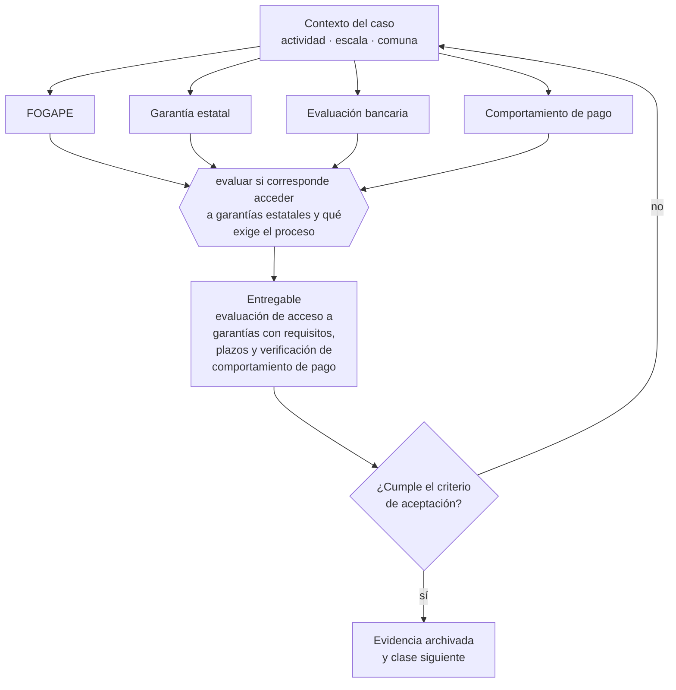

# Clase 215 — FOGAPE, garantías y evaluación bancaria

> **Parte 16 · Financiamiento, banca, fondos e inversión** — clase 5 de 14

**Estado de evidencia:** `DINAMICO` · **Jurisdicción:** Chile-first · **Fecha base normativa:** 07-08-2026 
**Decisión que habilita:** evaluar si corresponde acceder a garantías estatales y qué exige el proceso 
**Entregable:** evaluación de acceso a garantías con requisitos, plazos y verificación de comportamiento de pago

## 🎯 Propósito

Entender que las garantías estatales facilitan el acceso pero no reemplazan la evaluación de capacidad de pago.

## 📚 Resultados de aprendizaje

Al finalizar esta clase podrás:

1. **Definir** con precisión los cuatro conceptos de la tabla siguiente y usarlos para describir un caso real.
2. **Explicar** por qué esta materia condiciona decisiones de otras partes del programa.
3. **Decidir** —evaluar si corresponde acceder a garantías estatales y qué exige el proceso— y justificar la decisión por escrito.
4. **Producir** el entregable de la clase y contrastarlo contra su criterio de aceptación.
5. **Distinguir** el dato estable del dato dinámico que exige revalidación en la fuente oficial.

## 🧩 Conceptos centrales

| Concepto | Comprensión verificable |
|---|---|
| **FOGAPE** | Fondo de garantía estatal para pequeños empresarios. |
| **Garantía estatal** | Respaldo que reduce el riesgo del banco. |
| **Evaluación bancaria** | Análisis de capacidad de pago y comportamiento. |
| **Comportamiento de pago** | Historial que condiciona el acceso al crédito. |

## 🗺️ Flujo de razonamiento

## 📖 Desarrollo

### 1. El fondo del asunto

Las garantías estatales no reemplazan la evaluación bancaria: facilitan el acceso reduciendo el riesgo del banco, pero la empresa debe demostrar capacidad de pago igual. Mantener limpio el comportamiento de pago —proveedores, impuestos, cotizaciones— es lo que determina el acceso futuro.

### 2. Cómo se traduce en la práctica

Reducen el riesgo del banco, no el requisito de demostrar que se puede pagar. Y el comportamiento de pago —proveedores, impuestos, cotizaciones— es lo que determina el acceso futuro: deteriorarlo para aliviar un mes cierra puertas por años, que es un costo que no aparece en ninguna planilla.

### 3. Marco aplicable y quién interviene

- FOGAPE y sistema de garantías estatales
- Ley 21.521 Fintec para plataformas de financiamiento colectivo
- instrumentos SAFE, notas convertibles y aumentos de capital en SpA

**Autoridades o contrapartes involucradas:** CMF, CORFO, SERCOTEC, BancoEstado y banca comercial.
**Profesionales de apoyo:** CFO, abogado corporativo, asesor financiero, contador. La participación concreta depende del riesgo, del
tamaño de la empresa y de la actividad económica.

## 🧪 Taller guiado

Aplica esta clase a **una** de las siguientes líneas de negocio y repite después el ejercicio con
una segunda línea de carga regulatoria distinta:

| Línea | Carga regulatoria |
|---|---|
| SaaS B2B con IA | media |
| Servicios profesionales | baja |
| E-commerce D2C | media |
| Alimentos o foodtech | alta |
| Exportación de servicios | media |
| Fintech regulada | alta |
| Construcción o servicios técnicos | alta |

**Secuencia de trabajo:**

1. Delimita el contexto: actividad económica, escala, comuna y etapa de la empresa.
2. Reúne los antecedentes que la decisión exige y anota la fecha de cada fuente.
3. Identifica las alternativas reales, incluida la de no hacer nada.
4. Evalúa el impacto en mercado, caja, personas, regulación y operación.
5. Toma la decisión y regístrala con sus supuestos.
6. Produce el entregable.
7. Contrástalo contra el criterio de aceptación.
8. Anota lo que requiere validación profesional y programa su revisión.

### 📦 Entregable

Evaluación de acceso a garantías con requisitos, plazos y verificación de comportamiento de pago.

Debe incluir decisión, supuestos, fuentes con fecha de consulta, responsable, riesgos
identificados y próximos pasos.

## 🏆 Reto verificable

Resuelve la misma materia para una segunda línea de negocio con distinta carga regulatoria y
explica por escrito **qué cambió, por qué y qué fuente lo determina**.

## ✅ Criterio de aceptación

- [ ] los requisitos vigentes están verificados en fuente oficial
- [ ] el comportamiento de pago de la empresa está revisado
- [ ] cada afirmación regulatoria está referida a una fuente oficial con fecha de consulta;
- [ ] los datos dinámicos quedan marcados para revalidación;
- [ ] hay un responsable asignado y evidencia reproducible del trabajo.

## ⚠️ Errores frecuentes

**Propios de esta clase:**

- Asumir que la garantía estatal reemplaza la evaluación de capacidad de pago.
- Deteriorar el comportamiento de pago y perder acceso a financiamiento futuro.

**Característicos de la parte 16:**

- Financiar activos de largo plazo con líneas de corto plazo.
- Usar factoring de forma estructural y erosionar el margen.

## 🇨🇱 Checklist Chile

- [ ] ¿existe norma o autoridad específica para esta materia?
- [ ] ¿la fuente consultada está vigente a la fecha de ejecución?
- [ ] ¿se activa algún trámite ante el SII?
- [ ] ¿se activa algún requisito municipal o sectorial?
- [ ] ¿afecta a consumidores o al tratamiento de datos personales?
- [ ] ¿afecta a trabajadores o a la seguridad y salud en el trabajo?
- [ ] ¿afecta a impuestos, contabilidad o caja?
- [ ] ¿afecta a contratos o a propiedad intelectual?
- [ ] ¿requiere renovación, reporte periódico o revalidación?

## ❓ Preguntas de comprobación

1. ¿Cumples los requisitos vigentes del instrumento de garantía que buscas?
2. ¿Cómo está tu comportamiento de pago en los registros que consulta el banco?
3. ¿Qué deuda estás postergando que afectará tu acceso a crédito futuro?

## 🔗 Fuentes oficiales

**Corporación de Fomento de la Producción — Innovación, inversión y garantías**  
<https://www.corfo.cl/> · verificado 2026-08-07

- *Qué contiene:* Reúne los instrumentos de fomento a la innovación y la inversión, incluidos programas de capital semilla, escalamiento, garantías y cobertura de riesgo para el sistema financiero.
- *Cómo leerla:* Filtra por etapa de la empresa antes que por monto. Y verifica el componente de innovación que exige cada instrumento: presentar una expansión comercial como innovación es la causa más común de rechazo.

**Comisión para el Mercado Financiero — Registro de Prestadores de Servicios Financieros · Ley 21.521**  
<https://www.cmfchile.cl/portal/principal/613/w3-propertyvalue-18591.html> · verificado 2026-08-07

- *Qué contiene:* Establece qué servicios financieros tecnológicos requieren inscripción o autorización ante la CMF, con qué requisitos de capital, gobierno corporativo y gestión de riesgos.
- *Cómo leerla:* Califica primero tu servicio contra la lista de actividades reguladas; el nombre comercial no decide. Si califica, los requisitos de capital y gobierno son la variable que define si el modelo es viable, antes que el producto.

Complementos del repositorio: [glosario](../../../docs/19_GLOSSARY.md) ·
[ruta de lecturas](../../../docs/15_BOOKS_AND_LEARNING_PATH.md) ·
[catálogo de fuentes](../../../docs/16_OFFICIAL_SOURCE_CATALOG.md).

> [!IMPORTANT]
> Material educativo. Para una decisión real de alto impacto hay que verificar la fuente oficial
> vigente y validar con el profesional competente.

---

| Anterior | Índice | Siguiente |
|---|---|---|
| [← 214 · Leasing, factoring y confirming](../class-04-leasing-factoring-y-confirming/README.md) | [Parte 16](../README.md) · [Programa](../../../README.md) | [216 · SERCOTEC y programas de fomento →](../class-06-sercotec-y-programas-de-fomento/README.md) |
