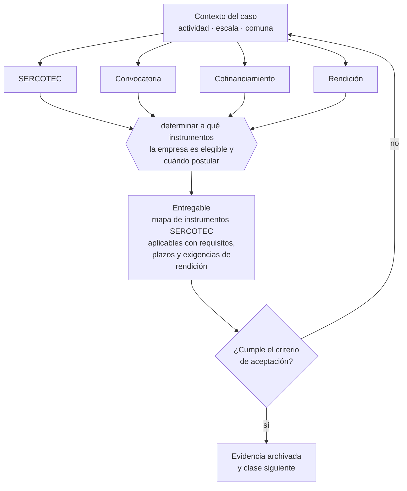

# Clase 216 — SERCOTEC y programas de fomento

> **Parte 16 · Financiamiento, banca, fondos e inversión** — clase 6 de 14

**Estado de evidencia:** `DINAMICO` · **Jurisdicción:** Chile-first · **Fecha base normativa:** 07-08-2026 
**Decisión que habilita:** determinar a qué instrumentos la empresa es elegible y cuándo postular 
**Entregable:** mapa de instrumentos SERCOTEC aplicables con requisitos, plazos y exigencias de rendición

## 🎯 Propósito

Verificar la elegibilidad contra las bases vigentes y planificar la rendición antes de postular, porque ahí se pierden los fondos adjudicados.

## 📚 Resultados de aprendizaje

Al finalizar esta clase podrás:

1. **Definir** con precisión los cuatro conceptos de la tabla siguiente y usarlos para describir un caso real.
2. **Explicar** por qué esta materia condiciona decisiones de otras partes del programa.
3. **Decidir** —determinar a qué instrumentos la empresa es elegible y cuándo postular— y justificar la decisión por escrito.
4. **Producir** el entregable de la clase y contrastarlo contra su criterio de aceptación.
5. **Distinguir** el dato estable del dato dinámico que exige revalidación en la fuente oficial.

## 🧩 Conceptos centrales

| Concepto | Comprensión verificable |
|---|---|
| **SERCOTEC** | Servicio de apoyo a micro y pequeñas empresas. |
| **Convocatoria** | Llamado con bases, plazos y requisitos específicos. |
| **Cofinanciamiento** | Aporte propio exigido junto al subsidio. |
| **Rendición** | Obligación de documentar el uso de los fondos. |

## 🗺️ Flujo de razonamiento

## 📖 Desarrollo

### 1. El fondo del asunto

Los instrumentos de fomento se pierden por errores formales más que por calidad del proyecto: postulaciones fuera de plazo, documentación incompleta o empresa que no cumple el perfil. La rendición posterior exige respaldo documental estricto; sin él, el subsidio debe devolverse.

### 2. Cómo se traduce en la práctica

Los instrumentos de fomento se pierden por errores formales más que por calidad del proyecto: postulaciones fuera de plazo, documentación incompleta o perfil de empresa que no calza. Y la rendición exige respaldo documental estricto: sin él, el subsidio debe devolverse.

### 3. Marco aplicable y quién interviene

- FOGAPE y sistema de garantías estatales
- Ley 21.521 Fintec para plataformas de financiamiento colectivo
- instrumentos SAFE, notas convertibles y aumentos de capital en SpA

**Autoridades o contrapartes involucradas:** CMF, CORFO, SERCOTEC, BancoEstado y banca comercial.
**Profesionales de apoyo:** CFO, abogado corporativo, asesor financiero, contador. La participación concreta depende del riesgo, del
tamaño de la empresa y de la actividad económica.

## 🧪 Taller guiado

Aplica esta clase a **una** de las siguientes líneas de negocio y repite después el ejercicio con
una segunda línea de carga regulatoria distinta:

| Línea | Carga regulatoria |
|---|---|
| SaaS B2B con IA | media |
| Servicios profesionales | baja |
| E-commerce D2C | media |
| Alimentos o foodtech | alta |
| Exportación de servicios | media |
| Fintech regulada | alta |
| Construcción o servicios técnicos | alta |

**Secuencia de trabajo:**

1. Delimita el contexto: actividad económica, escala, comuna y etapa de la empresa.
2. Reúne los antecedentes que la decisión exige y anota la fecha de cada fuente.
3. Identifica las alternativas reales, incluida la de no hacer nada.
4. Evalúa el impacto en mercado, caja, personas, regulación y operación.
5. Toma la decisión y regístrala con sus supuestos.
6. Produce el entregable.
7. Contrástalo contra el criterio de aceptación.
8. Anota lo que requiere validación profesional y programa su revisión.

### 📦 Entregable

Mapa de instrumentos sercotec aplicables con requisitos, plazos y exigencias de rendición.

Debe incluir decisión, supuestos, fuentes con fecha de consulta, responsable, riesgos
identificados y próximos pasos.

## 🏆 Reto verificable

Resuelve la misma materia para una segunda línea de negocio con distinta carga regulatoria y
explica por escrito **qué cambió, por qué y qué fuente lo determina**.

## ✅ Criterio de aceptación

- [ ] la elegibilidad está verificada contra las bases vigentes
- [ ] las exigencias de rendición están identificadas antes de postular
- [ ] cada afirmación regulatoria está referida a una fuente oficial con fecha de consulta;
- [ ] los datos dinámicos quedan marcados para revalidación;
- [ ] hay un responsable asignado y evidencia reproducible del trabajo.

## ⚠️ Errores frecuentes

**Propios de esta clase:**

- Postular sin verificar el perfil de empresa exigido por las bases.
- No planificar la rendición y no poder acreditar el uso de los fondos.

**Característicos de la parte 16:**

- Financiar activos de largo plazo con líneas de corto plazo.
- Usar factoring de forma estructural y erosionar el margen.

## 🇨🇱 Checklist Chile

- [ ] ¿existe norma o autoridad específica para esta materia?
- [ ] ¿la fuente consultada está vigente a la fecha de ejecución?
- [ ] ¿se activa algún trámite ante el SII?
- [ ] ¿se activa algún requisito municipal o sectorial?
- [ ] ¿afecta a consumidores o al tratamiento de datos personales?
- [ ] ¿afecta a trabajadores o a la seguridad y salud en el trabajo?
- [ ] ¿afecta a impuestos, contabilidad o caja?
- [ ] ¿afecta a contratos o a propiedad intelectual?
- [ ] ¿requiere renovación, reporte periódico o revalidación?

## ❓ Preguntas de comprobación

1. ¿Cumples el perfil de empresa que exigen las bases, verificado en el texto?
2. ¿Qué gastos son financiables y cuáles no en la convocatoria concreta?
3. ¿Podrías acreditar documentalmente cada gasto en la forma que exigen?

## 🔗 Fuentes oficiales

**Servicio de Cooperación Técnica — Fomento para micro y pequeñas empresas**  
<https://www.sercotec.cl/> · verificado 2026-08-07

- *Qué contiene:* Publica las convocatorias vigentes con sus bases: perfil de empresa elegible, monto del subsidio, cofinanciamiento exigido, gastos financiables y obligaciones de rendición.
- *Cómo leerla:* Lee las bases desde el final: la sección de rendición decide si podrás quedarte con el subsidio. Muchos proyectos se adjudican y después devuelven fondos por no poder acreditar el gasto en la forma exigida.

Complementos del repositorio: [glosario](../../../docs/19_GLOSSARY.md) ·
[ruta de lecturas](../../../docs/15_BOOKS_AND_LEARNING_PATH.md) ·
[catálogo de fuentes](../../../docs/16_OFFICIAL_SOURCE_CATALOG.md).

> [!IMPORTANT]
> Material educativo. Para una decisión real de alto impacto hay que verificar la fuente oficial
> vigente y validar con el profesional competente.

---

| Anterior | Índice | Siguiente |
|---|---|---|
| [← 215 · FOGAPE, garantías y evaluación bancaria](../class-05-fogape-garantias-y-evaluacion-bancaria/README.md) | [Parte 16](../README.md) · [Programa](../../../README.md) | [217 · CORFO y financiamiento para innovación →](../class-07-corfo-y-financiamiento-para-innovacion/README.md) |
