# Clase 218 — Start-Up Chile y ecosistema emprendedor

> **Parte 16 · Financiamiento, banca, fondos e inversión** — clase 8 de 14

**Estado de evidencia:** `DINAMICO` · **Jurisdicción:** Chile-first · **Fecha base normativa:** 07-08-2026 
**Decisión que habilita:** determinar si el programa aporta lo que la empresa necesita en esta etapa 
**Entregable:** evaluación de programas de aceleración con aporte esperado, contrapartida y ajuste a la etapa

## 🎯 Propósito

Evaluar programas de aceleración por lo que la empresa necesita en su etapa, no por prestigio ni por monto.

## 📚 Resultados de aprendizaje

Al finalizar esta clase podrás:

1. **Definir** con precisión los cuatro conceptos de la tabla siguiente y usarlos para describir un caso real.
2. **Explicar** por qué esta materia condiciona decisiones de otras partes del programa.
3. **Decidir** —determinar si el programa aporta lo que la empresa necesita en esta etapa— y justificar la decisión por escrito.
4. **Producir** el entregable de la clase y contrastarlo contra su criterio de aceptación.
5. **Distinguir** el dato estable del dato dinámico que exige revalidación en la fuente oficial.

## 🧩 Conceptos centrales

| Concepto | Comprensión verificable |
|---|---|
| **Aceleradora** | Programa que aporta capital, mentoría y red a cambio de participación o compromiso. |
| **Cohorte** | Grupo de empresas que participa en el mismo período. |
| **Compromiso de permanencia** | Obligación asociada al beneficio recibido. |
| **Red** | Acceso a inversionistas, clientes y talento. |

## 🗺️ Flujo de razonamiento

```mermaid
flowchart TB
    C["Contexto del caso<br/>actividad · escala · comuna"]
    C --> A1["Aceleradora"]
    C --> A2["Cohorte"]
    C --> A3["Compromiso de permanencia"]
    C --> A4["Red"]
    A1 & A2 & A3 & A4 --> D{{"determinar si el programa<br/>aporta lo que la empresa<br/>necesita en esta etapa"}}
    D --> E["Entregable<br/>evaluación de programas de<br/>aceleración con aporte<br/>esperado, contrapartida y<br/>ajuste a la etapa"]
    E --> V{"¿Cumple el criterio<br/>de aceptación?"}
    V -->|sí| S["Evidencia archivada<br/>y clase siguiente"]
    V -->|no| C
```

## 📖 Desarrollo

### 1. El fondo del asunto

El valor de una aceleradora está más en la red y la validación que en el monto. La contrapartida —permanencia, participación o reporte— debe evaluarse contra lo que la empresa realmente necesita: capital, acceso a mercado o credibilidad frente a inversionistas.

### 2. Cómo se traduce en la práctica

El valor está más en la red y la validación que en el cheque. La contrapartida —permanencia, participación, actividades obligatorias— tiene costo operativo real y debe compararse contra el beneficio concreto: capital, acceso a mercado o credibilidad ante inversionistas.

### 3. Marco aplicable y quién interviene

- FOGAPE y sistema de garantías estatales
- Ley 21.521 Fintec para plataformas de financiamiento colectivo
- instrumentos SAFE, notas convertibles y aumentos de capital en SpA

**Autoridades o contrapartes involucradas:** CMF, CORFO, SERCOTEC, BancoEstado y banca comercial.
**Profesionales de apoyo:** CFO, abogado corporativo, asesor financiero, contador. La participación concreta depende del riesgo, del
tamaño de la empresa y de la actividad económica.

## 🧪 Taller guiado

Aplica esta clase a **una** de las siguientes líneas de negocio y repite después el ejercicio con
una segunda línea de carga regulatoria distinta:

| Línea | Carga regulatoria |
|---|---|
| SaaS B2B con IA | media |
| Servicios profesionales | baja |
| E-commerce D2C | media |
| Alimentos o foodtech | alta |
| Exportación de servicios | media |
| Fintech regulada | alta |
| Construcción o servicios técnicos | alta |

**Secuencia de trabajo:**

1. Delimita el contexto: actividad económica, escala, comuna y etapa de la empresa.
2. Reúne los antecedentes que la decisión exige y anota la fecha de cada fuente.
3. Identifica las alternativas reales, incluida la de no hacer nada.
4. Evalúa el impacto en mercado, caja, personas, regulación y operación.
5. Toma la decisión y regístrala con sus supuestos.
6. Produce el entregable.
7. Contrástalo contra el criterio de aceptación.
8. Anota lo que requiere validación profesional y programa su revisión.

### 📦 Entregable

Evaluación de programas de aceleración con aporte esperado, contrapartida y ajuste a la etapa.

Debe incluir decisión, supuestos, fuentes con fecha de consulta, responsable, riesgos
identificados y próximos pasos.

## 🏆 Reto verificable

Resuelve la misma materia para una segunda línea de negocio con distinta carga regulatoria y
explica por escrito **qué cambió, por qué y qué fuente lo determina**.

## ✅ Criterio de aceptación

- [ ] la necesidad concreta que cubre el programa está declarada
- [ ] la contrapartida está evaluada en costo real
- [ ] cada afirmación regulatoria está referida a una fuente oficial con fecha de consulta;
- [ ] los datos dinámicos quedan marcados para revalidación;
- [ ] hay un responsable asignado y evidencia reproducible del trabajo.

## ⚠️ Errores frecuentes

**Propios de esta clase:**

- Postular por prestigio sin necesidad concreta del programa.
- Comprometer permanencia sin evaluar su efecto en la operación.

**Característicos de la parte 16:**

- Financiar activos de largo plazo con líneas de corto plazo.
- Usar factoring de forma estructural y erosionar el margen.

## 🇨🇱 Checklist Chile

- [ ] ¿existe norma o autoridad específica para esta materia?
- [ ] ¿la fuente consultada está vigente a la fecha de ejecución?
- [ ] ¿se activa algún trámite ante el SII?
- [ ] ¿se activa algún requisito municipal o sectorial?
- [ ] ¿afecta a consumidores o al tratamiento de datos personales?
- [ ] ¿afecta a trabajadores o a la seguridad y salud en el trabajo?
- [ ] ¿afecta a impuestos, contabilidad o caja?
- [ ] ¿afecta a contratos o a propiedad intelectual?
- [ ] ¿requiere renovación, reporte periódico o revalidación?

## ❓ Preguntas de comprobación

1. ¿Qué necesidad concreta cubre el programa que estás evaluando?
2. ¿Cuánto tiempo del equipo consume la contrapartida exigida?
3. ¿Qué obtendrías del programa que no puedas conseguir de otra forma?

## 🔗 Fuentes oficiales

**Start-Up Chile · CORFO — Aceleración de startups**  
<https://startupchile.org/> · verificado 2026-08-07

- *Qué contiene:* Describe los programas de aceleración, sus cohortes, el aporte que entregan y las contrapartidas exigidas en permanencia, reporte y actividades.
- *Cómo leerla:* Evalúa el programa por la red y la validación que aporta, no por el monto. La contrapartida de permanencia tiene costo operativo real y debe compararse contra lo que la empresa necesita en su etapa.

**Corporación de Fomento de la Producción — Innovación, inversión y garantías**  
<https://www.corfo.cl/> · verificado 2026-08-07

- *Qué contiene:* Reúne los instrumentos de fomento a la innovación y la inversión, incluidos programas de capital semilla, escalamiento, garantías y cobertura de riesgo para el sistema financiero.
- *Cómo leerla:* Filtra por etapa de la empresa antes que por monto. Y verifica el componente de innovación que exige cada instrumento: presentar una expansión comercial como innovación es la causa más común de rechazo.

Complementos del repositorio: [glosario](../../../docs/19_GLOSSARY.md) ·
[ruta de lecturas](../../../docs/15_BOOKS_AND_LEARNING_PATH.md) ·
[catálogo de fuentes](../../../docs/16_OFFICIAL_SOURCE_CATALOG.md).

> [!IMPORTANT]
> Material educativo. Para una decisión real de alto impacto hay que verificar la fuente oficial
> vigente y validar con el profesional competente.

---

| Anterior | Índice | Siguiente |
|---|---|---|
| [← 217 · CORFO y financiamiento para innovación](../class-07-corfo-y-financiamiento-para-innovacion/README.md) | [Parte 16](../README.md) · [Programa](../../../README.md) | [219 · Ángeles y capital semilla privado →](../class-09-angeles-y-capital-semilla-privado/README.md) |
