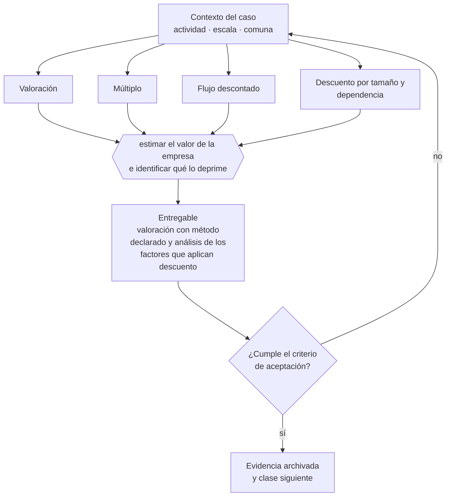

# Clase 222 — Valoración empresarial básica

> **Parte 16 · Financiamiento, banca, fondos e inversión** — clase 12 de 14

**Estado de evidencia:** `DINAMICO` · **Jurisdicción:** Chile-first · **Fecha base normativa:** 07-08-2026 
**Decisión que habilita:** estimar el valor de la empresa e identificar qué lo deprime 
**Entregable:** valoración con método declarado y análisis de los factores que aplican descuento

## 🎯 Propósito

Estimar el valor de la empresa e identificar qué factores lo deprimen, que suele ser más accionable que aumentar el resultado.

## 📚 Resultados de aprendizaje

Al finalizar esta clase podrás:

1. **Definir** con precisión los cuatro conceptos de la tabla siguiente y usarlos para describir un caso real.
2. **Explicar** por qué esta materia condiciona decisiones de otras partes del programa.
3. **Decidir** —estimar el valor de la empresa e identificar qué lo deprime— y justificar la decisión por escrito.
4. **Producir** el entregable de la clase y contrastarlo contra su criterio de aceptación.
5. **Distinguir** el dato estable del dato dinámico que exige revalidación en la fuente oficial.

## 🧩 Conceptos centrales

| Concepto | Comprensión verificable |
|---|---|
| **Valoración** | Estimación del valor económico de la empresa. |
| **Múltiplo** | Factor aplicado sobre ventas o ebitda según el sector. |
| **Flujo descontado** | Valoración por proyección de flujos futuros. |
| **Descuento por tamaño y dependencia** | Ajuste por riesgo de empresa pequeña o dependiente del fundador. |

## 🗺️ Flujo de razonamiento

## 📖 Desarrollo

### 1. El fondo del asunto

En empresas pequeñas la valoración por múltiplos es la referencia práctica, con descuentos importantes por dependencia del fundador, concentración de clientes y falta de información auditada. Reducir esos tres factores aumenta el valor más que cualquier mejora de resultado marginal.

### 2. Cómo se traduce en la práctica

En empresas pequeñas la valoración por múltiplos es la referencia práctica, con descuentos importantes por dependencia del fundador, concentración de clientes y falta de información auditada. Reducir esos tres aumenta el valor más que cualquier mejora marginal de EBITDA.

### 3. Marco aplicable y quién interviene

- FOGAPE y sistema de garantías estatales
- Ley 21.521 Fintec para plataformas de financiamiento colectivo
- instrumentos SAFE, notas convertibles y aumentos de capital en SpA

**Autoridades o contrapartes involucradas:** CMF, CORFO, SERCOTEC, BancoEstado y banca comercial.
**Profesionales de apoyo:** CFO, abogado corporativo, asesor financiero, contador. La participación concreta depende del riesgo, del
tamaño de la empresa y de la actividad económica.

## 🧪 Taller guiado

Aplica esta clase a **una** de las siguientes líneas de negocio y repite después el ejercicio con
una segunda línea de carga regulatoria distinta:

| Línea | Carga regulatoria |
|---|---|
| SaaS B2B con IA | media |
| Servicios profesionales | baja |
| E-commerce D2C | media |
| Alimentos o foodtech | alta |
| Exportación de servicios | media |
| Fintech regulada | alta |
| Construcción o servicios técnicos | alta |

**Secuencia de trabajo:**

1. Delimita el contexto: actividad económica, escala, comuna y etapa de la empresa.
2. Reúne los antecedentes que la decisión exige y anota la fecha de cada fuente.
3. Identifica las alternativas reales, incluida la de no hacer nada.
4. Evalúa el impacto en mercado, caja, personas, regulación y operación.
5. Toma la decisión y regístrala con sus supuestos.
6. Produce el entregable.
7. Contrástalo contra el criterio de aceptación.
8. Anota lo que requiere validación profesional y programa su revisión.

### 📦 Entregable

Valoración con método declarado y análisis de los factores que aplican descuento.

Debe incluir decisión, supuestos, fuentes con fecha de consulta, responsable, riesgos
identificados y próximos pasos.

## 🏆 Reto verificable

Resuelve la misma materia para una segunda línea de negocio con distinta carga regulatoria y
explica por escrito **qué cambió, por qué y qué fuente lo determina**.

## ✅ Criterio de aceptación

- [ ] el método de valoración está declarado y es coherente con el tamaño
- [ ] los factores de descuento están identificados y cuantificados
- [ ] cada afirmación regulatoria está referida a una fuente oficial con fecha de consulta;
- [ ] los datos dinámicos quedan marcados para revalidación;
- [ ] hay un responsable asignado y evidencia reproducible del trabajo.

## ⚠️ Errores frecuentes

**Propios de esta clase:**

- Usar múltiplos de empresas grandes o de otro mercado.
- Valorar sin ajustar por dependencia del fundador y concentración de clientes.

**Característicos de la parte 16:**

- Financiar activos de largo plazo con líneas de corto plazo.
- Usar factoring de forma estructural y erosionar el margen.

## 🇨🇱 Checklist Chile

- [ ] ¿existe norma o autoridad específica para esta materia?
- [ ] ¿la fuente consultada está vigente a la fecha de ejecución?
- [ ] ¿se activa algún trámite ante el SII?
- [ ] ¿se activa algún requisito municipal o sectorial?
- [ ] ¿afecta a consumidores o al tratamiento de datos personales?
- [ ] ¿afecta a trabajadores o a la seguridad y salud en el trabajo?
- [ ] ¿afecta a impuestos, contabilidad o caja?
- [ ] ¿afecta a contratos o a propiedad intelectual?
- [ ] ¿requiere renovación, reporte periódico o revalidación?

## ❓ Preguntas de comprobación

1. ¿Qué múltiplo se usa en tu sector y de qué transacciones lo obtuviste?
2. ¿Cuánto descuento aplica hoy por tu dependencia del fundador?
3. ¿Qué factor deprime más tu valor y cuánto costaría corregirlo?

## 🔗 Fuentes oficiales

**Corporación de Fomento de la Producción — Innovación, inversión y garantías**  
<https://www.corfo.cl/> · verificado 2026-08-19

- *Qué contiene:* Reúne los instrumentos de fomento a la innovación y la inversión, incluidos programas de capital semilla, escalamiento, garantías y cobertura de riesgo para el sistema financiero.
- *Cómo leerla:* Filtra por etapa de la empresa antes que por monto. Y verifica el componente de innovación que exige cada instrumento: presentar una expansión comercial como innovación es la causa más común de rechazo.
- *Uso en esta clase:* aporta el marco de «Innovación, inversión y garantías» para estimar el valor de la empresa e identificar qué lo deprime.

**Servicio de Cooperación Técnica — Fomento para micro y pequeñas empresas**  
<https://www.sercotec.cl/> · verificado 2026-08-19

- *Qué contiene:* Publica las convocatorias vigentes con sus bases: perfil de empresa elegible, monto del subsidio, cofinanciamiento exigido, gastos financiables y obligaciones de rendición.
- *Cómo leerla:* Lee las bases desde el final: la sección de rendición decide si podrás quedarte con el subsidio. Muchos proyectos se adjudican y después devuelven fondos por no poder acreditar el gasto en la forma exigida.
- *Uso en esta clase:* aporta el marco de «Fomento para micro y pequeñas empresas» para estimar el valor de la empresa e identificar qué lo deprime.

**Start-Up Chile · CORFO — Aceleración de startups**  
<https://startupchile.org/> · verificado 2026-08-19

- *Qué contiene:* Describe los programas de aceleración, sus cohortes, el aporte que entregan y las contrapartidas exigidas en permanencia, reporte y actividades.
- *Cómo leerla:* Evalúa el programa por la red y la validación que aporta, no por el monto. La contrapartida de permanencia tiene costo operativo real y debe compararse contra lo que la empresa necesita en su etapa.
- *Uso en esta clase:* aporta el marco de «Aceleración de startups» para estimar el valor de la empresa e identificar qué lo deprime.

Complementos del repositorio: [glosario](../../../docs/19_GLOSSARY.md) ·
[ruta de lecturas](../../../docs/15_BOOKS_AND_LEARNING_PATH.md) ·
[catálogo de fuentes](../../../docs/16_OFFICIAL_SOURCE_CATALOG.md).

> [!IMPORTANT]
> Material educativo. Para una decisión real de alto impacto hay que verificar la fuente oficial
> vigente y validar con el profesional competente.

---

| Anterior | Índice | Siguiente |
|---|---|---|
| [← 221 · SAFE, notas convertibles y equity](../class-11-safe-notas-convertibles-y-equity/README.md) | [Parte 16](../README.md) · [Programa](../../../README.md) | [223 · Data room y due diligence de inversión →](../class-13-data-room-y-due-diligence-de-inversion/README.md) |
