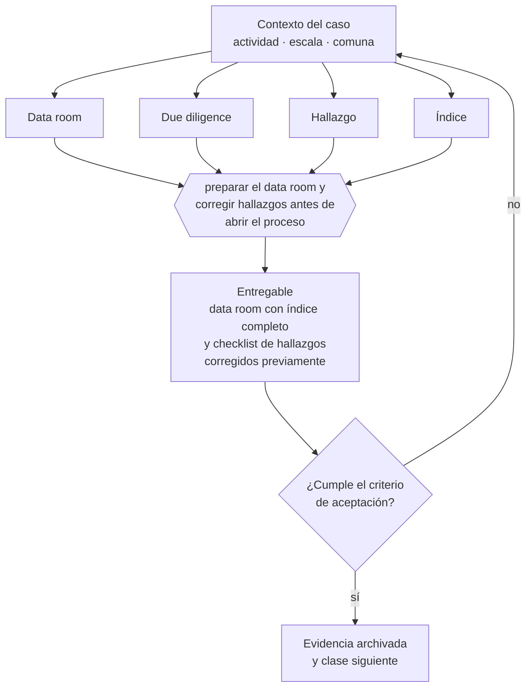

# Clase 223 — Data room y due diligence de inversión

> **Parte 16 · Financiamiento, banca, fondos e inversión** — clase 13 de 14

**Estado de evidencia:** `DINAMICO` · **Jurisdicción:** Chile-first · **Fecha base normativa:** 07-08-2026 
**Decisión que habilita:** preparar el data room y corregir hallazgos antes de abrir el proceso 
**Entregable:** data room con índice completo y checklist de hallazgos corregidos previamente

## 🎯 Propósito

Preparar el data room antes de necesitarlo y corregir los hallazgos que se detecten, porque vale más que negociar bien después.

## 📚 Resultados de aprendizaje

Al finalizar esta clase podrás:

1. **Definir** con precisión los cuatro conceptos de la tabla siguiente y usarlos para describir un caso real.
2. **Explicar** por qué esta materia condiciona decisiones de otras partes del programa.
3. **Decidir** —preparar el data room y corregir hallazgos antes de abrir el proceso— y justificar la decisión por escrito.
4. **Producir** el entregable de la clase y contrastarlo contra su criterio de aceptación.
5. **Distinguir** el dato estable del dato dinámico que exige revalidación en la fuente oficial.

## 🧩 Conceptos centrales

| Concepto | Comprensión verificable |
|---|---|
| **Data room** | Repositorio ordenado de información para el inversionista. |
| **Due diligence** | Proceso de verificación previo a la inversión. |
| **Hallazgo** | Problema detectado que afecta precio o condiciones. |
| **Índice** | Estructura del data room que permite encontrar cada documento. |

## 🗺️ Flujo de razonamiento

## 📖 Desarrollo

### 1. El fondo del asunto

El data room se prepara antes de necesitarlo. Los hallazgos que más afectan precio en Chile son laborales —honorarios mal usados, cotizaciones impagas— y tributarios. Detectarlos y corregirlos antes de abrir el proceso vale más que negociar bien después.

### 2. Cómo se traduce en la práctica

Los hallazgos que más afectan precio en Chile son laborales —honorarios mal usados, cotizaciones impagas— y tributarios. Abrir el proceso con esas contingencias sin resolver traslada el descuento completo al precio, y entregar información desordenada transmite una señal de descontrol que ningún argumento corrige.

### 3. Marco aplicable y quién interviene

- FOGAPE y sistema de garantías estatales
- Ley 21.521 Fintec para plataformas de financiamiento colectivo
- instrumentos SAFE, notas convertibles y aumentos de capital en SpA

**Autoridades o contrapartes involucradas:** CMF, CORFO, SERCOTEC, BancoEstado y banca comercial.
**Profesionales de apoyo:** CFO, abogado corporativo, asesor financiero, contador. La participación concreta depende del riesgo, del
tamaño de la empresa y de la actividad económica.

## 🧪 Taller guiado

Aplica esta clase a **una** de las siguientes líneas de negocio y repite después el ejercicio con
una segunda línea de carga regulatoria distinta:

| Línea | Carga regulatoria |
|---|---|
| SaaS B2B con IA | media |
| Servicios profesionales | baja |
| E-commerce D2C | media |
| Alimentos o foodtech | alta |
| Exportación de servicios | media |
| Fintech regulada | alta |
| Construcción o servicios técnicos | alta |

**Secuencia de trabajo:**

1. Delimita el contexto: actividad económica, escala, comuna y etapa de la empresa.
2. Reúne los antecedentes que la decisión exige y anota la fecha de cada fuente.
3. Identifica las alternativas reales, incluida la de no hacer nada.
4. Evalúa el impacto en mercado, caja, personas, regulación y operación.
5. Toma la decisión y regístrala con sus supuestos.
6. Produce el entregable.
7. Contrástalo contra el criterio de aceptación.
8. Anota lo que requiere validación profesional y programa su revisión.

### 📦 Entregable

Data room con índice completo y checklist de hallazgos corregidos previamente.

Debe incluir decisión, supuestos, fuentes con fecha de consulta, responsable, riesgos
identificados y próximos pasos.

## 🏆 Reto verificable

Resuelve la misma materia para una segunda línea de negocio con distinta carga regulatoria y
explica por escrito **qué cambió, por qué y qué fuente lo determina**.

## ✅ Criterio de aceptación

- [ ] el índice cubre societario, tributario, laboral, contractual y tecnológico
- [ ] los hallazgos detectados tienen plan de corrección
- [ ] cada afirmación regulatoria está referida a una fuente oficial con fecha de consulta;
- [ ] los datos dinámicos quedan marcados para revalidación;
- [ ] hay un responsable asignado y evidencia reproducible del trabajo.

## ⚠️ Errores frecuentes

**Propios de esta clase:**

- Abrir el data room con contingencias laborales o tributarias sin resolver.
- Entregar información desordenada y transmitir señal de descontrol.

**Característicos de la parte 16:**

- Financiar activos de largo plazo con líneas de corto plazo.
- Usar factoring de forma estructural y erosionar el margen.

## 🇨🇱 Checklist Chile

- [ ] ¿existe norma o autoridad específica para esta materia?
- [ ] ¿la fuente consultada está vigente a la fecha de ejecución?
- [ ] ¿se activa algún trámite ante el SII?
- [ ] ¿se activa algún requisito municipal o sectorial?
- [ ] ¿afecta a consumidores o al tratamiento de datos personales?
- [ ] ¿afecta a trabajadores o a la seguridad y salud en el trabajo?
- [ ] ¿afecta a impuestos, contabilidad o caja?
- [ ] ¿afecta a contratos o a propiedad intelectual?
- [ ] ¿requiere renovación, reporte periódico o revalidación?

## ❓ Preguntas de comprobación

1. ¿Qué contingencia laboral o tributaria aparecería si te auditaran hoy?
2. ¿Tienes un índice de data room que cubra todas las materias?
3. ¿Cuánto tardarías en reunir la documentación societaria completa?

## 🔗 Fuentes oficiales

**Servicio de Impuestos Internos — Carpeta Tributaria Electrónica**  
<https://zeus.sii.cl/dii_doc/carpeta_tributaria/html/generar_carpeta.htm> · verificado 2026-08-19

- *Qué contiene:* Permite generar el expediente que acredita la situación tributaria de la empresa: inicio de actividades, régimen, declaraciones presentadas y timbraje.
- *Cómo leerla:* Es el documento que pedirán banco, inversionista y comprador. Genera una hoy aunque no la necesites: lo que muestre es exactamente lo que verá un tercero al evaluarte.
- *Uso en esta clase:* aporta el marco de «Carpeta Tributaria Electrónica» para preparar el data room y corregir hallazgos antes de abrir el proceso.

**Dirección del Trabajo — Relaciones laborales y obligaciones del empleador**  
<https://www.dt.gob.cl/> · verificado 2026-08-19

- *Qué contiene:* Concentra el Código del Trabajo aplicado: dictámenes que interpretan la norma en casos concretos, la plataforma Mi DT para registrar contratos y finiquitos, y las guías de fiscalización.
- *Cómo leerla:* Los dictámenes valen más que las guías divulgativas: describen cómo la autoridad resolvió un caso real. Busca por materia y contrasta la fecha, porque un dictamen posterior puede cambiar el criterio anterior.
- *Uso en esta clase:* aporta el marco de «Relaciones laborales y obligaciones del empleador» para preparar el data room y corregir hallazgos antes de abrir el proceso.

Complementos del repositorio: [glosario](../../../docs/19_GLOSSARY.md) ·
[ruta de lecturas](../../../docs/15_BOOKS_AND_LEARNING_PATH.md) ·
[catálogo de fuentes](../../../docs/16_OFFICIAL_SOURCE_CATALOG.md).

> [!IMPORTANT]
> Material educativo. Para una decisión real de alto impacto hay que verificar la fuente oficial
> vigente y validar con el profesional competente.

---

| Anterior | Índice | Siguiente |
|---|---|---|
| [← 222 · Valoración empresarial básica](../class-12-valoracion-empresarial-basica/README.md) | [Parte 16](../README.md) · [Programa](../../../README.md) | [224 · Costo de dilución y estrategia de financiamiento →](../class-14-costo-de-dilucion-y-estrategia-de-financiamiento/README.md) |
