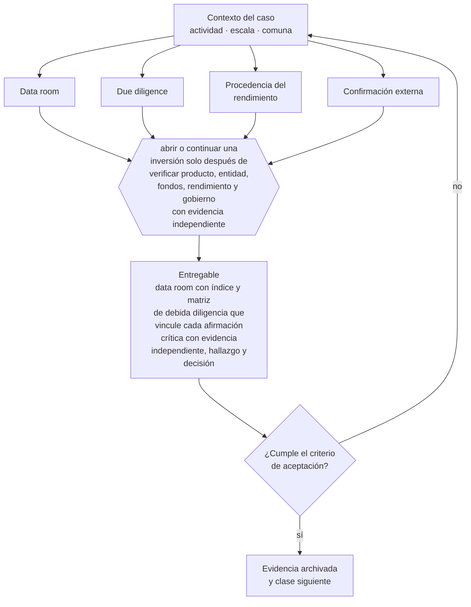

# Clase 223 — Data room y due diligence de inversión

> **Parte 16 · Financiamiento, banca, fondos e inversión** — clase 13 de 14

**Estado de evidencia:** `DINAMICO` · **Jurisdicción:** Chile-first · **Fecha base normativa:** 07-08-2026 
**Decisión que habilita:** abrir o continuar una inversión solo después de verificar producto, entidad, fondos, rendimiento y gobierno con evidencia independiente 
**Entregable:** data room con índice y matriz de debida diligencia que vincule cada afirmación crítica con evidencia independiente, hallazgo y decisión

## 🎯 Propósito

Convertir la debida diligencia en verificación independiente de producto, autorización, custodia, rendimiento y gobierno.

## 📚 Resultados de aprendizaje

Al finalizar esta clase podrás:

1. **Definir** con precisión los cuatro conceptos de la tabla siguiente y usarlos para describir un caso real.
2. **Explicar** por qué esta materia condiciona decisiones de otras partes del programa.
3. **Decidir** —abrir o continuar una inversión solo después de verificar producto, entidad, fondos, rendimiento y gobierno con evidencia independiente— y justificar la decisión por escrito.
4. **Producir** el entregable de la clase y contrastarlo contra su criterio de aceptación.
5. **Distinguir** el dato estable del dato dinámico que exige revalidación en la fuente oficial.

## 🧩 Conceptos centrales

| Concepto | Comprensión verificable |
|---|---|
| **Data room** | Repositorio ordenado de información para el inversionista. |
| **Due diligence** | Verificación independiente de producto, entidad, modelo, fondos y gobierno. |
| **Procedencia del rendimiento** | Actividad y flujo verificables que explican cómo se genera el retorno. |
| **Confirmación externa** | Evidencia obtenida directamente de regulador, banco, custodio, auditor o contraparte. |

## 🗺️ Flujo de razonamiento

```mermaid
flowchart TB
    C["Contexto del caso<br/>actividad · escala · comuna"]
    C --> A1["Data room"]
    C --> A2["Due diligence"]
    C --> A3["Procedencia del<br/>rendimiento"]
    C --> A4["Confirmación externa"]
    A1 & A2 & A3 & A4 --> D{{"abrir o continuar una<br/>inversión solo después de<br/>verificar producto, entidad,<br/>fondos, rendimiento y gobierno<br/>con evidencia independiente"}}
    D --> E["Entregable<br/>data room con índice y matriz<br/>de debida diligencia que<br/>vincule cada afirmación<br/>crítica con evidencia<br/>independiente, hallazgo y<br/>decisión"]
    E --> V{"¿Cumple el criterio<br/>de aceptación?"}
    V -->|sí| S["Evidencia archivada<br/>y clase siguiente"]
    V -->|no| C
```

## 📖 Desarrollo

### 1. El fondo del asunto

La debida diligencia no se satisface con presentaciones, saldos emitidos por el propio gestor ni pagos iniciales puntuales. OneCoin exige verificar que el producto y su infraestructura existan; Madoff, confirmar custodia, operaciones y auditor independiente; AC Inversions, revisar captación, autorización para operar, contratos, cuentas receptoras y procedencia del rendimiento en el contexto chileno. Una tasa alta es señal para investigar, no prueba automática de delito.

### 2. Cómo se traduce en la práctica

OneCoin, Madoff y AC Inversions aportan preguntas complementarias: ¿existe y funciona el producto?, ¿los activos y operaciones se confirman fuera del gestor?, ¿la captación y las cuentas receptoras corresponden a una entidad habilitada?, ¿la fuente del rendimiento se reproduce con evidencia? Los pagos anteriores, la reputación o una presentación sofisticada no sustituyen esas respuestas.

### 3. Marco aplicable y quién interviene

- FOGAPE y sistema de garantías estatales
- Ley 21.521 Fintec para plataformas de financiamiento colectivo
- instrumentos SAFE, notas convertibles y aumentos de capital en SpA

**Autoridades o contrapartes involucradas:** CMF, CORFO, SERCOTEC, BancoEstado y banca comercial.
**Profesionales de apoyo:** CFO, abogado corporativo, asesor financiero, contador. La participación concreta depende del riesgo, del
tamaño de la empresa y de la actividad económica.

## 🧪 Taller guiado

Aplica esta clase a **una** de las siguientes líneas de negocio y repite después el ejercicio con
una segunda línea de carga regulatoria distinta:

| Línea | Carga regulatoria |
|---|---|
| SaaS B2B con IA | media |
| Servicios profesionales | baja |
| E-commerce D2C | media |
| Alimentos o foodtech | alta |
| Exportación de servicios | media |
| Fintech regulada | alta |
| Construcción o servicios técnicos | alta |

**Secuencia de trabajo:**

1. Delimita el contexto: actividad económica, escala, comuna y etapa de la empresa.
2. Reúne los antecedentes que la decisión exige y anota la fecha de cada fuente.
3. Identifica las alternativas reales, incluida la de no hacer nada.
4. Evalúa el impacto en mercado, caja, personas, regulación y operación.
5. Toma la decisión y regístrala con sus supuestos.
6. Produce el entregable.
7. Contrástalo contra el criterio de aceptación.
8. Anota lo que requiere validación profesional y programa su revisión.

### 📦 Entregable

Data room con índice y matriz de debida diligencia que vincule cada afirmación crítica con evidencia independiente, hallazgo y decisión.

Debe incluir decisión, supuestos, fuentes con fecha de consulta, responsable, riesgos
identificados y próximos pasos.

## 🏆 Reto verificable

Resuelve la misma materia para una segunda línea de negocio con distinta carga regulatoria y
explica por escrito **qué cambió, por qué y qué fuente lo determina**.

## ✅ Criterio de aceptación

- [ ] producto, autorización, custodia, operaciones, auditor y beneficiario final se verifican en fuentes independientes
- [ ] cada rendimiento tiene procedencia económica reproducible y los hallazgos tienen escalamiento o condición de cierre
- [ ] cada afirmación regulatoria está referida a una fuente oficial con fecha de consulta;
- [ ] los datos dinámicos quedan marcados para revalidación;
- [ ] hay un responsable asignado y evidencia reproducible del trabajo.

## ⚠️ Errores frecuentes

**Propios de esta clase:**

- Aceptar como prueba estados de cuenta o certificados producidos únicamente por quien administra los fondos.
- Inferir delito solo por una rentabilidad elevada o, en sentido contrario, normalidad porque hubo pagos iniciales.

**Característicos de la parte 16:**

- Financiar activos de largo plazo con líneas de corto plazo.
- Usar factoring de forma estructural y erosionar el margen.

## 🇨🇱 Checklist Chile

- [ ] ¿existe norma o autoridad específica para esta materia?
- [ ] ¿la fuente consultada está vigente a la fecha de ejecución?
- [ ] ¿se activa algún trámite ante el SII?
- [ ] ¿se activa algún requisito municipal o sectorial?
- [ ] ¿afecta a consumidores o al tratamiento de datos personales?
- [ ] ¿afecta a trabajadores o a la seguridad y salud en el trabajo?
- [ ] ¿afecta a impuestos, contabilidad o caja?
- [ ] ¿afecta a contratos o a propiedad intelectual?
- [ ] ¿requiere renovación, reporte periódico o revalidación?

## ❓ Preguntas de comprobación

1. ¿Qué afirmación crítica depende hoy de evidencia emitida por la misma parte interesada?
2. ¿Puedes confirmar directamente producto, custodio, auditor, autorización y beneficiario final?
3. ¿Qué actividad económica y documentos explican la procedencia de cada rendimiento?

## 🔗 Fuentes oficiales

**Servicio de Impuestos Internos — Carpeta Tributaria Electrónica**  
<https://zeus.sii.cl/dii_doc/carpeta_tributaria/html/generar_carpeta.htm> · verificado 2026-09-01

- *Qué contiene:* Permite generar el expediente que acredita la situación tributaria de la empresa: inicio de actividades, régimen, declaraciones presentadas y timbraje.
- *Cómo leerla:* Es el documento que pedirán banco, inversionista y comprador. Genera una hoy aunque no la necesites: lo que muestre es exactamente lo que verá un tercero al evaluarte.
- *Uso en esta clase:* aporta el marco de «Carpeta Tributaria Electrónica» para abrir o continuar una inversión solo después de verificar producto, entidad, fondos, rendimiento y gobierno con evidencia independiente.

**Comisión para el Mercado Financiero — Alertas sobre entidades y plataformas de inversión no supervisadas**  
<https://www.cmfchile.cl/portal/principal/623/w4-propertyvalue-48784.html> · verificado 2026-09-28

- *Qué contiene:* Publica alertas sobre personas o entidades que podrían captar fondos o prestar servicios financieros o de inversión sin la autorización o inscripción exigible, y orienta a verificar identidad y supervisión antes de operar.
- *Cómo leerla:* Úsala como una comprobación de debida diligencia y no como sentencia: que una entidad aparezca en una alerta exige detenerse, confirmar autorización y pedir evidencia; la ausencia de alerta tampoco prueba legitimidad ni solvencia.
- *Uso en esta clase:* aporta el marco de «Alertas sobre entidades y plataformas de inversión no supervisadas» para abrir o continuar una inversión solo después de verificar producto, entidad, fondos, rendimiento y gobierno con evidencia independiente.

**Departamento de Justicia de Estados Unidos — OneCoin: sentencia del cofundador Karl Sebastian Greenwood**  
<https://www.justice.gov/usao-sdny/pr/co-founder-multibillion-dollar-cryptocurrency-scheme-onecoin-sentenced-20-years-prison> · verificado 2026-09-28

- *Qué contiene:* Documenta la sentencia de septiembre de 2023 de un cofundador y describe la comercialización multinivel de un producto presentado como criptomoneda, mientras la otra cofundadora permanecía prófuga a la fecha de la fuente.
- *Cómo leerla:* Separa el estado procesal de cada persona. Para debida diligencia, verifica existencia y funcionamiento del producto, infraestructura, posibilidad real de transar, modelo comercial, gobierno y evidencia independiente antes de evaluar promesas de rentabilidad.
- *Uso en esta clase:* aporta el marco de «OneCoin: sentencia del cofundador Karl Sebastian Greenwood» para abrir o continuar una inversión solo después de verificar producto, entidad, fondos, rendimiento y gobierno con evidencia independiente.

**U.S. Securities and Exchange Commission — Reformas posteriores a Madoff sobre custodia y verificación independiente**  
<https://www.sec.gov/spotlight/secpostmadoffreforms.htm> · verificado 2026-09-28

- *Qué contiene:* Explica controles adoptados después del caso Madoff, entre ellos custodia independiente, exámenes sorpresa, revisión por terceros y confirmación de que los activos informados existen.
- *Cómo leerla:* Toma los principios de independencia, confirmación y separación de custodia como aprendizaje de control. Sus exigencias concretas pertenecen al marco estadounidense y no deben presentarse como obligaciones chilenas sin una norma local aplicable.
- *Uso en esta clase:* aporta el marco de «Reformas posteriores a Madoff sobre custodia y verificación independiente» para abrir o continuar una inversión solo después de verificar producto, entidad, fondos, rendimiento y gobierno con evidencia independiente.

**Ministerio Público de Chile — AC Inversions: reformalización y peritajes contables de la investigación**  
<https://www.fiscaliadechile.cl/actualidad/noticias/regionales/caso-ac-inversions-fiscalia-de-alta-complejidad-reformalizo> · verificado 2026-09-28

- *Qué contiene:* Informa la reformalización de febrero de 2018 y los resultados entonces atribuidos por la Fiscalía a peritajes contables sobre captación y perjuicio en la investigación por estafa, infracción a la Ley de Bancos y lavado de activos.
- *Cómo leerla:* Es una fuente de investigación y reformalización, no una sentencia. Sirve para diseñar verificaciones chilenas sobre captación, contratos, cuentas receptoras, autorización para operar, procedencia del rendimiento y peritaje contable sin anticipar conclusiones penales.
- *Uso en esta clase:* aporta el marco de «AC Inversions: reformalización y peritajes contables de la investigación» para abrir o continuar una inversión solo después de verificar producto, entidad, fondos, rendimiento y gobierno con evidencia independiente.

Complementos del repositorio: [glosario](../../../docs/19_GLOSSARY.md) ·
[ruta de lecturas](../../../docs/15_BOOKS_AND_LEARNING_PATH.md) ·
[catálogo de fuentes](../../../docs/16_OFFICIAL_SOURCE_CATALOG.md).

> [!IMPORTANT]
> Material educativo. Para una decisión real de alto impacto hay que verificar la fuente oficial
> vigente y validar con el profesional competente.

---

| Anterior | Índice | Siguiente |
|---|---|---|
| [← 222 · Valoración empresarial básica](../class-12-valoracion-empresarial-basica/README.md) | [Parte 16](../README.md) · [Programa](../../../README.md) | [224 · Costo de dilución y estrategia de financiamiento →](../class-14-costo-de-dilucion-y-estrategia-de-financiamiento/README.md) |
